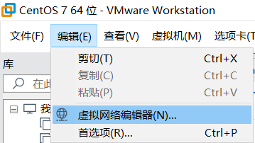
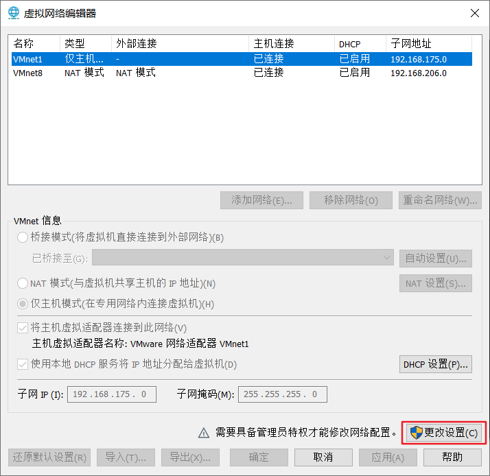
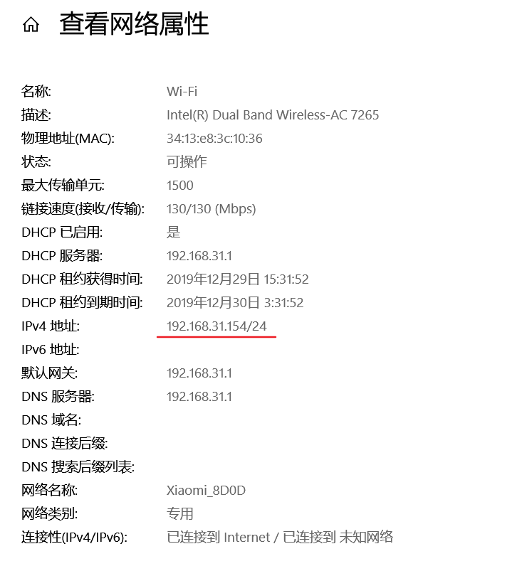
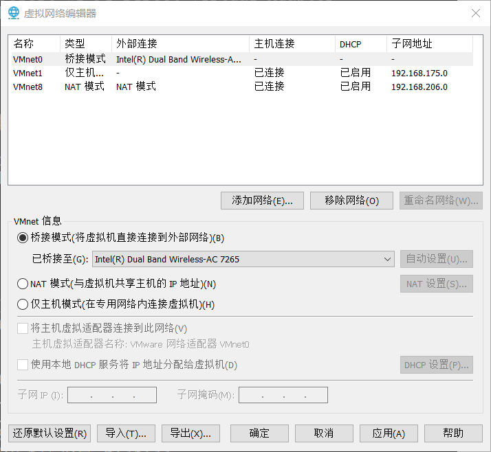
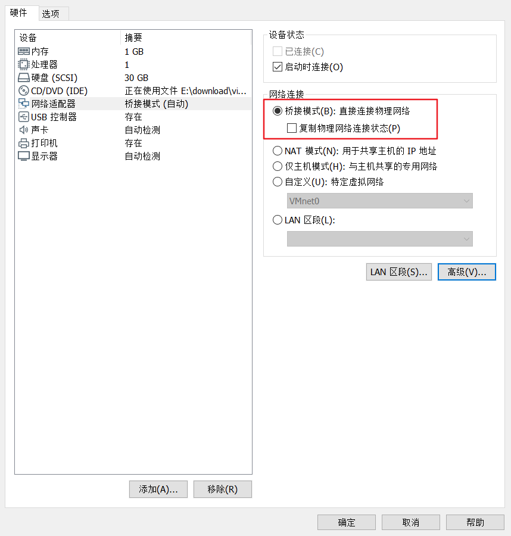
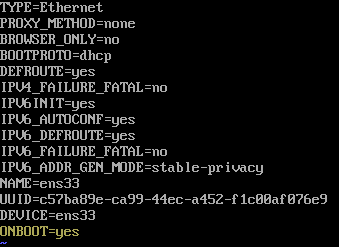

## VMware 设置桥接模式

1. 关闭虚拟机里的系统
2. 编辑 -> 虚拟网络编辑器



3. 添加“桥接模式”

   

   

   

4. 虚拟机设置

   

5. 启动虚拟机

   ```shell
   # 查看网卡名称
   ifconfig
   # 修改对应网卡，ens33 为 ifconfig 命令输出的网卡名称
   vi /etc/sysconfig/network-scripts/ifcfg-ens33
   ```

   

将 ONBOOT 修改为yes

保存退出后重启网络服务 `systemctl restart network.service`

## 更换yum官方源

https://www.cnblogs.com/ziyoufei/p/11721507.html

```shell
# 下载wget工具
yum install -y wget
# 进入yum源配置文件所在文件夹
cd /etc/yum.repos.d/
# 备份本地yum源
mv CentOS-Base.repo CentOS-Base.repo_bak
# 获取国内yum源（阿里、163二选一）
wget -O CentOS-Base.repo http://mirrors.aliyun.com/repo/Centos-7.repo
# wget -O CentOS-Base.repo http://mirrors.163.com/.help/CentOS7-Base-163.repo

# 清理yum缓存 
yum clean all
# 重建缓存 
yum makecache 
```

## 增加epel源
```shell
# 安装epel源
yum install epel-release
# 修改为阿里的epel源
wget -O /etc/yum.repos.d/epel.repo http://mirrors.aliyun.com/repo/epel-7.repo
```


## 安装 golang

```
# 查看 golang 信息
yum info golang
# 安装 golang
yum install golang
# 配置环境变量
vi /etc/profile
# 添加环境变量
export GOROOT=/usr/lib/golang
export GOPATH=$HOME/gopath
export PATH=$PATH:$GOROOT/bin:$GOPATH/bin
# 使环境变量生效
source /etc/profile
# 查看 golang 版本
go version
# 查看 golang 环境变量
go env
```

## 修改 goproxy

```
export GO111MODULE=on
export GOPROXY=https://goproxy.io
```

更详细的使用 go mod https://blog.csdn.net/qq_42403866/article/details/93654421

## github

### 生成 SSH Keys

使用 SSH 连接 github 操作（如 `git clone git@github.com:...`）时，报错 `git@github.com: Permission denied (publickey).`

解决方法：

运行以下命令生成本机 SSH 密钥：

```bash
mkdir ~/.ssh //in case that the folder doesnt exist...
cd ~/.ssh

ssh-keygen -t rsa -C "youremail@somewhere.gr"
```

然后一路回车即可。

使用 `cat id_rsa.pub` 命令查看公钥，并将公钥加到 `https://github.com/settings/keys` 

### Hello World

1

