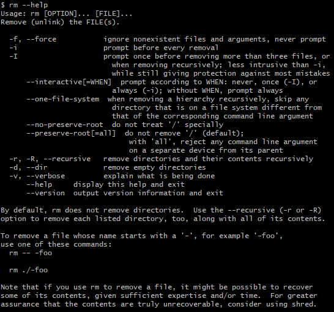
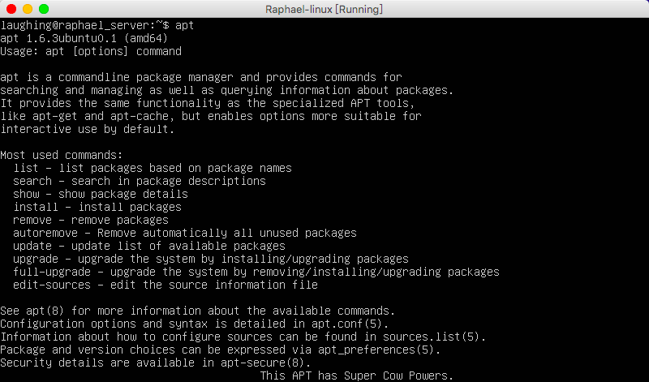
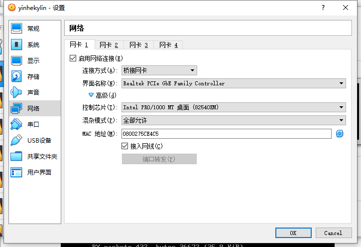
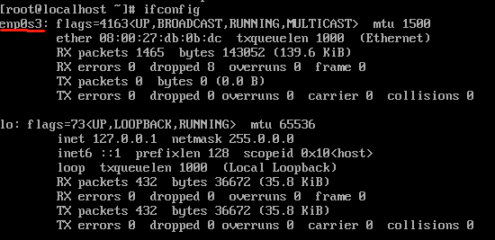
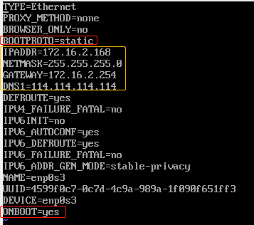
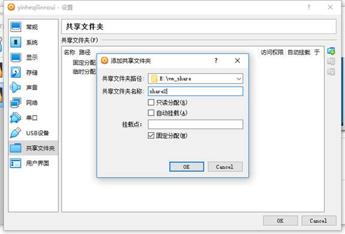
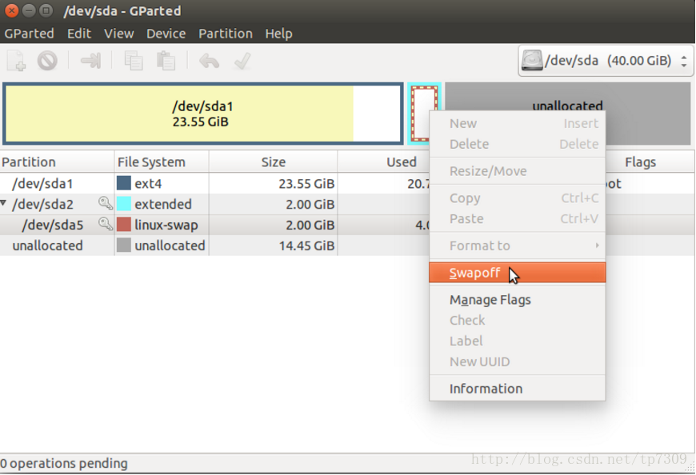

# 常用操作以及概念

## 求助

### 1. --help

指令的基本用法与选项介绍。

### 2. man

man 是 manual 的缩写，将指令的具体信息显示出来。

当执行 `man date` 时，有 DATE(1) 出现，其中的数字代表指令的类型，常用的数字及其类型如下：

| 代号 | 类型                                            |
| ---- | ----------------------------------------------- |
| 1    | 用户在 shell 环境中可以操作的指令或者可执行文件 |
| 5    | 配置文件                                        |
| 8    | 系统管理员可以使用的管理指令                    |

### 3. info

info 与 man 类似，但是 info 将文档分成一个个页面，每个页面可以进行跳转。

### 4. doc

/usr/share/doc 存放着软件的一整套说明文件。

## 关机

### 1. who

在关机前需要先使用 who 命令查看有没有其它用户在线。

### 2. sync

为了加快对磁盘文件的读写速度，位于内存中的文件数据不会立即同步到磁盘上，因此关机之前需要先进行 sync 同步操作。

### 3. shutdown

```
# shutdown [-krhc] 时间 [信息]
-k ： 不会关机，只是发送警告信息，通知所有在线的用户
-r ： 将系统的服务停掉后就重新启动
-h ： 将系统的服务停掉后就立即关机
-c ： 取消已经在进行的 shutdown 指令内容
```

## PATH

可以在环境变量 PATH 中声明可执行文件的路径，路径之间用 : 分隔。

```
/usr/local/bin:/usr/bin:/usr/local/sbin:/usr/sbin:/home/dmtsai/.local/bin:/home/dmtsai/bin
```

## sudo

sudo 允许一般用户使用 root 可执行的命令，不过只有在 /etc/sudoers 配置文件中添加的用户才能使用该指令。

## 包管理工具

RPM 和 DPKG 为最常见的两类软件包管理工具：

- RPM 全称为 Redhat Package Manager，最早由 Red Hat 公司制定实施，随后被 GNU 开源操作系统接受并成为许多 Linux 系统的既定软件标准。YUM 基于 RPM，具有依赖管理和软件升级功能。
- 与 RPM 竞争的是基于 Debian 操作系统的 DEB 软件包管理工具 DPKG，全称为 Debian Package，功能方面与 RPM 相似。

## 发行版

Linux 发行版是 Linux 内核及各种应用软件的集成版本。

| 基于的包管理工具 | 商业发行版 | 社区发行版      |
| ---------------- | ---------- | --------------- |
| RPM              | Red Hat    | Fedora / CentOS |
| DPKG             | Ubuntu     | Debian          |

# 用户

## 切换用户 su

su是（switch user）切换用户或（super user）超级用户的缩写。

终端光标前面的 $代表普通用户，#代表超级用户。

```
$ su [-] [username]
- 是否切换环境变量
username 为空，表示切换到root用户
$ exit	//退出当前用户
```

## su命令和su -命令区别

su只是切换了root身份，但Shell环境仍然是普通用户的Shell（包括环境变量PATH等）；而su -连用户和Shell环境一起切换成root身份了。

su切换成root用户以后，pwd一下，发现工作目录仍然是普通用户的工作目录；而用su -命令切换以后，工作目录变成root的工作目录了。

## 鉴定故障

在普通用户进入root的时候，使用''su -''，出现鉴定故障。

原因是在装系统的时候，没有给超级用户(root)设置密码，只是给普通用户设置了一个密码。

解决办法：`sudo passwd root`

## 创建新用户

adduser命令会自动创建用户主目录，创建用户同名的组。

```
root@ubuntu:~# sudo adduser db
[sudo] password for xx:
输入xx用户的密码，出现如下信息
正在添加用户"db"…
正在添加新组"db" (1006)…
正在添加新用户"db" (1006) 到组"db"…
创建主目录"/home/db"…
正在从"/etc/skel"复制文件…
输入新的 UNIX 口令：
重新输入新的 UNIX 口令：
两次输入db的初始密码，出现的信息如下
passwd: password updated successfully
Changing the user information for db
Enter the new value, or press ENTER for the default
Full Name []:
Room Number []:
Work Phone []:
Home Phone []:
Other []:
Full Name []:

等信息一路回车
这个信息是否正确？ [Y/n] y
```

到此，用户添加成功。

## 删除用户

```
# userdel [-r] 用户名
-r : 同时删除其home目录
```

## 查看用户所属用户组

```
# groups [username]
username 为空，则查看当前用户所属用户组；可以同时查看多个用户，用户名之间用空格隔开
```

## 添加root权限

修改/etc/sudoers文件

```
root@ubuntu:~# sudo vim /etc/sudoers
修改文件如下：
# User privilege specification
root ALL=(ALL:ALL) ALL
db ALL=(ALL:ALL) ALL
```

保存退出，db用户就拥有了root权限。

# 环境变量

## 设置变量

1. 在/etc/profile文件中添加变量【对所有用户生效(永久的)】

2. 在用户目录下的.bash_profile/.bashrc文件中增加变量【对单一用户生效(永久的)】

3. 运行export命令定义变量【只对当前或其子shell(BASH)有效(临时的)】 

   export PATH="$PATH:/opt/au1200_rm/build_tools/bin"

## 查看变量

1. 使用echo命令查看单个环境变量。例如：echo $PATH
2. 使用env命令查看所有环境变量。
3. 使用set查看所有本地定义的环境变量。set也可以设置某个环境变量的值。

## 删除变量

使用unset命令删除指定环境变量

## 常用的环境变量

PATH 决定了shell将到哪些目录中寻找命令或程序 
HOME 当前用户主目录 
HISTSIZE　历史记录数 
LOGNAME 当前用户的登录名 
HOSTNAME　指主机的名称 
SHELL 当前用户Shell类型 
LANGUAGE 　语言相关的环境变量，多语言可以修改此环境变量 
MAIL　当前用户的邮件存放目录 
PS1　基本提示符，对于root用户是#，对于普通用户是$

# 文件系统

## 目录配置

为了使不同 Linux 发行版本的目录结构保持一致性，Filesystem Hierarchy Standard (FHS) 规定了 Linux 的目录结构。最基础的三个目录如下：

- / (root, 根目录)
- /usr (unix software resource)：所有系统默认软件都会安装到这个目录；
- /var (variable)：存放系统或程序运行过程中的数据文件。


## 文件属性

用户分为三种：文件拥有者、群组以及其它人，对不同的用户有不同的文件权限。

使用 ls 查看一个文件时，会显示一个文件的信息，例如 `drwxr-xr-x 3 root root 17 May 6 00:14 .config`，对这个信息的解释如下：

- drwxr-xr-x：文件类型以及权限，第 1 位为文件类型字段，后 9 位为文件权限字段
- 3：链接数
- root：文件拥有者
- root：所属群组
- 17：文件大小
- May 6 00:14：文件最后被修改的时间
- .config：文件名

常见的文件类型及其含义有：

- d：目录
- -：文件
- l：链接文件

9 位的文件权限字段中，每 3 个为一组，共 3 组，每一组分别代表对文件拥有者、所属群组以及其它人的文件权限。一组权限中的 3 位分别为 r、w、x 权限，表示可读、可写、可执行。

文件时间有以下三种：

- modification time (mtime)：文件的内容更新就会更新；
- status time (ctime)：文件的状态（权限、属性）更新就会更新；
- access time (atime)：读取文件时就会更新。

## 文件与目录的基本操作

### 1. ls

列出文件或者目录的信息，目录的信息就是其中包含的文件。

```
# ls [-aAdfFhilnrRSt] file|dir
-a ：列出全部的文件
-d ：仅列出目录本身
-l ：以长数据串行列出，包含文件的属性与权限等等数据
```

- 权限数字对应权限组说明，总共分为4部分：

【文件或文件夹】【owner权限】【group权限】【others权限】

【文件是-，文件夹是d】【r/w/x相加】【r/w/x相加】【r/w/x相加】

Linux档案的基本权限有九个，分别是owner/group/others三种身份各有自己的read/write/execute权限。

### 2. cd

更换当前目录。

```
cd [相对路径或绝对路径]
```

### 3. mkdir

创建目录。

```
# mkdir [-mp] 目录名称
-m ：配置目录权限
-p ：递归创建目录
```

### 4. rmdir

删除目录，目录必须为空。

```
rmdir [-p] 目录名称
-p ：递归删除目录
```

### 5. touch

更新文件时间或者建立新文件。

```
# touch [-acdmt] filename
-a ： 更新 atime
-c ： 更新 ctime，若该文件不存在则不建立新文件
-m ： 更新 mtime
-d ： 后面可以接更新日期而不使用当前日期，也可以使用 --date="日期或时间"
-t ： 后面可以接更新时间而不使用当前时间，格式为[YYYYMMDDhhmm]
```

### 6. cp

复制文件。如果源文件有两个以上，则目的文件一定要是目录才行。

```
cp [-adfilprsu] source destination
-a ：相当于 -dr --preserve=all
-d ：若来源文件为链接文件，则复制链接文件属性而非文件本身
-f ：强制(force)，若有重复或其它疑问时，不会询问用户，而强制复制
-i ：若目标文件已经存在时，在覆盖前会先询问
-l ：建立硬连接(hard link)的连接文件，而非复制文件本身
-p ：连同文件的属性一起复制过去
-r ：递归复制，用于目录的复制操作
-s ：复制成符号连接文件(symbolic link)，即“快捷方式”文件
-u ：destination 比 source 旧才更新 destination，或 destination 不存在的情况下才复制
--preserve=all ：除了 -p 的权限相关参数外，还加入 SELinux 的属性, links, xattr 等也复制了
```

将dir1下所有文件复制到dir2下
如果dir2目录不存在，则可以直接使用
`cp -r dir1 dir2`
如果dir2目录已存在，则需要使用
`cp -r dir1/. dir2`
如果这时使用`cp -r dir1 dir2`,则会将dir1目录也复制到dir2中

如果dir2存在文件需要先删除
`rm -rf dir2/*`
否则会一个个文件提示你确认，使用`cp -rf `也一样提示


### 7. rm 删除文件/目录

```
# rm [-fir] 文件或目录
-r ：递归删除
```



### 8. mv

移动文件。

```
# mv [-fiu] source destination
# mv [options] source1 source2 source3 .... directory
-f ：force 强制的意思，如果目标文件已经存在，不会询问而直接覆盖
-i ：若目标文件(destination)已经存在，就会询问是否覆盖
-u ：若目标文件已经存在，且源文件比较新，才会更新
```

移动文件夹下所有文件

```
# mv /data/new/* /data/old/
```

## 修改权限 chmod

可以将一组权限用数字来表示，此时一组权限的 3 个位当做二进制数字的位，从左到右每个位的权值为 4、2、1，即每个权限对应的数字权值为 r : 4、w : 2、x : 1。

```
# chmod [-R] xyz dirname/filename
-R 递归修改子目录及文件的权限
```

示例：将 .bashrc 文件的权限修改为 -rwxr-xr--。

```
# chmod 754 .bashrc
```

也可以使用符号来设定权限。

```
# chmod [ugoa]  [+-=] [rwx] dirname/filename
- u：拥有者
- g：所属群组
- o：其他人（不是u和g）
- a：所有人
- +：添加权限
- -：移除权限
- =：设定权限
```

示例：为 .bashrc 文件的所有用户添加写权限。

```
# chmod a+w .bashrc
```

## 默认权限

- 文件默认权限：文件默认没有可执行权限，因此为 666，也就是 -rw-rw-rw- 。
- 目录默认权限：目录必须要能够进入，也就是必须拥有可执行权限，因此为 777 ，也就是 drwxrwxrwx。

可以通过 umask 设置或者查看默认权限，通常以掩码的形式来表示，例如 002 表示其它用户的权限去除了一个 2 的权限，也就是写权限，因此建立新文件时默认的权限为 -rw-rw-r--。

## 修改所属用户/组 chown

```
# chown [-cfhvR] [user][:group] dirname/filename
-R : 递归修改子目录及文件的所属用户/组
-c : 显示更改的部分的信息
-f : 忽略错误信息
-h : 修复符号链接
-v : 显示详细的处理信息

# chown test abc.txt		//修改所属用户
# chown :admin abc.txt		//修改所属组
# chown test:admin abc.txt	//修改所属用户/组
```

## 目录的权限

文件名不是存储在一个文件的内容中，而是存储在一个文件所在的目录中。因此，拥有文件的 w 权限并不能对文件名进行修改。

目录存储文件列表，一个目录的权限也就是对其文件列表的权限。因此，目录的 r 权限表示可以读取文件列表；w 权限表示可以修改文件列表，具体来说，就是添加删除文件，对文件名进行修改；x 权限可以让该目录成为工作目录，x 权限是 r 和 w 权限的基础，如果不能使一个目录成为工作目录，也就没办法读取文件列表以及对文件列表进行修改了。

## 获取文件内容

### 1. cat

取得文件内容。

```
# cat [-AbEnTv] filename
-n ：打印出行号，连同空白行也会有行号，-b 不会
```

### 2. tac

是 cat 的反向操作，从最后一行开始打印。

### 3. more

和 cat 不同的是它可以一页一页查看文件内容，比较适合大文件的查看。

### 4. less

和 more 类似，但是多了一个向前翻页的功能。

### 5. head

取得文件前几行。

```
# head [-n number] filename
-n ：后面接数字，代表显示几行的意思
```

### 6. tail

是 head 的反向操作，只是取得是后几行。

### 7. od

以字符或者十六进制的形式显示二进制文件。

## 指令与文件搜索

### 1. which

指令搜索。

```
# which [-a] command
-a ：将所有指令列出，而不是只列第一个
```

### 2. whereis

文件搜索。速度比较快，因为它只搜索几个特定的目录。

```
# whereis [-bmsu] dirname/filename
```

### 3. locate

文件搜索。可以用关键字或者正则表达式进行搜索。

locate 使用 /var/lib/mlocate/ 这个数据库来进行搜索，它存储在内存中，并且每天更新一次，所以无法用 locate 搜索新建的文件。可以使用 updatedb 来立即更新数据库。

```
# locate [-ir] keyword
-r：正则表达式
```

### 4. find

文件搜索。可以使用文件的属性和权限进行搜索。

```
# find [basedir] [option]
example: find . -name "shadow*"
```

**① 与时间有关的选项**

```
-mtime  n ：列出在 n 天前的那一天修改过内容的文件
-mtime +n ：列出在 n 天之前 (不含 n 天本身) 修改过内容的文件
-mtime -n ：列出在 n 天之内 (含 n 天本身) 修改过内容的文件
-newer file ： 列出比 file 更新的文件
```

**② 与文件拥有者和所属群组有关的选项**

```
-uid n
-gid n
-user name
-group name
-nouser ：搜索拥有者不存在 /etc/passwd 的文件
-nogroup：搜索所属群组不存在于 /etc/group 的文件
```

**③ 与文件权限和名称有关的选项**

```
-name filename
-size [+-]SIZE：搜寻比 SIZE 还要大 (+) 或小 (-) 的文件。这个 SIZE 的规格有：c: 代表 byte，k: 代表 1024bytes。所以，要找比 50KB 还要大的文件，就是 -size +50k
-type TYPE
-perm mode  ：搜索权限等于 mode 的文件
-perm -mode ：搜索权限包含 mode 的文件
-perm /mode ：搜索权限包含任一 mode 的文件
```

# 压缩与打包

## 压缩文件名

Linux 底下有很多压缩文件名，常见的如下：

| 扩展名         | 压缩程序                                                 |
| -------------- | -------------------------------------------------------- |
| *.Z            | compress                                                 |
| *.zip          | zip                                                      |
| *.gz           | gzip                                                     |
| *.bz2、bzip2   | bzip2                                                    |
| *.xz           | xz                                                       |
| *.tar          | tar 程序打包的数据，没有经过压缩                         |
| *.tar.gz、.tgz | tar 程序打包的文件，经过 gzip 的压缩；用 tar -xzf 解压   |
| *.tar.bz2      | tar 程序打包的文件，经过 bzip2 的压缩；用tar -xjf 解压   |
| *.tar.xz       | tar 程序打包的文件，经过 xz 的压缩用tar -xJf 解压        |
| *.tar.Z        | tar 程序打包的文件，经过compress 的压缩；用tar -xZf 解压 |

## 压缩指令

### 1. gzip

gzip 是 Linux 使用最广的压缩指令，可以解开 compress、zip 与 gzip 所压缩的文件。

经过 gzip 压缩过，源文件就不存在了。

有 9 个不同的压缩等级可以使用。

可以使用 zcat、zmore、zless 来读取压缩文件的内容。

```
$ gzip [-cdtv#] filename
-c ：将压缩的数据输出到屏幕上
-d ：解压缩或使用gunzip命令
-t ：检验压缩文件是否出错
-v ：显示压缩比等信息
-# ： # 为数字的意思，代表压缩等级，数字越大压缩比越高，默认为 6
```

### 2. bzip2

提供比 gzip 更高的压缩比。

查看命令：bzcat、bzmore、bzless、bzgrep。

```
$ bzip2 [-cdkzv#] filename
-k ：保留源文件
```

### 3. xz

提供比 bzip2 更佳的压缩比。

可以看到，gzip、bzip2、xz 的压缩比不断优化。不过要注意的是，压缩比越高，压缩的时间也越长。

查看命令：xzcat、xzmore、xzless、xzgrep。

```
$ xz [-dtlkc#] filename
```

## 打包

压缩指令只能对一个文件进行压缩，而打包能够将多个文件打包成一个大文件。tar 不仅可以用于打包，也可以使用 gzip、bzip2、xz 将打包文件进行压缩。

```
$ tar [-z|-j|-J] [cv] [-f 新建的 tar 文件] filename...  ==打包压缩
$ tar [-z|-j|-J] [tv] [-f 已有的 tar 文件]              ==查看
$ tar [-z|-j|-J] [xv] [-f 已有的 tar 文件] [-C 目录]    ==解压缩
-z ：使用 zip；
-Z ：使用 compress；
-j ：使用 bzip2；
-J ：使用 xz；
-c ：新建打包文件；
-t ：查看打包文件里面有哪些文件；
-x ：解打包或解压缩的功能；
-v ：在压缩/解压缩的过程中，显示正在处理的文件名；
-r ：向压缩归档文件末尾追加文件；
-u ：更新原压缩包中的文件；
-f : filename：要处理的文件；//作为最后一个参数，后面只能接档案名。
-C 目录 ： 在特定目录解压缩。
```

| 使用方式 | 命令                                                  |
| -------- | ----------------------------------------------------- |
| 打包压缩 | tar -jcv -f filename.tar.bz2 要被压缩的文件或目录名称 |
| 查 看    | tar -jtv -f filename.tar.bz2                          |
| 解压缩   | tar -jxv -f filename.tar.bz2 -C 要解压缩的目录        |

**解压**

tar -xvf file.tar //解压 tar包

tar -xzvf file.tar.gz //解压tar.gz

tar -xjvf file.tar.bz2  //解压 tar.bz2

tar -xZvf file.tar.Z  //解压tar.Z

**压缩**

tar -cvf jpg.tar *.jpg //将目录里所有jpg文件打包成jpg.tar 

tar -czf jpg.tar.gz *.jpg  //将目录里所有jpg文件打包成jpg.tar后，并且将其用gzip压缩

tar -rf all.tar *.gif //将目录里所有.gif的文件增加到all.tar包

tar -uf all.tar logo.gif //替换all.tar中logo.gif文件

# 软件安装/卸载 apt

## 介绍

apt 是Advanced Packaging Tool的简称，是Ubuntu下的包安装管理工具，大部分的软件安装/更新/卸载都是利用apt命令来实现的。

apt和apt-get都是ubuntu下最常用的安装软件命令，早期使用apt-get，从Ubuntu16开始官方建议使用apt，这两个命令的使用方式非常类似。



## 基本命令

1. 安装软件： sudo apt install [software] ；
2. 卸载软件： sudo apt remove [software] ；
3. 更新可用软件包： sudo apt update ；
4. 更新已安装软件包： sudo apt upgrade 。

## deb 安装格式

deb是debian linux的安装格式，在ubuntu中同样可以使用 ，要安装deb安装包需要使用dpkg这个终端命令

sudo dpkg -i(install) <package.deb>

# 数据流重定向

重定向指的是使用文件代替标准输入、标准输出和标准错误输出。

|                       | 代码 | 运算符    |
| --------------------- | ---- | --------- |
| 标准输入 (stdin)      | 0    | < 或 <<   |
| 标准输出 (stdout)     | 1    | > 或 >>   |
| 标准错误输出 (stderr) | 2    | 2> 或 2>> |

其中，有一个箭头的表示以覆盖的方式重定向，而有两个箭头的表示以追加的方式重定向。

可以将不需要的标准输出以及标准错误输出重定向到 /dev/null，相当于扔进垃圾箱。

如果需要将标准输出以及标准错误输出同时重定向到一个文件，需要将某个输出转换为另一个输出，例如 2>&1 表示将标准错误输出转换为标准输出。

```
$ find /home -name .bashrc > list 2>&1
```

# 管道指令

管道是将一个命令的标准输出作为另一个命令的标准输入，在数据需要经过多个步骤的处理之后才能得到我们想要的内容时就可以使用管道。

在命令之间使用 | 分隔各个管道命令。

```
$ ls -al /etc | less
```

## 提取指令

cut 对数据进行切分，取出想要的部分。

切分过程一行一行地进行。

```
$ cut
-d ：分隔符
-f ：经过 -d 分隔后，使用 -f n 取出第 n 个区间
-c ：以字符为单位取出区间
```

示例 1：last 显示登入者的信息，取出用户名。

```
$ last
root pts/1 192.168.201.101 Sat Feb 7 12:35 still logged in
root pts/1 192.168.201.101 Fri Feb 6 12:13 - 18:46 (06:33)
root pts/1 192.168.201.254 Thu Feb 5 22:37 - 23:53 (01:16)

$ last | cut -d ' ' -f 1
```

示例 2：将 export 输出的信息，取出第 12 字符以后的所有字符串。

```
$ export
declare -x HISTCONTROL="ignoredups"
declare -x HISTSIZE="1000"
declare -x HOME="/home/dmtsai"
declare -x HOSTNAME="study.centos.vbird"
.....(其他省略).....

$ export | cut -c 12-
```

## 排序指令

**sort** 用于排序。

```
$ sort [-fbMnrtuk] [file or stdin]
-f ：忽略大小写
-b ：忽略最前面的空格
-M ：以月份的名字来排序，例如 JAN，DEC
-n ：使用数字
-r ：反向排序
-u ：相当于 unique，重复的内容只出现一次
-t ：分隔符，默认为 tab
-k ：指定排序的区间
```

示例：/etc/passwd 文件内容以 : 来分隔，要求以第三列进行排序。

```
$ cat /etc/passwd | sort -t ':' -k 3
root:x:0:0:root:/root:/bin/bash
dmtsai:x:1000:1000:dmtsai:/home/dmtsai:/bin/bash
alex:x:1001:1002::/home/alex:/bin/bash
arod:x:1002:1003::/home/arod:/bin/bash
```

**uniq** 可以将重复的数据只取一个。

```
$ uniq [-ic]
-i ：忽略大小写
-c ：进行计数
```

示例：取得每个人的登录总次数

```
$ last | cut -d ' ' -f 1 | sort | uniq -c
1
6 (unknown
47 dmtsai
4 reboot
7 root
1 wtmp
```

## 双向输出重定向

输出重定向会将输出内容重定向到文件中，而 **tee** 不仅能够完成这个功能，还能保留屏幕上的输出。也就是说，使用 tee 指令，一个输出会同时传送到文件和屏幕上。

```
$ tee [-a] file
```

## 字符转换指令

**tr** 用来删除一行中的字符，或者对字符进行替换。

```
$ tr [-ds] SET1 ...
-d ： 删除行中 SET1 这个字符串
```

示例，将 last 输出的信息所有小写转换为大写。

```
$ last | tr '[a-z]' '[A-Z]'
```

**col** 将 tab 字符转为空格字符。

```
$ col [-xb]
-x ： 将 tab 键转换成对等的空格键
```

**expand** 将 tab 转换一定数量的空格，默认是 8 个。

```
$ expand [-t] file
-t ：tab 转为空格的数量
```

**join** 将有相同数据的那一行合并在一起。

```
$ join [-ti12] file1 file2
-t ：分隔符，默认为空格
-i ：忽略大小写的差异
-1 ：第一个文件所用的比较字段
-2 ：第二个文件所用的比较字段
```

**paste** 直接将两行粘贴在一起。

```
$ paste [-d] file1 file2
-d ：分隔符，默认为 tab
```

## 分区指令

**split** 将一个文件划分成多个文件。

```
$ split [-bl] file PREFIX
-b ：以大小来进行分区，可加单位，例如 b, k, m 等
-l ：以行数来进行分区。
- PREFIX ：分区文件的前导名称
```

# xargs

xargs 是给命令传递参数的一个过滤器，也是组合多个命令的一个工具。

xargs 可以将管道或标准输入（stdin）数据转换成命令行参数，也能够从文件的输出中读取数据。

xargs 也可以将单行或多行文本输入转换为其他格式，例如多行变单行，单行变多行。

xargs 默认的命令是 echo，这意味着通过管道传递给 xargs 的输入将会包含换行和空白，不过通过 xargs 的处理，换行和空白将被空格取代。

xargs 是一个强有力的命令，它能够捕获一个命令的输出，然后传递给另外一个命令。

之所以能用到这个命令，关键是由于很多命令不支持|管道来传递参数，而日常工作中有有这个必要，所以就有了 xargs 命令，例如：

```
find /sbin -perm +700 |ls -l       #这个命令是错误的
find /sbin -perm +700 |xargs ls -l   #这样才是正确的
```

xargs 一般是和管道一起使用。

**命令格式：**

```
somecommand |xargs -item  command
```

**参数：**

- -a file 从文件中读入作为sdtin
- -e flag ，注意有的时候可能会是-E，flag必须是一个以空格分隔的标志，当xargs分析到含有flag这个标志的时候就停止。
- -p 当每次执行一个argument的时候询问一次用户。
- -n num 后面加次数，表示命令在执行的时候一次用的argument的个数，默认是用所有的。
- -t 表示先打印命令，然后再执行。
- -i 或者是-I，这得看linux支持了，将xargs的每项名称，一般是一行一行赋值给 {}，可以用 {} 代替。
- -r no-run-if-empty 当xargs的输入为空的时候则停止xargs，不用再去执行了。
- -s num 命令行的最大字符数，指的是 xargs 后面那个命令的最大命令行字符数。
- -L num 从标准输入一次读取 num 行送给 command 命令。
- -l 同 -L。
- -d delim 分隔符，默认的xargs分隔符是回车，argument的分隔符是空格，这里修改的是xargs的分隔符。
- -x exit的意思，主要是配合-s使用。。
- -P 修改最大的进程数，默认是1，为0时候为as many as it can ，这个例子我没有想到，应该平时都用不到的吧。

## 实例

xargs 用作替换工具，读取输入数据重新格式化后输出。

定义一个测试文件，内有多行文本数据：

```
# cat test.txt

a b c d e f g
h i j k l m n
o p q
r s t
u v w x y z
```

多行输入单行输出：

```
# cat test.txt | xargs
a b c d e f g h i j k l m n o p q r s t u v w x y z
```

-n 选项多行输出：

```
# cat test.txt | xargs -n3

a b c
d e f
g h i
j k l
m n o
p q r
s t u
v w x
y z
```

-d 选项可以自定义一个定界符：

```
# echo "nameXnameXnameXname" | xargs -dX

name name name name
```

结合 -n 选项使用：

```
# echo "nameXnameXnameXname" | xargs -dX -n2

name name
name name
```

读取 stdin，将格式化后的参数传递给命令

假设一个命令为 sk.sh 和一个保存参数的文件 arg.txt：

```
#!/bin/bash
#sk.sh命令内容，打印出所有参数。

echo $*
```

arg.txt文件内容：

```
# cat arg.txt

aaa
bbb
ccc
```

xargs 的一个选项 -I，使用 -I 指定一个替换字符串 {}，这个字符串在 xargs 扩展时会被替换掉，当 -I 与 xargs 结合使用，每一个参数命令都会被执行一次：

```
# cat arg.txt | xargs -I {} ./sk.sh -p {} -l

-p aaa -l
-p bbb -l
-p ccc -l
```

复制所有图片文件到 /data/images 目录下：

```
ls *.jpg | xargs -n1 -I {} cp {} /data/images
```

xargs 结合 find 使用

用 rm 删除太多的文件时候，可能得到一个错误信息：**/bin/rm Argument list too long.** 用 xargs 去避免这个问题：

```
find . -type f -name "*.log" -print0 | xargs -0 rm -f
```

xargs -0 将 \0 作为定界符。

统计一个源代码目录中所有 php 文件的行数：

```
find . -type f -name "*.php" -print0 | xargs -0 wc -l
```

查找所有的 jpg 文件，并且压缩它们：

```
find . -type f -name "*.jpg" -print | xargs tar -czvf images.tar.gz
```

xargs 其他应用

假如你有一个文件包含了很多你希望下载的 URL，你能够使用 xargs下载所有链接：

```
# cat url-list.txt | xargs wget -c
```

# 正则表达式

## grep

g/re/p（globally search a regular expression and print)，使用正则表示式进行全局查找并打印。

```
$ grep [-acinv] [--color=auto] 搜寻字符串 filename
-c ： 统计个数
-i ： 忽略大小写
-n ： 输出行号
-v ： 反向选择，也就是显示出没有 搜寻字符串 内容的那一行
--color=auto ：找到的关键字加颜色显示
```

示例：把含有 the 字符串的行提取出来（注意默认会有 --color=auto 选项，因此以下内容在 Linux 中有颜色显示 the 字符串）

```
$ grep -n 'the' regular_express.txt
8:I can't finish the test.
12:the symbol '*' is represented as start.
15:You are the best is mean you are the no. 1.
16:The world Happy is the same with "glad".
18:google is the best tools for search keyword
```

因为 { 和 } 在 shell 是有特殊意义的，因此必须要使用转义字符进行转义。

```
$ grep -n 'go\{2,5\}g' regular_express.txt
```

## printf

用于格式化输出。它不属于管道命令，在给 printf 传数据时需要使用 $( ) 形式。

```
$ printf '%10s %5i %5i %5i %8.2f \n' $(cat printf.txt)
    DmTsai    80    60    92    77.33
     VBird    75    55    80    70.00
       Ken    60    90    70    73.33
```

## awk

是由 Alfred Aho，Peter Weinberger, 和 Brian Kernighan 创造，awk 这个名字就是这三个创始人名字的首字母。

awk 每次处理一行，处理的最小单位是字段，每个字段的命名方式为：$n，n 为字段号，从 1 开始，$0 表示一整行。

示例：取出最近五个登录用户的用户名和 IP

```
$ last -n 5
dmtsai pts/0 192.168.1.100 Tue Jul 14 17:32 still logged in
dmtsai pts/0 192.168.1.100 Thu Jul 9 23:36 - 02:58 (03:22)
dmtsai pts/0 192.168.1.100 Thu Jul 9 17:23 - 23:36 (06:12)
dmtsai pts/0 192.168.1.100 Thu Jul 9 08:02 - 08:17 (00:14)
dmtsai tty1 Fri May 29 11:55 - 12:11 (00:15)
$ last -n 5 | awk '{print $1 "\t" $3}'
```

可以根据字段的某些条件进行匹配，例如匹配字段小于某个值的那一行数据。

```
$ awk '条件类型 1 {动作 1} 条件类型 2 {动作 2} ...' filename
```

示例：/etc/passwd 文件第三个字段为 UID，对 UID 小于 10 的数据进行处理。

```
$ cat /etc/passwd | awk 'BEGIN {FS=":"} $3 < 10 {print $1 "\t " $3}'
root 0
bin 1
daemon 2
```

awk 变量：

| 变量名称 | 代表意义                     |
| -------- | ---------------------------- |
| NF       | 每一行拥有的字段总数         |
| NR       | 目前所处理的是第几行数据     |
| FS       | 目前的分隔字符，默认是空格键 |

示例：显示正在处理的行号以及每一行有多少字段

```
$ last -n 5 | awk '{print $1 "\t lines: " NR "\t columns: " NF}'
dmtsai lines: 1 columns: 10
dmtsai lines: 2 columns: 10
dmtsai lines: 3 columns: 10
dmtsai lines: 4 columns: 10
dmtsai lines: 5 columns: 9
```

# 查看进程

## 1. ps

查看某个时间点的进程信息。

示例一：查看自己的进程

```
# ps -l
```

示例二：查看系统所有进程

```
# ps aux
```

示例三：查看特定的进程

```
# ps aux | grep threadx
```

## 2. pstree

查看进程树。

示例：查看所有进程树

```
# pstree -A
```

## 3. top

实时显示进程信息。

示例：两秒钟刷新一次

```
# top -d 2
```

## 4. netstat

查看占用端口的进程

示例：查看特定端口的进程

```
# netstat -anp | grep port
```

# VirtualBox

## 设置网络

目的：虚拟机能够上网

打开虚拟机设置，选择“桥接网卡”，混杂模式选择“全部允许”，勾选“接入网线”



终端中输入ifconfig，查看网卡名称



修改网卡配置文件




修改BOOTPROTO为static，ONBOOT为yes

增加黄框中的IP、掩码、网关、DNS（与主机配置在同一个网络）

重启网络 `systemctl restart network`

## 设置共享文件夹



“设备”-“安装增强功能”

https://www.jianshu.com/p/5b66e1ec09dc

创建挂载文件夹：sudo mkdir /mnt/shared

挂载共享文件（重启失效）：sudo mount -t vboxsf share2 /mnt/shared

取消挂载：sudo umount -f /mnt/shared

设置自动挂载（重启不失效）：

•  sudo vi /etc/fstab

•  末尾添加：share2 /mnt/shared vboxsf rw,gid=100,uid=1000,auto 0 0

## 虚拟硬盘扩容

打开命令行，运行以下命令（扩容到60G）

```
cd C:\Program Files\Oracle\VirtualBox
VBoxManage.exe modifyhd "E:\VMS\yinhekylin\yinkekylin.vdi" --resize 61440
```

启动虚拟机，打开终端，安装并启动 gparted

```
sudo apt install gparted
sudo gparted
```



先”swap off”关闭交换空间，然后删除linux-swap，删除extended。然后选择需要调整的盘执行”Resize/Move”命令，调整到需要的大小，同样留下4GB的空间再新建回extended与linux-swap，完成后点对勾应用更改，Partition节下会恢复原来的分区标识，修改完毕再正常进入系统即可。

https://blog.csdn.net/tanningzhong/article/details/80482994

https://blog.csdn.net/orange_612/article/details/79597905