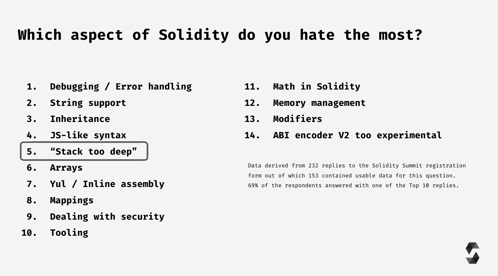

# Solidity



https://solidity.readthedocs.io/en/v0.7.3/index.html

`uint` (*u*nsigned *int*eger of *256* bits)

`address public minter;` The keyword `public` automatically generates a function that allows you to access the current value of the state variable from outside of the contract. The code of the function generated by the compiler is equivalent to the following: `function minter() external view returns (address) { return minter; }`. And `mapping (address => uint) public balances;` generates: `function balances(address _account) external view returns (uint) { return balances[_account]; }`

**Mapping**s can be seen as hash tables which are virtually initialised such that every possible key exists from the start and is mapped to a value whose byte-representation is **all zeros**. However, it is neither possible to obtain a list of all keys of a mapping, nor a list of all values.

**Events**

Ethereum clients such as web applications can listen for these events emitted on the blockchain without much cost. As soon as it is emitted, the listener receives the arguments, which makes it possible to track transactions.

```
event Sent(address from, address to, uint amount);
```

```js
Coin.Sent().watch({}, '', function(error, result) {
    if (!error) {
        console.log("Coin transfer: " + result.args.amount +
            " coins were sent from " + result.args.from +
            " to " + result.args.to + ".");
        console.log("Balances now:\n" +
            "Sender: " + Coin.balances.call(result.args.from) +
            "Receiver: " + Coin.balances.call(result.args.to));
    }
})
```

**EVM**

The Ethereum Virtual Machine or EVM is the runtime environment for smart contracts in Ethereum. It is not only sandboxed but actually completely isolated, which means that code running inside the EVM has no access to network, filesystem or other processes. Smart contracts even have limited access to other smart contracts.

There are two kinds of accounts in Ethereum which share the same address space: **External accounts** that are controlled by public-private key pairs (i.e. humans) and **contract accounts** which are controlled by the code stored together with the account. The address of an external account is determined from the public key while the address of a contract is determined at the time the contract is created (it is derived from the creator address and the number of transactions sent from that address, the so-called “nonce”).

The only way to remove code from the blockchain is when a contract at that address performs the `selfdestruct` operation. The remaining Ether stored at that address is sent to a designated target and then the storage and code is removed from the state. Even if a contract’s code does not contain a call to `selfdestruct`, it can still perform that operation using `delegatecall` or `callcode`.

```
struct Proposal {
	bytes32 name;   // short name (up to 32 bytes)
	uint voteCount; // number of accumulated votes
}
Proposal[] public proposals;
proposals.push(Proposal({
	name: ...,
	voteCount: 0
}));
```

```
modifier condition(bool _condition) {
	require(_condition);
	_;
}
```

**Modular Contracts**

```
// SPDX-License-Identifier: GPL-3.0
pragma solidity >=0.5.0 <0.8.0;

library Balances {
    function move(mapping(address => uint256) storage balances, address from, address to, uint amount) internal {
        require(balances[from] >= amount);
        require(balances[to] + amount >= balances[to]);
        balances[from] -= amount;
        balances[to] += amount;
    }
}

contract Token {
    mapping(address => uint256) balances;
    using Balances for *;
    mapping(address => mapping (address => uint256)) allowed;

    event Transfer(address from, address to, uint amount);
    event Approval(address owner, address spender, uint amount);

    function transfer(address to, uint amount) public returns (bool success) {
        balances.move(msg.sender, to, amount);
        emit Transfer(msg.sender, to, amount);
        return true;

    }

    function transferFrom(address from, address to, uint amount) public returns (bool success) {
        require(allowed[from][msg.sender] >= amount);
        allowed[from][msg.sender] -= amount;
        balances.move(from, to, amount);
        emit Transfer(from, to, amount);
        return true;
    }

    function approve(address spender, uint tokens) public returns (bool success) {
        require(allowed[msg.sender][spender] == 0, "");
        allowed[msg.sender][spender] = tokens;
        emit Approval(msg.sender, spender, tokens);
        return true;
    }

    function balanceOf(address tokenOwner) public view returns (uint balance) {
        return balances[tokenOwner];
    }
}
```

## Pragmas

The version pragma is used as follows: `pragma solidity ^0.5.2;`

A source file with the line above does not compile with a compiler earlier than version 0.5.2, and it also does not work on a compiler starting from version 0.6.0 (this second condition is added by using `^`).

It is possible to specify more complex rules for the compiler version, these follow the same syntax used by [npm](https://docs.npmjs.com/misc/semver).

The second pragma is the **experimental pragma**. It can be used to enable features of the compiler or language that are not yet enabled by default. The following experimental pragmas are currently supported:

ABIEncoderV2

The new ABI encoder is able to encode and decode arbitrarily nested arrays and structs. It might produce less optimal code and has not received as much testing as the old encoder, but is considered non-experimental as of Solidity 0.6.0. You still have to explicitly activate it using `pragma experimental ABIEncoderV2;` - we kept the same pragma, even though it is not considered experimental anymore.

## Integers

`int` / `uint`: Signed and unsigned integers of various sizes. Keywords `uint8` to `uint256` in steps of `8` (unsigned of 8 up to 256 bits) and `int8` to `int256`. `uint` and `int` are aliases for `uint256` and `int256`, respectively.

For an integer type `X`, you can use `type(X).min` and `type(X).max` to access the minimum and maximum value representable by the type.

Warning

Integers in Solidity are restricted to a certain range. For example, with `uint32`, this is `0` up to `2**32 - 1`. If the result of some operation on those numbers does not fit inside this range, it is truncated. These truncations can have serious consequences that you should [be aware of and mitigate against](https://solidity.readthedocs.io/en/v0.7.3/security-considerations.html#underflow-overflow).

**Shifts**

- For positive and negative `x` values, `x << y` is equivalent to `x * 2**y`.
- For positive `x` values, `x >> y` is equivalent to `x / 2**y`.
- For negative `x` values, `x >> y` is equivalent to `(x + 1) / 2**y - 1` (which is the same as dividing `x` by `2**y` while rounding down towards negative infinity).

Warning

Before version `0.5.0` a right shift `x >> y` for negative `x` was equivalent to `x / 2**y`, i.e., right shifts used rounding up (towards zero) instead of rounding down (towards negative infinity).

**Addition, subtraction and multiplication**

Addition, subtraction and multiplication have the usual semantics. They wrap in two’s complement representation, meaning that for example `uint256(0) - uint256(1) == 2**256 - 1`. You have to take these overflows into account when designing safe smart contracts.

The expression `-x` is equivalent to `(T(0) - x)` where `T` is the type of `x`. This means that `-x` will not be negative if the type of `x` is an unsigned integer type. Also, `-x` can be positive if `x` is negative. There is another caveat also resulting from two’s complement representation:

```
int x = -2**255;
assert(-x == x);
```

This means that even if a number is negative, you cannot assume that its negation will be positive.

**Division**

Since the type of the result of an operation is always the type of one of the operands, division on integers always results in an integer. In Solidity, division rounds towards zero. This mean that `int256(-5) / int256(2) == int256(-2)`.

**Modulo**

The modulo operation `a % n` yields the remainder `r` after the division of the operand `a` by the operand `n`, where `q = int(a / n)` and `r = a - (n * q)`. This means that modulo results in the same sign as its left operand (or zero) and `a % n == -(-a % n)` holds for negative `a`:

```
int256(5) % int256(2) == int256(1)
int256(5) % int256(-2) == int256(1)
int256(-5) % int256(2) == int256(-1)
int256(-5) % int256(-2) == int256(-1)
```

**Exponentiation**

Exponentiation is only available for unsigned types in the exponent. The resulting type of an exponentiation is always equal to the type of the base. Please take care that it is large enough to hold the result and prepare for potential wrapping behaviour. Note that `0**0` is defined by the EVM as `1`.

**Rational and Integer Literals**

Number literal expressions retain arbitrary precision until they are converted to a non-literal type (i.e. by using them together with a non-literal expression or by explicit conversion). This means that computations do not overflow and divisions do not truncate in number literal expressions.

数值字面常量表达式本身支持任意精度，除非它们被转换成了非字面常量类型（也就是说，当它们出现在变量表达式中时就会发生转换）。 这意味着在数值常量表达式中, 计算不会溢出而除法也不会截断。

For example, `(2**800 + 1) - 2**800` results in the constant `1` (of type `uint8`) although intermediate results would not even fit the machine word size. Furthermore, `.5 * 8` results in the integer `4` (although non-integers were used in between).

例如， (2\*\*800 + 1) - 2\*\*800 的结果是字面常量 1 （属于 uint8 类型），尽管计算的中间结果已经超过了 以太坊虚拟机Ethereum Virtual Machine(EVM) 的机器字长度。 此外， .5 * 8 的结果是整型 4 （尽管有非整型参与了计算）。

Warning

Division on integer literals used to truncate in Solidity prior to version 0.4.0, but it now converts into a rational number, i.e. `5 / 2` is not equal to `2`, but to `2.5`.

Note

Number literal expressions are converted into a non-literal type as soon as they are used with non-literal expressions. Disregarding types, the value of the expression assigned to `b` below evaluates to an integer. Because `a` is of type `uint128`, the expression `2.5 + a` has to have a proper type, though. Since there is no common type for the type of `2.5` and `uint128`, the Solidity compiler does not accept this code.

```
uint128 a = 1;
uint128 b = 2.5 + a + 0.5;
```

## Address

The address type comes in two flavours, which are largely identical:

> - `address`: Holds a 20 byte value (size of an Ethereum address).
> - `address payable`: Same as `address`, but with the additional members `transfer` and `send`.

The idea behind this distinction is that `address payable` is an address you can send Ether to, while a plain `address` cannot be sent Ether.

Type conversions:

Implicit conversions from `address payable` to `address` are allowed, whereas conversions from `address` to `address payable` must be explicit via `payable(<address>)`.

[Address literals](https://solidity.readthedocs.io/en/v0.7.3/types.html#address-literals) can be implicitly converted to `address payable`.

Explicit conversions to and from `address` are allowed for integers, integer literals, `bytes20` and contract types with the following caveat: The result of a conversion of the form `address(x)` has the type `address payable`, if `x` is of integer or fixed bytes type, a literal or a contract with a receive or payable fallback function. If `x` is a contract without a receive or payable fallback function, then `address(x)` will be of type `address`. In external function signatures `address` is used for both the `address` and the `address payable` type.

The distinction between `address` and `address payable` was introduced with version 0.5.0. Also starting from that version, contracts do not derive from the address type, but can still be explicitly converted to `address` or to `address payable`, if they have a receive or payable fallback function.

**Members of Addresses**

- `balance` and `transfer`

It is possible to query the balance of an address using the property `balance` and to send Ether (in units of wei) to a payable address using the `transfer` function:

```
address payable x = address(0x123);
address myAddress = address(this);
if (x.balance < 10 && myAddress.balance >= 10) x.transfer(10);
```

The `transfer` function fails if the balance of the current contract is not large enough or if the Ether transfer is rejected by the receiving account. The `transfer` function reverts on failure.

- `send`

Send is the low-level counterpart of `transfer`. If the execution fails, the current contract will not stop with an exception, but `send` will return `false`.

Warning

There are some dangers in using `send`: The transfer fails if the call stack depth is at 1024 (this can always be forced by the caller) and it also fails if the recipient runs out of gas. So in order to make safe Ether transfers, always check the return value of `send`, use `transfer` or even better: use a pattern where the recipient withdraws the money.

- `call`, `delegatecall` and `staticcall`

They all take a single `bytes memory` parameter and return the success condition (as a `bool`) and the returned data (`bytes memory`). The functions `abi.encode`, `abi.encodePacked`, `abi.encodeWithSelector` and `abi.encodeWithSignature` can be used to encode structured data.

Example:

```
bytes memory payload = abi.encodeWithSignature("register(string)", "MyName");
(bool success, bytes memory returnData) = address(nameReg).call(payload);
require(success);
```

```
address(nameReg).call{gas: 1000000}(abi.encodeWithSignature("register(string)", "MyName"));
address(nameReg).call{value: 1 ether}(abi.encodeWithSignature("register(string)", "MyName"));
address(nameReg).call{gas: 1000000, value: 1 ether}(abi.encodeWithSignature("register(string)", "MyName"));

```

The `gas` option is available on all three methods, while the `value` option is not supported for `delegatecall`.

In a similar way, the function `delegatecall` can be used: the difference is that only the code of the given address is used, all other aspects (storage, balance, …) are taken from the current contract. The purpose of `delegatecall` is to use library code which is stored in another contract. The user has to ensure that the layout of storage in both contracts is suitable for delegatecall to be used.

Since byzantium `staticcall` can be used as well. This is basically the same as `call`, but will revert if the called function modifies the state in any way.

Prior to version 0.5.0, there was a member called `callcode` with similar but slightly different semantics than `delegatecall`.

**Note**

All contracts can be converted to `address` type, so it is possible to query the balance of the current contract using `address(this).balance`.

## Contract Types

Every [contract](https://solidity.readthedocs.io/en/v0.7.3/contracts.html#contracts) defines its own type. You can implicitly convert contracts to contracts they inherit from. Contracts can be explicitly converted to and from the `address` type.

Explicit conversion to and from the `address payable` type is only possible if the contract type has a receive or payable fallback function. The conversion is still performed using `address(x)`. If the contract type does not have a receive or payable fallback function, the conversion to `address payable` can be done using `payable(address(x))`. 

For a contract `C` you can use `type(C)` to access [type information](https://solidity.readthedocs.io/en/v0.7.3/units-and-global-variables.html#meta-type) about the contract.

`this` (current contract’s type): the current contract, explicitly convertible to [Address](https://solidity.readthedocs.io/en/v0.7.3/types.html#address)

`selfdestruct(address payable recipient)`

Destroy the current contract, sending its funds to the given [Address](https://solidity.readthedocs.io/en/v0.7.3/types.html#address) and end execution. Note that `selfdestruct` has some peculiarities inherited from the EVM:

- the receiving contract’s receive function is not executed.
- the contract is only really destroyed at the end of the transaction and `revert` s might “undo” the destruction.

## Byte arrays

**Fixed-size byte arrays**

The value types `bytes1`, `bytes2`, `bytes3`, …, `bytes32` hold a sequence of bytes from one to up to 32. `byte` is an alias for `bytes1`.

Index access: If `x` is of type `bytesI`, then `x[k]` for `0 <= k < I` returns the `k` th byte (read-only).

`.length` yields the fixed length of the byte array (read-only).

Note

The type `byte[]` is an array of bytes, but due to padding rules, it wastes 31 bytes of space for each element (except in storage). It is better to use the `bytes` type instead.

**Dynamically-sized byte array**

`bytes`:

Dynamically-sized byte array, see [Arrays](https://solidity.readthedocs.io/en/v0.7.3/types.html#arrays). Not a value-type!

`string`:

Dynamically-sized UTF-8-encoded string, see [Arrays](https://solidity.readthedocs.io/en/v0.7.3/types.html#arrays). Not a value-type!

## String Literals and Types

String literals are written with either double or single-quotes (`"foo"` or `'bar'`), and they can also be split into multiple consecutive parts (`"foo" "bar"` is equivalent to `"foobar"`) which can be helpful when dealing with long strings. They do not imply trailing zeroes as in C; `"foo"` represents three bytes, not four. As with integer literals, their type can vary, but they are implicitly convertible to `bytes1`, …, `bytes32`, if they fit, to `bytes` and to `string`.

For example, with `bytes32 samevar = "stringliteral"` the string literal is interpreted in its raw byte form when assigned to a `bytes32` type.

String literals can only contain printable ASCII characters, which means the characters between and including 0x1F .. 0x7E.

Additionally, string literals also support the following escape characters:

> - `\<newline>` (escapes an actual newline)
> - `\\` (backslash)
> - `\'` (single quote)
> - `\"` (double quote)
> - `\b` (backspace)
> - `\f` (form feed)
> - `\n` (newline)
> - `\r` (carriage return)
> - `\t` (tab)
> - `\v` (vertical tab)
> - `\xNN` (hex escape, see below)
> - `\uNNNN` (unicode escape, see below)

`\xNN` takes a hex value and inserts the appropriate byte, while `\uNNNN` takes a Unicode codepoint and inserts an UTF-8 sequence.

The string in the following example has a length of ten bytes. It starts with a newline byte, followed by a double quote, a single quote a backslash character and then (without separator) the character sequence `abcdef`.

```
"\n\"\'\\abc\
def"
```

Any Unicode line terminator which is not a newline (i.e. LF, VF, FF, CR, NEL, LS, PS) is considered to terminate the string literal. Newline only terminates the string literal if it is not preceded by a `\`.

**Unicode Literals**

While regular string literals can only contain ASCII, Unicode literals – prefixed with the keyword `unicode` – can contain any valid UTF-8 sequence. They also support the very same escape sequences as regular string literals.

```
string memory a = unicode"Hello 😃";
```

## Hexadecimal Literals

Hexadecimal literals are prefixed with the keyword `hex` and are enclosed in double or single-quotes (`hex"001122FF"`, `hex'0011_22_FF'`). Their content must be hexadecimal digits which can optionally use a single underscore as separator between byte boundaries. The value of the literal will be the binary representation of the hexadecimal sequence.

Multiple hexadecimal literals separated by whitespace are concatenated into a single literal: `hex"00112233" hex"44556677"` is equivalent to `hex"0011223344556677"`

## Enums

Enums are explicitly convertible to and from all integer types but implicit conversion is not allowed. 

The data representation is the same as for enums in C: The options are represented by subsequent unsigned integer values starting from `0`.

```
// SPDX-License-Identifier: GPL-3.0
pragma solidity >=0.4.16 <0.8.0;

contract test {
    enum ActionChoices { GoLeft, GoRight, GoStraight, SitStill }
    ActionChoices choice;
    ActionChoices constant defaultChoice = ActionChoices.GoStraight;

    function setGoStraight() public {
        choice = ActionChoices.GoStraight;
    }

    // Since enum types are not part of the ABI, the signature of "getChoice"
    // will automatically be changed to "getChoice() returns (uint8)"
    // for all matters external to Solidity. The integer type used is just
    // large enough to hold all enum values, i.e. if you have more than 256 values,
    // `uint16` will be used and so on.
    function getChoice() public view returns (ActionChoices) {
        return choice;
    }

    function getDefaultChoice() public pure returns (uint) {
        return uint(defaultChoice);
    }
}
```

## Function Types

Internal functions can only be called inside the current contract (more specifically, inside the current code unit, which also includes internal library functions and inherited functions) because they cannot be executed outside of the context of the current contract.

```
function (<parameter types>) {internal|external} [pure|view|payable] [returns (<return types>)]
```

Note that public functions of the current contract can be used both as an internal and as an external function. To use `f` as an internal function, just use `f`, if you want to use its external form, use `this.f`.

External (or public) functions have the following members:

- `.address` returns the address of the contract of the function.
- `.selector` returns the [ABI function selector](https://solidity.readthedocs.io/en/v0.7.3/abi-spec.html#abi-function-selector)

Note

External (or public) functions used to have the additional members `.gas(uint)` and `.value(uint)`. These were deprecated in Solidity 0.6.2 and removed in Solidity 0.7.0. Instead use `{gas: ...}` and `{value: ...}` to specify the amount of gas or the amount of wei sent to a function, respectively. See [External Function Calls](https://solidity.readthedocs.io/en/v0.7.3/control-structures.html#external-function-calls) for more information.

Example that shows how to use the members:

```
// SPDX-License-Identifier: GPL-3.0
pragma solidity >=0.6.4 <0.8.0;

contract Example {
    function f() public payable returns (bytes4) {
        assert(this.f.address == address(this));
        return this.f.selector;
    }

    function g() public {
        this.f{gas: 10, value: 800}();
    }
}
```

Example that shows how to use internal function types:

```
// SPDX-License-Identifier: GPL-3.0
pragma solidity >=0.4.16 <0.8.0;

library ArrayUtils {
    // internal functions can be used in internal library functions because
    // they will be part of the same code context
    function map(uint[] memory self, function (uint) pure returns (uint) f)
        internal
        pure
        returns (uint[] memory r)
    {
        r = new uint[](self.length);
        for (uint i = 0; i < self.length; i++) {
            r[i] = f(self[i]);
        }
    }

    function reduce(
        uint[] memory self,
        function (uint, uint) pure returns (uint) f
    )
        internal
        pure
        returns (uint r)
    {
        r = self[0];
        for (uint i = 1; i < self.length; i++) {
            r = f(r, self[i]);
        }
    }

    function range(uint length) internal pure returns (uint[] memory r) {
        r = new uint[](length);
        for (uint i = 0; i < r.length; i++) {
            r[i] = i;
        }
    }
}


contract Pyramid {
    using ArrayUtils for *;

    function pyramid(uint l) public pure returns (uint) {
        return ArrayUtils.range(l).map(square).reduce(sum);
    }

    function square(uint x) internal pure returns (uint) {
        return x * x;
    }

    function sum(uint x, uint y) internal pure returns (uint) {
        return x + y;
    }
}
```

Another example that uses external function types:

```
// SPDX-License-Identifier: GPL-3.0
pragma solidity >=0.4.22 <0.8.0;


contract Oracle {
    struct Request {
        bytes data;
        function(uint) external callback;
    }

    Request[] private requests;
    event NewRequest(uint);

    function query(bytes memory data, function(uint) external callback) public {
        requests.push(Request(data, callback));
        emit NewRequest(requests.length - 1);
    }

    function reply(uint requestID, uint response) public {
        // Here goes the check that the reply comes from a trusted source
        requests[requestID].callback(response);
    }
}


contract OracleUser {
    Oracle constant private ORACLE_CONST = Oracle(0x1234567); // known contract
    uint private exchangeRate;

    function buySomething() public {
        ORACLE_CONST.query("USD", this.oracleResponse);
    }

    function oracleResponse(uint response) public {
        require(
            msg.sender == address(ORACLE_CONST),
            "Only oracle can call this."
        );
        exchangeRate = response;
    }
}
```

## Reference Types

Currently, reference types comprise structs, arrays and mappings. If you use a reference type, you always have to explicitly provide the data area where the type is stored: `memory` (whose lifetime is limited to an external function call), `storage` (the location where the state variables are stored, where the lifetime is limited to the lifetime of a contract) or `calldata` (special data location that contains the function arguments).

Every reference type has an additional annotation, the “**data location**”, about where it is stored. There are three data locations: `memory`, `storage` and `calldata`. Calldata is a non-modifiable, non-persistent area where function arguments are stored, and behaves mostly like memory. It is required for parameters of external functions but can also be used for other variables.

- Assignments between `storage` and `memory` (or from `calldata`) always create an independent copy.
- Assignments from `memory` to `memory` only create references. This means that changes to one memory variable are also visible in all other memory variables that refer to the same data.
- Assignments from `storage` to a **local** storage variable also only assign a reference.
- All other assignments to `storage` always copy. Examples for this case are assignments to state variables or to members of local variables of storage struct type, even if the local variable itself is just a reference.

```
// SPDX-License-Identifier: GPL-3.0
pragma solidity >=0.5.0 <0.8.0;

contract C {
    // The data location of x is storage.
    // This is the only place where the
    // data location can be omitted.
    uint[] x;

    // The data location of memoryArray is memory.
    function f(uint[] memory memoryArray) public {
        x = memoryArray; // works, copies the whole array to storage
        uint[] storage y = x; // works, assigns a pointer, data location of y is storage
        y[7]; // fine, returns the 8th element
        y.pop(); // fine, modifies x through y
        delete x; // fine, clears the array, also modifies y
        // The following does not work; it would need to create a new temporary /
        // unnamed array in storage, but storage is "statically" allocated:
        // y = memoryArray;
        // This does not work either, since it would "reset" the pointer, but there
        // is no sensible location it could point to.
        // delete y;
        g(x); // calls g, handing over a reference to x
        h(x); // calls h and creates an independent, temporary copy in memory
    }

    function g(uint[] storage) internal pure {}
    function h(uint[] memory) public pure {}
}
```

## Arrays

The type of an array of fixed size `k` and element type `T` is written as `T[k]`, and an array of dynamic size as `T[]`.

For example, an array of 5 dynamic arrays of `uint` is written as `uint[][5]`. The notation is **reversed** compared to some other languages. In Solidity, `X[3]` is always an array containing three elements of type `X`, even if `X` is itself an array. This is not the case in other languages such as C.

Indices are zero-based, and access is in the opposite direction of the declaration.

For example, if you have a variable `uint[][5] memory x`, you access the second `uint` in the third dynamic array using `x[2][1]`, and to access the third dynamic array, use `x[2]`. Again, if you have an array `T[5] a` for a type `T` that can also be an array, then `a[2]` always has type `T`.

Methods `.push()` and `.push(value)` can be used to append a new element at the end of the array, where `.push()` appends a zero-initialized element and returns a reference to it.

**`bytes` and `strings` as Arrays**

Variables of type `bytes` and `string` are special arrays. A `bytes` is similar to `byte[]`, but it is packed tightly in calldata and memory. `string` is equal to `bytes` but does not allow length or index access.

Solidity does not have string manipulation functions, but there are third-party string libraries. You can also compare two strings by their keccak256-hash using `keccak256(abi.encodePacked(s1)) == keccak256(abi.encodePacked(s2))` and concatenate two strings using `abi.encodePacked(s1, s2)`.

You should use `bytes` over `byte[]` because it is cheaper, since `byte[]` adds 31 padding bytes between the elements. As a general rule, use `bytes` for arbitrary-length raw byte data and `string` for arbitrary-length string (UTF-8) data. If you can limit the length to a certain number of bytes, always use one of the value types `bytes1` to `bytes32` because they are much cheaper.

Note

If you want to access the byte-representation of a string `s`, use `bytes(s).length` / `bytes(s)[7] = 'x';`. Keep in mind that you are accessing the low-level bytes of the UTF-8 representation, and not the individual characters.

**Allocating Memory Arrays**

Memory arrays with dynamic length can be created using the `new` operator. As opposed to storage arrays, it is **not** possible to resize memory arrays (e.g. the `.push` member functions are not available). You either have to calculate the required size in advance or create a new memory array and copy every element.

```
// SPDX-License-Identifier: GPL-3.0
pragma solidity >=0.4.16 <0.8.0;

contract C {
    function f(uint len) public pure {
        uint[] memory a = new uint[](7);
        bytes memory b = new bytes(len);
        assert(a.length == 7);
        assert(b.length == len);
        a[6] = 8;
    }
}
```

**Array Literals**

Array literals are always statically-sized memory arrays.

In the example below, the type of `[1, 2, 3]` is `uint8[3] memory`. Because the type of each of these constants is `uint8`, if you want the result to be a `uint[3] memory` type, you need to convert the first element to `uint`.

```
// SPDX-License-Identifier: GPL-3.0
pragma solidity >=0.4.16 <0.8.0;

contract C {
    function f() public pure {
        g([uint(1), 2, 3]);
    }
    function g(uint[3] memory) public pure {
        // ...
    }
}
```

Fixed size memory arrays **cannot** be assigned to dynamically-sized memory arrays.

**Array Members**

- **length**:

  Arrays have a `length` member that contains their number of elements. The length of memory arrays is fixed (but dynamic, i.e. it can depend on runtime parameters) once they are created.

- **push()**:

  Dynamic storage arrays and `bytes` (not `string`) have a member function called `push()` that you can use to append a zero-initialised element at the end of the array. It returns a reference to the element, so that it can be used like `x.push().t = 2` or `x.push() = b`.

- **push(x)**:

  Dynamic storage arrays and `bytes` (not `string`) have a member function called `push(x)` that you can use to append a given element at the end of the array. The function returns nothing.

- **pop**:

  Dynamic storage arrays and `bytes` (not `string`) have a member function called `pop` that you can use to remove an element from the end of the array. This also implicitly calls [delete](https://solidity.readthedocs.io/en/v0.7.3/types.html#delete) on the removed element.

Note

Increasing the length of a storage array by calling `push()` has constant gas costs because storage is zero-initialised, while decreasing the length by calling `pop()` has a cost that depends on the “size” of the element being removed. If that element is an array, it can be very costly, because it includes explicitly clearing the removed elements similar to calling [delete](https://solidity.readthedocs.io/en/v0.7.3/types.html#delete) on them.

Note

To use arrays of arrays in external (instead of public) functions, you need to activate ABIEncoderV2.

Note

In EVM versions before Byzantium, it was not possible to access dynamic arrays return from function calls. If you call functions that return dynamic arrays, make sure to use an EVM that is set to Byzantium mode.

**Array Slices**

Array slices are a view on a contiguous portion of an array. They are written as `x[start:end]`, where `start` and `end` are expressions resulting in a uint256 type (or implicitly convertible to it). The first element of the slice is `x[start]` and the last element is `x[end - 1]`.

Both `start` and `end` are optional: `start` defaults to `0` and `end` defaults to the length of the array.

Array slices do not have any members. They are implicitly convertible to arrays of their underlying type and support index access. Index access is not absolute in the underlying array, but relative to the start of the slice.

Array slices do not have a type name which means no variable can have an array slices as type, they only exist in intermediate expressions.

Note

As of now, array slices are only implemented for calldata arrays.

Array slices are useful to ABI-decode secondary data passed in function parameters:

```
// SPDX-License-Identifier: GPL-3.0
pragma solidity ^0.7.0;

contract Proxy {
    /// @dev Address of the client contract managed by proxy i.e., this contract
    address client;

    constructor(address _client) {
        client = _client;
    }

    /// Forward call to "setOwner(address)" that is implemented by client
    /// after doing basic validation on the address argument.
    function forward(bytes calldata _payload) external {
        // Since ABI decoding requires padded data, we cannot
        // use abi.decode(_payload[:4], (bytes4)).
        bytes4 sig =
            _payload[0] |
            (bytes4(_payload[1]) >> 8) |
            (bytes4(_payload[2]) >> 16) |
            (bytes4(_payload[3]) >> 24);
        if (sig == bytes4(keccak256("setOwner(address)"))) {
            address owner = abi.decode(_payload[4:], (address));
            require(owner != address(0), "Address of owner cannot be zero.");
        }
        (bool status,) = client.delegatecall(_payload);
        require(status, "Forwarded call failed.");
    }
}
```

## Structs

```
// SPDX-License-Identifier: GPL-3.0
pragma solidity >=0.6.0 <0.8.0;

// Defines a new type with two fields.
// Declaring a struct outside of a contract allows
// it to be shared by multiple contracts.
// Here, this is not really needed.
struct Funder {
    address addr;
    uint amount;
}

contract CrowdFunding {
    // Structs can also be defined inside contracts, which makes them
    // visible only there and in derived contracts.
    struct Campaign {
        address payable beneficiary;
        uint fundingGoal;
        uint numFunders;
        uint amount;
        mapping (uint => Funder) funders;
    }

    uint numCampaigns;
    mapping (uint => Campaign) campaigns;

    function newCampaign(address payable beneficiary, uint goal) public returns (uint campaignID) {
        campaignID = numCampaigns++; // campaignID is return variable
        // We cannot use "campaigns[campaignID] = Campaign(beneficiary, goal, 0, 0)"
        // because the RHS creates a memory-struct "Campaign" that contains a mapping.
        Campaign storage c = campaigns[campaignID];
        c.beneficiary = beneficiary;
        c.fundingGoal = goal;
    }

    function contribute(uint campaignID) public payable {
        Campaign storage c = campaigns[campaignID];
        // Creates a new temporary memory struct, initialised with the given values
        // and copies it over to storage.
        // Note that you can also use Funder(msg.sender, msg.value) to initialise.
        c.funders[c.numFunders++] = Funder({addr: msg.sender, amount: msg.value});
        c.amount += msg.value;
    }

    function checkGoalReached(uint campaignID) public returns (bool reached) {
        Campaign storage c = campaigns[campaignID];
        if (c.amount < c.fundingGoal)
            return false;
        uint amount = c.amount;
        c.amount = 0;
        c.beneficiary.transfer(amount);
        return true;
    }
}
```

It is not possible for a struct to contain a member of its own type, although the struct itself can be the value type of a mapping member or it can contain a dynamically-sized array of its type. This restriction is necessary, as the size of the struct has to be finite.

## Mapping Types

Mapping types use the syntax `mapping(_KeyType => _ValueType)` and variables of mapping type are declared using the syntax `mapping(_KeyType => _ValueType) _VariableName`. The `_KeyType` can be any built-in value type, `bytes`, `string`, or any contract or enum type. Other user-defined or complex types, such as mappings, structs or array types are not allowed. `_ValueType` can be any type, including mappings, arrays and structs.

You can think of mappings as [hash tables](https://en.wikipedia.org/wiki/Hash_table), which are virtually initialised such that every possible key exists and is mapped to a value whose byte-representation is all zeros, a type’s [default value](https://solidity.readthedocs.io/en/v0.7.3/control-structures.html#default-value). The similarity ends there, the key data is not stored in a mapping, only its `keccak256` hash is used to look up the value.

Because of this, mappings do not have a length or a concept of a key or value being set, and therefore cannot be erased without extra information regarding the assigned keys (see [Clearing Mappings](https://solidity.readthedocs.io/en/v0.7.3/security-considerations.html#clearing-mappings)).

Mappings can only have a data location of `storage` and thus are allowed for state variables, as storage reference types in functions, or as parameters for library functions. They cannot be used as parameters or return parameters of contract functions that are publicly visible. These restrictions are also true for arrays and structs that contain mappings.

You can mark state variables of mapping type as `public` and Solidity creates a [getter](https://solidity.readthedocs.io/en/v0.7.3/contracts.html#visibility-and-getters) for you. The `_KeyType` becomes a parameter for the getter. If `_ValueType` is a value type or a struct, the getter returns `_ValueType`. If `_ValueType` is an array or a mapping, the getter has one parameter for each `_KeyType`, recursively.

**Iterable Mappings**

You cannot iterate over mappings, i.e. you cannot enumerate their keys. It is possible, though, to implement a data structure on top of them and iterate over that. For example, the code below implements an `IterableMapping` library that the `User` contract then adds data too, and the `sum` function iterates over to sum all the values.

```
// SPDX-License-Identifier: GPL-3.0
pragma solidity >=0.6.0 <0.8.0;

struct IndexValue { uint keyIndex; uint value; }
struct KeyFlag { uint key; bool deleted; }

struct itmap {
    mapping(uint => IndexValue) data;
    KeyFlag[] keys;
    uint size;
}

library IterableMapping {
    function insert(itmap storage self, uint key, uint value) internal returns (bool replaced) {
        uint keyIndex = self.data[key].keyIndex;
        self.data[key].value = value;
        if (keyIndex > 0)
            return true;
        else {
            keyIndex = self.keys.length;
            self.keys.push();
            self.data[key].keyIndex = keyIndex + 1;
            self.keys[keyIndex].key = key;
            self.size++;
            return false;
        }
    }

    function remove(itmap storage self, uint key) internal returns (bool success) {
        uint keyIndex = self.data[key].keyIndex;
        if (keyIndex == 0)
            return false;
        delete self.data[key];
        self.keys[keyIndex - 1].deleted = true;
        self.size --;
    }

    function contains(itmap storage self, uint key) internal view returns (bool) {
        return self.data[key].keyIndex > 0;
    }

    function iterate_start(itmap storage self) internal view returns (uint keyIndex) {
        return iterate_next(self, uint(-1));
    }

    function iterate_valid(itmap storage self, uint keyIndex) internal view returns (bool) {
        return keyIndex < self.keys.length;
    }

    function iterate_next(itmap storage self, uint keyIndex) internal view returns (uint r_keyIndex) {
        keyIndex++;
        while (keyIndex < self.keys.length && self.keys[keyIndex].deleted)
            keyIndex++;
        return keyIndex;
    }

    function iterate_get(itmap storage self, uint keyIndex) internal view returns (uint key, uint value) {
        key = self.keys[keyIndex].key;
        value = self.data[key].value;
    }
}

// How to use it
contract User {
    // Just a struct holding our data.
    itmap data;
    // Apply library functions to the data type.
    using IterableMapping for itmap;

    // Insert something
    function insert(uint k, uint v) public returns (uint size) {
        // This calls IterableMapping.insert(data, k, v)
        data.insert(k, v);
        // We can still access members of the struct,
        // but we should take care not to mess with them.
        return data.size;
    }

    // Computes the sum of all stored data.
    function sum() public view returns (uint s) {
        for (
            uint i = data.iterate_start();
            data.iterate_valid(i);
            i = data.iterate_next(i)
        ) {
            (, uint value) = data.iterate_get(i);
            s += value;
        }
    }
}
```

## Operators

If `a` is an LValue (i.e. a variable or something that can be assigned to), the following operators are available as shorthands:

`a += e` is equivalent to `a = a + e`. The operators `-=`, `*=`, `/=`, `%=`, `|=`, `&=` and `^=` are defined accordingly. `a++` and `a--` are equivalent to `a += 1` / `a -= 1` but the expression itself still has the previous value of `a`. In contrast, `--a` and `++a` have the same effect on `a` but return the value after the change.

### delete

`delete a` assigns the initial value for the type to `a`. I.e. for integers it is equivalent to `a = 0`, but it can also be used on arrays, where it assigns a dynamic array of length zero or a static array of the same length with all elements set to their initial value. `delete a[x]` deletes the item at index `x` of the array and leaves all other elements and the length of the array untouched. This especially means that it leaves a gap in the array. If you plan to remove items, a [mapping](https://solidity.readthedocs.io/en/v0.7.3/types.html#mapping-types) is probably a better choice.

For structs, it assigns a struct with all members reset. In other words, the value of `a` after `delete a` is the same as if `a` would be declared without assignment, with the following caveat:

`delete` has no effect on mappings (as the keys of mappings may be arbitrary and are generally unknown). So if you delete a struct, it will reset all members that are not mappings and also recurse into the members unless they are mappings. However, individual keys and what they map to can be deleted: If `a` is a mapping, then `delete a[x]` will delete the value stored at `x`.

It is important to note that `delete a` really behaves like an assignment to `a`, i.e. it stores a new object in `a`. This distinction is visible when `a` is reference variable: It will only reset `a` itself, not the value it referred to previously.

```
// SPDX-License-Identifier: GPL-3.0
pragma solidity >=0.4.0 <0.8.0;

contract DeleteExample {
    uint data;
    uint[] dataArray;

    function f() public {
        uint x = data;
        delete x; // sets x to 0, does not affect data
        delete data; // sets data to 0, does not affect x
        uint[] storage y = dataArray;
        delete dataArray; // this sets dataArray.length to zero, but as uint[] is a complex object, also
        // y is affected which is an alias to the storage object
        // On the other hand: "delete y" is not valid, as assignments to local variables
        // referencing storage objects can only be made from existing storage objects.
        assert(y.length == 0);
    }
}
```

## Explicit Conversions

If an integer is explicitly converted to a smaller type, higher-order bits are cut off:

```
uint32 a = 0x12345678;
uint16 b = uint16(a); // b will be 0x5678 now
```

If an integer is explicitly converted to a larger type, it is padded on the left (i.e., at the higher order end). The result of the conversion will compare equal to the original integer:

```
uint16 a = 0x1234;
uint32 b = uint32(a); // b will be 0x00001234 now
assert(a == b);
```

Fixed-size bytes types behave differently during conversions. They can be thought of as sequences of individual bytes and converting to a smaller type will cut off the sequence:

```
bytes2 a = 0x1234;
bytes1 b = bytes1(a); // b will be 0x12
```

If a fixed-size bytes type is explicitly converted to a larger type, it is padded on the right. Accessing the byte at a fixed index will result in the same value before and after the conversion (if the index is still in range):

```
bytes2 a = 0x1234;
bytes4 b = bytes4(a); // b will be 0x12340000
assert(a[0] == b[0]);
assert(a[1] == b[1]);
```

Since integers and fixed-size byte arrays behave differently when truncating or padding, explicit conversions between integers and fixed-size byte arrays are only allowed, if both have the same size. If you want to convert between integers and fixed-size byte arrays of different size, you have to use intermediate conversions that make the desired truncation and padding rules explicit:

```
bytes2 a = 0x1234;
uint32 b = uint16(a); // b will be 0x00001234
uint32 c = uint32(bytes4(a)); // c will be 0x12340000
uint8 d = uint8(uint16(a)); // d will be 0x34
uint8 e = uint8(bytes1(a)); // e will be 0x12
```

**Conversions between Literals and Elementary Types**

**Integer Types**

Decimal and hexadecimal number literals can be implicitly converted to any integer type that is large enough to represent it without truncation:

```
uint8 a = 12; // fine
uint32 b = 1234; // fine
uint16 c = 0x123456; // fails, since it would have to truncate to 0x3456
```

**Fixed-Size Byte Arrays**

Decimal number literals cannot be implicitly converted to fixed-size byte arrays. Hexadecimal number literals can be, but only if the number of hex digits exactly fits the size of the bytes type. As an exception both decimal and hexadecimal literals which have a value of zero can be converted to any fixed-size bytes type:

```
bytes2 a = 54321; // not allowed
bytes2 b = 0x12; // not allowed
bytes2 c = 0x123; // not allowed
bytes2 d = 0x1234; // fine
bytes2 e = 0x0012; // fine
bytes4 f = 0; // fine
bytes4 g = 0x0; // fine
```

String literals and hex string literals can be implicitly converted to fixed-size byte arrays, if their number of characters matches the size of the bytes type:

```
bytes2 a = hex"1234"; // fine
bytes2 b = "xy"; // fine
bytes2 c = hex"12"; // not allowed
bytes2 d = hex"123"; // not allowed
bytes2 e = "x"; // not allowed
bytes2 f = "xyz"; // not allowed
```

**Addresses**

As described in [Address Literals](https://solidity.readthedocs.io/en/v0.7.3/types.html#address-literals), hex literals of the correct size that pass the checksum test are of `address` type. No other literals can be implicitly converted to the `address` type.

Explicit conversions from `bytes20` or any integer type to `address` result in `address payable`.

An `address a` can be converted to `address payable` via `payable(a)`.

## Units and Globally Available Variables

### Ether Units

A literal number can take a suffix of `wei`, `gwei` or `ether` to specify a subdenomination of Ether, where Ether numbers without a postfix are assumed to be Wei.

```
assert(1 wei == 1);
assert(1 gwei == 1e9);
assert(1 ether == 1e18);
```

### Time Units

Suffixes like `seconds`, `minutes`, `hours`, `days` and `weeks` after literal numbers can be used to specify units of time where seconds are the base unit and units are considered naively in the following way:

> - `1 == 1 seconds`
> - `1 minutes == 60 seconds`
> - `1 hours == 60 minutes`
> - `1 days == 24 hours`
> - `1 weeks == 7 days`

Take care if you perform calendar calculations using these units, because not every year equals 365 days and not even every day has 24 hours because of [leap seconds](https://en.wikipedia.org/wiki/Leap_second). Due to the fact that leap seconds cannot be predicted, an exact calendar library has to be updated by an external oracle.

Note

The suffix `years` has been removed in version 0.5.0 due to the reasons above.

These suffixes cannot be applied to variables. For example, if you want to interpret a function parameter in days, you can in the following way:

```
function f(uint start, uint daysAfter) public {
    if (block.timestamp >= start + daysAfter * 1 days) {
      // ...
    }
}
```

### Block and Transaction Properties

- `blockhash(uint blockNumber) returns (bytes32)`: hash of the given block - only works for 256 most recent, excluding current, blocks, all other values will be zero.
- `block.coinbase` (`address payable`): current block miner’s address
- `block.difficulty` (`uint`): current block difficulty
- `block.gaslimit` (`uint`): current block gaslimit
- `block.number` (`uint`): current block number
- `block.timestamp` (`uint`): current block timestamp as seconds since unix epoch
- `gasleft() returns (uint256)`: remaining gas
- `msg.data` (`bytes calldata`): complete calldata
- `msg.sender` (`address payable`): sender of the message (current call)
- `msg.sig` (`bytes4`): first four bytes of the calldata (i.e. function identifier)
- `msg.value` (`uint`): number of wei sent with the message
- `tx.gasprice` (`uint`): gas price of the transaction
- `tx.origin` (`address payable`): sender of the transaction (full call chain)

Note

The values of all members of `msg`, including `msg.sender` and `msg.value` can change for every **external** function call. This includes calls to library functions.

In version 0.7.0, the alias `now` (for `block.timestamp`) was removed.

### ABI Encoding and Decoding Functions

- `abi.decode(bytes memory encodedData, (...)) returns (...)`: ABI-decodes the given data, while the types are given in parentheses as second argument. Example: `(uint a, uint[2] memory b, bytes memory c) = abi.decode(data, (uint, uint[2], bytes))`
- `abi.encode(...) returns (bytes memory)`: ABI-encodes the given arguments
- `abi.encodePacked(...) returns (bytes memory)`: Performs [packed encoding](https://solidity.readthedocs.io/en/v0.7.3/abi-spec.html#abi-packed-mode) of the given arguments. Note that packed encoding can be ambiguous!
- `abi.encodeWithSelector(bytes4 selector, ...) returns (bytes memory)`: ABI-encodes the given arguments starting from the second and prepends the given four-byte selector
- `abi.encodeWithSignature(string memory signature, ...) returns (bytes memory)`: Equivalent to `abi.encodeWithSelector(bytes4(keccak256(bytes(signature))), ...)``

Note

These encoding functions can be used to craft data for external function calls without actually calling an external function. Furthermore, `keccak256(abi.encodePacked(a, b))` is a way to compute the hash of structured data (although be aware that it is possible to craft a “hash collision” using different function parameter types).

See the documentation about the [ABI](https://solidity.readthedocs.io/en/v0.7.3/abi-spec.html#abi) and the [tightly packed encoding](https://solidity.readthedocs.io/en/v0.7.3/abi-spec.html#abi-packed-mode) for details about the encoding.

### Error Handling

`assert(bool condition)`
causes an invalid opcode and thus state change reversion if the condition is not met - to be used for internal errors.
`require(bool condition)`
reverts if the condition is not met - to be used for errors in inputs or external components.
`require(bool condition, string memory message)`
reverts if the condition is not met - to be used for errors in inputs or external components. Also provides an error message.
`revert()`
abort execution and revert state changes
`revert(string memory reason)`
abort execution and revert state changes, providing an explanatory string

### Mathematical and Cryptographic Functions

- `addmod(uint x, uint y, uint k) returns (uint)`

  compute `(x + y) % k` where the addition is performed with arbitrary precision and does not wrap around at `2**256`. Assert that `k != 0` starting from version 0.5.0.

- `mulmod(uint x, uint y, uint k) returns (uint)`

  compute `(x * y) % k` where the multiplication is performed with arbitrary precision and does not wrap around at `2**256`. Assert that `k != 0` starting from version 0.5.0.

- `keccak256(bytes memory) returns (bytes32)`

  compute the Keccak-256 hash of the input

Note: There used to be an alias for `keccak256` called `sha3`, which was removed in version 0.5.0.

- `sha256(bytes memory) returns (bytes32)`

  compute the SHA-256 hash of the input

- `ripemd160(bytes memory) returns (bytes20)`

  compute RIPEMD-160 hash of the input

- `ecrecover(bytes32 hash, uint8 v, bytes32 r, bytes32 s) returns (address)`

  recover the address associated with the public key from elliptic curve signature or return zero on error. The function parameters correspond to ECDSA values of the signature:

  `r` = first 32 bytes of signature

  `s` = second 32 bytes of signature

  `v` = final 1 byte of signature

  `ecrecover` returns an `address`, and not an `address payable`. See [address payable](https://solidity.readthedocs.io/en/v0.7.3/types.html#address) for conversion, in case you need to transfer funds to the recovered address.

  For further details, read [example usage](https://ethereum.stackexchange.com/questions/1777/workflow-on-signing-a-string-with-private-key-followed-by-signature-verificatio).

Warning

If you use `ecrecover`, be aware that a valid signature can be turned into a different valid signature without requiring knowledge of the corresponding private key. In the Homestead hard fork, this issue was fixed for _transaction_ signatures (see [EIP-2](https://eips.ethereum.org/EIPS/eip-2#specification)), but the ecrecover function remained unchanged.

This is usually not a problem unless you require signatures to be unique or use them to identify items. OpenZeppelin have a [ECDSA helper library](https://docs.openzeppelin.com/contracts/2.x/api/cryptography#ECDSA) that you can use as a wrapper for `ecrecover` without this issue.

Note

When running `sha256`, `ripemd160` or `ecrecover` on a *private blockchain*, you might encounter Out-of-Gas. This is because these functions are implemented as “precompiled contracts” and only really exist after they receive the first message (although their contract code is hardcoded). Messages to non-existing contracts are more expensive and thus the execution might run into an Out-of-Gas error. A workaround for this problem is to first send Wei (1 for example) to each of the contracts before you use them in your actual contracts. This is not an issue on the main or test net.

### Type Information

The expression `type(X)` can be used to retrieve information about the type `X` (`X` can be either a contract or an integer type). 

The following properties are available for a contract type `C`:

- `type(C).name`

  The name of the contract.

- `type(C).creationCode`

  Memory byte array that contains the creation bytecode of the contract. This can be used in inline assembly to build custom creation routines, especially by using the `create2` opcode. This property can **not** be accessed in the contract itself or any derived contract. It causes the bytecode to be included in the bytecode of the call site and thus circular references like that are not possible.

- `type(C).runtimeCode`

  Memory byte array that contains the runtime bytecode of the contract. This is the code that is usually deployed by the constructor of `C`. If `C` has a constructor that uses inline assembly, this might be different from the actually deployed bytecode. Also note that libraries modify their runtime bytecode at time of deployment to guard against regular calls. The same restrictions as with `.creationCode` also apply for this property.

In addition to the properties above, the following properties are available for an interface type `I`:

- `type(I).interfaceId`:

  A `bytes4` value containing the [EIP-165](https://eips.ethereum.org/EIPS/eip-165) interface identifier of the given interface `I`. This identifier is defined as the `XOR` of all function selectors defined within the interface itself - excluding all inherited functions.

The following properties are available for an integer type `T`:

- `type(T).min`

  The smallest value representable by type `T`.

- `type(T).max`

  The largest value representable by type `T`.

## Expressions and Control Structures

Note that there is no type conversion from non-boolean to boolean types as there is in C and JavaScript, so `if (1) { ... }` is *not* valid Solidity.

### External Function Calls

The expressions `this.g(8);` and `c.g(2);` (where `c` is a contract instance) are also valid function calls, but this time, the function will be called “externally”, via a message call. Please note that function calls on `this` cannot be used in the constructor, as the actual contract has not been created yet.

### Named Calls and Anonymous Function Parameters

Function call arguments can be given by name, in any order, if they are enclosed in `{ }` as can be seen in the following example. The argument list has to coincide by name with the list of parameters from the function declaration, but can be in arbitrary order.

```
// SPDX-License-Identifier: GPL-3.0
pragma solidity >=0.4.0 <0.8.0;

contract C {
    mapping(uint => uint) data;

    function f() public {
        set({value: 2, key: 3});
    }

    function set(uint key, uint value) public {
        data[key] = value;
    }

}
```

### Omitted Function Parameter Names

The names of unused parameters (especially return parameters) can be omitted. Those parameters will still be present on the stack, but they are inaccessible.

```
// SPDX-License-Identifier: GPL-3.0
pragma solidity >=0.4.22 <0.8.0;

contract C {
    // omitted name for parameter
    function func(uint k, uint) public pure returns(uint) {
        return k;
    }
}
```

### Creating Contracts via `new`

A contract can create other contracts using the `new` keyword. The full code of the contract being created has to be known when the creating contract is compiled so recursive creation-dependencies are not possible.

```
// SPDX-License-Identifier: GPL-3.0
pragma solidity ^0.7.0;

contract D {
    uint public x;
    constructor(uint a) payable {
        x = a;
    }
}

contract C {
    D d = new D(4); // will be executed as part of C's constructor

    function createD(uint arg) public {
        D newD = new D(arg);
        newD.x();
    }

    function createAndEndowD(uint arg, uint amount) public payable {
        // Send ether along with the creation
        D newD = new D{value: amount}(arg);
        newD.x();
    }
}
```

As seen in the example, it is possible to send Ether while creating an instance of `D` using the `value` option, but it is not possible to limit the amount of gas. If the creation fails (due to out-of-stack, not enough balance or other problems), an exception is thrown.

### Salted contract creations / create2

When creating a contract, the address of the contract is computed from the address of the creating contract and a counter that is increased with each contract creation.

If you specify the option `salt` (a bytes32 value), then contract creation will use a different mechanism to come up with the address of the new contract:

It will compute the address from the address of the creating contract, the given salt value, the (creation) bytecode of the created contract and the constructor arguments.

In particular, the counter (“nonce”) is not used. This allows for more flexibility in creating contracts: You are able to derive the address of the new contract before it is created. Furthermore, you can rely on this address also in case the creating contracts creates other contracts in the meantime.

```
// SPDX-License-Identifier: GPL-3.0
pragma solidity ^0.7.0;

contract D {
    uint public x;
    constructor(uint a) {
        x = a;
    }
}

contract C {
    function createDSalted(bytes32 salt, uint arg) public {
        // This complicated expression just tells you how the address
        // can be pre-computed. It is just there for illustration.
        // You actually only need ``new D{salt: salt}(arg)``.
        address predictedAddress = address(uint(keccak256(abi.encodePacked(
            byte(0xff),
            address(this),
            salt,
            keccak256(abi.encodePacked(
                type(D).creationCode,
                arg
            ))
        ))));

        D d = new D{salt: salt}(arg);
        require(address(d) == predictedAddress);
    }
}
```

Warning

There are some peculiarities in relation to salted creation. A contract can be re-created at the same address after having been destroyed. Yet, it is possible for that newly created contract to have a different deployed bytecode even though the creation bytecode has been the same (which is a requirement because otherwise the address would change). This is due to the fact that the compiler can query external state that might have changed between the two creations and incorporate that into the deployed bytecode before it is stored.

### Assignment

**Destructuring Assignments and Returning Multiple Values**

Solidity internally allows tuple types, i.e. a list of objects of potentially different types whose number is a constant at compile-time. Those tuples can be used to return multiple values at the same time. These can then either be assigned to newly declared variables or to pre-existing variables (or LValues in general).

Tuples are not proper types in Solidity, they can only be used to form syntactic groupings of expressions.

```
// SPDX-License-Identifier: GPL-3.0
pragma solidity >=0.5.0 <0.8.0;

contract C {
    uint index;

    function f() public pure returns (uint, bool, uint) {
        return (7, true, 2);
    }

    function g() public {
        // Variables declared with type and assigned from the returned tuple,
        // not all elements have to be specified (but the number must match).
        (uint x, , uint y) = f();
        // Common trick to swap values -- does not work for non-value storage types.
        (x, y) = (y, x);
        // Components can be left out (also for variable declarations).
        (index, , ) = f(); // Sets the index to 7
    }
}
```

It is not possible to mix variable declarations and non-declaration assignments, i.e. the following is not valid: `(x, uint y) = (1, 2);`

Warning

Be careful when assigning to multiple variables at the same time when reference types are involved, because it could lead to unexpected copying behaviour.

### Scoping and Declarations

A variable which is declared will have an initial default value whose byte-representation is all zeros. The “default values” of variables are the typical “zero-state” of whatever the type is. For example, the default value for a `bool` is `false`. The default value for the `uint` or `int` types is `0`. For statically-sized arrays and `bytes1` to `bytes32`, each individual element will be initialized to the default value corresponding to its type. For dynamically-sized arrays, `bytes` and `string`, the default value is an empty array or string. For the `enum` type, the default value is its first member.

As a special example of the C99 scoping rules, note that in the following, the first assignment to `x` will actually assign the outer and not the inner variable. In any case, you will get a warning about the outer variable being shadowed.

```
// SPDX-License-Identifier: GPL-3.0
pragma solidity >=0.5.0 <0.8.0;
// This will report a warning
contract C {
    function f() pure public returns (uint) {
        uint x = 1;
        {
            x = 2; // this will assign to the outer variable
            uint x;
        }
        return x; // x has value 2
    }
}
```

Warning

Before version 0.5.0 Solidity followed the same scoping rules as JavaScript, that is, a variable declared anywhere within a function would be in scope for the entire function, regardless where it was declared. The following example shows a code snippet that used to compile but leads to an error starting from version 0.5.0.

```
// SPDX-License-Identifier: GPL-3.0
pragma solidity >=0.5.0 <0.8.0;
// This will not compile
contract C {
    function f() pure public returns (uint) {
        x = 2;
        uint x;
        return x;
    }
}
```

### Error handling: Assert, Require, Revert and Exceptions

Warning

The low-level functions `call`, `delegatecall` and `staticcall` return `true` as their first **return value if the account called is non-existent**, as part of the design of the EVM. Account existence must be checked prior to calling if needed.

Exceptions can be caught with the `try`/`catch` statement.

**`assert` and `require`**

The `assert` function should only be used to test for internal errors, and to check invariants. Properly functioning code should never reach a failing `assert` statement; if this happens there is a bug in your contract which you should fix. Language analysis tools can evaluate your contract to identify the conditions and function calls which will reach a failing `assert`.

An `assert`-style exception is generated in the following situations:

1. If you access an array or an array slice at a too large or negative index (i.e. `x[i]` where `i >= x.length` or `i < 0`).
2. If you access a fixed-length `bytesN` at a too large or negative index.
3. If you divide or modulo by zero (e.g. `5 / 0` or `23 % 0`).
4. If you shift by a negative amount.
5. If you convert a value too big or negative into an enum type.
6. If you call a zero-initialized variable of internal function type.
7. If you call `assert` with an argument that evaluates to false.

The `require` function should be used to ensure valid conditions that cannot be detected until execution time. This includes conditions on inputs or return values from calls to external contracts.

A `require`-style exception is generated in the following situations:

1. Calling `require` with an argument that evaluates to `false`.
2. If you call a function via a message call but it does not finish properly (i.e., it runs out of gas, has no matching function, or throws an exception itself), except when a low level operation `call`, `send`, `delegatecall`, `callcode` or `staticcall` is used. The low level operations never throw exceptions but indicate failures by returning `false`.
3. If you create a contract using the `new` keyword but the contract creation [does not finish properly](https://solidity.readthedocs.io/en/v0.7.3/control-structures.html#creating-contracts).
4. If you perform an external function call targeting a contract that contains no code.
5. If your contract receives Ether via a public function without `payable` modifier (including the constructor and the fallback function).
6. If your contract receives Ether via a public getter function.
7. If a `.transfer()` fails.

```
// SPDX-License-Identifier: GPL-3.0
pragma solidity >=0.5.0 <0.8.0;

contract Sharer {
    function sendHalf(address payable addr) public payable returns (uint balance) {
        require(msg.value % 2 == 0, "Even value required.");
        uint balanceBeforeTransfer = address(this).balance;
        addr.transfer(msg.value / 2);
        // Since transfer throws an exception on failure and
        // cannot call back here, there should be no way for us to
        // still have half of the money.
        assert(address(this).balance == balanceBeforeTransfer - msg.value / 2);
        return address(this).balance;
    }
}
```

Internally, Solidity performs a revert operation (instruction `0xfd`) for a `require`-style exception and executes an invalid operation (instruction `0xfe`) to throw an `assert`-style exception. In both cases, this causes the EVM to revert all changes made to the state.

In both cases, the caller can react on such failures using `try`/`catch` (in the failing `assert`-style exception only if enough gas is left), but the changes in the caller will always be reverted.

Note

`assert`-style exceptions consume all gas available to the call, while `require`-style exceptions do not consume any gas starting from the Metropolis release.

**`revert`**

The `revert` function is another way to trigger exceptions from within other code blocks to flag an error and revert the current call. The function takes an optional string message containing details about the error that is passed back to the caller.

The following example shows how to use an error string together with `revert` and the equivalent `require`:

```
// SPDX-License-Identifier: GPL-3.0
pragma solidity >=0.5.0 <0.8.0;

contract VendingMachine {
    function buy(uint amount) public payable {
        if (amount > msg.value / 2 ether)
            revert("Not enough Ether provided.");
        // Alternative way to do it:
        require(
            amount <= msg.value / 2 ether,
            "Not enough Ether provided."
        );
        // Perform the purchase.
    }
}
```

The two syntax options are equivalent, it’s developer preference which to use.

The provided string is [abi-encoded](https://solidity.readthedocs.io/en/v0.7.3/abi-spec.html#abi) as if it were a call to a function `Error(string)`. In the above example, `revert("Not enough Ether provided.");` returns the following hexadecimal as error return data:

```
0x08c379a0                                  // Function selector for Error(string)
0x0000000000000000000000000000000000000000000000000000000000000020 // Data offset
0x000000000000000000000000000000000000000000000000000000000000001a // String length
0x4e6f7420656e6f7567682045746865722070726f76696465642e000000000000 // String data
```

The provided message can be retrieved by the caller using `try`/`catch` as shown below.

**`try`/`catch`**

A failure in an external call can be caught using a try/catch statement, as follows:

```
// SPDX-License-Identifier: GPL-3.0
pragma solidity >=0.6.0 <0.8.0;

interface DataFeed { function getData(address token) external returns (uint value); }

contract FeedConsumer {
    DataFeed feed;
    uint errorCount;
    function rate(address token) public returns (uint value, bool success) {
        // Permanently disable the mechanism if there are
        // more than 10 errors.
        require(errorCount < 10);
        try feed.getData(token) returns (uint v) {
            return (v, true);
        } catch Error(string memory /*reason*/) {
            // This is executed in case
            // revert was called inside getData
            // and a reason string was provided.
            errorCount++;
            return (0, false);
        } catch (bytes memory /*lowLevelData*/) {
            // This is executed in case revert() was used
            // or there was a failing assertion, division
            // by zero, etc. inside getData.
            errorCount++;
            return (0, false);
        }
    }
}
```

Currently, Solidity supports different kinds of catch blocks depending on the type of error. If the error was caused by `revert("reasonString")` or `require(false, "reasonString")` (or an internal error that causes such an exception), then the catch clause of the type `catch Error(string memory reason)` will be executed.

The clause `catch (bytes memory lowLevelData)` is executed if the error signature does not match any other clause, there was an error during decoding of the error message, if there was a failing assertion in the external call (for example due to a division by zero or a failing `assert()`) or if no error data was provided with the exception. The declared variable provides access to the low-level error data in that case.

If you are not interested in the error data, you can just use `catch { ... }` (even as the only catch clause).

In order to catch all error cases, you have to have at least the clause `catch { ...}` or the clause `catch (bytes memory lowLevelData) { ... }`.

Note

If execution reaches a catch-block, then the state-changing effects of the external call have been reverted. If execution reaches the success block, the effects were not reverted. If the effects have been reverted, then execution either continues in a catch block or the execution of the try/catch statement itself reverts (for example due to decoding failures as noted above or due to not providing a low-level catch clause).

## Contracts

### Creating Contracts

One way to create contracts programmatically on Ethereum is via the JavaScript API [web3.js](https://github.com/ethereum/web3.js). It has a function called [web3.eth.Contract](https://web3js.readthedocs.io/en/1.0/web3-eth-contract.html#new-contract) to facilitate contract creation.

A constructor is optional. Only one constructor is allowed, which means overloading is not supported.

After the constructor has executed, the final code of the contract is stored on the blockchain. This code includes all public and external functions and all functions that are reachable from there through function calls. The **deployed code** does not include the constructor code or internal functions only called from the constructor.

### Visibility and Getters

Solidity knows two kinds of function calls: internal ones that do not create an actual EVM call (also called a “message call”) and external ones that do. Because of that, there are four types of visibility for functions and state variables.

Functions have to be specified as being `external`, `public`, `internal` or `private`. For state variables, `external` is not possible.

- `external`

  External functions are part of the contract interface, which means they can be called from other contracts and via transactions. An external function `f` cannot be called internally (i.e. `f()` does not work, but `this.f()` works). External functions are sometimes more efficient when they receive large arrays of data, because the data is not copied from calldata to memory.

- `public`

  Public functions are part of the contract interface and can be either called internally or via messages. For public state variables, an automatic getter function (see below) is generated.

- `internal`

  Those functions and state variables can only be accessed internally (i.e. from within the current contract or contracts deriving from it), without using `this`.

- `private`

  Private functions and state variables are only visible for the contract they are defined in and not in derived contracts.

Note

Everything that is inside a contract is visible to all observers external to the blockchain. Making something `private` only prevents other contracts from reading or modifying the information, but it will still be visible to the whole world outside of the blockchain.

### Getter Functions

The compiler automatically creates getter functions for all **public** state variables. 

The getter functions have external visibility. If the symbol is accessed internally (i.e. without `this.`), it evaluates to a state variable. If it is accessed externally (i.e. with `this.`), it evaluates to a function.

```
// SPDX-License-Identifier: GPL-3.0
pragma solidity >=0.4.0 <0.8.0;

contract C {
    uint public data;
    function x() public returns (uint) {
        data = 3; // internal access
        return this.data(); // external access
    }
}
```

The next example is more complex:

```
// SPDX-License-Identifier: GPL-3.0
pragma solidity >=0.4.0 <0.8.0;

contract Complex {
    struct Data {
        uint a;
        bytes3 b;
        mapping (uint => uint) map;
    }
    mapping (uint => mapping(bool => Data[])) public data;
}
```

It generates a function of the following form. The mapping in the struct is omitted because there is no good way to provide the key for the mapping:

```
function data(uint arg1, bool arg2, uint arg3) public returns (uint a, bytes3 b) {
    a = data[arg1][arg2][arg3].a;
    b = data[arg1][arg2][arg3].b;
}
```

### Function Modifiers

Modifiers are inheritable properties of contracts and may be overridden by derived contracts, but only if they are marked `virtual`. For details, please see [Modifier Overriding](https://solidity.readthedocs.io/en/v0.7.3/contracts.html#modifier-overriding).

```
// SPDX-License-Identifier: GPL-3.0
pragma solidity >0.7.0 <0.8.0;

contract owned {
    constructor() { owner = msg.sender; }
    address payable owner;

    // This contract only defines a modifier but does not use
    // it: it will be used in derived contracts.
    // The function body is inserted where the special symbol
    // `_;` in the definition of a modifier appears.
    // This means that if the owner calls this function, the
    // function is executed and otherwise, an exception is
    // thrown.
    modifier onlyOwner {
        require(
            msg.sender == owner,
            "Only owner can call this function."
        );
        _;
    }
}

contract destructible is owned {
    // This contract inherits the `onlyOwner` modifier from
    // `owned` and applies it to the `destroy` function, which
    // causes that calls to `destroy` only have an effect if
    // they are made by the stored owner.
    function destroy() public onlyOwner {
        selfdestruct(owner);
    }
}

contract priced {
    // Modifiers can receive arguments:
    modifier costs(uint price) {
        if (msg.value >= price) {
            _;
        }
    }
}

contract Register is priced, destructible {
    mapping (address => bool) registeredAddresses;
    uint price;

    constructor(uint initialPrice) { price = initialPrice; }

    // It is important to also provide the
    // `payable` keyword here, otherwise the function will
    // automatically reject all Ether sent to it.
    function register() public payable costs(price) {
        registeredAddresses[msg.sender] = true;
    }

    function changePrice(uint _price) public onlyOwner {
        price = _price;
    }
}

contract Mutex {
    bool locked;
    modifier noReentrancy() {
        require(
            !locked,
            "Reentrant call."
        );
        locked = true;
        _;
        locked = false;
    }

    /// This function is protected by a mutex, which means that
    /// reentrant calls from within `msg.sender.call` cannot call `f` again.
    /// The `return 7` statement assigns 7 to the return value but still
    /// executes the statement `locked = false` in the modifier.
    function f() public noReentrancy returns (uint) {
        (bool success,) = msg.sender.call("");
        require(success);
        return 7;
    }
}
```

Multiple modifiers are applied to a function by specifying them in a whitespace-separated list and are evaluated in the order presented.

### Constant and Immutable State Variables

State variables can be declared as `constant` or `immutable`. In both cases, the variables cannot be modified after the contract has been constructed. For `constant` variables, the value has to be fixed at compile-time, while for `immutable`, it can still be assigned at construction time.

The compiler does not reserve a storage slot for these variables, and every occurrence is replaced by the respective value.

Compared to regular state variables, the gas costs of constant and immutable variables are much lower. For a constant variable, the expression assigned to it is copied to all the places where it is accessed and also re-evaluated each time. This allows for local optimizations. Immutable variables are evaluated once at construction time and their value is copied to all the places in the code where they are accessed. For these values, 32 bytes are reserved, even if they would fit in fewer bytes. Due to this, constant values can sometimes be cheaper than immutable values.

Not all types for constants and immutables are implemented at this time. The only supported types are [strings](https://solidity.readthedocs.io/en/v0.7.3/types.html#strings) (only for constants) and [value types](https://solidity.readthedocs.io/en/v0.7.3/types.html#value-types).

**Constant**

For `constant` variables, the value has to be a constant at compile time and it has to be assigned where the variable is declared. Any expression that accesses storage, blockchain data (e.g. `block.timestamp`, `address(this).balance` or `block.number`) or execution data (`msg.value` or `gasleft()`) or makes calls to external contracts is disallowed. Expressions that might have a side-effect on memory allocation are allowed, but those that might have a side-effect on other memory objects are not. The built-in functions `keccak256`, `sha256`, `ripemd160`, `ecrecover`, `addmod` and `mulmod` are allowed (even though, with the exception of `keccak256`, they do call external contracts).

**Immutable**

Variables declared as `immutable` are a bit less restricted than those declared as `constant`: Immutable variables can be assigned an arbitrary value in the constructor of the contract or at the point of their declaration. They cannot be read during construction time and can only be assigned once.

The contract creation code generated by the compiler will modify the contract’s runtime code before it is returned by replacing all references to immutables by the values assigned to the them.

### Functions

Functions can be defined inside and outside of contracts.

Functions outside of a contract, also called “free functions”, always have implicit `internal` [visibility](https://solidity.readthedocs.io/en/v0.7.3/contracts.html#visibility-and-getters). Their code is included in all contracts that call them, similar to internal library functions.

**Function Parameters**

Function parameters are declared the same way as variables, and the name of unused parameters can be omitted.

Note

An [external function](https://solidity.readthedocs.io/en/v0.7.3/control-structures.html#external-function-calls) cannot accept a multi-dimensional array as an input parameter. This functionality is possible if you enable the new `ABIEncoderV2` feature by adding `pragma experimental ABIEncoderV2;` to your source file.

An [internal function](https://solidity.readthedocs.io/en/v0.7.3/control-structures.html#external-function-calls) can accept a multi-dimensional array without enabling the feature.

**Return Variables**

Return variables can be used as any other local variable and they are initialized with their [default value](https://solidity.readthedocs.io/en/v0.7.3/control-structures.html#default-value) and have that value until they are (re-)assigned.

Note

You cannot return some types from non-internal functions, notably multi-dimensional dynamic arrays and structs. If you enable the new `ABIEncoderV2` feature by adding `pragma experimental ABIEncoderV2;` to your source file then more types are available, but `mapping` types are still limited to inside a single contract and you cannot transfer them.

**Returning Multiple Values**

When a function has multiple return types, the statement `return (v0, v1, ..., vn)` can be used to return multiple values. The number of components must be the same as the number of return variables and their types have to match, potentially after an [implicit conversion](https://solidity.readthedocs.io/en/v0.7.3/types.html#types-conversion-elementary-types).

#### View Functions

Functions can be declared `view` in which case they promise not to modify the state.

Note

If the compiler’s EVM target is Byzantium or newer (default) the opcode `STATICCALL` is used when `view` functions are called, which enforces the state to stay unmodified as part of the EVM execution. For library `view` functions `DELEGATECALL` is used, because there is no combined `DELEGATECALL` and `STATICCALL`. This means library `view` functions do not have run-time checks that prevent state modifications. This should not impact security negatively because library code is usually known at compile-time and the static checker performs compile-time checks.

The following statements are considered modifying the state:

1. Writing to state variables.
2. [Emitting events](https://solidity.readthedocs.io/en/v0.7.3/contracts.html#events).
3. [Creating other contracts](https://solidity.readthedocs.io/en/v0.7.3/control-structures.html#creating-contracts).
4. Using `selfdestruct`.
5. Sending Ether via calls.
6. Calling any function not marked `view` or `pure`.
7. Using low-level calls.
8. Using inline assembly that contains certain opcodes.

Note

Getter methods are automatically marked `view`.

Note

Prior to version 0.5.0, the compiler did not use the `STATICCALL` opcode for `view` functions. This enabled state modifications in `view` functions through the use of invalid explicit type conversions. By using `STATICCALL` for `view` functions, modifications to the state are prevented on the level of the EVM.

#### Pure Functions

Functions can be declared `pure` in which case they promise not to read from or modify the state.

Note

If the compiler’s EVM target is Byzantium or newer (default) the opcode `STATICCALL` is used, which does not guarantee that the state is not read, but at least that it is not modified.

In addition to the list of state modifying statements explained above, the following are considered reading from the state:

1. Reading from state variables.
2. Accessing `address(this).balance` or `<address>.balance`.
3. Accessing any of the members of `block`, `tx`, `msg` (with the exception of `msg.sig` and `msg.data`).
4. Calling any function not marked `pure`.
5. Using inline assembly that contains certain opcodes.

Pure functions are able to use the `revert()` and `require()` functions to revert potential state changes when an [error occurs](https://solidity.readthedocs.io/en/v0.7.3/control-structures.html#assert-and-require).

#### Receive Ether Function

A contract can have at most one `receive` function, declared using `receive() external payable { ... }` (without the `function` keyword). This function cannot have arguments, cannot return anything and must have `external` visibility and `payable` state mutability. It is executed on a call to the contract with empty calldata. This is the function that is executed on plain Ether transfers (e.g. via `.send()` or `.transfer()`). If no such function exists, but a payable [fallback function](https://solidity.readthedocs.io/en/v0.7.3/contracts.html#fallback-function) exists, the fallback function will be called on a plain Ether transfer. If neither a receive Ether nor a payable fallback function is present, the contract cannot receive Ether through regular transactions and throws an exception.

In the worst case, the `receive` function can only rely on 2300 gas being available (for example when `send` or `transfer` is used), leaving little room to perform other operations except basic logging. The following operations will consume more gas than the 2300 gas stipend:

- Writing to storage
- Creating a contract
- Calling an external function which consumes a large amount of gas
- Sending Ether

Warning

A contract without a receive Ether function can receive Ether as a recipient of a *coinbase transaction* (aka *miner block reward*) or as a destination of a `selfdestruct`.

A contract cannot react to such Ether transfers and thus also cannot reject them. This is a design choice of the EVM and Solidity cannot work around it.

It also means that `address(this).balance` can be higher than the sum of some manual accounting implemented in a contract (i.e. having a counter updated in the receive Ether function).

```
// SPDX-License-Identifier: GPL-3.0
pragma solidity >=0.6.0 <0.8.0;

// This contract keeps all Ether sent to it with no way
// to get it back.
contract Sink {
    event Received(address, uint);
    receive() external payable {
        emit Received(msg.sender, msg.value);
    }
}
```

#### Fallback Function

A contract can have at most one `fallback` function, declared using `fallback () external [payable]` (without the `function` keyword). This function cannot have arguments, cannot return anything and must have `external` visibility. It is executed on a call to the contract if none of the other functions match the given function signature, or if no data was supplied at all and there is no [receive Ether function](https://solidity.readthedocs.io/en/v0.7.3/contracts.html#receive-ether-function). The fallback function always receives data, but in order to also receive Ether it must be marked `payable`.

In the worst case, if a payable fallback function is also used in place of a receive function, it can only rely on 2300 gas being available (see [receive Ether function](https://solidity.readthedocs.io/en/v0.7.3/contracts.html#receive-ether-function) for a brief description of the implications of this).

Like any function, the fallback function can execute complex operations as long as there is enough gas passed on to it.

Note

Even though the fallback function cannot have arguments, one can still use `msg.data` to retrieve any payload supplied with the call. After having checked the first four bytes of `msg.data`, you can use `abi.decode` together with the array slice syntax to decode ABI-encoded data: `(c, d) = abi.decode(msg.data[4:], (uint256, uint256));` Note that this should only be used as a last resort and proper functions should be used instead.

#### Function Overloading

A contract can have multiple functions of the same name but with different parameter types. This process is called “overloading” and also applies to inherited functions.

Overloaded functions are also present in the external interface. It is an error if two externally visible functions differ by their Solidity types but not by their external types.

```
// SPDX-License-Identifier: GPL-3.0
pragma solidity >=0.4.16 <0.8.0;

// This will not compile
contract A {
    function f(B _in) public pure returns (B out) {
        out = _in;
    }

    function f(address _in) public pure returns (address out) {
        out = _in;
    }
}

contract B {
}
```

Both `f` function overloads above end up accepting the address type for the ABI although they are considered different inside Solidity.

**Overload resolution and Argument matching**

Overloaded functions are selected by matching the function declarations in the current scope to the arguments supplied in the function call. Functions are selected as overload candidates if all arguments can be implicitly converted to the expected types. If there is not exactly one candidate, resolution fails.

Note

Return parameters are not taken into account for overload resolution.

```
// SPDX-License-Identifier: GPL-3.0
pragma solidity >=0.4.16 <0.8.0;

contract A {
    function f(uint8 _in) public pure returns (uint8 out) {
        out = _in;
    }

    function f(uint256 _in) public pure returns (uint256 out) {
        out = _in;
    }
}
```

Calling `f(50)` would create a type error since `50` can be implicitly converted both to `uint8` and `uint256` types. On another hand `f(256)` would resolve to `f(uint256)` overload as `256` cannot be implicitly converted to `uint8`.

### Events

Solidity events give an abstraction on top of the EVM’s logging functionality. Applications can subscribe and listen to these events through the RPC interface of an Ethereum client.

Events are inheritable members of contracts. When you call them, they cause the arguments to be stored in the transaction’s log - a special data structure in the blockchain. These logs are associated with the address of the contract, are incorporated into the blockchain, and stay there as long as a block is accessible (forever as of now, but this might change with Serenity). The Log and its event data is not accessible from within contracts (not even from the contract that created them).

It is possible to request a Merkle proof for logs, so if an external entity supplies a contract with such a proof, it can check that the log actually exists inside the blockchain. You have to supply block headers because the contract can only see the last 256 block hashes.

You can add the attribute `indexed` to up to three parameters which adds them to a special data structure known as [“topics”](https://solidity.readthedocs.io/en/v0.7.3/abi-spec.html#abi-events) instead of the data part of the log. If you use arrays (including `string` and `bytes`) as indexed arguments, its Keccak-256 hash is stored as a topic instead, this is because a topic can only hold a single word (32 bytes).

All parameters without the `indexed` attribute are [ABI-encoded](https://solidity.readthedocs.io/en/v0.7.3/abi-spec.html#abi) into the data part of the log.

Topics allow you to search for events, for example when filtering a sequence of blocks for certain events. You can also filter events by the address of the contract that emitted the event.

```
// SPDX-License-Identifier: GPL-3.0
pragma solidity >=0.4.21 <0.8.0;

contract ClientReceipt {
    event Deposit(
        address indexed _from,
        bytes32 indexed _id,
        uint _value
    );

    function deposit(bytes32 _id) public payable {
        // Events are emitted using `emit`, followed by
        // the name of the event and the arguments
        // (if any) in parentheses. Any such invocation
        // (even deeply nested) can be detected from
        // the JavaScript API by filtering for `Deposit`.
        emit Deposit(msg.sender, _id, msg.value);
    }
}
```

The use in the JavaScript API is as follows:

```
var abi = /* abi as generated by the compiler */;
var ClientReceipt = web3.eth.contract(abi);
var clientReceipt = ClientReceipt.at("0x1234...ab67" /* address */);

var event = clientReceipt.Deposit();

// watch for changes
event.watch(function(error, result){
    // result contains non-indexed arguments and topics
    // given to the `Deposit` call.
    if (!error)
        console.log(result);
});


// Or pass a callback to start watching immediately
var event = clientReceipt.Deposit(function(error, result) {
    if (!error)
        console.log(result);
});
```

The output of the above looks like the following (trimmed):

```
{
   "returnValues": {
       "_from": "0x1111…FFFFCCCC",
       "_id": "0x50…sd5adb20",
       "_value": "0x420042"
   },
   "raw": {
       "data": "0x7f…91385",
       "topics": ["0xfd4…b4ead7", "0x7f…1a91385"]
   }
}
```

**Low-Level Interface to Logs**

It is also possible to access the low-level interface to the logging mechanism via the functions `log0`, `log1`, `log2`, `log3` and `log4`. Each function `logi` takes `i + 1` parameter of type `bytes32`, where the first argument will be used for the data part of the log and the others as topics. The event call above can be performed in the same way as

```
// SPDX-License-Identifier: GPL-3.0
pragma solidity >=0.4.10 <0.8.0;

contract C {
    function f() public payable {
        uint256 _id = 0x420042;
        log3(
            bytes32(msg.value),
            bytes32(0x50cb9fe53daa9737b786ab3646f04d0150dc50ef4e75f59509d83667ad5adb20),
            bytes32(uint256(msg.sender)),
            bytes32(_id)
        );
    }
}
```

where the long hexadecimal number is equal to `keccak256("Deposit(address,bytes32,uint256)")`, the signature of the event.

### Inheritance

Solidity supports multiple inheritance including polymorphism.

Polymorphism means that a function call (internal and external) always executes the function of the same name (and parameter types) in the most derived contract in the inheritance hierarchy. This has to be explicitly enabled on each function in the hierarchy using the `virtual` and `override` keywords. See [Function Overriding](https://solidity.readthedocs.io/en/v0.7.3/contracts.html#function-overriding) for more details.

It is possible to call functions further up in the inheritance hierarchy internally by explicitly specifying the contract using `ContractName.functionName()` or using `super.functionName()` if you want to call the function one level higher up in the flattened inheritance hierarchy (see below).

When a contract inherits from other contracts, only a single contract is created on the blockchain, and the code from all the base contracts is compiled into the created contract. This means that all internal calls to functions of base contracts also just use internal function calls (`super.f(..)` will use JUMP and not a message call).

State variable shadowing is considered as an error. A derived contract can only declare a state variable `x`, if there is no visible state variable with the same name in any of its bases.

The general inheritance system is very similar to [Python’s](https://docs.python.org/3/tutorial/classes.html#inheritance), especially concerning multiple inheritance, but there are also some [differences](https://solidity.readthedocs.io/en/v0.7.3/contracts.html#multi-inheritance).

```
// SPDX-License-Identifier: GPL-3.0
pragma solidity ^0.7.0;


contract Owned {
    constructor() { owner = msg.sender; }
    address payable owner;
}


// Use `is` to derive from another contract. Derived
// contracts can access all non-private members including
// internal functions and state variables. These cannot be
// accessed externally via `this`, though.
contract Destructible is Owned {
    // The keyword `virtual` means that the function can change
    // its behaviour in derived classes ("overriding").
    function destroy() virtual public {
        if (msg.sender == owner) selfdestruct(owner);
    }
}


// These abstract contracts are only provided to make the
// interface known to the compiler. Note the function
// without body. If a contract does not implement all
// functions it can only be used as an interface.
abstract contract Config {
    function lookup(uint id) public virtual returns (address adr);
}


abstract contract NameReg {
    function register(bytes32 name) public virtual;
    function unregister() public virtual;
}


// Multiple inheritance is possible. Note that `owned` is
// also a base class of `Destructible`, yet there is only a single
// instance of `owned` (as for virtual inheritance in C++).
contract Named is Owned, Destructible {
    constructor(bytes32 name) {
        Config config = Config(0xD5f9D8D94886E70b06E474c3fB14Fd43E2f23970);
        NameReg(config.lookup(1)).register(name);
    }

    // Functions can be overridden by another function with the same name and
    // the same number/types of inputs.  If the overriding function has different
    // types of output parameters, that causes an error.
    // Both local and message-based function calls take these overrides
    // into account.
    // If you want the function to override, you need to use the
    // `override` keyword. You need to specify the `virtual` keyword again
    // if you want this function to be overridden again.
    function destroy() public virtual override {
        if (msg.sender == owner) {
            Config config = Config(0xD5f9D8D94886E70b06E474c3fB14Fd43E2f23970);
            NameReg(config.lookup(1)).unregister();
            // It is still possible to call a specific
            // overridden function.
            Destructible.destroy();
        }
    }
}


// If a constructor takes an argument, it needs to be
// provided in the header or modifier-invocation-style at
// the constructor of the derived contract (see below).
contract PriceFeed is Owned, Destructible, Named("GoldFeed") {
    function updateInfo(uint newInfo) public {
        if (msg.sender == owner) info = newInfo;
    }

    // Here, we only specify `override` and not `virtual`.
    // This means that contracts deriving from `PriceFeed`
    // cannot change the behaviour of `destroy` anymore.
    function destroy() public override(Destructible, Named) { Named.destroy(); }
    function get() public view returns(uint r) { return info; }

    uint info;
}
```

Note that above, we call `Destructible.destroy()` to “forward” the destruction request. The way this is done is problematic, as seen in the following example:

```
// SPDX-License-Identifier: GPL-3.0
pragma solidity ^0.7.0;

contract owned {
    constructor() { owner = msg.sender; }
    address payable owner;
}

contract Destructible is owned {
    function destroy() public virtual {
        if (msg.sender == owner) selfdestruct(owner);
    }
}

contract Base1 is Destructible {
    function destroy() public virtual override { /* do cleanup 1 */ Destructible.destroy(); }
}

contract Base2 is Destructible {
    function destroy() public virtual override { /* do cleanup 2 */ Destructible.destroy(); }
}

contract Final is Base1, Base2 {
    function destroy() public override(Base1, Base2) { Base2.destroy(); }
}
```

A call to `Final.destroy()` will call `Base2.destroy` because we specify it explicitly in the final override, but this function will bypass `Base1.destroy`. The way around this is to use `super`:

```
// SPDX-License-Identifier: GPL-3.0
pragma solidity ^0.7.0;

contract owned {
    constructor() { owner = msg.sender; }
    address payable owner;
}

contract Destructible is owned {
    function destroy() virtual public {
        if (msg.sender == owner) selfdestruct(owner);
    }
}

contract Base1 is Destructible {
    function destroy() public virtual override { /* do cleanup 1 */ super.destroy(); }
}


contract Base2 is Destructible {
    function destroy() public virtual override { /* do cleanup 2 */ super.destroy(); }
}

contract Final is Base1, Base2 {
    function destroy() public override(Base1, Base2) { super.destroy(); }
}
```

If `Base2` calls a function of `super`, it does not simply call this function on one of its base contracts. Rather, it calls this function on the next base contract in the final inheritance graph, so it will call `Base1.destroy()` (note that the final inheritance sequence is – starting with the most derived contract: Final, Base2, Base1, Destructible, owned). The actual function that is called when using super is not known in the context of the class where it is used, although its type is known. This is similar for ordinary virtual method lookup.

#### Function Overriding

Base functions can be overridden by inheriting contracts to change their behavior if they are marked as `virtual`. The overriding function must then use the `override` keyword in the function header. The overriding function may only change the visibility of the overridden function from `external` to `public`. The mutability may be changed to a more strict one following the order: `nonpayable` can be overridden by `view` and `pure`. `view` can be overridden by `pure`. `payable` is an exception and cannot be changed to any other mutability.

The following example demonstrates changing mutability and visibility:

```
// SPDX-License-Identifier: GPL-3.0
pragma solidity ^0.7.0;

contract Base
{
    function foo() virtual external view {}
}

contract Middle is Base {}

contract Inherited is Middle
{
    function foo() override public pure {}
}
```

For multiple inheritance, the most derived base contracts that define the same function must be specified explicitly after the `override` keyword. In other words, you have to specify all base contracts that define the same function and have not yet been overridden by another base contract (on some path through the inheritance graph). Additionally, if a contract inherits the same function from multiple (unrelated) bases, it has to explicitly override it:

```
// SPDX-License-Identifier: GPL-3.0
pragma solidity >=0.6.0 <0.8.0;

contract Base1
{
    function foo() virtual public {}
}

contract Base2
{
    function foo() virtual public {}
}

contract Inherited is Base1, Base2
{
    // Derives from multiple bases defining foo(), so we must explicitly
    // override it
    function foo() public override(Base1, Base2) {}
}
```

An explicit override specifier is not required if the function is defined in a common base contract or if there is a unique function in a common base contract that already overrides all other functions.

```
// SPDX-License-Identifier: GPL-3.0
pragma solidity >=0.6.0 <0.8.0;

contract A { function f() public pure{} }
contract B is A {}
contract C is A {}
// No explicit override required
contract D is B, C {}
```

Note

Functions without implementation have to be marked `virtual` outside of interfaces. In interfaces, all functions are automatically considered `virtual`.

Public state variables can override external functions if the parameter and return types of the function matches the getter function of the variable:

```
// SPDX-License-Identifier: GPL-3.0
pragma solidity >=0.6.0 <0.8.0;

contract A
{
    function f() external view virtual returns(uint) { return 5; }
}

contract B is A
{
    uint public override f;
}
```

Note

While public state variables can override external functions, they themselves cannot be overridden.

#### Modifier Overriding

Function modifiers can override each other. This works in the same way as [function overriding](https://solidity.readthedocs.io/en/v0.7.3/contracts.html#function-overriding) (except that there is no overloading for modifiers). The `virtual` keyword must be used on the overridden modifier and the `override` keyword must be used in the overriding modifier:

```
// SPDX-License-Identifier: GPL-3.0
pragma solidity >=0.6.0 <0.8.0;

contract Base
{
    modifier foo() virtual {_;}
}

contract Inherited is Base
{
    modifier foo() override {_;}
}
```

In case of multiple inheritance, all direct base contracts must be specified explicitly:

```
// SPDX-License-Identifier: GPL-3.0
pragma solidity >=0.6.0 <0.8.0;

contract Base1
{
    modifier foo() virtual {_;}
}

contract Base2
{
    modifier foo() virtual {_;}
}

contract Inherited is Base1, Base2
{
    modifier foo() override(Base1, Base2) {_;}
}
```

#### Constructors

Before the constructor code is executed, state variables are initialised to their specified value if you initialise them inline, or zero if you do not.

After the constructor has run, the final code of the contract is deployed to the blockchain. The deployment of the code costs additional gas linear to the length of the code. This code includes all functions that are part of the public interface and all functions that are reachable from there through function calls. It does not include the constructor code or internal functions that are only called from the constructor.

If there is no constructor, the contract will assume the default constructor, which is equivalent to `constructor() {}`.

**Arguments for Base Constructors**

The constructors of all the base contracts will be called following the linearization rules explained below. If the base constructors have arguments, derived contracts need to specify all of them. This can be done in two ways:

```
// SPDX-License-Identifier: GPL-3.0
pragma solidity ^0.7.0;

contract Base {
    uint x;
    constructor(uint _x) { x = _x; }
}

// Either directly specify in the inheritance list...
contract Derived1 is Base(7) {
    constructor() {}
}

// or through a "modifier" of the derived constructor.
contract Derived2 is Base {
    constructor(uint _y) Base(_y * _y) {}
}
```

One way is directly in the inheritance list (`is Base(7)`). The other is in the way a modifier is invoked as part of the derived constructor (`Base(_y * _y)`). The first way to do it is more convenient if the constructor argument is a constant and defines the behaviour of the contract or describes it. The second way has to be used if the constructor arguments of the base depend on those of the derived contract. Arguments have to be given either in the inheritance list or in modifier-style in the derived constructor. Specifying arguments in both places is an error.

If a derived contract does not specify the arguments to all of its base contracts’ constructors, it will be abstract.

It is an error when any of the following pairs in a contract have the same name due to inheritance:

- a function and a modifier
- a function and an event
- an event and a modifier

As an exception, a state variable getter can override an external function.

### Abstract Contracts

Note that a function without implementation is different from a [Function Type](https://solidity.readthedocs.io/en/v0.7.3/types.html#function-types) even though their syntax looks very similar.

Example of function without implementation (a function declaration):

```
function foo(address) external returns (address);
```

Example of a declaration of a variable whose type is a function type:

```
function(address) external returns (address) foo;
```

### Interfaces

Interfaces are similar to abstract contracts, but they cannot have any functions implemented. There are further restrictions:

- They cannot inherit from other contracts, but they can inherit from other interfaces.
- All declared functions must be external.
- They cannot declare a constructor.
- They cannot declare state variables.

```
// SPDX-License-Identifier: GPL-3.0
pragma solidity >=0.6.2 <0.8.0;

interface Token {
    enum TokenType { Fungible, NonFungible }
    struct Coin { string obverse; string reverse; }
    function transfer(address recipient, uint amount) external;
}
```

All functions declared in interfaces are implicitly `virtual`, which means that they can be overridden. 

Interfaces can inherit from other interfaces. This has the same rules as normal inheritance.

```
// SPDX-License-Identifier: GPL-3.0
pragma solidity >=0.6.2 <0.8.0;

interface ParentA {
    function test() external returns (uint256);
}

interface ParentB {
    function test() external returns (uint256);
}

interface SubInterface is ParentA, ParentB {
    // Must redefine test in order to assert that the parent
    // meanings are compatible.
    function test() external override(ParentA, ParentB) returns (uint256);
}
```

Types defined inside interfaces and other contract-like structures can be accessed from other contracts: `Token.TokenType` or `Token.Coin`.

### Libraries

Libraries are similar to contracts, but their purpose is that they are deployed only once at a specific address and their code is reused using the `DELEGATECALL` (`CALLCODE` until Homestead) feature of the EVM. This means that if library functions are called, their code is executed in the context of the calling contract, i.e. `this` points to the calling contract, and especially the storage from the calling contract can be accessed. As a library is an isolated piece of source code, it can only access state variables of the calling contract if they are explicitly supplied (it would have no way to name them, otherwise). Library functions can only be called directly (i.e. without the use of `DELEGATECALL`) if they do not modify the state (i.e. if they are `view` or `pure` functions), because libraries are assumed to be stateless. In particular, it is not possible to destroy a library.

Libraries can be seen as implicit base contracts of the contracts that use them. They will not be explicitly visible in the inheritance hierarchy, but calls to library functions look just like calls to functions of explicit base contracts (using qualified access like `L.f()`). Of course, calls to internal functions use the internal calling convention, which means that all internal types can be passed and types [stored in memory](https://solidity.readthedocs.io/en/v0.7.3/types.html#data-location) will be passed by reference and not copied. To realize this in the EVM, code of internal library functions and all functions called from therein will at compile time be included in the calling contract, and a regular `JUMP` call will be used instead of a `DELEGATECALL`.

```
// SPDX-License-Identifier: GPL-3.0
pragma solidity >=0.6.0 <0.8.0;


// We define a new struct datatype that will be used to
// hold its data in the calling contract.
struct Data {
    mapping(uint => bool) flags;
}

library Set {
    // Note that the first parameter is of type "storage
    // reference" and thus only its storage address and not
    // its contents is passed as part of the call.  This is a
    // special feature of library functions.  It is idiomatic
    // to call the first parameter `self`, if the function can
    // be seen as a method of that object.
    function insert(Data storage self, uint value)
        public
        returns (bool)
    {
        if (self.flags[value])
            return false; // already there
        self.flags[value] = true;
        return true;
    }

    function remove(Data storage self, uint value)
        public
        returns (bool)
    {
        if (!self.flags[value])
            return false; // not there
        self.flags[value] = false;
        return true;
    }

    function contains(Data storage self, uint value)
        public
        view
        returns (bool)
    {
        return self.flags[value];
    }
}


contract C {
    Data knownValues;

    function register(uint value) public {
        // The library functions can be called without a
        // specific instance of the library, since the
        // "instance" will be the current contract.
        require(Set.insert(knownValues, value));
    }
    // In this contract, we can also directly access knownValues.flags, if we want.
}
```

The calls to `Set.contains`, `Set.insert` and `Set.remove` are all compiled as calls (`DELEGATECALL`) to an external contract/library. If you use libraries, be aware that an actual external function call is performed. `msg.sender`, `msg.value` and `this` will retain their values in this call, though (prior to Homestead, because of the use of `CALLCODE`, `msg.sender` and `msg.value` changed, though).

In comparison to contracts, libraries are restricted in the following ways:

- they cannot have state variables
- they cannot inherit nor be inherited
- they cannot receive Ether
- they cannot be destroyed

#### Using For

The directive `using A for B;` can be used to attach library functions (from the library `A`) to any type (`B`) in the context of a contract. These functions will receive the object they are called on as their first parameter (like the `self` variable in Python).

The effect of `using A for *;` is that the functions from the library `A` are attached to *any* type.

In both situations, *all* functions in the library are attached, even those where the type of the first parameter does not match the type of the object. The type is checked at the point the function is called and function overload resolution is performed.

The `using A for B;` directive is active only within the current contract, including within all of its functions, and has no effect outside of the contract in which it is used. The directive may only be used inside a contract, not inside any of its functions.

```
// SPDX-License-Identifier: GPL-3.0
pragma solidity >=0.4.16 <0.8.0;

library Search {
    function indexOf(uint[] storage self, uint value)
        public
        view
        returns (uint)
    {
        for (uint i = 0; i < self.length; i++)
            if (self[i] == value) return i;
        return uint(-1);
    }
}

contract C {
    using Search for uint[];
    uint[] data;

    function append(uint value) public {
        data.push(value);
    }

    function replace(uint _old, uint _new) public {
        // This performs the library function call
        uint index = data.indexOf(_old);
        if (index == uint(-1))
            data.push(_new);
        else
            data[index] = _new;
    }
}
```

Note that all external library calls are actual EVM function calls. This means that if you pass memory or value types, a copy will be performed, even of the `self` variable. The only situation where no copy will be performed is when storage reference variables are used or when internal library functions are called.