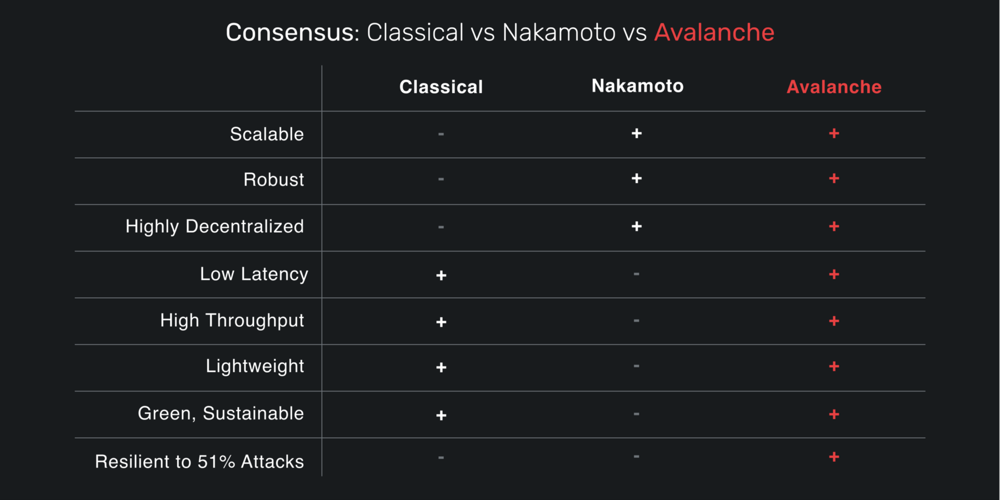

# Avalanche 平台

2020/06/30

Kevin Sekniqi, Daniel Laine, Stephen Buttolph, and Emin Gun Sirer

**摘要**。本文提供了Avalanche平台的第一个版本的架构概述，代号为Avalanche Borealis。5 关于标记为$AVAX的原生代币的经济学细节，请读者参考附带的代币白皮书[2]。 

<u>披露</u>：本文描述的信息是初步的，可能会在任何时候发生变化。此外，本文可能包含 "前瞻性声明"。

Git Commit: 7497e4a4ba0a1ea2dc2a111bc6deefbf3023708e

## 1 概述

本文提供了Avalanche平台的架构概述。重点是该平台的三个关键差异化因素：引擎、架构模型和治理机制。

### 1.1 目标和原则

Avalanche是一个高性能、可扩展、可定制和安全的区块链平台。它针对三个广泛的用例：


Avalanche是第一个具有 "智能合约"能力（支持EVM/Solidity）的网络，每秒可处理超过4500个交易，并具有即时确认和高吞吐量。

Avalanche是一个由子网和动态验证者集组成的网络，共同就一组区块链的状态达成共识。有一个主要或默认的子网，由P、X和C链组成。

平台（P） P链是Avalanche上的元数据区块链，协调验证器，跟踪活跃的子网，并实现新子网的创建。P-Chain实现了Snowman共识协议。
eXchange (X) X-Chain作为一个去中心化的平台，用于创建和交易数字智能资产，对应现实世界资源（如股票、债券）。
合同（C）C-链允许使用C-链的API创建智能合约。


https://github.com/ava-labs/mastering-avalanche/blob/main/chapter_09.md

History of Consensus

在分布式系统45年的历史中，解决共识问题的方法只有三种：经典、中本聪和雪崩。让我们讨论一下这三种方法，以说明它们之间的区别，并确定它们各自的优势和劣势。

经典

经典的共识协议，如Practical Byzantine Fault Tolerance（PBFT）和HotStuff，是基于全对全投票的。这意味着验证者需要听取组成网络的大量节点的意见，才能做出决定。此外，它们是 "概率为1 "或P=1的协议，这意味着网络以绝对确定的方式就一项决定达成一致。当一个节点收到构成系统的必要部分节点的响应后，交易立即完成。

在开放的、类似互联网的环境中，经典的共识有两个主要问题。第一个问题是，这些协议是脆弱的：它们的正确性在很大程度上取决于系统中的每个人都知道并同意在任何一个点上组成系统的验证者的身份。因此，在维持系统成员资格方面的任何错误，或者网络观点的任何差异都会导致安全违规。此外，攻击者只需要控制33%的网络，就可以发起保证成功的双重消费攻击。

其次，这些系统虽然速度快，但在参与者的数量上不能很好地扩展。Facebook的Diem（以前的Libra）使用的最具扩展性的经典协议HotStuff（顺便说一下，由Ted Yin设计，他现在正在研究Avalanche协议），只支持大约100个验证者，性能就开始下降。

这两个缺陷使古典共识成为开放和无许可网络的一个不可行的候选方案，在这些网络中，节点可以随意加入和离开，节点的行为可能对网络的意图产生不利影响。

中本聪

十多年来，实用的拜占庭容错系统是一个新鲜事物，因为经典的共识无法扩展到处理全球需求。然后，不知从哪里冒出来的中本聪，抛出了比特币白皮书，向世界展示了创建一个在全球范围内运作的抗对抗性共识协议的可能性。中本聪通过重新定义共识问题，使正确性定义成为概率性的，从而实现了这一点。

在基于中本聪的协议中，中本聪没有等待网络中所有节点的绝对确定性，而是用无法区分的概率差异换取更大的可扩展性。经典协议必须以1的概率（P=1）达成共识，而中本聪以1的概率减去一些微小的错误机会（P=1 - ε）达成共识。在中本聪，随着更多区块的产生，这个误差值会越来越小。区块越多，重组的几率就会呈指数级下降。

不可否认的是，中本聪作为一个强大的全球协议是一个突破，但它确实有缺点。它很慢，消耗大量的能源，并且需要很长的时间才能对交易的最终结果感到有信心。虽然这些缺点对于不经常流动或作为储备的资产来说是可以接受的，但对于点对点支付和去中心化金融这样的用例来说，它们是太大的负担了。

雪崩

在中本聪的工作之后，世界仍然想要一个具有中本聪共识的所有好处（稳健性、规模、去中心化）和经典共识的所有好处（速度、快速最终性和能源效率）的协议。

然后，在2018年5月，一个名为Team Rocket的小组发表了一篇论文，提出了第三类共识协议，他们称之为 "雪崩"。有了经典共识的所有好处和中本聪共识的大规模去中心化，它证明了经典协议可以被泛化为概率行为，并因此获得大规模的性能改进。



Avalanche共识，就像中本聪共识一样，是一个概率协议。就像中本聪用小概率来换取性能一样，Avalanche拥抱概率，使错误的概率同样微小（而且更好的是，像Avalanche的所有部分一样，可由自定义子网的验证者配置）。

Avalanche可以使错误变得如此之小，以至于在Avalanche节点上发生安全违规的可能性甚至低于发现SHA-256哈希碰撞的几率。从更大的角度来看，在接下来的一百年里，一颗终结生命的小行星与地球相撞的可能性要比在接下来的一千年里，一个每秒计算1万亿次哈希值的网络检测到SHA-256碰撞的可能性大几十个数量级。这真的很安全!

Avalanche还能立即完成所有交易，而无需等待确认。Avalanche能够这样做是因为它是经典共识的概括，所以它继承了这个非常理想的特性。事实上，Avalanche在平均不到一秒的时间内完成了交易。与现有的去中心化网络相比，这个速度快得惊人。

作为一个考虑到概率模型的广义经典共识，Avalanche还具有受CPU限制和高吞吐量的特性。它不需要专门的（昂贵的）硬件来达到每秒超过4500个交易。这意味着你已经拥有的计算机（甚至是在你的衣柜里收集灰尘的计算机）已经足够强大，可以运行Avalanche。这种组合使得Avalanche节点既非常绿色又经济。

更好的是，像中本聪共识一样，对于有多少人可以参与网络的最深层次，没有已知的上限--经典协议就不一样了，它的性能会随着参与度的增加而呈指数级下降（更多内容见下面的高级说明）。对于所有关于使这些网络对大众开放的讨论，Avalanche在这方面是无以伦比的。

Avalanche并不像中本聪共识那样依赖于工作证明。在像比特币这样的协议中，工作证明对于防止不诚实的行为者的组织和安全都是必要的。Avalanche可以使用工作证明，但选择了股权证明，以迫使用户在被允许对交易进行投票之前拥有一定数量的代币。

最后，与比特币和其他基于中本聪工作的系统不同，需要一直工作，Avalanche节点只在有工作要做的时候工作。没有挖矿或投票来获得新区块。交易被广播给更广泛的网络，然后他们监听到它们并开始投票。如果没有交易可供投票，网络中的节点不做任何事情，直到监听到新的交易。简单地说，Avalanche的工作更聪明，而不是更难。

进一步说明：Avalanche最重要的属性，真正使它远远区别于现有的经典协议，是像中本聪共识一样，它可以在网络中的参与者没有已知的上限的情况下运行。Avalanche的决策可以在每个节点的O(1)（常数）信息中完成。与经典协议相比，它需要O(n²)条消息来达成共识，而经典协议所面临的网络扩展问题在Avalanche中消失了。

雪崩共识如何工作
首先，让我们来谈谈雪崩共识中的验证者是干什么的。Avalanche是一个投票协议。验证人监听交易。当他们监听到一个交易时，他们投票决定交易是否被 "接受"，如果不被接受，则被标记为 "拒绝"。看起来是良性的交易将被验证者投票为 "接受"。如果它是冲突的，该交易将被投票为 "拒绝"。这就是它的全部。一个验证者看到一个决议，做出一个初步的表决，然后与网络的其他成员协作，以确定网络是否同意这个决议。这与经典投票协议中的期望相同，但在Avalanche中，它支持更多的验证者数量。

Avalanche中的这种投票过程是独特的。每个验证者都是一个完全独立的决策者。没有领导者选举。然而，根据协议，每个节点使用相同的过程来确定一个决定是否是良性的，以及他们与网络其他成员达成共识的可能性有多大。一旦他们看到整个网络达成一致的概率很高，节点就会锁定他们的投票，并接受一项交易为最终交易。

用于确定一项交易是否是正确，以及网络的其他部分同意这一决定的过程被称为 "重复随机子抽样"。

在高层次上，这意味着一个验证者随机选择其他验证者，问他们喜欢什么。它在新的随机选择的节点上一次又一次地这样做，直到它建立起足够的数据，以确定其正确的概率足够高，你不妨认为它不可能是错的。

更详细地说，它的工作原理如下。

1.  验证人收到一组已发出的交易，并被要求决定哪些交易要 "接受"。
2.  节点客户端向虚拟机（"VM"）展示其交易，虚拟机将提供信息以帮助客户端确定哪些交易是可接受的。
3.  验证者选择这些交易中不冲突的一个子集，将其标记为preferred，并试图通过网络接受它们。
4.  任何查询该验证器的节点都会收到该decision最新的preferred choice。
5.  这个验证者从整个验证者列表中选择K个节点（选择的概率由stake金额加权）来查询其preferred decision。
6.  每个被查询的验证者都会回应他们的preferred decision，验证者的投票也会相应更新，并建立confidence。
7.  同时，其他节点也从验证者集合中随机选择验证者，查询他们的preferred response，并相应地更新他们的answers。
8.  这种情况至少持续M轮，或直到达到足够的confidence阈值，无论最后如何，每轮随机选择K个验证人（不替换）。
9.  一旦达到confidence阈值，交易的decision就被锁定为最终决定。
10.  如果 "接受"，该交易将被发送到虚拟机上处理；如果 "拒绝"，该交易将从共识中删除。


Team Rocket白皮书显示，在正确的参数化下，一个网络将使用这个过程得出相同的决定，达到一个可参数化的概率。

概率性的最终结果
科学家们需要在他们的模型中拥有确定性。在描述一个系统或过程时，能够说 "这绝对是真实的，没有任何疑问 "是非常好的和整洁的。古典协议努力实现这种田园诗般的模型，但在现实世界中，没有什么是确定的。

在一个经典网络中，有100台机器，其中33%的机器有可能同时离线，或者有人从社会上接管了33%的机器并试图将他们的意志强加于网络。还有一个非零的概率是，一个房间里的所有氧气会通过随机碰撞跳到另一边，导致任何不幸在错误一边的人在氮气池中窒息。这是有可能的，但概率很低，不会成为任何人的担忧。

中本聪继续向世界证明，只要安全故障的概率非常小，那么概率性的最终结果是可以接受的。全世界都认为这是一个可以接受的服务水平。哎呀，这比你在运营商级别的SLA中得到的五个九（99.999%）要好得多。

雪崩，通过接受这个同样的小误差，是接受了在正确参数的模型中每两万年出现一次错误的机会。更有可能的是，老化的互联网基础设施导致大规模的网络中断。正是这个关键的见解帮助Team Rocket为一个新的共识协议铺平了道路，该协议的扩展性极大地优于现有的经典网络。

雪球算法

Parameters

- *n*: number of participants
- *k* (sample size): between 1 and *n*
- α (quorum size): between 1 and *k*
- β (decision threshold): >= 1

### Algorithm

```
preference := pizza
consecutiveSuccesses := 0
while not decided:
  ask k random people their preference
  if >= α give the same response:
    preference := response with >= α
    if preference == old preference:
      consecutiveSuccesses++
    else:
      consecutiveSuccesses = 1
  else:
    consecutiveSuccesses = 0
  if consecutiveSuccesses > β:
    decide(preference)
```


随着网络上的节点数量（n）的增加，雪球法具有很好的可扩展性。无论网络中的参与者有多少，发送的共识信息的数量都是一样的，因为在一个给定的查询中，一个节点只查询k个节点，即使网络中有成千上万的节点。

DAGs (有向无环图)

现在让我们来介绍一种叫做DAG或有向无环图的数据结构。DAG给出了一个决策的部分排序。例如，看看这张图中的DAG。


例如，比特币和以太坊都有一条线性链，每个区块都有一个父块和一个子块。Avalanche使用DAG来存储数据，而不是线性链。DAG的每个元素可能有多个父代。DAG中的父子关系并不意味着应用层面的依赖性。


一个顶点就像线性区块链中的一个区块。它包含其父辈的哈希值，并包含一个交易列表。顶点允许交易被分批和分组投票，而不是一个一个地投票。DAG是由顶点组成的，协议的工作方式与上面描述的非常相似。

最终性

在Avalanche中，接受/拒绝是最终的、不可逆的，只需几秒钟。


Avalanche中的两个大的想法是子抽样和传递性投票。子采样的信息开销很低。不管是20个验证者还是2000个验证者，一个节点在查询过程中发送的共识信息数量是不变的。

传递性投票，即对一个顶点的投票就是对其所有祖先的投票，有助于提高交易吞吐量。


Avalanche也适用于线性链。该协议大体上与上述相同，但每个顶点只有一个父节点。这对于某些需要知道一个交易是否在另一个交易之前发生的应用是很有用的，比如智能合约。Snowman是Ava实验室对线性链的Avalanche共识协议的实现名称。

如果没有未决定的交易，Avalanche共识协议会静止。也就是说，如果没有工作要做，它什么都不做。Avalanche比工作证明（Proof-of-work）更具可持续性，在工作证明中，节点需要不断地做工作。

