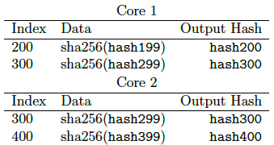

# Solana：高性能区块链的新架构 v0.8.13

Anatoly Yakovenko

anatoly@solana.io

**法律声明** 本白皮书中的任何内容都不是出售或购买任何代币的要约。Solana发布本白皮书只是为了接受公众的反馈和意见。如果以后Solana发售任何代币（或未来代币的简单协议），它将通过明确的发售文件进行，包括披露文件和风险因素。这些最终文件预计还将包括本白皮书的更新版本，可能与当前版本有很大不同。如果Solana在美国进行这样的发行，该发行可能将只提供给经认可的投资者。

本白皮书中的任何内容都不应被视为或解读为对Solanas业务将如何发展或对代币的效用及价值的保证和承诺。本白皮书概述了当前的计划，这些计划可以酌情改变，其成功与否将取决于Solanas控制之外的许多因素，包括基于市场的因素以及数据和加密货币行业的因素，等等。任何关于未来事件的陈述都完全基于Solanas对本白皮书中描述的问题的分析。该分析可能被证明是不正确的。

**摘要**

本文提出了一种基于历史证明（PoH）的新的区块链架构--一种验证事件之间的顺序和时间流逝的证明。PoH被用来将无信任的时间流逝编码到账本中--一种仅追加的数据结构。当与工作证明（PoW）或权益证明（PoS）等共识算法一起使用时，PoH可以减少拜占庭容错复制状态机中的信息传递开销，从而实现亚秒级的最终性时间。本文还提出了两种利用PoH账本的时间保持特性的算法--一种可以从任何规模的分区中恢复的PoS算法和一种高效的流式复制证明（PoRep）。PoRep和PoH的结合在时间（排序）和存储方面提供了对账本伪造的防御。本文显示，在当今的硬件条件下，网络带宽1gbps，该协议每秒最高710k的交易吞吐量是可能的。

## 1 简介

区块链是一个容错的复制状态机的实现。目前公开的区块链并不依赖时间，或者对参与者的计时能力做一个弱的假设[4, 5]。网络中的每个节点通常依赖他们自己的本地时钟，而不知道网络中任何其他参与者的时钟。缺乏可信的时间来源意味着，当消息的时间戳被用来接受或拒绝一个消息时，不能保证网络中的其他参与者会做出完全相同的选择。这里介绍的PoH旨在创建一个具有可验证的时间流逝的账本，即事件和消息排序之间的时间。预计网络中的每一个节点都将能够依赖账本中记录的时间流逝而无需信任。

## 2 概要

本文的其余部分组织如下。第3节描述了整体系统设计。第4节详细描述了历史证明PoH。第5节详细描述了权益证明共识算法。第6节详细描述了快速复制证明PoRep。第7节分析了系统架构和性能限制。第7.5节描述了一个高性能的GPU友好型智能合约引擎。

## 3 网络设计

如图1所示，在任何给定的时间，一个系统节点被指定为Leader，来产生历史证明序列，为网络提供全局的读取一致性和可验证的时间流逝。Leader为用户信息生成序列号，并对它们进行排序，使它们能够被系统中的其他节点有效地处理，从而使吞吐量最大化。它根据存储在RAM中的当前状态执行交易，并将交易和最终状态的签名公布给称为验证者的复制节点。验证者在他们的状态副本上执行相同的交易，并将他们计算出的状态签名作为确认信息发布。发布的确认作为共识算法的投票。

图1：整个网络中的交易流。

在非分裂状态下，在任何时候，网络中都只有一个Leader。每个验证者节点具有与Leader相同的硬件能力，可以被选为Leader，这是通过基于PoS的选举完成的。PoS算法选举将在第5.6节深入介绍。

根据CAP定理，在发生分裂的情况下，一致性几乎总是比可用性更重要。在大分裂的情况下，本文提出了一种机制，可以从任何规模的分裂中恢复对网络的控制。这将在第5.12节中深入阐述。

## 4 历史证明PoH

历史证明是一个计算序列，提供一种方法来加密验证两个事件之间的时间流逝。它使用一个加密安全的函数，使输出不能从输入中预测，并且必须完全执行以产生输出。该函数在一个单一的核心上按顺序运行，其先前的输出作为当前的输入，定期记录当前的输出，以及其被调用的次数。然后，外部计算机可以通过在一个单独的核上检查每个序列段来重新计算和验证输出。

通过将数据（或一些数据的哈希值）附加到函数的状态中，带时间戳的数据可以进入这个序列。因为它（带时间戳的状态、索引和数据记录）被附加到序列中，所以可以保证数据是在序列中生成下一个哈希值之前的某个时间创建的。这种设计也支持横向扩展，因为多个生成器可以通过将它们的状态混合到彼此的序列中来实现彼此之间的同步。水平扩展将在第4.4节中深入讨论。

### 4.1 描述

该系统被设计成如下工作方式。用一个加密的哈希函数，在不运行该函数的情况下无法预测其输出（如sha256、ripemd等），从一些随机的起始值开始运行该函数，并将其输出作为输入再次传入同一函数。所选择的起始随机值可以是任何字符串，如《纽约时报》当天的头条。

例如：

其中hashN代表实际的哈希输出。

只需要在一个时间间隔内公布哈希值和索引的子集。

例如：

只要选择的哈希函数是抗碰撞的，这组哈希值只能由一个计算机线程依次计算。这源于这样一个事实：如果不从起始值开始实际运行算法300次，就没有办法预测索引300处的哈希值会是什么。因此，我们可以从数据结构中推断出，在索引0和索引300之间确实经过了真实的时间。

在图2的例子中，哈希62f51643c1产生于计数510144806912，哈希c43d862d88产生于计数510146904064。根据之前讨论的PoH算法的特性，我们可以相信在计数510144806912和计数510146904064之间有真实的时间流逝。

图2：历史证明序列

### 4.2 事件的时间戳

这个哈希值序列也可以用来记录某些数据是在某一哈希索引产生之前创建的。使用`combine`函数将数据与当前索引的哈希值相组合。该数据可以是任意事件数据的唯一加密哈希值。组合函数可以是一个简单的数据附加，或任何抗碰撞的操作。下一个生成的哈希值代表了数据的时间戳，因为它只能在该特定的数据被插入后生成。

例如：

一些外部事件发生了，比如拍摄了一张照片，或者创建了任何数字数据：

Hash336是由hash335的附加二进制数据和照片的sha256计算出来的。照片的索引和sha256被记录为序列输出的一部分。因此，任何验证这个序列的人都可以复现这个序列的变化。验证仍然可以并行进行，其讨论在第4.3节。

因为初始过程仍然是有顺序的，所以我们就可以知道，进入序列的事情一定是在未来的哈希值被计算之前的某个时间发生的。

表1：有两个事件的历史证明序列

在表1所代表的序列中，照片2是在哈希值600之前创建的，而照片1是在哈希值336之前创建的。将数据插入哈希值序列会导致序列中所有后续数值的改变。只要使用的哈希函数是抗碰撞的，而且数据是被附加的，那么在计算上就不可能根据事先知道哪些数据将被整合到序列中而预先计算任何未来的序列。

混入序列的数据可以是原始数据本身，也可以是带有附带元数据的数据散列值。

在图3的例子中，输入cfd40df8...被插入到历史证明序列中。它被插入的计数是510145855488，它被插入的状态是3d039eef3。所有未来生成的哈希值都被这个序列的变化所修改，这个变化在图中用颜色的变化表示。

观察这个序列的每个节点可以确定所有事件被插入的顺序，并估计插入之间的实际时间。

图3：将数据插入历史证明中

### 4.3 验证

多核计算机可以在比生成序列时间短得多的时间内验证该序列的正确性。

例如：

给定一定数量的内核，比如一个有4000个内核的现代GPU，验证器可以将哈希序列和它们的索引分成4000个片断，并并行地确保每个片断从开始的哈希到片断中的最后一个哈希都是正确的。如果产生该序列的预期时间将是：

$$
\frac{hash总数量}{单核每秒生成数量}
$$
验证序列是否正确的预期时间将是：
$$
\frac{hash总数量}{(单核每秒验证数量*可用核数)}
$$
在图4的例子中，每个核都能并行地验证序列的每个片断。由于所有的输入字符串都被记录到输出中，并附有计数器和状态，验证器可以并行地复现每个片断。红色的哈希值表示序列被一条插入的数据所修改。

图4：使用多核进行验证

### 4.4 横向扩展

它可以通过将每个生成器的序列状态混合到其他生成器中来同步多个历史证明生成器，从而实现历史证明生成器的水平扩展。这种扩展是在没有分片的情况下完成的。两个生成器的输出对于重建系统中事件的完整顺序是必要的。

给定生成器A和B，A从B收到一个数据包（hash1b），其中包含生成器B的最后一个状态，以及生成器B从生成器A观察到的最后一个状态。生成器A的下一个状态hash取决于生成器B的状态，所以我们可以得出hash1b发生在hash3a之前的某个时间。这个属性可以是传递性的，所以如果三个生成器通过一个共同的生成器 $A \leftrightarrow B \leftrightarrow C$ 进行同步，我们可以追踪A和C之间的依赖关系，尽管它们没有直接同步。

通过定期同步生成器，每个生成器可以处理一部分外部流量，因此整个系统可以处理更多的事件追踪，但由于生成器之间的网络延迟，真正的时间准确性会受到影响。通过选择一些确定的函数来对同步窗口内的任何事件进行排序，例如通过哈希值本身，仍然可以实现一个全局的顺序。

在图5中，两个生成器互相插入对方的输出状态并记录操作。颜色的变化表示来自对等体的数据已经修改了序列。混合到每个数据流中的生成的哈希值以黑体字突出显示。

图5：两个生成器同步执行

同步性是传递性的。$A \leftrightarrow B \leftrightarrow C$ 在A和C之间有一个可证明的事件顺序，通过B。

以这种方式扩展是以可用性为代价的。可用性为0.999的 $10 \times 1$​​ gbps连接将有 $0.999^{10} = 0.99$​ 的可用性。

### 4.5 一致性

用户将能够强制生成的序列的一致性，通过将他们认为有效的序列的最后观察到的输出插入到他们的输入中，使其能够抵抗攻击。

恶意的PoH生成器如果能够同时获得所有的事件，或者能够生成一个更快的隐藏序列，就可以产生第二个包括倒序事件的隐藏序列。

为了防止这种攻击，每个客户端生成的事件本身应该包含客户端从它认为有效的序列中观察到的最新哈希值。因此，当客户端创建 "Event1 "数据时，他们应该附加上他们观察到的最后一个哈希值。

当序列被发布时，Event3将引用hash30a，如果它不在这个事件之前的序列中，那么序列的消费者就知道它是一个无效的序列。然后，部分重排攻击产生的哈希值的数量将被限制在客户端已经观察到的事件以及最新的事件之间。然后，在最后观察到的和最新插入的哈希值之间的短时期内，将不认为事件顺序是正确的。

为了防止恶意的PoH生成器重写客户端的事件哈希值，客户端可以提交事件数据的签名和最后观察到的哈希值，而不仅仅是数据。

验证这个数据首先需要进行签名验证，其次要在这个哈希值之前的哈希值序列中找到它。

验证：
$$
(Signature, PublicKey, hash30a, event3 data) = Event3 \\
Verify(Signature, PublicKey, Event3) \\
Lookup(hash30a, PoHSequence)
$$
在图6中，用户的输入基于某个生成序列中的哈希值0xdeadbeef，该哈希值在用户数据被插入前的某个时间存在。左上角的蓝色箭头表示客户端引用之前产生的哈希值。客户端信息只在包含哈希值0xdeadbeef的序列中有效。序列中的红色表示该序列已经被客户端的数据所修改。

图6：带向前引用的输入

### 4.6 开销

每秒4000个哈希值将产生额外的160KB的数据，并需要一个具有4000个内核的GPU和大约0.25-0.75毫秒的时间来验证。

### 4.7 攻击

#### 4.7.1 倒序

为了生成一个倒序的恶意序列，攻击者需要在第二个事件后才开始生成。这个延迟将允许任何非恶意的节点之间对事件的原始顺序进行验证。

#### 4.7.2 速度

多个发生器可能会使网络对攻击更有抵抗力。一个发生器可以是高带宽的，并接收许多事件以混合到它的序列中，另一个发生器可以是高速低带宽的，定期与高带宽发生器混合。

高速序列将产生一个攻击者必须扭转的二级数据序列。

#### 4.7.3 长程攻击

长程攻击涉及获取旧的被丢弃的客户私钥，并产生一个伪造的账本[10]。历史证明提供了对长程攻击的一些保护。获得旧私钥的恶意用户将不得不重新创建一个历史记录，该记录所需的时间与他们试图伪造的原始记录一样多。这需要使用比网络目前使用的更快的处理器，否则攻击者在历史长度上将永远赶不上。

此外，单一的时间来源允许构建一个更简单的复制证明PoRep（关于这一点，将在第6节详细介绍）。由于网络的设计使网络中的所有参与者都将依赖单一的历史事件记录。

PoRep和PoH一起可以同时从空间上和时间上防止伪造账本。

## 5 PoS 共识

### 5.1 描述

PoS是为了快速确认历史证明生成器产生的当前序列，用于投票和选择下一个历史证明生成器，以及惩罚任何行为不当的验证者。该算法取决于消息最终在一定的超时时间内到达所有参与节点。

### 5.2 术语

**bonds**

bond相当于工作证明中的资本支出。 矿工购买硬件和电力，并将算力投入到工作证明区块链中的一个分支。bond是验证者在验证交易时承诺作为抵押的货币。

**slashing**

这是一种经济激励措施，旨在阻止验证者同时确认多个分支。

**super majority**

超级多数是指按债券加权占2/3的验证者。超级多数票表明网络已经达成共识，至少需要1/3的网络节点恶意投票，对应的区块链分支才会无效。这将使攻击的经济成本达到该币市值的1/3。

### 5.3 绑定bonding

绑定交易将一定数量的代币转移到绑定账户。绑定账户中的硬币不能被花费，必须留在账户中，直到用户将其删除。用户只能删除已经超时的代币。绑定在当前利益相关者的超多数确认序列后有效。

### 5.4 投票

历史证明生成器被期望能在一个预定的时期内发布状态的签名。每个绑定账户必须通过发布他们自己签署的状态签名来确认该签名。投票是一个简单的赞成票，没有反对票。

如果超多数的绑定身份在超时内投票，那么这个分支将被接受为有效。

### 5.5 解绑unbonding

错过N个投票，则标志着该绑定账户中的代币已过期，不再有资格投票。用户可以发布一个解除绑定的交易来移除代币。

N是一个动态值，基于陈旧票与活跃票的比例。N随着陈旧票数的增加而增加。在发生大型网络分裂的情况下，这允许较大的分支比较小的分支恢复得快。

### 5.6 选举

当检测到PoH生成器故障时，将进行新PoH生成器的选举。拥有最大投票权的验证者，或者在有平局的情况下拥有最高公钥地址的验证者将被选为新的PoH生成器。

在新的序列上需要有超多数的确认。如果在超级多数确认之前，新的领导者故障了，那么就会选择下一个最高的验证者，并且需要一组新的确认。

要切换投票，验证者需要在更高的PoH序列计数器上投票，而新的投票需要包含它想要切换的投票。否则，第二张票将被砍掉。票数转换预计会被设计成只能在没有超级多数的高度发生。

一旦一个PoH发生器被选中并开始工作，就可以选出一个次级发生器来接管交易处理的职责。如果存在一个次级发生器，它将被视为一级发生器故障期间的下一个Leader。

该平台的设计是这样的：如果检测到异常情况或按照预定的时间表，次级发生器会变成一级发生器，低级发生器会被提升。

### 5.7 选举的触发因素

#### 5.7.1 分叉的PoH生成器

PoH生成器被设计成有一个标识生成序列的身份。只有在PoH生成器的身份被泄露的情况下才会发生分叉。分叉被检测到是因为在同一个PoH身份上发布了两个不同的历史记录。

#### 5.7.2 运行时异常

硬件故障或错误，或者PoH生成器异常，都可能导致它生成一个无效的状态，并发布一个与本地验证者结果不一致的状态签名。验证者将通过gossip发布正确的签名，这一事件将触发新一轮的选举。任何接受无效状态的验证者将被扣除他们的bonds。

#### 5.7.3 网络超时

网络超时将触发一次选举。

### 5.8 Slashing

### 5.9 次级选举

二级和更低级的历史证明生成器可以被提议和批准。在主要生成器的序列上投出一个提案。该提案包含一个超时，如果该议案在超时前被超多数票通过，则被认为是次级生成器当选，并将按计划接管职责。主网可以通过在生成的序列中插入一个消息，表明将发生交接，或插入一个无效的状态，迫使网络回退到副网，从而向副网进行软交接。

如果一个二级历史证明生成器被选出，而一级历史证明生成器出现故障，二级历史证明生成器将被视为选举期间的第一后备历史证明生成器。

### 5.10 可用性

CAP systems that deal with partitions have to pick Consistency or Availability. Our approach eventually picks Availability, but because we have an objective measure of time, Consistency is picked with reasonable human timeouts.

处理分区的CAP系统必须要选择一致性或可用性。我们的方法最终选择了可用性，但因为我们有一个客观的时间衡量标准，所以在合理的超时情况下，一致性被选中。

PoS验证人在stake中锁定了一定数量的代币，这使得他们可以为一组特定的交易投票。锁定代币是一种交易，它被输入到PoH流中，就像任何其他交易一样。PoS验证者签署状态的哈希值作为投票，它是在处理所有交易到PoH账本的特定位置后计算出来的。这个投票也作为一个交易被输入到PoH流中。通过PoH账本，我们就可以推断出每次投票之间经过了多少时间，如果发生分裂，每个验证人有多长时间没有响应。

我们提出了一种动态的方法来unsake不可用的验证人。当验证人的数量较多且超过2/3时，unsake的过程会很快。在不可用的验证人完全unsake之前，需要生成到账本中的哈希值的数量很低，而且这些验证人不再计入共识。当验证人的数量低于2/3但高于1/2时，unsake的计时器会比较慢，需要在不可用的验证人被unsake之前生成较大数量的哈希值。在一个大的分裂中，比如一个缺少1/2或更多验证者的分裂，unsake过程会非常非常慢。交易仍然可以被输入到数据流中，验证者仍然可以投票，但直到产生了大量的哈希值和不可用的验证者被unsake后，才会达成完全的2/3共识。网络恢复的时间差异使我们作为网络的客户可以有时间选择一个我们想继续使用的分区。

### 5.11 恢复

在我们提出的系统中，账本可以从任何故障中完全恢复。这意味着，世界上任何一个人都可以在账本中随机挑选一个点，通过添加新生成的哈希值和交易来创建一个有效的分叉。如果这个分叉中缺少所有的验证者，那么任何额外的bonds变得有效（即这个分支要达到2/3的超级多数共识）都需要非常非常长的时间。因此，在可用验证人为零的情况下，完全恢复需要将大量的哈希值附加到账本上，只有在所有不可用的验证器被unsake后，任何新的 bonds才验证账本。

### 5.12 最终性

PoH允许网络的验证者观察过去发生的事情，并对这些事件的时间有一定程度的把握。由于PoH发生器产生的是一个信息流，所有的验证者都需要在500ms内提交他们对状态的签名。根据网络条件，这个数字可以进一步降低。由于每个验证都被输入到信息流中，网络中的每个人都可以验证每个验证者是否在规定的超时时间内提交了他们的投票，而不需要实际直接观察投票情况。

### 5.13 攻击

#### 5.13.1 Tragedy of Commons

PoS验证器只是确认PoH生成器所生成的状态哈希。为了最大化收益，他们更倾向不做任何工作，只是简单地批准每一个生成的状态哈希。为了避免这种情况，PoH生成器应该在一个随机的间隔内发布一个无效的哈希值。任何给这个哈希值投票的验证都应该被惩罚。当这样的哈希值生成后，该网络应该立即提议次级PoH生成器成为Leader。

每个验证人都需要在一个小的超时内做出反应--例如500ms。该超时应设置得足够低，以使恶意验证者观察另一个验证者的投票并将其自身投票快速输入数据流的概率很低。

#### 5.13.2 与PoH生成器串谋

与PoH生成器串通的验证者会事先知道无效的哈希值将会产生，而不会投票给它。这种情况实际上与PoH身份有更大的验证者stake没有什么不同。【This scenario is really no different than the PoH identity having a larger verifier stake.】PoH生成器仍然需要做所有的工作来生成状态哈希值。

#### 5.13.3 审查

当1/3的bond持有者拒绝验证任何存在新bond的序列时，审查或拒绝服务就会发生。该协议可以通过动态调整bond失效的速度来防御这种形式的攻击。在拒绝服务的情况下，较大的分区开始分叉和审查拜占庭bond持有人。随着拜占庭bond随着时间的推移变得无效，更大的网络将恢复。较小的拜占庭分区将无法在较长的时间内向前推进。

该算法的工作方式如下。大的网络将选出一个新的Leader。然后，Leader将审查拜占庭bond持有人的参与情况。历史证明生成器必须继续生成一个序列，以证明时间的流逝，直到有足够多的拜占庭bond变得失效，从而使更大的网络拥有一个超级多数。bond失效的速度将动态地基于bond的活跃比例。因此，网络的拜占庭少数分叉将不得不比多数分叉等待更长的时间来恢复超级多数。一旦建立了超级多数，就可以用slashing来永久地惩罚拜占庭bond持有者。

#### 5.13.4 长程攻击

PoH可以自然地防御长程攻击。因为从过去的任何一点恢复账本，都需要攻击者通过超越PoH生成器的速度及时超越有效账本。

共识协议提供了第二层防御，因为任何攻击都必须花费比unstake所有有效验证者的时间更长的时间。它还在账本的历史上创造了一个可用性缺口。当比较两个相同高度的账本时，具有最小最大分区的账本可以被客观地认为是有效的。【It also creates an availability gap in the history of the ledger. When comparing two ledgers of the same height, the one with the smallest maximum partition can be objectively considered as valid.】

#### 5.13.5 ASIC攻击

在这个协议中，存在两个ASIC攻击的机会--在网络分裂期间，以及在最终性中伪造超时时间。

对于网络分裂期间的ASIC攻击，bond unstake的速度是非线性的，对于具有大分区的网络，该速度要比ASIC攻击的预期收益慢几个数量级。

For ASIC attacks during Finality, the vulnerability allows for byzantine validators who have a bonded stake wait for confirmations from other nodes and inject their votes with a collaborating PoH generator. The PoH generator can then use its faster ASIC to generate 500ms worth of hashes in less time, and allow for network communication between PoH generator and the collaborating nodes. But, if the PoH generator is also byzantine, there is no reason why the byzantine generator wouldnt have communicated the exact counter when they expect to insert the failure. This scenario is no different than a PoH generator and all the collaborators sharing the same identity and having a single combined stake and only using 1 set of hardware.

## 6 流式复制证明

### 6.1 描述

Filecoin提出了一种的复制证明[6]。这个版本的目标是对复制证明进行快速和流式验证，通过跟踪历史证明生成序列的时间来实现。复制并不是作为一种共识算法，而是一种有用的工具，用于解释在高可用性下存储区块链历史或状态的成本。

### 6.2 算法

如图7所示，CBC加密依次对每个数据块进行加密，使用之前加密的数据块来XOR输入数据。

每个复制身份通过签署已生成的历史证明序列的哈希值来产生一个密钥。这将密钥与复制者的身份以及特定的历史证明序列联系在一起。只有特定的哈希值可以被选择。(见第6.5节哈希值的选择)

该数据集被逐块完全加密。然后，为了生成证明，密钥被用来作为伪随机数发生器的种子，从每个块中随机选择32个字节。

将选定的PoH哈希值预加到每个片断中计算出一个Merkle哈希值。

与密钥一起，默克尔根及选择生成的哈希被发布。

复制节点需要在N个由历史证明生成器生成的哈希值中发布另一个证明，其中N大约是加密数据所需时间的1/2。历史证明生成器将在预定的时间段发布特定的哈希值用于复制证明。复制者节点必须选择下一个公布的哈希值来生成证明。同样，哈希值被签名，并从区块中选择随机的片断来创建Merkle根。

在经过N次证明后，用新的CBC密钥对数据进行重新加密。

图7：顺序CBC加密

图8：快速复制证明

### 6.3 验证

N个核，每个核可以对每个identity进行流式加密。需要的总空间是2blocks*Ncores，因为前一个加密块是生成下一个的必要条件。然后，每个核都可以用来生成从当前加密块衍生出来的所有证明。

验证证明的总时间预计与加密的时间相等。证明本身只需要区块中的少数随机字节，因此需要哈希的数据量大大低于加密的区块大小。可以同时验证的复制身份的数量与可用的内核数量相等。现代GPU有3500多个可用的内核，尽管运行速度是CPU的1/2-1/3。

### 6.4 密钥轮换

如果没有密钥轮换，同一个加密的复制可以为多个历史证明序列产生廉价的证明。密钥是定期轮换的，每次复制都用新的密钥重新加密，该密钥与唯一的历史证明序列挂钩。

轮换的速度需要足够慢，以便在GPU硬件上验证复制证明，而GPU的每核速度比CPU慢。

### 6.5 哈希选择

历史证明生成器发布一个哈希值，供整个网络用于加密复制证明，并用作快速证明中字节选择的伪随机数生成器。

哈希值在一个周期性的计数器上公布，该计数器大致等于加密数据集所需时间的1/2。每个复制身份必须使用相同的哈希值，并使用哈希值的签名结果作为字节选择的种子，或作为加密密钥。

The period that each replicator must provide a proof must be smaller than the encryption time. Otherwise the replicator can stream the encryption and delete it for each proof.

恶意的生成器可以在这个哈希值之前的序列中注入数据以生成一个特定的哈希值。这种攻击将在5.13.2中进一步讨论。

### 6.6 证明验证

历史证明节点不会验证已提交的复制证明。它会跟踪由复制者身份提交的未决和已验证证明的数量。当复制者能够由网络中的超级多数验证者签署证明时，证明将得到验证。

验证由复制者通过p2p gossip网络收集，并作为一个数据包提交，其中包含网络中的超级多数验证者。这个数据包验证了由历史证明序列产生的特定哈希值之前的所有证明，并且可以同时包含多个复制者身份。

### 6.7 攻击

#### 6.7.1 Spam

一个恶意的用户可以创建许多复制者的身份，并在网络中散播不良证明。为了促进更快的验证，要求节点在请求验证时向网络的其他部分提供加密数据和整个merkle树。

本文设计的复制证明可以廉价验证任何额外的证明，因为它们不占用额外的空间。但每个身份将消耗1个核心的加密时间。复制目标应设置为最大的可用的核心。现代GPU出厂时有3500多个内核。

#### 6.7.2 部分删除

一个复制者节点可以尝试部分删除一些数据，以避免存储整个状态。证明的数量和种子的随机性应该使这种攻击变得困难。

例如，一个存储1TB数据的用户从每MB的块中删除一个字节。从每MB中抽出一个字节的单一证明，与任何被删除的字节发生碰撞的可能性是1-(1-1/1,000,0000)^1,000,000=0.63。经过5次证明，碰撞可能性为0.99。

#### 6.7.3 与PoH发生器串通

签名的哈希值将被用来作为抽样的种子。如果复制者可以事先选择一个特定的哈希值，那么复制者就可以删除所有不会被采样的字节。

与历史证明生成器串通的复制者身份可以在生成用于随机字节选择的预定义哈希值之前，在序列的末端注入一个特定的交易。有了足够的核心，攻击者可以生成一个对复制者身份有利的哈希值。

这种攻击只能使单一的复制者身份受益。由于所有的身份都必须使用相同的哈希值，并通过ECDSA（或同等的算法）进行加密签名，因此所产生的签名对每个复制者的身份都是唯一的，而且是抗碰撞的。一个单一的复制者身份只会有边际收益。【A single replicator identity would only have marginal gains.】

#### 6.7.4 DoS攻击

增加一个额外的复制者身份的成本预计等于存储的成本。增加额外计算能力以验证所有复制者身份的成本预计等于每个复制身份的CPU或GPU核心的成本。

这就为通过创建大量有效的复制者身份而对网络进行拒绝服务攻击创造了机会。

为了限制这种攻击，网络使用的共识协议可以选择一个复制目标，并奖励符合预期特征的复制证明，如网络上的可用性、带宽、地理位置等。

#### 6.7.5 Tragedy of Commons

PoS验证者可能会简单地确认PoRep而不做任何校验。应该在PoS验证者后面，增加经济激励机制，比如在PoS验证者和PoRep复制节点之间分配挖矿奖励。

为了进一步避免这种情况，PoRep验证者可以在一小部分时间内提交虚假证明。他们可以通过提供产生虚假数据的函数来验证证明是虚假的。任何确认虚假证明的PoS验证者都会被slash。

## 7 系统架构

图9：系统架构

### 7.1 组件

#### 7.1.1 Leader——PoH生成器

Learder是一个被选中的历史证明生成器。它接收任意的用户交易，并输出所有交易的历史证明序列，以保证系统中唯一顺序。在每一批交易之后，Leader生成一个状态签名，这个状态是按该顺序执行交易得到的结果。这个签名是用Leader的身份签名的。

#### 7.1.2 状态

一个以用户地址为索引的哈希表。每个单元包含完整的用户地址和该计算所需的内存。例如，交易表包含：

共32字节。

PoS bonds表包含：

共64字节。

#### 7.1.3 Verier验证者——状态复制

验证者节点复制区块链状态，提供区块链状态的高可用性。复制目标由共识算法选择，共识算法中的验证者根据链外定义的标准选择并投票表决他们认可的复制证明节点。

The network could be configured with a minimum Proof of Stake bond size, and a requirement for a single replicator identity per bond.

#### 7.1.4 Validators

这些节点与Verifiers共用带宽。它们是虚拟节点，可以与Verifiers或Leader在同一台机器上运行，也可以在由这个网络配置的共识算法所指定的单独的机器上运行。

### 7.2 网络上限

Leader能够接收传入的用户数据包，以最有效的方式对其进行排序，并生成历史证明序列，发布给下游验证者。效率基于交易的内存访问模式，所以交易排序是为了最小化故障和最大化预取。

图10：生成器网络上限

接收的数据包格式：

可以支持的最小数据是1个目标账户。带数据的数据包：

历史证明序列数据包包含当前的哈希值、计数器和添加到PoH序列的所有新消息的哈希值以及处理所有消息后的状态签名。这个数据包每广播N条消息就会发送一次。

PoH数据包：

在1gbps的网络连接上，可能的最大交易数量是每秒1千兆/176字节=710k tps。由于以太网构架的原因，预计会有1-4%的损失。超过网络目标量的剩余容量可用于提高可用性，通过对输出进行Reed-Solomon编码并将其发送到可用的下游验证器上。

### 7.3 计算上限

每个交易都需要一个摘要验证。这个操作不使用交易信息本身以外的任何内存，可以独立地进行并行化。因此，预计吞吐量将受到系统中可用的核心数量的限制。

基于GPU的服务器的实验结果为每秒90万次ECDSA验证[9]。

### 7.4 内存上限

一个原始状态实现是一个空间使用率50%的哈希表，每个账户有32个字节的条目，理论上可以在640GB中容纳100亿个账户。已测得对这个表的随机访问为每秒1:1 * 10^7次写入或读取。因为每笔交易的2次读和2次写，所以内存吞吐量可以处理每秒275万笔交易。这是在aws 1TB x1.16xlarge实例上测得的。

### 7.5 高性能智能合约

智能合约是交易的一种普遍形式。它们是在每个节点上运行并修改状态的程序。本设计利用扩展的伯克利包过滤（Berkeley Packet Filter，BPF）字节码作为快速、容易分析、支持JIT的智能合约语言。

其主要优势之一是零成本的外部函数接口。内置函数直接在平台上实现，可以被程序调用。调用内置函数会暂停该程序，并将内置函数放在高性能服务器上执行。内置函数分批在GPU上并行执行。

在上面的例子中，两个不同的用户程序调用同一个内置函数。两个程序都被暂停，直到本次的内置函数批量执行完成。一个内置函数的例子是ECDSA验证。在GPU上批量执行这些调用，可以将吞吐量提高数千倍。

图11：执行BPF程序

这个操作不需要本地操作系统的线程上下文切换，因为BPF字节码对它所使用的所有内存都有一个定义好的上下文。

eBPF支持自2015年以来一直包含在LLVM中，因此任何LLVM前端语言都可以用来编写智能合约。它自2015年以来一直在Linux内核中，而字节码的第一次迭代自1992年以来一直存在。一次即可检查eBPF的正确性，确定其运行时间和内存要求，并将其转换为x86指令。

