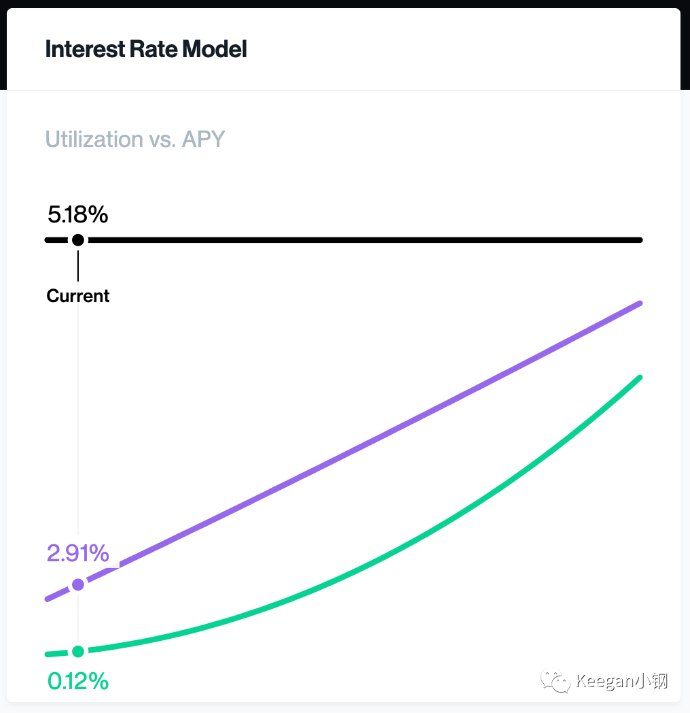
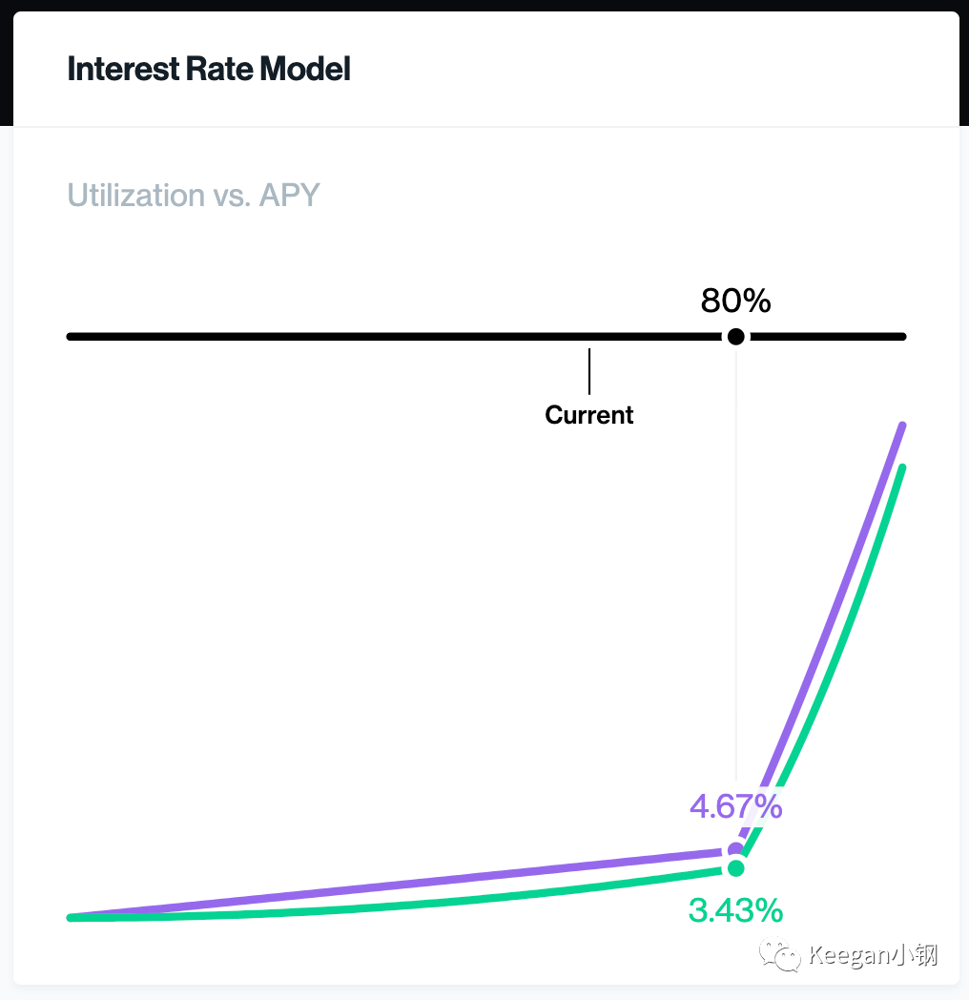
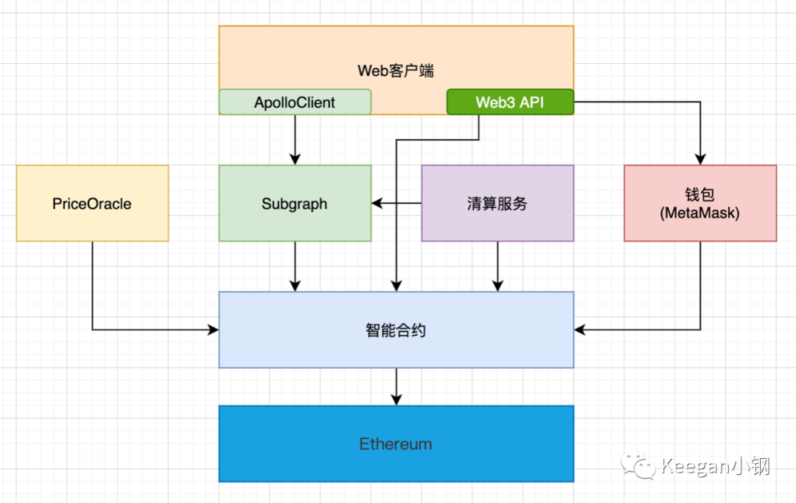
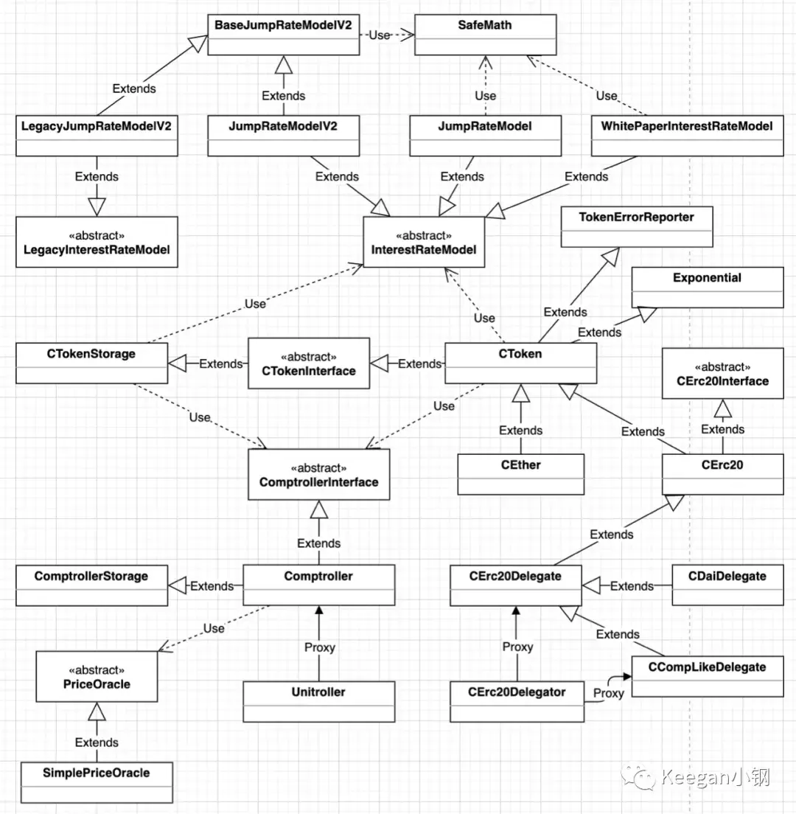
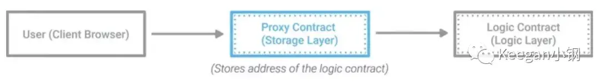

[剖析DeFi借贷产品之Compound：概述篇](https://juejin.cn/post/6971196546326986760)

[剖析DeFi借贷产品之Compound：合约篇](https://juejin.cn/post/6974005248947929124)

> 目前，DeFi 中的借贷平台基本都为抵押贷款方式，通过超额抵押一种数字资产而借出另一种资产，比如抵押价值 2000 美刀的 ETH，可借出 1800 美刀的 USDT。这与传统的抵押贷款方式类似，不过，传统的抵押贷款本质上是将房子、车、土地等非流动性资产作为抵押，借出钱这种能够高度流动的资产。但 DeFi 中的抵押贷款，抵押的资产和借出的资产，都属于高流动性的资产，这为什么能有市场？初看起来有点难以理解。然而，因为 DeFi 借贷产品有着高额的抵押利率以及 DeFi 市场前期巨额的收益率吸引了较高的市场资金。比如，Compound 的流动性挖矿模式，用户就算借款也能得到挖矿的平台币奖励，这奖励扣减掉借款利息后净收益还是正的，所以才吸引了众多用户参与其中。
>
> 目前 DeFi 借贷市场的需求主要有几点：
>
> 1. **满足交易活动的资金需求**：包括套利、杠杆、做市等交易活动，这是最主要的刚需。
> 2. **获得被动收入**：主要满足那些长期持有数字资产又希望能够产生额外收益的投资者。
> 3. **获得一定的流动性资金**：主要是矿工或一些行业内的初创企业存在一些短期性流动资金的需求。
>
> 第三点是比较符合传统借贷业务逻辑的，但在 DeFi 借贷市场中，占比较低。最主要的需求还是第一种情况，比如，我手上持有 ETH，而且我看好 ETH 在接下来的时间内还会上涨，那我可以抵押我的 ETH，借出 USDT，用来买更多 ETH，而且买回来的 ETH 还可以再抵押进去，再借出一些 USDT，再买更多 ETH。这样子，一份资金还可以获得多项收益。本质上，这种需求其实就是为了增加杠杆，也因此，开始有不少 DeFi 产品直接提供杠杆挖矿、杠杆交易的服务。
>
> DeFi 借贷这种超额抵押贷款的模式，其主要缺点就是资金利用率低。信用贷款显然比抵押贷款会更有效率，但在目前的区块链匿名环境下，难以实现。Aave 的**闪电贷**是在区块链世界中实现无抵押贷款的首创者，利用了区块链独有的特性而实现，需要在一个区块内完成借款和还款，否则就失效。适用场景非常有限，且存在技术门槛，普通用户无法参与。
>
> ## Compound
>
> Compound 的模式比较简单，就是每种借贷资产都会开设一个资金池，存取借还都是从资金池里流入和流出。要理解 Compound 的业务逻辑，有几个相关概念也需要理解：
>
> - **标的资产（Underlying Token）**：即借贷资产，比如 ETH、USDT、USDC、WBTC 等，目前 Compound 只开设了 14 种标的资产。
> - **cToken**：也称为生息代币，是用户在 Compound 上存入资产的凭证。每一种标的资产都有对应的一种 cToken，比如，ETH 对应 cETH，USDT 对应 cUSDT，当用户向 Compound 存入 ETH 则会返回 cETH。取款时就可以用 cToken 换回标的资产。
> - **兑换率（Exchange Rate）**：cToken 与标的资产的兑换比例，比如 cETH 的兑换率为 0.02，即 1 个 cETH 可以兑换 0.02 个 ETH。兑换率会随着时间推移不断上涨，因此，持有 cToken 就等于不断生息，所以也才叫生息代币。计算公式为：exchangeRate = (totalCash + totalBorrows - totalReserves) / totalSupply
> - **抵押因子（Collateral Factor）**：每种标的资产都有一个抵押因子，代表用户抵押的资产价值对应可得到的借款的比率，即用来衡量可借额度的。取值范围 0-1，当为 0 时，表示该类资产不能作为抵押品去借贷其他资产。一般最高设为 0.75，比如 ETH，假如用户存入了 0.1 个 ETH 并开启作为抵押品，当时的 ETH 价值为 2000 美元，则可借额度为 0.1 * 2000 * 0.75 = 150 美元，可最多借出价值 150 美元的其他资产。
>
> 当用户存入**标的资产**后，Compound 会根据**兑换率**返回与标的资产相对应的 **cToken** 给到用户，作为一种存款凭证。当需要赎回存款时，将 cToken 还回去，Compound 会根据最新的兑换率计算出需要赎回的标的资产的数量并返还给用户。比如，用户存入 1 个 **ETH**，当时的兑换率为 0.1，则返回 1/0.1 = 10 个 **cETH**，等到赎回时，假设兑换率已经升到了 0.15，则那 10 个 cETH 可赎回 10*0.15 = 1.5 个 ETH，多出的 0.5 个 ETH 就是利息所得。
>
> 当用户将存入的资产开启作为抵押品之后，则可以进行借款了。不过，不是所有资产都可以作为抵押品，比如 USDT 就不可以作为抵押品，其抵押因子为 0。ETH、DAI、USDC 的抵押因子都是 0.75，即 75%，表示价值 100 美元的抵押资产，可借额度为 75 美元，即最多可以借出价值 75 美元的数字资产。不过，不建议用完所有额度，不然，存在被清算的风险。
>
> 当用户的借款价值已经超过借款额度的时候，就可以被清算了。不过，智能合约没办法自动清算，所以需要外部的清算人调用智能合约的清算函数来执行清算。而为了激励第三方清算人来执行清算，就会有个清算激励，该激励由被清算人（即借款人）来承担。另外，清算人一般都是由程序化的清算服务来承担。
>
> Compound 的清算模式属于**代还款清算**的方式，即清算人会帮借款人进行部分还款，并得到与还款资产价值同等的抵押资产，同时加上一定比例的清算激励，清算激励也是抵押资产。比如，借款人 A 有 100 USDT 的借款，而且抵押物为 ETH；那清算人 B 对 A 进行清算时，则需要帮 A 部分还款，目前 Compound 每次清算最多可代还款 50%，即 B 可以帮 A 还 50 USDT，假设清算激励为 0.05，那 B 将可以得到 A 的价值为 50 * (1 + 0.05) = 52.5 USDT 的 ETH。
>
> ## 利率模型
>
> Compound 的利率模型主要有两种，第一种，我称为**直线型**的，如下图：
>
> 
>
> 其中，黑色线为横轴，表示**使用率**，紫色线表示**借款利率**，绿色线表示**存款利率**。
>
> Compound 早期的时候都是这种利率模型，目前，依然有少数几种资产保留着这种模型。
>
> 使用率即是资金的使用率，计算公式为：
>
> ```
> utilizationRate = borrows / (cash + borrows - reserves)
> ```
>
> 其中，borrows 表示借款额，cash 表示资金池余额，reserves 表示储备金。借款利率由使用率决定，存款利率由借款利率决定。
>
> 使用率本质上就是反映借贷供求关系的一个量化指标，使用率低说明存款的多，但借款的太少，即供给大于需求。这时候就需要鼓励用户多借款少存款，所以借款利率偏低，存款利率也偏低。而使用率高的时候则相反，借款利率和存款利率偏高，就能鼓励大家多存款少借款。
>
> 使用率偏高的话，那说明资金池里剩下的钱就比较少了，会面临资金池枯竭的风险。资金池枯竭的话，那存款用户就没资金可取，也没资金可借，这就可能会导致系统性风险了。一般资金使用率在 80% 以内比较安全。
>
> 而为了控制使用率在安全范围内，Compound 后来就升级了利率模型，我称之为**拐点型**，看下图：
>
> 
>
> 可看到，以使用率 80% 为拐点，之后的斜率陡然剧增，超高的借款利率一般就能有效降低借款需求，而超高的存款利率则能鼓励大家提高供给，从而能有效降低整体的使用率，避免资金池枯竭。
>
> 目前，Compound 大部分资金池都是采用这种利率模型。

Compound Interest Rates 实时图表: https://observablehq.com/@jflatow/compound-interest-rates

> ## 技术架构
>
> 在技术层面，整个 Compound 借贷系统的整体架构大概如下图：
>
> 
>
> 图中的每个模块我简单介绍一下：
>
> - **Ethereum**：底层的区块链系统，Compound 是部署在以太坊上的，但稍作修改其实也可以部署到 Heco、BSC 等链上。
> - **智能合约**：所有核心业务都是使用智能合约实现的，代码也都已开源。
> - **PriceOracle**：价格预言机，会定时将那些数字资产的价格设置到智能合约上，从而智能合约可以获取资产价格做一些相应的计算。Compound 使用自己设计的 Open Price Feed 作为价格预言机。
> - **Subgraph**：数据索引服务，需部署到 Graph 节点才能使用，为前端和清算服务提供一些结构化的数据查询功能，比从链上查数据更方便快捷。
> - **清算服务**：承担清算人的角色，会定时查询出待清算账户并调用智能合约执行清算操作。
> - **钱包**：如 MetaMask 这样的钱包工具。
> - **Web客户端**：给普通用户使用的前端页面，集成 ApolloClient 连接 Subgraph，再通过 Web3 API 连接 MetaMask 等钱包进行操作，也有一些数据无法从 Subgraph 读取，而需要直接查询合约数据。
>
> ## 梳理合约关系
>
> 开始研究一个项目的合约代码时，第一步要做的应该是先梳理清楚合约之间的关系，可以用类图的方式进行整理。以下就是我梳理出来的合约关系图：
>
> 
>
> 以上的合约关系图中，没包含治理合约。治理属于独立的板块，初期并不需要关心，所以可以先不管。
>
> 合约文件虽然有点多，但涉及核心业务的其实可以分为四个模块：
>
> - **InterestRateModel**：利率模型的抽象合约，JumpRateModelV2、JumpRateModel、WhitePaperInterestRateModel 都是具体的利率模型实现。而 LegacyInterestRateModel 的代码和 InterestRateModel 相比，除了注释有些许不同，并没有其他区别。
> - **Comptroller**：审计合约，封装了全局使用的数据，以及很多业务检验功能。其入口合约为 Unitroller，也是一个代理合约。
> - **PriceOracle**：价格预言机合约，用来获取资产价格的。
> - **CToken**：cToken 代币的核心逻辑实现都在该合约中，属于抽象基类合约，没有构造函数，且定义了 3 个抽象函数。CEther 是 cETH 代币的入口合约，直接继承自 CToken。而 ERC20 的 cToken 入口则是 CErc20Delegator，这是一个代理合约，而实际实现合约为 CErc20Delegate 或 CCompLikeDelegate、CDaiDelegate 等。
>
> ## InterestRateModel
>
> ```js
> pragma solidity ^0.5.16;
> 
> /**
>   * @title Compound's InterestRateModel Interface
>   * @author Compound
>   */
> contract InterestRateModel {
>     /// @notice Indicator that this is an InterestRateModel contract (for inspection)
>     bool public constant isInterestRateModel = true;
> 
>     function getBorrowRate(uint cash, uint borrows, uint reserves) external view returns (uint);
> 
>     function getSupplyRate(uint cash, uint borrows, uint reserves, uint reserveFactorMantissa) external view returns (uint);
> 
> }
> ```
>
> 其实就是定义了利率模型的接口，但因为声明了一个常量 *isInterestRateModel* 用来标明这是一个利率模型合约，所以没用 **interface** 声明，而用 **contract**，定义成抽象合约。Compound 的很多接口都是采用这种方式定义的。
>
> 该接口只定义了两个函数，*getBorrowRate()* 和 *getSupplyRate()*，分别用来获取当前的借款利率和存款利率。但这两个利率不是**年化率**，也不是**日利率**，而是**区块利率**，即按每个区块计算的利率。
>
> ### 直线型
>
> 而具体的利率模型实现有好几个，**WhitePaperInterestRateModel** 是最简单的一种实现，即**直线型**的利率模型。所谓的直线，其实是借款利率的，其计算公式为：
>
> ```mathematica
> y = k*x + b
> ```
>
> y 即 y 轴的值，即借款利率值，x 即 x 轴的值，表示资金使用率，k 为斜率，b 则是 x 为 0 时的起点值。
>
> 理解了这条公式之后，我们再来看代码就会很好理解那些值的含义了。先来看看构造函数：
>
> ```javascript
> constructor(uint baseRatePerYear, uint multiplierPerYear) public {
>     baseRatePerBlock = baseRatePerYear.div(blocksPerYear);
>     multiplierPerBlock = multiplierPerYear.div(blocksPerYear);
>     emit NewInterestParams(baseRatePerBlock, multiplierPerBlock);
> }
> ```
>
> 构造函数有两个入参：
>
> - **baseRatePerYear**：基准年利率，其实就是公式中的 b 值
> - **multiplierPerYear**：其实就是斜率 k 值
>
> 构造函数的实现中，*blocksPerYear* 是一个常量值，表示一年内的区块数 2102400，是按照每 15 秒出一个区块计算得出的。将两个入参分别除以 *blocksPerYear*，就分别得到了区块级别的基准利率和区块斜率。
>
> 那公式中的 b 值和 k 值都初始化好了，x 值即资金使用率则是动态计算的，计算公式为：
>
> ```mathematica
> 资金使用率 = 总借款 / (资金池余额 + 总借款 - 储备金)
> utilizationRate = borrows / (cash + borrows - reserves)
> ```
>
> 其代码实现如下：
>
> ```javascript
> function utilizationRate(uint cash, uint borrows, uint reserves) public pure returns (uint) {
>     // Utilization rate is 0 when there are no borrows
>     if (borrows == 0) {
>       return 0;
>     }
>     return borrows.mul(1e18).div(cash.add(borrows).sub(reserves));
> }
> ```
>
> 其中，mul(1e18) 是为了将结果值扩展为对应的精度整数。
>
> 那么，借款利率的实现也很容易理解了，代码如下：
>
> ```javascript
> function getBorrowRate(uint cash, uint borrows, uint reserves) public view returns (uint) {
>     uint ur = utilizationRate(cash, borrows, reserves);
>     return ur.mul(multiplierPerBlock).div(1e18).add(baseRatePerBlock);
> }
> ```
>
> 其中，div(1e18) 则是因为 ur 和 multiplierPerBlock 本身都已经扩为高精度整数了，相乘之后精度变成 36 了，所以再除以 1e18 就可以把精度降回 18。
>
> 最后，存款利率又是如何计算的呢？请看代码：
>
> ```javascript
> function getSupplyRate(uint cash, uint borrows, uint reserves, uint reserveFactorMantissa) public view returns (uint) {
>     uint oneMinusReserveFactor = uint(1e18).sub(reserveFactorMantissa);
>     uint borrowRate = getBorrowRate(cash, borrows, reserves);
>     uint rateToPool = borrowRate.mul(oneMinusReserveFactor).div(1e18);
>     return utilizationRate(cash, borrows, reserves).mul(rateToPool).div(1e18);
> }
> ```
>
> 整理一下就可得到计算公式为：
>
> ```mathematica
> 存款利率 = 资金使用率 * 借款利率 *（1 - 储备金率）
> supplyRate = utilizationRate * borrowRate * (1 - reserveFactor)
> ```

存款利率 = $ x(kx+b)(1 - 储备金率)=(kx^2+bx)(1 - 储备金率)$

即存款利率是资金使用率的二次函数。

> 至此，直线型的利率模型，合约内容就这么多了，还是非常容易理解的。
>
> 下面，我们来剖析拐点型的利率模型。
>
> ### 拐点型
>
> 拐点型主要有过两个版本的实现，**JumpRateModel** 和 **JumpRateModelV2**，目前，曾经使用 *JumpRateModel* 的都已经升级为 *JumpRateModelV2*，所以我们就直接研究 JumpRateModelV2 即可。
>
> 回想下拐点型的图形，基本特征就是在拐点前的借款利率是一条直线，拐点后则是另一条斜率高得多的直线。
>
> 资金使用率没超过拐点值时，利率公式和直线型的一样：
>
> ```mathematica
> y = k*x + b
> ```
>
> 而超过拐点之后，则利率公式将变成：
>
> ```mathematica
> y = k2*(x - p) + (k*p + b)
> ```
>
> 其中，k2 表示拐点后的直线的斜率，p 则表示拐点的 x 轴的值。因此，需要初始化的参数有 4 个：**b、k、k2、p**，分别对应了构造函数中的几个入参：**baseRatePerYear、multiplierPerYear、jumpMultiplierPerYear、kink**。而几个 PerYear 入参对应的就有几个 PerBlock 变量，和前面一样，就不重复说明了。
>
> 那理解了上面的计算公式，我们来看看获取借款利率的代码实现：
>
> ```javascript
> function getBorrowRateInternal(uint cash, uint borrows, uint reserves) internal view returns (uint) {
>     uint util = utilizationRate(cash, borrows, reserves);
> 
>     if (util <= kink) {
>       	return util.mul(multiplierPerBlock).div(1e18).add(baseRatePerBlock);
>     } else {
>         uint normalRate = kink.mul(multiplierPerBlock).div(1e18).add(baseRatePerBlock);
>         uint excessUtil = util.sub(kink);
>         return excessUtil.mul(jumpMultiplierPerBlock).div(1e18).add(normalRate);
>     }
> }
> ```
>
> 如果这都还不理解代码实现，请结合公式多看几遍。
>
> 而存款利率的计算公式则和直线型的一样，没有变化。因为存款利率是随着借款利率而变的，所以斜率其实也跟随着借款利率而变化。
>
> ## CToken
>
> CToken 合约管理着 cToken 代币，也管理着借贷的资金池，所以 CToken 的核心地位毋庸置疑。
>
> CToken 合约只是个基类合约，没有构造函数，且还声明了几个抽象函数，由上层合约来实现。上层合约主要分两类，一类是用来处理 ETH 的 **CEther** 合约，该合约也是用户交互的入口合约；一类是用来处理 ERC20 的 **CErc20** 合约。在早期版本中，CErc20 也是用户交互的入口合约，但后来做了调整，CErc20 移除了构造函数，改为了初始化函数，增加了 CErc20Delegate 作为其上层合约，而且还增加了 CErc20Delegator 来代理 CToken，作为 cToken 的入口合约。
>
> 简而言之，**ETH** 的 cToken 交互入口是 **CEther** 合约，仅此一份；而 **ERC20** 的 cToken 交互入口则是 **CErc20Delegator** 合约，每种 ERC20 资产都各有一份入口合约。
>
> 代理合约很重要，可实现数据与逻辑的分离，是保证 CToken 合约可升级的基础。使用代理合约后，用户对目标合约的所有调用都通过代理合约，代理合约会将调用请求重定向到目标合约中。请看下图：
>
> 
>
> CErc20Delegator 就对应于图中的 Proxy Contract，而 CErc20Delegate 则对应于 Logic Contract。这种代理模式的基本原理主要是用到了 delegatecall 函数，若想深入理解可实现合约升级的代理模式，可查看此文章：[blog.openzeppelin.com/proxy-patte…](https://blog.openzeppelin.com/proxy-patterns/)。
>
> 每个 cToken 合约初始化时至少需要指定几个重要参数：
>
> - **underlying**：标的资产合约，每种 cToken 都对应于每种标的资产
> - **comptroller**：审计合约，所有 cToken 都会使用同一个审计合约
> - **interestRateModel**：利率模型合约，每种 cToken 都有各自的利率模型合约
>
> 其中，comptroller 和 interestRateModel 是可以更换的，当两者存在升级版本时，就可以分别调用 **_setComptroller(newComptroller)** 和 **_setInterestRateModel(newInterestRateModel)** 更换为升级后的合约。
>
> 存取借款等核心业务的入口函数则主要有以下几个：
>
> - **mint**：存款，之所以叫 mint，是因为该操作会新增 cToken 数量，即 totalSupply 增加了，就等于挖矿了 cToken。该操作会将用户的标的资产转入 cToken 合约中（数据会存储在代理合约中），并根据最新的兑换率将对应的 cToken 代币转到用户钱包地址。
> - **redeem**：赎回存款，即用 cToken 换回标的资产，会根据最新的兑换率计算能换回多少标的资产。
> - **redeemUnderlying**：同样是赎回存款的函数，与上一个函数不同的是，该函数指定的是标的资产的数量，会根据兑换率算出需要扣减多少 cToken。
> - **borrow**：借款，会根据用户的抵押物来计算可借额度，借款成功则将所借资产从资金池中直接转到用户钱包地址。
> - **repayBorrow**：还款，当指定还款金额为 -1 时，则表示全额还款，包括所有利息，否则，则会存在利息没还尽的可能，因为每过一个区块就会产生新的利息。
> - **repayBorrowBehalf**：代还款，即支付人帮借款人还款。
> - **liquidateBorrow**：清算，任何人都可以调用此函数来担任清算人，直接借款人、还款金额和清算的 cToken 资产，清算时，清算人帮借款人代还款，并得到借款人所抵押的等值+清算奖励的 cToken 资产。
>
> 以上，每一步操作发生时，都会调用 **accrueInterest()** 函数计算新的利息。该函数的实现逻辑主要如下：
>
> 1. 获取当前区块 crrentBlockNumber 和最近一次计算的区块 accrualBlockNumberPrior，如果两个区块相等，表示当前区块已经计算过利息，无需再计算，直接返回。
> 2. 获取保存的 cash（资金池余额）、totalBorrows（总借款）、totalReserves（总储备金）、borrowIndex（借款指数）。
> 3. 调用 interestRateModel.getBorrowRate() 得到借款利率 borrowRate。
> 4. 如果 borrowRate 超过最大的借款利率，则错误退出，否则进入下一步。
> 5. 计算当前区块和 accrualBlockNumberPrior 之间的区块数 blockDelta，该区块数即是还未计算利息的区块区间。
> 6. 根据以下公式计算出新累积的利息和一些新值：
>    - simpleInterestFactor = borrowRate * blockDelta，区块区间内的单位利息
>    - interestAccumulated = simpleInterestFactor * totalBorrows，表示总借款在该区块区间内产生的总利息
>    - totalBorrowsNew = interestAccumulated + totalBorrows，将总利息累加到总借款中
>    - totalReservesNew = interestAccumulated * reserveFactor + totalReserves，根据储备金率将部分利息累加到储备金中
>    - borrowIndexNew = simpleInterestFactor * borrowIndex + borrowIndex，累加借款指数
> 7. 更新以下值：
>    - accrualBlockNumber = currentBlockNumber
>    - borrowIndex = borrowIndexNew
>    - totalBorrows = totalBorrowsNew
>    - totalReserves = totalReservesNew
> 8. 发射 AccrueInterest() 事件。
>
> 另外，存取借还时，还会调用 comptroller 对应的 XXXAllowed() 函数进行审计。比如，mint() 函数对应调用 mintAllowed() 函数。
>
> ## Comptroller
>
> **Comptroller** 是一个审计合约，顾名思义，主要职责就是对存取借款等核心业务进行审查和校验，查看 **ComptrollerInterface** 定义了哪些函数就可以看出来，审计函数主要有：
>
> - **mintAllowed()**：是否允许存款
> - **redeemAllowed()**：是否允许取款
> - **borrowAllow()**：是否允许借款
> - **repayBorrowAllowed()**：是否允许还款
> - **liquidateBorrowAllowed()**：是否允许清算
> - **seizeAllowed()**：是否允许清算抵押物
> - **transferAllowed()**：是否允许转账
>
> 另外，对应于以上每个函数，接口中还分别定义了对应的 **Verify()** 函数，比如 **mintVerify()、redeemVerify()** 等，但这些 Verify() 函数在 Compound 目前的实现中并没做任何实质性的操作。
>
> 借贷市场上要支持哪些资产的存借，也是在 Comptroller 设置的，通过调用 **_supportMarket(CToken)** 函数进行设置。支持的市场会存储到以下两个数据结构中：
>
> ```Javascript
> /**
>  * @notice Official mapping of cTokens -> Market metadata
>  * @dev Used e.g. to determine if a market is supported
>  */
> mapping(address => Market) public markets;
> 
> /// @notice A list of all markets
> CToken[] public allMarkets;
> ```
>
> 用户还可以选择对存入的资产开启或关闭作为抵押品，对应的函数则是：
>
> - **enterMarkets(address[] memory cTokens)**
> - **exitMarket(address cTokenAddress)**
>
> enterMarkets 可以将指定的多个 cToken 作为抵押品，对应地就可增加用户的可借额度。exitMarket 则可以将指定 cToken 从抵押品列表中移除，但是，如果用户存在借款时，exitMarket 的资产价值不能超过借款价值。用户的抵押品列表会存储在 accountAssets 中：
>
> ```javascript
> mapping(address => CToken[]) public accountAssets;
> ```
>
> 其中，address 为每个用户的钱包地址。
>
> 而下面这个函数则可以获得用户的资产状况：
>
> ```javascript
> /**
>  * @notice Determine the current account liquidity wrt collateral requirements
>  * @return (possible error code (semi-opaque),
>  *					account liquidity in excess of collateral requirements,
>  *          account shortfall below collateral requirements)
>  */
> function getAccountLiquidity(address account) public view returns (uint, uint, uint) {
>   	(Error err, uint liquidity, uint shortfall) = getHypotheticalAccountLiquidityInternal(account, CToken(0), 0, 0);
> 
>   	return (uint(err), liquidity, shortfall);
> }
> ```
>
> 其中，返回的 liquidity 表示剩余的可借额度，它是用户的抵押物总价值（乘以**抵押因子**后的价值）sumCollateral 和总债务 sumBorrowPlusEffects 的差额。当这个差额为正数时，则 **liquidity = sumCollateral - sumBorrowPlusEffects**，此时 shortfall 为 0；而差额为负数时，则 liquidity 为 0，**shortfall = sumBorrowPlusEffects - sumCollateral**，此时表示用户债务已经超过了清算门槛，已经可以被清算。
>
> 每个市场的**抵押因子**也是在 Comptroller 中设置的，通过 **_setCollateralFactor(CToken cToken, uint newCollateralFactorMantissa)** 函数进行设置。

[Compound Document](https://compound.finance/docs)

> **Cloudflare’s Ethereum Gateway** - Cloudflare, a popular DNS and general web-infrastructure company provides a free API for accessing the Ethereum Main Net. **Unlike Infura, Cloudflare’s gateway can be used without an account or API**. The network can be interfaced with at [https://cloudflare-eth.com](https://cloudflare-eth.com/). However, you can interface with only Homestead; not Ropsten, Göerli, Kovan, or Rinkeby.
>
> run Ganache with a fork of Main net:
>
> ```
> ganache-cli -f https://cloudflare-eth.com
> ```
>
> [Setting up an Ethereum Development Environment](https://medium.com/compound-finance/setting-up-an-ethereum-development-environment-7c387664c5fe)

> ```
> ganache-cli \
>   -f https://mainnet.infura.io/v3/<YOUR INFURA API KEY HERE> \
>   -m "clutch captain shoe salt awake harvest setup primary inmate ugly among become" \
>   -i 1 \
>   -u 0x9759A6Ac90977b93B58547b4A71c78317f391A28
> ```
>
> A quick explanation of each of the command line flags:
>
> - `-f` **Forks** the Main Ethereum network to your local machine for development and testing.
> - `-m` Runs Ganache with an Ethereum key set based on the **mnemonic** passed. The first 10 addresses have 100 test ETH in their balance on the local test net every time you boot Ganache. **Do not use this mnemonic anywhere other than your localhost test net.**
> - `-i` Sets an explicit network ID to avoid confusion and errors.
> - `-u` Unlocks an address so you can write to your localhost test blockchain without knowing that address’s private key. We are unlocking the above address **so we can mint our own test DAI** on our localhost test net (more on this later).
>
> If you are working with a Ganache CLI test blockchain, follow the instructions in the section [**Minting Test Net Dai**](https://github.com/compound-developers/compound-supply-examples#minting-localhost-test-dai) to get your test wallet some Dai.
>
> [Supplying Assets to the Compound Protocol](https://medium.com/compound-finance/supplying-assets-to-the-compound-protocol-ec2cf5df5aa)

> The order of operations for borrowing are:
>
> **Supply Collateral**
>
> 1. Supply one or many supported crypto assets to Compound, as **collateral**, by calling the **mint** function in the cToken smart contract. You will receive cTokens in return for your asset. Note that collateral earns interest, even while a borrow is open against it.
> 2. Enter the market of the supplied asset or assets by calling the Comptroller’s **enterMarkets** function. Call this function and pass the address of the cToken contract of the asset in which you want to use as **collateral**.
> 3. Choose an asset you want to **borrow** from the supported assets listed on the [Compound Markets](https://compound.finance/markets) page. All cToken **contract addresses** are posted in the [Compound documentation](https://compound.finance/docs#networks).
>
> **Calculate the amount to borrow**
>
> 1. Use the [Open Price Feed](https://compound.finance/docs/prices) contract’s **price** function to get the price in USD of the asset you wish to borrow. We’ll need this to find out just how much we can borrow.
> 2. Call **getAccountLiquidity** on the Comptroller to get the USD value of your account’s liquidity.
> 3. Calculate the maximum amount you can borrow of the asset. Divide the account’s liquidity by the price of the asset you wish to borrow. This step is not needed when you are borrowing USDC or USDT because the liquidity price is already in USD.
>
> **Borrow**
>
> 1. Call the corresponding cToken contract’s **borrow** function, passing an amount that is less than your maximum allowed borrow.
> 2. Do things with your borrowed asset while making sure your account does not go **insolvent**.
> 3. When you’re ready, repay your borrow using the cToken’s **repayBorrow** function.
>
> [Borrowing Assets from the Compound Protocol](https://medium.com/compound-finance/borrowing-assets-from-compound-quick-start-guide-f5e69af4b8f4)

> **Calculating the APY Using Rate Per Block**
>
> ```js
> const ethMantissa = 1e18;
> const blocksPerDay = 6570; // 13.15 seconds per block
> const daysPerYear = 365;
> 
> const cToken = new web3.eth.Contract(cEthAbi, cEthAddress);
> const supplyRatePerBlock = await cToken.methods.supplyRatePerBlock().call();
> const borrowRatePerBlock = await cToken.methods.borrowRatePerBlock().call();
> const supplyApy = (((Math.pow((supplyRatePerBlock / ethMantissa * blocksPerDay) + 1, daysPerYear))) - 1) * 100;
> const borrowApy = (((Math.pow((borrowRatePerBlock / ethMantissa * blocksPerDay) + 1, daysPerYear))) - 1) * 100;
> console.log(`Supply APY for ETH ${supplyApy} %`);
> console.log(`Borrow APY for ETH ${borrowApy} %`);
> ```

没有使用WETH，额外增加了复杂度。