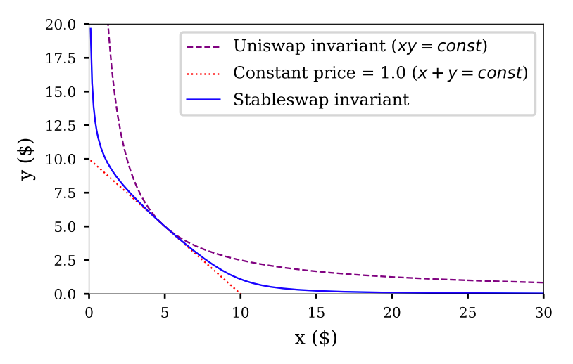
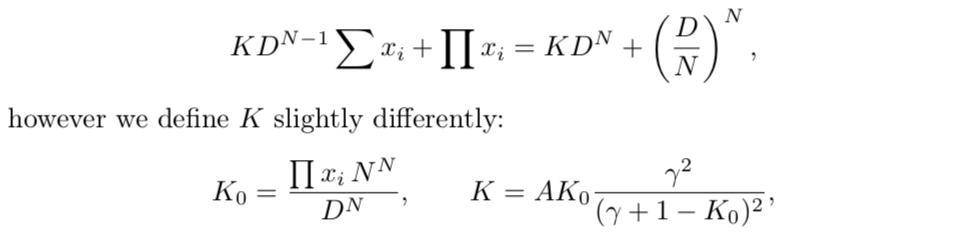
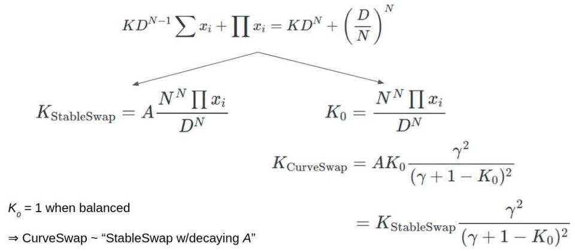

[Curve Whitepapers](https://curve.fi/whitepaper)

[Curve Finance定价公式：StableSwap invariant](https://www.wwsww.cn/qtszb/6390.html)

[Code评测 回顾：自动做市商 Curve](https://0xzx.com/2021012101001107899.html)

# Curve(StableSwap)

> **恒定乘积公式 Constant Product**
> $$
> x*y=k
> $$
> 当资产A数量多的时候，可以兑换的资产B就减少，表示价格下降。当资产A数量少的时候，可以兑换的资产B增加，表示价格上升。而最重要的是这个兑换曲线是一个双曲线，这表示资产A或资产B在这个公式里，数量不会是零，理想中提供了永远可进行交易的可能性。
>
> - 有滑点问题
> - 有无常损失问题
> - 没有流动性枯竭问题
>
> **恒定总和公式Constant Sum**
> $$
> x+y=k
> $$
> 这个公式的特点是零滑点，意思就是说，交换多少的资产，就会在兑换价格中呈现而不失真。在其他的公式中，单次交易量越大，当次的价格失真越高；滑点越大，价格的失真度越高，代表产生的损失可能越大。
> 然后这个公式不会产生无限的流动池。意思就是说，资产A或资产B兑换后，数量是有可能为0的。看上一个恒定乘积公式，在理论上是提供无限的流量池，每个交易结束后都还有资产进行下一个交易。因此，这个公式并不适合做为自动做市的公式。
>
> - 可以实现零滑点的交易
> - 会有流动性枯竭的问题，比较小的交易量就可能导致矿池子的 token 没了
>
> **混合型恒定总合及恒定乘积公式Hybrid Constant Sum and Constant Product (aka StableSwap from Cruve whitepaper)**
> StableSwap 的价格曲线特性是：在代币平衡时较平坦像是恒定总加，代币不平衡时就过渡为类似恒定乘积。
>
> Curve 结合了恒定乘积和恒定求和模型，Curve 的数学曲线形状类似于一个平底锅，在平底区域基本没有滑点，但是越过这个区域就会有很大的滑点。 

> StableSwap provides a mechanism to create cross-markets for stablecoins in a way which could be called “Uniswap with leverage”. 
>
> StableSwap 提供了一种为稳定币创建跨市场的机制，这种方式可以称为“带杠杆的 Uniswap”。

假设稳定币的种类为$n$，总量为$D$，则对应的恒定总和公式为：
$$
\sum x_i=D
$$
因为稳定币的价格都相同（即1美元），所以各稳定币初始投入的数量应该都是$\frac{D}{n}$，则恒定乘积公式为：
$$
\prod x_i=(\frac{D}{n})^n
$$
构造公式：
$$
\chi D^{n-1}\sum x_i + \prod x_i = \chi D^n + (\frac{D}{n})^n
$$
当 $\chi=0$ 时，退化成恒定乘积公式；当$\chi \rightarrow \infin$时，就是恒定总和公式。

构造$\chi$：
$$
\chi = \frac{A\prod x_i}{(D/n)^n}
$$
当资产平衡时，$\chi$趋近于常数$A$，反之，则趋近于零。

最终公式为：
$$
An^n\sum x_i + D = ADn^n + \frac{D^{n+1}}{n^n\prod x_i}
$$
作者使用三种稳定币的历史价格数据进行仿真测试，流动池中总金额为\$30000，得出最优的放大系数$A=85$，手续费率$0.06\%$，年利率为$312\%$

> 牛顿迭代法：
> $$
> x_{n+1}=x_n - \frac{f(x_n)}{f'(x_n)}
> $$
> 
>
> https://www.zhihu.com/question/20690553

使用牛顿迭代法求解：
$$
f(D) = \frac{D^{n+1}}{n^n\prod x_i} + (An^n-1)D - An^n\sum x_i
$$

$$
D' = D - \frac{\frac{D^{n+1}}{n^n\prod x_i} + (An^n-1)D - An^n\sum x_i}{(n+1)\frac{D^n}{n^n\prod x_i}+(An^n-1)}\\
=\frac{n\frac{D^{n+1}}{n^n\prod x_i}+An^n\sum x_i}{(n+1)\frac{D^n}{n^n\prod x_i}+(An^n-1)}\\
=\frac{(n\frac{D^{n+1}}{n^n\prod x_i}+An^n\sum x_i)*D}{(n+1)\frac{D^{n+1}}{n^n\prod x_i}+(An^n-1)*D}
$$

```python
@pure
@internal
def get_D(xp: uint256[N_COINS], amp: uint256) -> uint256:
    S: uint256 = 0
    for _x in xp:
        S += _x
    if S == 0:
        return 0

    Dprev: uint256 = 0
    D: uint256 = S
    Ann: uint256 = amp * N_COINS
    for _i in range(255):
        D_P: uint256 = D
        for _x in xp:
            D_P = D_P * D / (_x * N_COINS)  # If division by 0, this will be borked: only withdrawal will work. And that is good
        Dprev = D
        D = (Ann * S + D_P * N_COINS) * D / ((Ann - 1) * D + (N_COINS + 1) * D_P)
        # Equality with the precision of 1
        if D > Dprev:
            if D - Dprev <= 1:
                break
        else:
            if Dprev - D <= 1:
                break
    return D
```

其中
$$
Ann = An^n \\
S = \sum x_i \\
D\_P = \frac{D^{n+1}}{n^n\prod x_i}
$$
已知$D$，求解$y$：
$$
An^n(y+\sum x_{i-1}) + D = ADn^n + \frac{D^{n+1}}{n^n y\prod x_{i-1}}
$$

$$
f(y)=y^2+(\sum x_{i-1}+\frac{D}{An^n}-D)y-\frac{D^{n+1}}{n^n \prod x_{i-1} An^n}
$$

$$
y' = y - \frac{y^2+(\sum x_{i-1}+\frac{D}{An^n}-D)y-\frac{D^{n+1}}{n^n \prod x_{i-1} An^n}}{2y+(\sum x_{i-1}+\frac{D}{An^n}-D)}\\
=\frac{y^2+\frac{D^{n+1}}{n^n \prod x_{i-1} An^n}}{2y+\sum x_{i-1}+\frac{D}{An^n}-D}
$$

```python
def get_y(i: int128, j: int128, x: uint256, xp_: uint256[N_COINS]) -> uint256:
    # x in the input is converted to the same price/precision

    assert i != j       # dev: same coin
    assert j >= 0       # dev: j below zero
    assert j < N_COINS  # dev: j above N_COINS

    # should be unreachable, but good for safety
    assert i >= 0
    assert i < N_COINS

    amp: uint256 = self._A()
    D: uint256 = self.get_D(xp_, amp)
    c: uint256 = D
    S_: uint256 = 0
    Ann: uint256 = amp * N_COINS

    _x: uint256 = 0
    for _i in range(N_COINS):
        if _i == i:
            _x = x
        elif _i != j:
            _x = xp_[_i]
        else:
            continue
        S_ += _x
        c = c * D / (_x * N_COINS)
    c = c * D / (Ann * N_COINS)
    b: uint256 = S_ + D / Ann  # - D
    y_prev: uint256 = 0
    y: uint256 = D
    for _i in range(255):
        y_prev = y
        y = (y*y + c) / (2 * y + b - D)
        # Equality with the precision of 1
        if y > y_prev:
            if y - y_prev <= 1:
                break
        else:
            if y_prev - y <= 1:
                break
    return y
```

其中
$$
S\_=\sum x_{i-1}\\
c=\frac{D^{n+1}}{n^n \prod x_{i-1} An^n}\\
b=\sum x_{i-1}+\frac{D}{An^n}
$$

# Curve V2

[深入解构 Curve V2 的基本数学原理](https://www.chainnews.com/articles/727604493910.htm)

[简明理解 Curve V2 原理](https://www.chainnews.com/articles/739762114269.htm)



与 StableSwap的关系：



> 相比 V1 版本中更接近于一条直线的价格曲线，V2 的曲线在远端的弧度更大，以此增加对非稳定币交易对的支持程度。
>
> Curve V2 最关键的改进，是在当价格偏离原聚合范围时，可以对流动性进行自动再平衡（rebalance），重新构造一条适用于新价格的曲线。
>
> 当 EMA （exponentially moving average）预言机报出的价格偏离原始价格超过一定范围后，协议便会自动对整条曲线的形状进行调整，使得流动性重新聚合于最新的交易价格附近。