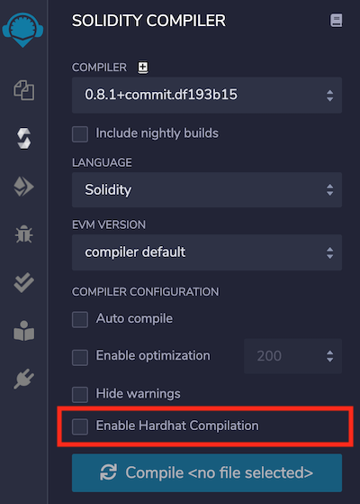
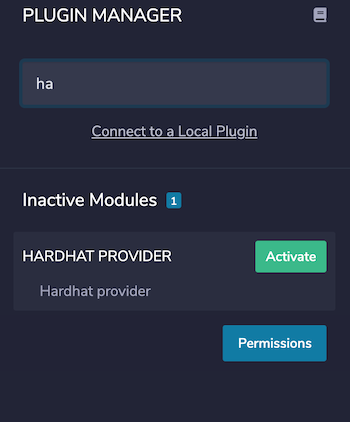
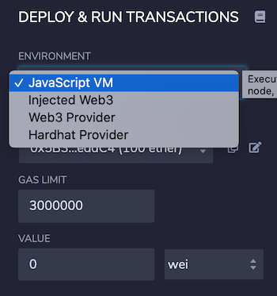

https://hardhat.org/getting-started/

# Getting Started

## Overview

Hardhat is a development environment to compile, deploy, test, and debug your Ethereum software.

Hardhat comes built-in with Hardhat Network, a local Ethereum network designed for development. Its functionality focuses around Solidity debugging, featuring stack traces, `console.log()` and explicit error messages when transactions fail.

Hardhat Runner, the CLI command to interact with Hardhat, is an extensible task runner. It's designed around the concepts of **tasks** and **plugins**. E.g. `npx hardhat compile` is running the built-in `compile` task. Tasks can call other tasks, allowing complex workflows to be defined. Users and plugins can override existing tasks, making those workflows customizable and extendable.

## Installation

To install it, you need to create an npm project by going to an empty folder, running `npm init`, and following its instructions. Once your project is ready, you should run

```text
npm install --save-dev hardhat
```

To use your local installation of Hardhat, you need to use `npx` to run it (i.e. `npx hardhat`).

## Quick Start

To create your Hardhat project run `npx hardhat` in your project folder:

```
$ npx hardhat
888    888                      888 888               888
888    888                      888 888               888
888    888                      888 888               888
8888888888  8888b.  888d888 .d88888 88888b.   8888b.  888888
888    888     "88b 888P"  d88" 888 888 "88b     "88b 888
888    888 .d888888 888    888  888 888  888 .d888888 888
888    888 888  888 888    Y88b 888 888  888 888  888 Y88b.
888    888 "Y888888 888     "Y88888 888  888 "Y888888  "Y888

Welcome to Hardhat v2.0.8

? What do you want to do? …
❯ Create a sample project
  Create an empty hardhat.config.js
  Quit
```

Or

```
npm install --save-dev @nomiclabs/hardhat-waffle ethereum-waffle chai @nomiclabs/hardhat-ethers ethers
```


### Running tasks

```
$ npx hardhat
Hardhat version 2.0.8

Usage: hardhat [GLOBAL OPTIONS] <TASK> [TASK OPTIONS]

GLOBAL OPTIONS:

  --config              A Hardhat config file.
  --emoji               Use emoji in messages.
  --help                Shows this message, or a task's help if its name is provided
  --max-memory          The maximum amount of memory that Hardhat can use.
  --network             The network to connect to.
  --show-stack-traces   Show stack traces.
  --tsconfig            Reserved hardhat argument -- Has no effect.
  --verbose             Enables Hardhat verbose logging
  --version             Shows hardhat's version.


AVAILABLE TASKS:

  accounts      Prints the list of accounts
  check         Check whatever you need
  clean         Clears the cache and deletes all artifacts
  compile       Compiles the entire project, building all artifacts
  console       Opens a hardhat console
  flatten       Flattens and prints contracts and their dependencies
  help          Prints this message
  node          Starts a JSON-RPC server on top of Hardhat Network
  run           Runs a user-defined script after compiling the project
  test          Runs mocha tests

To get help for a specific task run: npx hardhat help [task]
```

This is the list of built-in tasks, and the sample `accounts` task. Further ahead, when you start using plugins to add more functionality, tasks defined by those will also show up here. This is your starting point to find out what tasks are available to run.

If you take a look at the `hardhat.config.js` file, you will find the definition of the task `accounts`:

```js
require("@nomiclabs/hardhat-waffle");

// This is a sample Hardhat task. To learn how to create your own go to
// https://hardhat.org/guides/create-task.html
task("accounts", "Prints the list of accounts", async (taskArgs, hre) => {
  const accounts = await hre.ethers.getSigners();

  for (const account of accounts) {
    console.log(account.address);
  }
});

// You need to export an object to set up your config
// Go to https://hardhat.org/config/ to learn more

/**
 * @type import('hardhat/config').HardhatUserConfig
 */
module.exports = {
  solidity: "0.8.4",
};
```

### Compiling your contracts

```js
//SPDX-License-Identifier: Unlicense
pragma solidity ^0.8.0;

import "hardhat/console.sol";

contract Greeter {
  string greeting;

  constructor(string memory _greeting) {
    console.log("Deploying a Greeter with greeting:", _greeting);
    greeting = _greeting;
  }

  function greet() public view returns (string memory) {
    return greeting;
  }

  function setGreeting(string memory _greeting) public {
    console.log("Changing greeting from '%s' to '%s'", greeting, _greeting);
    greeting = _greeting;
  }
}
```

```text
npx hardhat compile

// Error HH503: Couldn't download compiler version 0.6.6. Checksum verification failed. Please check your connection.
// /Users/macbookpro/Library/Caches/hardhat-nodejs/compilers/
npx hardhat clean --global
npx hardhat compile --verbose
```

#### Multiple Solidity versions 

```js
module.exports = {
  solidity: {
    compilers: [
      {
        version: "0.5.5",
      },
      {
        version: "0.6.7",
        settings: {},
      },
    ],
  },
};
```

This setup means that a file with a `pragma solidity ^0.5.0` will be compiled with solc 0.5.5 and a file with a `pragma solidity ^0.6.0` will be compiled with solc 0.6.7.

It might happen that a file can be compiled with more than one of your configured compilers, for example a file with `pragma solidity >=0.5.0`. In that case, the compatible compiler with the highest version will be used (0.6.7 in this example). If you don't want that to happen, you can specify for each file which compiler should be used by using overrides:

```js
module.exports = {
  solidity: {
    compilers: [...],
    overrides: {
      "contracts/Foo.sol": {
        version: "0.5.5",
        settings: { }
      }
    }
  }
}
```

In this case, `contracts/Foo.sol` will be compiled with solc 0.5.5, no matter what's inside the `solidity.compilers` entry.

Keep in mind that:

- Overrides are full compiler configurations, so if you have any additional settings you're using you should set them for the override as well.

### Testing your contracts

The sample project comes with these tests that use [Waffle](https://getwaffle.io/) and [Ethers.js](https://github.com/ethers-io/ethers.js/). 

```js
const { expect } = require("chai");

describe("Greeter", function () {
  it("Should return the new greeting once it's changed", async function () {
    const Greeter = await ethers.getContractFactory("Greeter");
    const greeter = await Greeter.deploy("Hello, world!");
    await greeter.deployed();

    expect(await greeter.greet()).to.equal("Hello, world!");

    const setGreetingTx = await greeter.setGreeting("Hola, mundo!");

    // wait until the transaction is mined
    await setGreetingTx.wait();

    expect(await greeter.greet()).to.equal("Hola, mundo!");
  });
});

```

```
npx hardhat test
```

**Testing from a different account**

If you need to send a transaction from an account other than the default one, you can use the `connect()` method provided by Ethers.js.

```js
const [owner, addr1] = await ethers.getSigners();
```

The `ethers` variable is available in the global scope. If you like your code always being explicit, you can add this line at the top:

```js
const { ethers } = require("hardhat");
```

Finally, to execute a contract's method from another account, all you need to do is `connect` the `Contract` with the method being executed:

```js
await greeter.connect(addr1).setGreeting("Hallo, Erde!");
```

### Deploying your contracts

```
npx hardhat run scripts/sample-script.js
```

### Connecting a wallet or Dapp to Hardhat Network

Hardhat will always spin up an in-memory instance of Hardhat Network on startup by default. It's also possible to run Hardhat Network in a standalone fashion so that external clients can connect to it. This could be MetaMask, your Dapp front-end, or a script.

By default, it mines a block with each transaction that it receives, in order and with no delay.

It's backed by the `@ethereumjs/vm` EVM implementation, the same one used by ganache, Remix and Ethereum Studio.

To run Hardhat Network in this way, run `npx hardhat node`.

```
$ npx hardhat node
Started HTTP and WebSocket JSON-RPC server at http://127.0.0.1:8545/
```

If you want to connect Hardhat to this node to, for example, run a deployment script against it, you simply need to run it using `--network localhost`.

To try this, start a node with `npx hardhat node` and re-run the sample script using the `network` option:

```text
npx hardhat run scripts/sample-script.js --network localhost
```

If a transaction or call fails, Hardhat Network will throw an exception. This exception will have a combined JavaScript and Solidity **stack trace**: stack traces that start in JavaScript/TypeScript up to your call to the contract, and continue with the full Solidity call stack.

### debug_traceTransaction

You can get debug traces of already-mined transactions using the `debug_traceTransaction` RPC method. The returned object has a detailed description of the transaction execution, including a list of steps describing each executed opcode and the state of the EVM at that point.

If you are using [mainnet forking](https://hardhat.org/hardhat-network/guides/mainnet-forking.html) with an archive node, you can get traces of transactions from the remote network even if the node you are using doesn't support `debug_traceTransaction`.

```js
const trace = await hre.network.provider.send("debug_traceTransaction", [
  "0x123...",
]);
```

You can also selectively disable some properties in the list of steps:

```js
const trace = await hre.network.provider.send("debug_traceTransaction", [
  "0x123...",
  {
    disableMemory: true,
    disableStack: true,
    disableStorage: true,
  },
]);
```

**Known limitations**

- You can't trace transactions that use a hardfork older than [Spurious Dragon](https://ethereum.org/en/history/#spurious-dragon)
- The last step of a message is not guaranteed to have a correct value in the `gasCost` property

# Configuration

## Available config options

This object can have entries like `defaultNetwork`, [`networks`](https://hardhat.org/config/#networks-configuration), [`solidity`](https://hardhat.org/config/#solidity-configuration), [`paths`](https://hardhat.org/config/#path-configuration) and [`mocha`](https://hardhat.org/config/#mocha-configuration). For example:

```js
module.exports = {
  defaultNetwork: "rinkeby",
  networks: {
    hardhat: {
    },
    rinkeby: {
      url: "https://eth-mainnet.alchemyapi.io/v2/123abc123abc123abc123abc123abcde",
      accounts: [privateKey1, privateKey2, ...]
    }
  },
  solidity: {
    version: "0.5.15",
    settings: {
      optimizer: {
        enabled: true,
        runs: 200
      }
    }
  },
  paths: {
    sources: "./contracts",
    tests: "./test",
    cache: "./cache",
    artifacts: "./artifacts"
  },
  mocha: {
    timeout: 20000
  }
}
```

## Networks configuration

There are two kinds of networks in Hardhat: [JSON-RPC](https://eth.wiki/json-rpc/API) based networks, and the built-in Hardhat Network.

You can customize which network is used by default when running Hardhat by setting the config's `defaultNetwork` field. If you omit this config, its default value is `"hardhat"`.

### Hardhat Network

Hardhat comes built-in with a special network called `hardhat`. When using this network, an instance of the [Hardhat Network](https://hardhat.org/hardhat-network/) will be automatically created when you run a task, script or test your smart contracts.

- `allowUnlimitedContractSize`: An optional boolean that disables the contract size limit imposed by the [EIP 170](https://eips.ethereum.org/EIPS/eip-170). Default value: `false`
- `forking`: An object that describes the [forking](https://hardhat.org/hardhat-network/hardhat-network/#mainnet-forking) configuration that can have the following fields:
  - `url`: a URL that points to a JSON-RPC node with state that you want to fork off. There's no default value for this field. It must be provided for the fork to work.
  - `blockNumber`: an optional number to pin which block to fork from. If no value is provided, the latest block is used.
  - `enabled`: an optional boolean to switch on or off the fork functionality. Default value: `true` if `url` is set, `false` otherwise.

### JSON-RPC based networks

These are networks that connect to an external node. Nodes can be running in your computer, like Ganache, or remotely, like Alchemy or Infura.

This kind of network is configured with objects with the following fields:

- `url`: The url of the node. This argument is required for custom networks.
- `chainId`: An optional number, used to validate the network Hardhat connects to. If not present, this validation is omitted.
- `from`: The address to use as default sender. If not present the first account of the node is used.
- `gas`: Its value should be `"auto"` or a number. If a number is used, it will be the gas limit used by default in every transaction. If `"auto"` is used, the gas limit will be automatically estimated. Default value: `"auto"`.
- `gasPrice`: Its value should be `"auto"` or a number. This parameter behaves like `gas`. Default value: `"auto"`.
- `gasMultiplier`: A number used to multiply the results of gas estimation to give it some slack due to the uncertainty of the estimation process. Default value: `1`.
- `accounts`: This field controls which accounts Hardhat uses. It can use the node's accounts (by setting it to `"remote"`), a list of local accounts (by setting it to an array of hex-encoded private keys), or use an [HD Wallet](https://hardhat.org/config/#hd-wallet-config). Default value: `"remote"`.
- `httpHeaders`: You can use this field to set extra HTTP Headers to be used when making JSON-RPC requests. It accepts a JavaScript object which maps header names to their values. Default value: `undefined`.
- `timeout`: Timeout in ms for requests sent to the JSON-RPC server. If the request takes longer than this, it will be cancelled. Default value: `20000`.

### HD Wallet config

To use an HD Wallet with Hardhat you should set your network's `accounts` field to an object with the following fields:

- `mnemonic`: A required string with the mnemonic phrase of the wallet.
- `path`: The HD parent of all the derived keys. Default value: `"m/44'/60'/0'/0"`.
- `initialIndex`: The initial index to derive. Default value: `0`.
- `count`: The number of accounts to derive. Default value: `20`.

### Default networks object

```js
{
    localhost: {
      url: "http://127.0.0.1:8545"
    },
    hardhat: {
      // See its defaults
    }
}
```

## Mainnet forking

You can start an instance of Hardhat Network that forks mainnet. This means that it will simulate having the same state as mainnet, but it will work as a local development network. That way you can interact with deployed protocols and test complex interactions locally.

To use this feature you need to connect to an **archive** node. We recommend using [Alchemy](https://alchemyapi.io/).

The easiest way to try this feature is to start a node from the command line:

```text
npx hardhat node --fork https://eth-mainnet.alchemyapi.io/v2/<key>
```

You can also configure Hardhat Network to always do this:

```js
networks: {
  hardhat: {
    forking: {
      url: "https://eth-mainnet.alchemyapi.io/v2/<key>";
    }
  }
}
```

### Pinning a block

There are two reasons for this:

- The state your tests run against may change between runs. This could cause your tests or scripts to behave differently.
- Pinning enables caching. Every time data is fetched from mainnet, Hardhat Network caches it on disk to speed up future access. If you don't pin the block, there's going to be new data with each new block and the cache won't be useful. We measured up to 20x speed improvements with block pinning.

To pin the block number:

```js
networks: {
  hardhat: {
    forking: {
      url: "https://eth-mainnet.alchemyapi.io/v2/<key>",
      blockNumber: 11095000
    }
  }
}
```

If you are using the `node` task, you can also specify a block number with the `--fork-block-number` flag:

```text
npx hardhat node --fork https://eth-mainnet.alchemyapi.io/v2/<key> --fork-block-number 11095000
```

### Customizing Hardhat Network's behavior

Once you've got local instances of mainnet protocols, setting them in the specific state your tests need is likely the next step. Hardhat Network provides several RPC methods to help you with this:

- [`hardhat_impersonateAccount`](https://hardhat.org/hardhat-network/reference/#hardhat-impersonateaccount)

  Hardhat Network allows you to send transactions impersonating specific account and contract addresses.

  ```tsx
  await hre.network.provider.request({
    method: "hardhat_impersonateAccount",
    params: ["0x364d6D0333432C3Ac016Ca832fb8594A8cE43Ca6"],
  });
  ```

  If you are using [`hardhat-ethers`](https://github.com/nomiclabs/hardhat/tree/master/packages/hardhat-ethers), call `getSigner` after impersonating the account:

  ```text
  const signer = await ethers.getSigner("0x364d6D0333432C3Ac016Ca832fb8594A8cE43Ca6")
  signer.sendTransaction(...)
  ```

- [`hardhat_stopImpersonatingAccount`](https://hardhat.org/hardhat-network/reference/#hardhat-stopimpersonatingaccount)

- [`hardhat_setNonce`](https://hardhat.org/hardhat-network/reference/#hardhat-setnonce)

- [`hardhat_setBalance`](https://hardhat.org/hardhat-network/reference/#hardhat-setbalance)

  ```tsx
  await network.provider.send("hardhat_setBalance", [
    "0x0d2026b3EE6eC71FC6746ADb6311F6d3Ba1C000B",
    "0x1000",
  ]);
  ```

- [`hardhat_setCode`](https://hardhat.org/hardhat-network/reference/#hardhat-setcode)

- [`hardhat_setStorageAt`](https://hardhat.org/hardhat-network/reference/#hardhat-setstorageat)

### Resetting the fork

You can manipulate forking during runtime to reset back to a fresh forked state, fork from another block number or disable forking by calling `hardhat_reset`:

```ts
await network.provider.request({
  method: "hardhat_reset",
  params: [
    {
      forking: {
        jsonRpcUrl: "https://eth-mainnet.alchemyapi.io/v2/<key>",
        blockNumber: 11095000,
      },
    },
  ],
});
```

```json
{"jsonrpc":"2.0","method":"hardhat_reset","params":[{"forking":{"jsonRpcUrl":"http://127.0.0.1:8548"}}],"id":1}
```

You can **disable forking** by passing empty params:

```ts
await network.provider.request({
  method: "hardhat_reset",
  params: [],
});
```

## Mining Modes

Hardhat Network can be configured to **automine** blocks, immediately upon receiving each transaction, or it can be configured for **interval mining**, where a new block is mined periodically, incorporating as many pending transactions as possible.

You can use one of these modes, both or neither. By default, only the automine mode is enabled.

For example, to disable automining:

```js
await network.provider.send("evm_setAutomine", [false]);
```

And to enable interval mining:

```js
await network.provider.send("evm_setIntervalMining", [5000]);
```

You can configure the mining behavior under your Hardhat Network settings:

```js
networks: {
  hardhat: {
    mining: {
      auto: false,
      interval: 5000
    }
  }
}
```

You can also configure interval mining to generate a new block after a random delay:

```js
networks: {
  hardhat: {
    mining: {
      auto: false,
      interval: [3000, 6000]
    }
  }
}
```

When automine is disabled, every sent transaction is added to the mempool, which contains all the transactions that could be mined in the future. Hardhat Network's mempool follows the same rules as geth. This means, among other things, that transactions are prioritized by fees paid to the miner (and then by arrival time), and that invalid transactions are dropped. Pending transactions can be queried via the `eth_getBlockByNumber` RPC method (with `"pending"` as the block number argument), they can be removed using the `hardhat_dropTransaction` RPC method, and they can be replaced by submitting a new transaction with the same nonce but with a 10+% increase in fees paid to the miner.

You can disable both mining modes like this:

```js
networks: {
  hardhat: {
    mining: {
      auto: false,
      interval: 0
    }
  }
}
```

If neither mining mode is enabled, no new blocks will be mined, but you can manually mine new blocks using the `evm_mine` RPC method. This will generate a new block that will include as many pending transactions as possible.

## console.log

- You can use it in calls and transactions. It works with `view` functions, but not in `pure` ones.
- It always works, regardless of the call or transaction failing or being successful.
- To use it you need to import `hardhat/console.sol`.
- You can call `console.log` with up to 4 parameters in any order of following types:
  - `uint`
  - `string`
  - `bool`
  - `address`
- There's also the single parameter API for the types above, and additionally`bytes`, `bytes1`... up to `bytes32`:
  - `console.logInt(int i)`
  - `console.logUint(uint i)`
  - `console.logString(string memory s)`
  - `console.logBool(bool b)`
  - `console.logAddress(address a)`
  - `console.logBytes(bytes memory b)`
  - `console.logBytes1(bytes1 b)`
  - `console.logBytes2(bytes2 b)`
  - ...
  - `console.logBytes32(bytes32 b)`
- `console.log` implements the same formatting options that can be found in Node.js'`console.log`, which in turn uses `util.format`.
  - Example: `console.log("Changing owner from %s to %s", currentOwner, newOwner)`
- `console.log` is implemented in standard Solidity and then detected in Hardhat Network. This makes its compilation work with any other tools (like Remix, Waffle or Truffle).
- `console.log` calls can run in other networks, like mainnet, kovan, ropsten, etc. They do nothing in those networks, but do spend a minimal amount of gas.
- `console.log` output can also be viewed for testnets and mainnet via [Tenderly](https://tenderly.co/).
- `console.log` works by sending static calls to a well-known contract address. At runtime, Hardhat Network detects calls to that address, decodes the input data to the calls, and writes it to the console.

## Special testing/debugging methods

- evm_increaseTime

- evm_mine

- evm_revert

- evm_setAutomine

- evm_setBlockGasLimit

- evm_setIntervalMining

- evm_setNextBlockTimestamp

  This method works like `evm_increaseTime`, but takes the exact timestamp that you want in the next block, and increases the time accordingly.

- evm_snapshot

# TypeScript Support

https://hardhat.org/guides/typescript.html

```text
npm install --save-dev ts-node typescript
```

To be able to write your tests in TypeScript, you also need these packages:

```text
npm install --save-dev chai @types/node @types/mocha @types/chai
```

```text
mv hardhat.config.js hardhat.config.ts
```

We need to apply three changes to your config for it to work with TypeScript:

1. Plugins must be loaded with `import` instead of `require`.
2. You need to explicitly import the Hardhat config functions, like `task`.
3. If you are defining tasks, they need to access the [Hardhat Runtime Environment](https://hardhat.org/advanced/hardhat-runtime-environment.html) explicitly, as a parameter.

```typescript
import { task } from "hardhat/config";
import "@nomiclabs/hardhat-waffle";

// This is a sample Hardhat task. To learn how to create your own go to
// https://hardhat.org/guides/create-task.html
task("accounts", "Prints the list of accounts", async (args, hre) => {
  const accounts = await hre.ethers.getSigners();

  for (const account of accounts) {
    console.log(await account.address);
  }
});

// You need to export an object to set up your config
// Go to https://hardhat.org/config/ to learn more

export default {
  solidity: "0.7.3",
};
```

When using JavaScript, all the properties in the HRE are injected into the global scope, and are also available by getting the HRE explicitly. When using TypeScript nothing will be available in the global scope and you will need to import everything explicitly.

An example for tests:

```typescript
import { ethers } from "hardhat";
import { Signer } from "ethers";

describe("Token", function () {
  let accounts: Signer[];

  beforeEach(async function () {
    accounts = await ethers.getSigners();
  });

  it("should do something right", async function () {
    // Do something with the accounts
  });
});
```

An example for scripts:

```typescript
import { run, ethers } from "hardhat";

async function main() {
  await run("compile");

  const accounts = await ethers.getSigners();

  console.log(
    "Accounts:",
    accounts.map((a) => a.address)
  );
}

main()
  .then(() => process.exit(0))
  .catch((error) => {
    console.error(error);
    process.exit(1);
  });
```

One of the advantages of using TypeScript, is that you can have a type-safe configuration, and avoid typos and other common errors.

To do that, you have to write your config in this way:

```ts
import { HardhatUserConfig } from "hardhat/config";

const config: HardhatUserConfig = {
  // Your type-safe config goes here
};

export default config;
```

If you are sure you need a `tsconfig.json` file, here's a template to base yours on:

```json
{
  "compilerOptions": {
    "target": "es2018",
    "module": "commonjs",
    "strict": true,
    "esModuleInterop": true,
    "outDir": "dist"
  },
  "include": ["./scripts", "./test"],
  "files": ["./hardhat.config.ts"]
}
```


# Remix Integration

https://remix-ide.readthedocs.io/en/latest/hardhat.html

*(Supported since Remix IDE v0.12.0 and Remixd v0.3.6)*



**Hardhat Provider** is a plugin on Remix IDE which enables users to deploy the contract to the Hardhat ‘localhost’ network. This plugin can be activated from Remix IDE plugin manager.



