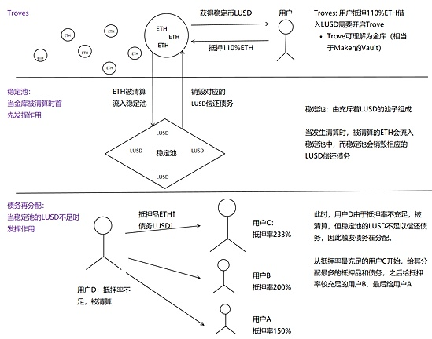
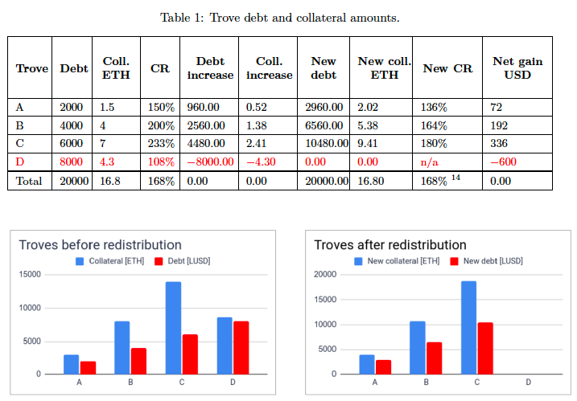
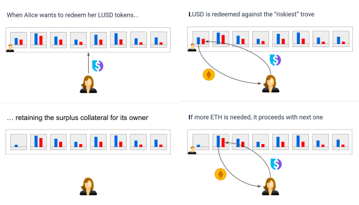

|            | MakerDao                       | Liquity                                |
| ---------- | ------------------------------ | -------------------------------------- |
| 抵押率     | >150%                          | >=110%                                 |
| 费用       | 稳定费                         | 无（抵押、赎回一次性费用）             |
| 抵押品     | ETH、WBTC、USDC等多种          | ETH                                    |
| 最低抵押值 | >0                             | >2000 LUSD                             |
| 清算方式   | 抵押品拍卖、债务拍卖、盈余拍卖 | 稳定池+再分配，恢复模式                |
| 代币       | Dai/MCR                        | LUSD/LQTY                              |
| 锚定方式   | 软锚定                         | 软、硬锚定（从抵押率由低到高进行赎回） |
| 治理       | 有                             | 无                                     |

> **即时清算辅以稳健的三重清算方案**
>
> - 稳定池
> - 债务再分配
> - Recovery Mode （系统恢复模式）
>
> 
>
> 首先，稳定池属于优先级别最高，即抵押借贷的用户需开启Trove提供高于110%的抵押品可发行100%的LUSD。而一旦用户抵押品ETH价值低于110%会被触发清算，此时充斥着LUSD的稳定池即会发挥作用，稳定池会销毁对应量的LUSD而获得相对应的抵押品ETH，因为只要低于110%即会被清算而110%>100%，相当于稳定池会获得10%折扣的ETH。
>
> 第二阶段债务再分配，可理解为稳定池LUSD不足的情况下的Plan B。假如稳定池里LUSD数量不足以覆盖系统债务，则会触发债务再分配，简单来讲就是把被清算的债务分配到抵押率较充足的Trove持有者头上。
>
> 如下图所示：此时Trove D的抵押率为108%触发清算。由于稳定池LUSD不足，抵押品4.3个ETH和相应债务则会被分配到其他Trove头上，Trove D的净损失约7%（600/8600=7%）。抵押率越充足，则被分配到的抵押品及LUSD越多。Trove C被分配到最多的抵押品（7个ETH）及最多的债务（4480个LUSD）债务，其抵押率由233%降低至180%，其净收益为$336。
>
> 
>
> 第三阶段被称为Recovery Mode，系统存在一个关键抵押率=150%，当系统的总抵押率不足150%时，则会触发Recovery Mode，此时，系统会依据抵押率由低到高，不管你的抵押率是否大于110%，只要低于150%就有可能被清算，直到系统总抵押率为150%为止。针对Trove来说，不会有额外的损失，也就是说如果你的抵押率为140%被触发清算，你的Trove会被关闭，110%抵押品被清算，30%的抵押品则依旧Claimable，因此该Trove的净损失依然为10%，但对系统来说减少了很多有风险的Trove从而提升了系统总抵押率。
>
> 该阶段的清算只会启用稳定池消化债务，而不会将其分配给其他 trove。
>
> 全局清算实际上起着一种**威慑作用**，为了免于清算，激励用户（即使处于 110-150％抵押率范围的借款人）增加抵押资产，从而实现让总质押率总是保持在 150％以上。
>
> **发行/赎回费用**
>
> 由上图可得知，当前Defi最大的稳定币项目，或称为Defi央行的Maker，存在稳定费率即基于金库Dai产生的债务累积的利息费。而Liquity的用户铸造稳定币LUSD仅需在**开启Trove和赎回抵押品时支付一次性的铸造费和赎回费**即可，而发行费和赎回费会依据每次赎回的时间周期和赎回金额调整，简单来讲系统无人赎回则赎回费会降低，赎回金额增多则费用也会相应增加。其目的是为了以较高的赎回费抑制大规模的赎回行为并通过较高的发行费用抑制大规模赎回发生后的大量借款（发行），通过一个冷静期来保证系统的长期稳定性及抵抗系统性风险。
>
> [Liquity 稳定币分级清算机制探索](https://www.jinse.com/news/blockchain/1062776.html)

> 总的说来，赎回费与两个变量有关，一个是与上一次赎回操作的时间间隔，另一个则是兑换 LUSD 数量占总发行量的百分比。也就是说，间隔上次赎回操作的时间越短，费用越高，着与上一次赎回活动的间隔拉长逐渐衰变，最终趋近于零。赎回兑换 LUSD 数量占总发行量的百分比越高，支付的费用越高。每一次产生的赎回费用会从赎回的抵押资产 ETH 中扣除。
>
> 为了激励稳定池规模的增长，系统将会把部分收益以增长代币 LQTY 的形式奖励给系统中的核心贡献者，在 Liquity 系统中，**核心贡献者是指第三方前端开发者和稳定池中的 LUSD 提供者。**
>
> Liquity 支持铸币用户的即刻承兑，也就是说，「trove」开户者可在任何时候将 LUSD 赎回为抵押品 ETH。当 「trove 」持有者想要用 LUSD 赎回 ETH 抵押品时，系统会将这些 LUSD 用于偿还系统中抵押率最低、也是风险最高的 trove，并将相应的 ETH 金额退还给赎回者。
>
> 这意味着，**110% 抵押率并不一定是最低的清算率**，事实上，只要系统中有人需要赎回抵押品，系统就会进行一次自动清理，重新平衡系统中风险最高的账户，这可强制剔除最弱的抵押品帐户来使系统重回正轨，从而提高了系统总体安全性。**每一次有人赎回，都是一次系统的自我风险审查，将最低质押率债仓进行清算。**
>
> [DeFi 借贷协议 Liquity 说可让抵押率低至 110％ 并维持稳定币锚定，这如何实现？](https://www.chainnews.com/articles/783679700327.htm)

> **使用 Liquity 有两种不同的创收方式：**
>
> - 将 LUSD 存入稳定池，并获得清算收益（以 ETH 为单位）和 LQTY 奖励。
> - 抵押 LQTY，并从借入和赎回费中赚取 LUSD 和 ETH 收入。
>
> [全方位的认识 Liquity （一）](https://www.chainnews.com/articles/241248627588.htm)

https://docs.liquity.org/faq/borrowing

最小抵押率 minimum collateral ratio (MCR)

最大杠杆率 = $\frac{MCR}{MCR-100\%}$

Whitepaper: https://medium.com/liquity/liquity-releases-updated-whitepaper-e5e9fca8d8c7

3 系统功能

3.1 借款人操作

该协议规定的最低债务为 2,000 LUSD。

*清算准备金*。借款人开新Trove时，预留200 LUSD。如果 Trove 需要清算，则作为对 gas 成本的补偿。200 LUSD 被添加到 Trove 的债务中，影响其抵押率。当一个借款人关闭他们的 Trove，清算准备金被退还，即相应的 200 LUSD Trove 上的债务被取消。

*借款费用*。该协议对借入的流动性收取一次性借款费。该费用被添加到 Trove 的债务中，并由（**基本利率**+ 0.5%） 乘以借款人提取的流动性金额。最低借款费用为 0.5%，最高为 5%。

假设基准利率为 0.5%。借款人通过存入 4 个 ETH 和抽取 4,000 LUSD。受制于 200 LUSD 的清算准备金并收取 1% * 4,000 LUSD 的费用，借款人将获得 4,000 LUSD，同时产生 4,240 LUSD (4,000 + 200 + 40)的债务 。为了关闭 Trove 并完全取回 4 ETH，借款人需要偿还 4,040 LUSD（同时清算准备金被退还）。

3.2 稳定池操作

稳定池是维持系统偿付能力的第一道防线：稳定存款吸收并抵消违约的 Troves 的债务。作为回报，稳定池参与者可以以大幅折扣从清算头寸中获取抵押品。参与者还将不断收到 LQTY 代币的分配。

3.3 赎回机制

Liquity 的代币 LUSD 是一种完全可赎回的稳定币。在任何时候，该系统允许持有人根据赎回的面值，使用他们的 LUSD 代币赎回底层 ETH 抵押品代币。

赎回时，系统使用 LUSD 偿还风险最高（最低抵押率）的 Trove(s)，并将相应数量的 ETH 从受影响的头寸转移到赎回者。借款人失去了同样的名义债务（以 LUSD 为单位）。

完全赎回的 Troves，即其债务为 0，将自动关闭，并且借款人可以收回盈余的 ETH 。

*赎回费和基本费率*。
$$
b(t) = b(t-1)+\alpha \times \frac{m}{n}
$$
其中$b(t)$ 是时间$t$的基准利率，$m$是赎回 LUSD 的数量，$n$是当前 LUSD 的供应量，$\alpha$为常数0.5

基本费率会随着时间的推移而衰减
$$
b(t) = b(t-1) \times \delta \Delta t
$$
其中$\delta$是衰减因子，$\Delta t$是自上次赎回或贷款以来经过的时间。选择衰减因子$\delta$使得基本利率的半衰期为 12 小时。

例子：

LUSD 目前的交易价格为 0.95 美元，当前的基准利率为 1.4%。套利者赎回 150,000 LUSD，而 LUSD 总供应量为 1000 万。最后一次赎回发生 2几个小时前，在此期间没有发行流动性。每小时衰减因子为 0.94。

系统首先将衰减率应用到当前基本率：
$$
b(t) = b(t-1) \times \delta \Delta t = 0.014 \times 0.94^2 = 0.01237
$$
然后，它根据赎回的总供应量的比例，按比例增加基本费率：
$$
b(t) = b(t-1)+0.5 \times \frac{m}{n} = 0.01237+0.5*150000/10000000=0.01987
$$

结果，赎回者收到价值 147,019.44 美元 [150 *,* 000 × (1 − 0 *.* 01987)] 的 ETH。由于交换的 LUSD 目前仅价值 142,500 美元 [150 *,* 000×0 *.* 95]，赎回者实现了 4,519.44 美元的套利收益。

https://github.com/liquity/beta

**核心智能合约**

`BorrowerOperations.sol` - 包含借款人与其 Trove 交互的基本操作：Trove 创建、ETH 充值/提款、稳定币发行和还款。它还向`LQTYStaking`合约发送发行费用。BorrowerOperations 函数调用 TroveManager，告诉它在必要时更新 Trove 状态。BorrowerOperations 函数还会调用各种池，告诉它们在必要时在池之间或池 <> 用户之间移动以太币/代币。

`TroveManager.sol` - 包含清算和赎回功能。它向`LQTYStaking`合约发送赎回费用。还包含每个 Trove 的状态 - 即 Trove 的抵押品和债务的记录。TroveManager 不保存代币（即以太币/其他代币）。TroveManager 函数调用各种池以告诉它们在必要时在池之间移动以太币/代币。

`LiquityBase.sol` - TroveManager 和 BorrowerOperations 都继承自父合约 LiquityBase，其中包含全局常量和一些常用函数。

`StabilityPool.sol`- 包含稳定池操作的功能：存款、提取复合存款以及累积的 ETH 和 LQTY 收益。持有 LUSD 稳定池存款，以及存款人从清算中获得的 ETH 收益。

`LUSDToken.sol`- 稳定币代币合约，实现 ERC20 代币标准以及阻止（意外）转账到 StabilityPool 和 address(0) 等不应通过直接转账接收资金的地址的机制。该合约铸造、销毁和转移 LUSD 代币。

`SortedTroves.sol` - 一个双向链表，存储 Trove 所有者的地址，按他们的个人抵押率 (ICR) 排序。它根据 ICR 在正确的位置插入和重新插入 Trove。

`PriceFeed.sol` - 包含获取当前 ETH:USD 价格的功能，系统使用该价格计算抵押比率。

`HintHelpers.sol` - 助手合约。

**数据合约**

连同`StabilityPool.sol`，这些合约持有系统各自部分的以太币和/或代币，并且包含最少的逻辑：

`ActivePool.sol` - 持有总 Ether 余额并记录活跃 Troves 的总稳定币债务。

`DefaultPool.sol`- 持有 Ether 总余额并记录已清算的 Troves 的总稳定币债务，这些 Troves 等待重新分配到活动 Troves。如果 Trove 在 DefaultPool 中有待处理的以太/债务“奖励”，那么它们将在 Trove 下一次进行借款人操作、赎回或清算时应用于 Trove。

`CollSurplusPool.sol`- 持有来自己完全赎回的 Troves 以及在恢复模式下清算的 ICR > MCR 的 Troves 中的 ETH 盈余。

`GasPool.sol`- 持有 LUSD 清算准备金总额。在打开 Trove 时移入，并在 Trove 清算或关闭时移出。

[Liquity官方中文社区专栏](https://www.chainnews.com/u/908977781425.htm)
