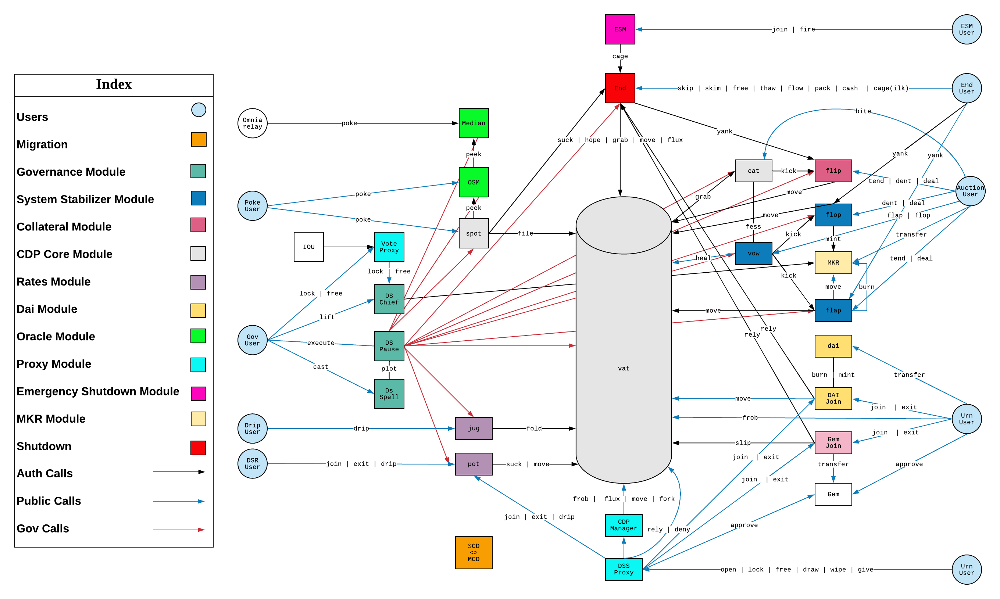
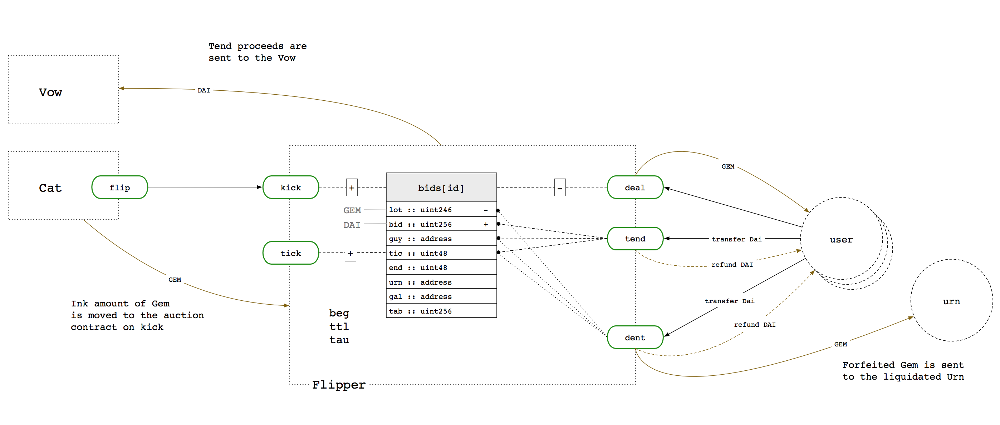
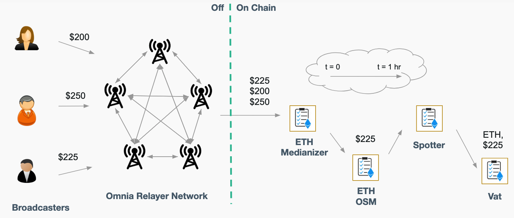
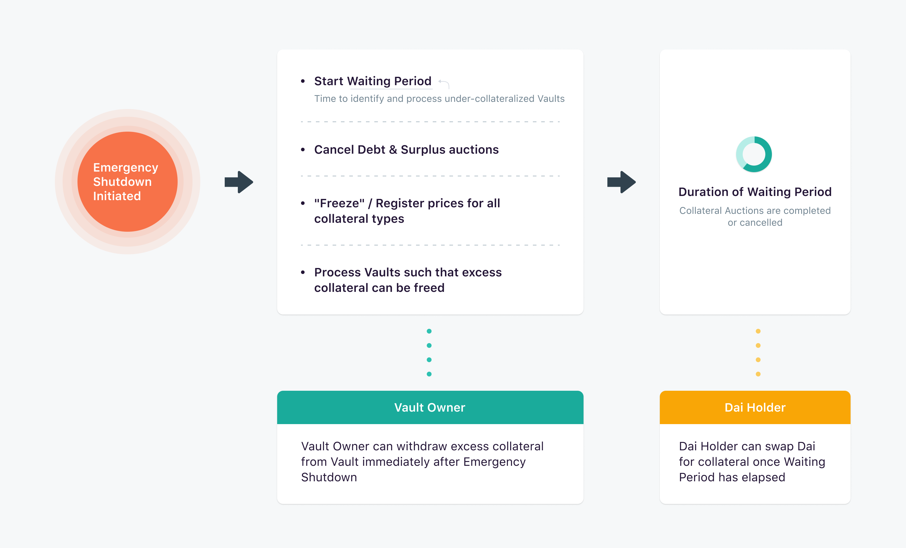

白皮书：https://makerdao.com/zh-CN/whitepaper/

Maker 协议介绍：https://docs.makerdao.com/

词汇表：https://github.com/makerdao/dss/wiki/Glossary

开发说明：https://github.com/makerdao/dss/blob/master/DEVELOPING.md

Developer Guides and Tutorials：https://github.com/makerdao/developerguides

Awesome MakerDAO： https://awesome.makerdao.com/

Learn About MakerDAO：https://community-development.makerdao.com/en/learn/

一站式 Dai 交易、借贷、存款平台： https://oasis.app/

Dai 统计平台：https://daistats.com/

Dai 系统的官方主网喂价：https://makerdao.com/zh-CN/feeds/

最新合约部署地址：https://changelog.makerdao.com/

# 介绍

Maker 协议，又称多担保 Dai（MCD）系统，可以让用户使用经过 “Maker 治理（Maker Governance）” 批准的资产作为担保物来生成 Dai 。Dai 是一种软锚定美元的资产担保型加密货币，其发行是去中心化、一视同仁的。由于波动性低，Dai 能够抵御恶性通货膨胀。

Maker 协议构建在以太坊区块链上，用户可以用其创造货币。该协议目前由**稳定币 Dai** 、Maker Collateral Vault（Maker 担保物金库）、信息输入系统（Oracle，旧译作 “预言机”）和投票机制组成。MakerDAO 依靠 MKR 持有者的投票决定关键的参数（例如，稳定费率、担保物类型/质押比率等），来治理 Maker 协议。

**历史**

从 2015 年开始，MakerDAO 与来自全球的开发者开始了对代码、架构和文档的第一版迭代。在 2017 年 12 月，MakerDAO 发布了第一版正式白皮书，介绍了最初的 Dai（也就是如今的 Sai）稳定币系统。

该白皮书介绍了通过名为担保债仓（Collateralized Debt Position, CDP）的独特智能合约 来质押以太币（ETH）生成 Dai 的系统。鉴于以太币是该系统唯一接受的担保资产，生成的 Dai 被称为单担保 Dai （Single-Collateral DAI, SCD），现又称 Sai 。该白皮书还提到了升级该系统的计划，支持包括以太币在内的多种担保资产。该计划已于 2019 年 11 月落实。

Dai 稳定币系统，现称 Maker 协议，目前接受所有基于以太坊、且经过 MKR 持有者批准的资产作为担保物，MKR 持有者还有权投票决定每种担保物的风险参数（Risk Parameter）。

**金库**

用户通过使用 Maker 协议来创建叫做 “Maker Vault （Maker 金库）"的智能合约并存入资产来生成 Dai。这个过程既是 Dai 进入流通领域的过程，也是用户获得流动性的过程。流通中的每个 Dai 都是由超额资产背书的 —— 担保物的价值总是高于 Dai 债务的价值 —— 而且所有 Dai 交易都在以太坊区块链上公开可见。

用户可以通过多种用户界面（即网络访问门户）访问 Maker 协议并创建金库。这些用户界面包括 [Oasis Borrow](https://oasis.app/borrow) 以及[由社区构建的各种界面](https://makerdao.com/zh-CN/ecosystem)。创建金库并不复杂，但是生成 Dai 意味着用户对系统有了一笔债务；需要归还 Dai 并支付稳定费（稳定费只能用 Dai 支付），才能取回金库中锁定的担保物。

**拍卖**

任何（根据 Maker 治理规定的参数）被判定为高风险的 Maker 金库都会通过自动化的 Maker 协议拍卖流程来清算。在进行清算之时，Maker 协议会取出被清算的金库中的担保物，并使用协议内一个基于市场的拍卖机制将其卖出。这被称为**担保品拍卖**（Collateral Auction）。通过担保物拍卖获得的 Dai 会被用来偿还金库内的债务，其中包括清算罚金（Liquidation Penalty）。如果担保物拍卖上获得的 Dai 足以清偿金库内的债务，并足够支付清算罚金，该竞拍会转换成反向担保品竞拍（Reverse Collateral Auction）尽可能地减少担保物的出售数量。剩余的担保物都会物归原主。


如果担保物竞拍获得的 Dai 不足以清偿金库内的债务，亏损部分就会变成 Maker 协议的负债，由 Maker 缓冲金（Maker Buffer) 中的 Dai 偿还。如果缓冲金中没有足够的 Dai ，Maker 协议就会触发**债务拍卖**（Debt Auction）机制。在债务拍卖期间，系统会铸造新的 MKR（增加流通中的 MKR 量），出售给那些使用 Dai 来参与竞拍的用户。

如果由竞拍和稳定费获得的 Dai 超过了 Maker 缓冲金的上限（由 Maker 治理设定的值），超出的部分就会通过**盈余拍卖**（Surplus Auction）出售。在盈余拍卖期间，投标者使用 MKR 来竞拍固定数量的 Dai ，价高者得。一旦盈余拍卖结束，Maker 协议会自动销毁拍卖所得的 MKR ，从而减少 MKR 的总供应量。

**主要的外部参与者**

除了智能合约基础设施之外，Maker 协议的运行还需要依靠各类外部参与者群体：看护者（Keeper）、信息输入者（Oracle）、全局清算者（Global Settler，又称 Emergency Oracle，即，紧急信息输入者） 和 Maker 社区成员。

- 看护者（Keeper）

看护者是独立的（通常是自动化的）参与者，在套利机会的激励下为去中心化系统的各个方面提供流动性。在 Maker 协议中，[看护者指的是帮助 Dai 维持目标价格（1 美元）的市场参与者](https://docs.makerdao.com/keepers/market-maker-keepers)：他们会在 Dai 的市场价格超出目标价格时将其卖出，并在市场价格低于目标价格之时买入。 在 Maker 金库被清算之时参与盈余拍卖、债务拍卖和担保物拍卖的也称为看护者（清算商）。

- 价格信息输入机（Price Oracle）

Maker 协议需要实时了解 Maker 金库中充当担保物的资产的市场价格，从而知道何时触发清算机制。

Maker 协议的内部担保物价格来自[去中心化信息输入架构（decentralized Oracle infrastructure）](https://blog.makerdao.com/introducing-oracles-v2-and-defi-feeds/) 。该架构由大量名为 “喂价机（Oracle Feed）” 的独立节点组成。MKR 投票者选出一组可信赖的喂价节点，并由通过以太坊交易向 Maker 系统提供价格信息。群组的节点数量也是由 MKR 投票者来控制的。

为了防范攻击者控制大部分喂价机的情况，Maker 协议是通过[喂价安全模块（Oracle Security Module, OSM)](https://docs.makerdao.com/smart-contract-modules/oracle-module/oracle-security-module-osm-detailed-documentation)来获取价格信息的，并不直接通过喂价机获取。喂价安全模块是架设在喂价机节点和 Maker 协议之间的防御层，将价格更新延迟 1 小时。在此期间，如果发现有喂价机被攻击者控制，可通过紧急信息输入者或 Maker 治理投票将其冻结。紧急信息输入者以及价格输入时滞的决策权都在 MKR 持有者手里。

- 紧急信息输入者（Emergency Oracle）

紧急信息输入者是 MKR 持有者投票选出的，是保护治理流程和其他信息输入者免遭攻击的最后一道防线。紧急预言机能够冻结单个喂价机（例如，ETH 和 BAT 的喂价机），有权单方触发紧急关停机制（Emergency Shutdown）。以此降低大量客户试图在短时间内从 Maker 协议取回资产所产生的风险。

**Dai 存款利率（Dai Savings Rate，DSR）**

[Dai 存款利率让所有 Dai 用户可以自动获得储蓄收益](https://blog.makerdao.com/why-the-dai-savings-rate-is-a-game-changer-for-the-defi-ecosystem-and-beyond/) ，只需用户将他们的 Dai 锁入 Maker 协议的 DSR 合约即可，该合约可以通过 [Oasis 的存款平台](https://oasis.app/save)或[其他接入 Maker 协议的平台](https://makerdao.com/zh-CN/ecosystem)访问。可以通过调节利率，间接影响Dai的价格。

**由 Maker 治理控制的主要风险参数**

- **债务上限（Debt Ceiling）**: 债务上限指的是一种担保品所能生成出债务总额上限。Maker 治理为每一种担保物都设定了债务上限，以确保 Maker 协议的担保物组合具备足够的多样性。一旦某种担保物达到了债务上限，就不可能产生更多债务，除非已有用户偿还部分或全部的金库债务（从而释放出债务空间）。
- **稳定费（Stability Fee）**: 稳定费是根据一个金库所生成的 Dai 数量来计算的年利息（对生成 Dai 的用户来说，稳定费率相当于贷款的年化利率；对 Maker 协议来说，稳定费率相当于年化的收益率）。稳定费只能由 Dai 支付，发送至 Maker 缓冲金 。
- **清算率（Liquidation Ratio）**: 清算率较低，意味着 Maker 治理对担保物价格波动性的预期较低；清算率较高，意味着对价格波动性的预期较高。
- **清算罚金（Liquidation Penalty）**: 清算罚金是当清算发生时，根据金库中未偿还 Dai 的总量向用户收取的额外一笔费用。清算罚金旨在鼓励金库所有者将质押率保持在适当的水平。
- ……

**紧急关停**

紧急关停（也可简称为关停）主要有两个目的。首先，它是发生紧急情况时的最后一道防线，用来保护 Maker 协议免受基础设施的攻击并直接执行 Dai 的目标价格。紧急情况包括恶意治理行为、非法入侵、安全漏洞和长期市场非理性。其次，关停被用来促进 Maker 协议系统的升级。关停流程只能由 Maker 治理控制。


**Units**

Dai has three different numerical units: `wad`, `ray` and `rad`

- `wad`: fixed point decimal with 18 decimals (for basic quantities, e.g. balances)
- `ray`: fixed point decimal with 27 decimals (for precise quantites, e.g. ratios)
- `rad`: fixed point decimal with 45 decimals (result of integer multiplication with a `wad` and a `ray`)

定点数：[https://zh.wikipedia.org/wiki/%E5%AE%9A%E7%82%B9%E6%95%B0](https://zh.wikipedia.org/wiki/定点数)

**Multiplication**

Generally, `wad` should be used additively and `ray` should be used multiplicatively. It usually doesn't make sense to multiply a `wad` by a `wad` (or a `rad` by a `rad`).

Two multiplaction operators are used in `dss`:

- `mul`: standard integer multiplcation. No loss of precision.
- `rmul`: used for multiplications involving `ray`'s. Precision is lost.

They can only be used sensibly with the following combination of units:

- `mul(wad, ray) -> rad`
- `rmul(wad, ray) -> wad`
- `rmul(ray, ray) -> ray`
- `rmul(rad, ray) -> rad`

Smart Contract Annotations: https://docs.makerdao.com/other-documentation/smart-contract-annotations




# Core

The **Core Module** is crucial to the system as it contains the entire state of the Maker Protocol and controls the central mechanisms of the system while it is in the expected normal state of operation.

## Spot

[Github](https://github.com/makerdao/dss/blob/master/src/spot.sol) [Contract](https://etherscan.io/address/0x65c79fcb50ca1594b025960e539ed7a9a6d434a3)

The Maker Protocol's liaison between the Oracles and Core Contracts

The `Spot` liaison between the `oracles` and the core contracts. It functions as an interface contract and only stores the current `ilk` list.

```js
pragma solidity >=0.5.12;

import "./lib.sol";

interface VatLike {
    function file(bytes32, bytes32, uint) external;
}

interface PipLike {//OSM
    function peek() external returns (bytes32, bool);
}

contract Spotter is LibNote {
    // --- Auth ---
    mapping (address => uint) public wards;
    function rely(address guy) external note auth { wards[guy] = 1;  }
    function deny(address guy) external note auth { wards[guy] = 0; }
    modifier auth {
        require(wards[msg.sender] == 1, "Spotter/not-authorized");
        _;
    }

    // --- Data ---
    struct Ilk {			// a given collateral type
        PipLike pip;  // Price Feed, the contract which holds the current price of a given ilk
        uint256 mat;  // Liquidation ratio [ray]
    }

    mapping (bytes32 => Ilk) public ilks;

    VatLike public vat;  // CDP Engine, the core of the mcd system
    uint256 public par;  // ref per dai [ray], value of DAI in the reference asset (e.g. $1 per DAI)

    uint256 public live;

    // --- Events ---
    event Poke(
      bytes32 ilk,
      bytes32 val,  // [wad]
      uint256 spot  // [ray]
    );

    // --- Init ---
    constructor(address vat_) public {
        wards[msg.sender] = 1;
        vat = VatLike(vat_);
        par = ONE;
        live = 1;
    }

    // --- Math ---
    uint constant ONE = 10 ** 27;

    function mul(uint x, uint y) internal pure returns (uint z) {
        require(y == 0 || (z = x * y) / y == x);
    }
    function rdiv(uint x, uint y) internal pure returns (uint z) {
        z = mul(x, ONE) / y;
    }

    // --- Administration ---
    function file(bytes32 ilk, bytes32 what, address pip_) external note auth {
        require(live == 1, "Spotter/not-live");
        if (what == "pip") ilks[ilk].pip = PipLike(pip_);
        else revert("Spotter/file-unrecognized-param");
    }
    function file(bytes32 what, uint data) external note auth {
        require(live == 1, "Spotter/not-live");
        if (what == "par") par = data;
        else revert("Spotter/file-unrecognized-param");
    }
    function file(bytes32 ilk, bytes32 what, uint data) external note auth {
        require(live == 1, "Spotter/not-live");
        if (what == "mat") ilks[ilk].mat = data;
        else revert("Spotter/file-unrecognized-param");
    }

    // --- Update value ---
    function poke(bytes32 ilk) external {
        (bytes32 val, bool has) = ilks[ilk].pip.peek();
        uint256 spot = has ? rdiv(rdiv(mul(uint(val), 10 ** 9), par), ilks[ilk].mat) : 0;
        vat.file(ilk, "spot", spot);
        emit Poke(ilk, val, spot);
    }

    function cage() external note auth {
        live = 0;
    }
}
```

**Poke**

`poke` calls two `external` functions:

1. `peek` calls the [OSM](https://docs.makerdao.com/smart-contract-modules/oracle-module/oracle-security-module-osm-detailed-documentation) for the given `ilk` and takes back in the `val` and `has`(a boolean which is false if there was an error in the `osm`). The second external call only happens if `has == true`.
2. When calculating the `spot`, the `par` is crucial to this calculation as it defines the relationship between DAI and 1 unit of value in the price. The `val` is then divided by the `par`(to get a ratio of `val` to `DAI`) and then the resulting value is divided by the `ilk.mat`. This gives us the current `spot` price for the given `ilk`.
3. `file` is then called after calculating the `spot`. This updates the `vat` with the current liquidation price of the `ilk` which the function was called for.

## Cat

[Github](https://github.com/makerdao/dss/blob/master/src/cat.sol) [Contract](https://etherscan.io/address/0x78f2c2af65126834c51822f56be0d7469d7a523e)

The Maker Protocol's Liquidation Agent

The `Cat` is the system's liquidation agent, it enables keepers to mark positions as unsafe and sends them to auction.

```js
pragma solidity >=0.5.12;

import "./lib.sol";

interface Kicker {
    function kick(address urn, address gal, uint256 tab, uint256 lot, uint256 bid)
        external returns (uint256);
}

interface VatLike {
    function ilks(bytes32) external view returns (
        uint256 Art,  // [wad]
        uint256 rate, // [ray]
        uint256 spot  // [ray]
    );
    function urns(bytes32,address) external view returns (
        uint256 ink,  // [wad]
        uint256 art   // [wad]
    );
    function grab(bytes32,address,address,address,int256,int256) external;
    function hope(address) external;
    function nope(address) external;
}

interface VowLike {
    function fess(uint256) external;
}

contract Cat is LibNote {
    // --- Auth ---
    mapping (address => uint256) public wards;
    function rely(address usr) external note auth { wards[usr] = 1; }
    function deny(address usr) external note auth { wards[usr] = 0; }
    modifier auth {
        require(wards[msg.sender] == 1, "Cat/not-authorized");
        _;
    }

    // --- Data ---
    struct Ilk {
        address flip;  // Liquidator
        uint256 chop;  // Liquidation Penalty  [ray]
        uint256 lump;  // Liquidation Quantity [rad]
    }

    mapping (bytes32 => Ilk) public ilks;

    uint256 public live;   // Active Flag
    VatLike public vat;    // CDP Engine
    VowLike public vow;    // Debt Engine
    uint256 public box;    // Max Dai out for liquidation        [rad]
    uint256 public litter; // Balance of Dai out for liquidation [rad]

    // --- Events ---
    event Bite(
      bytes32 indexed ilk,
      address indexed urn,
      uint256 ink,
      uint256 art,
      uint256 tab,
      address flip,
      uint256 id
    );

    // --- Init ---
    constructor(address vat_) public {
        wards[msg.sender] = 1;
        vat = VatLike(vat_);
        live = 1;
    }

    // --- Math ---
    uint256 constant RAY = 10 ** 27;

    uint256 constant MAX_LUMP = uint256(-1) / RAY;

    function min(uint256 x, uint256 y) internal pure returns (uint256 z) {
        if (x > y) { z = y; } else { z = x; }
    }
    function add(uint256 x, uint256 y) internal pure returns (uint256 z) {
        require((z = x + y) >= x);
    }
    function sub(uint256 x, uint256 y) internal pure returns (uint256 z) {
        require((z = x - y) <= x);
    }
    function mul(uint256 x, uint256 y) internal pure returns (uint256 z) {
        require(y == 0 || (z = x * y) / y == x);
    }

    // --- Administration ---
    function file(bytes32 what, address data) external note auth {
        if (what == "vow") vow = VowLike(data);
        else revert("Cat/file-unrecognized-param");
    }
    function file(bytes32 what, uint256 data) external note auth {
        if (what == "box") box = data;
        else revert("Cat/file-unrecognized-param");
    }
    function file(bytes32 ilk, bytes32 what, uint256 data) external note auth {
        if (what == "chop") ilks[ilk].chop = data;
        else if (what == "lump" && data <= MAX_LUMP) ilks[ilk].lump = data;
        else revert("Cat/file-unrecognized-param");
    }
    function file(bytes32 ilk, bytes32 what, address flip) external note auth {
        if (what == "flip") {
            vat.nope(ilks[ilk].flip);
            ilks[ilk].flip = flip;
            vat.hope(flip);
        }
        else revert("Cat/file-unrecognized-param");
    }

    // --- CDP Liquidation ---
    // bytes32 ilk parameter represents the collateral type that is being bitten.
    // address urn the address that identifies the Vault being bitten.
    // returns uint id which is the ID of the new auction in the Flipper.
    // bite checks if the Vault is in an unsafe position and if it is, it starts a Flip auction for a piece of the collateral to cover a share of the debt.
    function bite(bytes32 ilk, address urn) external returns (uint256 id) {
        (, uint256 rate, uint256 spot) = vat.ilks(ilk);//rate:累积稳定费率 spot:清算价
        (uint256 ink, uint256 art) = vat.urns(ilk, urn);//ink:ETH art:Dai

        require(live == 1, "Cat/not-live");
        require(spot > 0 && mul(ink, spot) < mul(art, rate), "Cat/not-unsafe");
        require(litter < box, "Cat/liquidation-limit-hit");

        Ilk memory milk = ilks[ilk];

        uint256 limit = min(milk.lump, sub(box, litter));
        uint256 fart = min(art, mul(limit, RAY) / rate / milk.chop);
        uint256 fink = min(ink, mul(ink, fart) / art);

        require(fink <= 2**255 && fart <= 2**255, "Cat/overflow");
        // Called in this way, vat.grab will:
        // - Remove the fink and the fart from the bitten Vault (urn)
        // - Adds the collateral (fink) to the Cat's gem
        // - Adds the debt (fart) to the Vow's debt (vat.sin[vow])
        // - Increases the total unbacked dai (vice) in the system
        vat.grab(ilk, urn, address(this), address(vow), -int256(fink), -int256(fart));
        // Adds to the debt-queue in Vow (Vow.Sin and Vow.sin[now])
        vow.fess(mul(fart, rate));

        { // Avoid stack too deep
  // tab is multiplied by the collateral's liquidation penalty to get the total tab for the auction
            uint256 tab = mul(mul(fart, rate), milk.chop) / RAY;
            litter = add(litter, tab);
  // Calls kick on the collateral's Flipper contract.
  // gal: address(vow) sets up the Vow as the recipient of the Dai income for this auction
  // bid: 0 indicates that this is the opening bid
  // This moves the collateral from the Cat's gem to the Flipper's gem in the Vat
            id = Kicker(milk.flip).kick({
                urn: urn,
                gal: address(vow),
                tab: tab,
                lot: fink,
                bid: 0
            });
        }

        emit Bite(ilk, urn, fink, fart, mul(fart, rate), milk.flip, id);
    }

    function scoop(uint256 poop) external note auth {
        litter = sub(litter, poop);
    }

    function cage() external note auth {
        live = 0;
    }
}
```

**Bite**

`bite` can be called at anytime but will only succeed if the Vault is unsafe. A Vault is unsafe when its locked collateral (`ink`) times its collateral's liquidation price (`spot`) is less than its debt (`art` times the fee for the collateral `rate`). Liquidation price is the oracle-reported price scaled by the collateral's liquidation ratio.

## Vat

[Github](https://github.com/makerdao/dss/blob/master/src/vat.sol) [Contract](https://etherscan.io/address/0x35d1b3f3d7966a1dfe207aa4514c12a259a0492b)

The Maker Protocol's Core Accounting System

The `Vat` is the core Vault engine of `dss`. It stores Vaults and tracks all the associated Dai and Collateral balances. It also defines the rules by which Vaults and balances can be manipulated. The rules defined in the `Vat` are immutable, so in some sense, the rules in the `Vat` can be viewed as the constitution of `dss`.

```js
pragma solidity >=0.5.12;

contract Vat {
    // --- Auth ---
    mapping (address => uint) public wards;
    function rely(address usr) external note auth { require(live == 1, "Vat/not-live"); wards[usr] = 1; }
    function deny(address usr) external note auth { require(live == 1, "Vat/not-live"); wards[usr] = 0; }
    modifier auth {
        require(wards[msg.sender] == 1, "Vat/not-authorized");
        _;
    }

    mapping(address => mapping (address => uint)) public can;
    // enable wish for a pair of addresses
    function hope(address usr) external note { can[msg.sender][usr] = 1; }
    // disable wish for a pair of addresses
    function nope(address usr) external note { can[msg.sender][usr] = 0; }
    // check whether an address is allowed to modify another address's gem or dai balance
    function wish(address bit, address usr) internal view returns (bool) {
        return either(bit == usr, can[bit][usr] == 1);
    }

    // --- Data ---
    struct Ilk {
        uint256 Art;   // Total Normalised stablecoin Debt     [wad], the sum of all art in the urns for that Ilk
        uint256 rate;  // Accumulated Rates         [ray], stablecoin debt multiplier (accumulated stability fees)
        uint256 spot;  // Price with Safety Margin  [ray], collateral price with safety margin, i.e. the maximum stablecoin allowed per unit of collateral
        uint256 line;  // Debt Ceiling              [rad]
        uint256 dust;  // Urn Debt Floor            [rad]
    }
    struct Urn {// a specific Vault
        uint256 ink;   // Locked Collateral  [wad], collateral balance
        uint256 art;   // Normalised stablecoin Debt    [wad]
    }

    mapping (bytes32 => Ilk)                       public ilks;
    mapping (bytes32 => mapping (address => Urn )) public urns;
    mapping (bytes32 => mapping (address => uint)) public gem;  // [wad] collateral tokens
    mapping (address => uint256)                   public dai;  // [rad] stablecoin tokens
    mapping (address => uint256)                   public sin;  // [rad] unbacked stablecoin (system debt, not belonging to any urn)

    uint256 public debt;  // Total Dai Issued    [rad], vice plus the sum of Ilk.Art * Ilk.rate across all ilks
    uint256 public vice;  // Total Unbacked Dai  [rad]
    uint256 public Line;  // Total Debt Ceiling  [rad]
    uint256 public live;  // Active Flag

    // --- Logs ---
    event LogNote(
        bytes4   indexed  sig,
        bytes32  indexed  arg1,
        bytes32  indexed  arg2,
        bytes32  indexed  arg3,
        bytes             data
    ) anonymous;

    modifier note {
        _;
        assembly {
            // log an 'anonymous' event with a constant 6 words of calldata
            // and four indexed topics: the selector and the first three args
            let mark := msize()                       // end of memory ensures zero
            mstore(0x40, add(mark, 288))              // update free memory pointer
            mstore(mark, 0x20)                        // bytes type data offset
            mstore(add(mark, 0x20), 224)              // bytes size (padded)
            calldatacopy(add(mark, 0x40), 0, 224)     // bytes payload
            log4(mark, 288,                           // calldata
                 shl(224, shr(224, calldataload(0))), // msg.sig
                 calldataload(4),                     // arg1
                 calldataload(36),                    // arg2
                 calldataload(68)                     // arg3
                )
        }
    }

    // --- Init ---
    constructor() public {
        wards[msg.sender] = 1;
        live = 1;
    }

    // --- Math ---
    function add(uint x, int y) internal pure returns (uint z) {
        z = x + uint(y);
        require(y >= 0 || z <= x);
        require(y <= 0 || z >= x);
    }
    function sub(uint x, int y) internal pure returns (uint z) {
        z = x - uint(y);
        require(y <= 0 || z <= x);
        require(y >= 0 || z >= x);
    }
    function mul(uint x, int y) internal pure returns (int z) {
        z = int(x) * y;
        require(int(x) >= 0);
        require(y == 0 || z / y == int(x));
    }
    function add(uint x, uint y) internal pure returns (uint z) {
        require((z = x + y) >= x);
    }
    function sub(uint x, uint y) internal pure returns (uint z) {
        require((z = x - y) <= x);
    }
    function mul(uint x, uint y) internal pure returns (uint z) {
        require(y == 0 || (z = x * y) / y == x);
    }

    // --- Administration ---
    // create a new collateral type
    function init(bytes32 ilk) external note auth {
        require(ilks[ilk].rate == 0, "Vat/ilk-already-init");
        ilks[ilk].rate = 10 ** 27;
    }
    function file(bytes32 what, uint data) external note auth {
        require(live == 1, "Vat/not-live");
        if (what == "Line") Line = data;
        else revert("Vat/file-unrecognized-param");
    }
    function file(bytes32 ilk, bytes32 what, uint data) external note auth {
        require(live == 1, "Vat/not-live");
        if (what == "spot") ilks[ilk].spot = data;
        else if (what == "line") ilks[ilk].line = data;
        else if (what == "dust") ilks[ilk].dust = data;
        else revert("Vat/file-unrecognized-param");
    }
    function cage() external note auth {
        live = 0;
    }

    // --- Fungibility ---
    // modify a user's collateral balance
    function slip(bytes32 ilk, address usr, int256 wad) external note auth {
        gem[ilk][usr] = add(gem[ilk][usr], wad);
    }
    // transfer collateral between users
    function flux(bytes32 ilk, address src, address dst, uint256 wad) external note {
        require(wish(src, msg.sender), "Vat/not-allowed");
        gem[ilk][src] = sub(gem[ilk][src], wad);
        gem[ilk][dst] = add(gem[ilk][dst], wad);
    }
    // transfer stablecoin between users
    function move(address src, address dst, uint256 rad) external note {
        require(wish(src, msg.sender), "Vat/not-allowed");
        dai[src] = sub(dai[src], rad);
        dai[dst] = add(dai[dst], rad);
    }

    function either(bool x, bool y) internal pure returns (bool z) {
        assembly{ z := or(x, y)}
    }
    function both(bool x, bool y) internal pure returns (bool z) {
        assembly{ z := and(x, y)}
    }

    // --- CDP Manipulation ---
    // modify a Vault
    function frob(bytes32 i, address u, address v, address w, int dink, int dart) external note {
        // system is live
        require(live == 1, "Vat/not-live");

        Urn memory urn = urns[i][u];
        Ilk memory ilk = ilks[i];
        // ilk has been initialised
        require(ilk.rate != 0, "Vat/ilk-not-init");

        urn.ink = add(urn.ink, dink);
        urn.art = add(urn.art, dart);
        ilk.Art = add(ilk.Art, dart);

        int dtab = mul(ilk.rate, dart);
        uint tab = mul(ilk.rate, urn.art);
        debt     = add(debt, dtab);

        // either debt has decreased, or debt ceilings are not exceeded
        require(either(dart <= 0, both(mul(ilk.Art, ilk.rate) <= ilk.line, debt <= Line)), "Vat/ceiling-exceeded");
        // urn is either less risky than before, or it is safe
        require(either(both(dart <= 0, dink >= 0), tab <= mul(urn.ink, ilk.spot)), "Vat/not-safe");

        // urn is either more safe, or the owner consents
        require(either(both(dart <= 0, dink >= 0), wish(u, msg.sender)), "Vat/not-allowed-u");
        // collateral src consents
        require(either(dink <= 0, wish(v, msg.sender)), "Vat/not-allowed-v");
        // debt dst consents
        require(either(dart >= 0, wish(w, msg.sender)), "Vat/not-allowed-w");

        // urn has no debt, or a non-dusty amount
        require(either(urn.art == 0, tab >= ilk.dust), "Vat/dust");

        gem[i][v] = sub(gem[i][v], dink);
        dai[w]    = add(dai[w],    dtab);

        urns[i][u] = urn;
        ilks[i]    = ilk;
    }
    // --- CDP Fungibility ---
    // to split a Vault
    function fork(bytes32 ilk, address src, address dst, int dink, int dart) external note {
        Urn storage u = urns[ilk][src];
        Urn storage v = urns[ilk][dst];
        Ilk storage i = ilks[ilk];

        u.ink = sub(u.ink, dink);
        u.art = sub(u.art, dart);
        v.ink = add(v.ink, dink);
        v.art = add(v.art, dart);

        uint utab = mul(u.art, i.rate);
        uint vtab = mul(v.art, i.rate);

        // both sides consent
        require(both(wish(src, msg.sender), wish(dst, msg.sender)), "Vat/not-allowed");

        // both sides safe
        require(utab <= mul(u.ink, i.spot), "Vat/not-safe-src");
        require(vtab <= mul(v.ink, i.spot), "Vat/not-safe-dst");

        // both sides non-dusty
        require(either(utab >= i.dust, u.art == 0), "Vat/dust-src");
        require(either(vtab >= i.dust, v.art == 0), "Vat/dust-dst");
    }
    // --- CDP Confiscation ---
    // liquidate a Vault
    function grab(bytes32 i, address u, address v, address w, int dink, int dart) external note auth {
        Urn storage urn = urns[i][u];
        Ilk storage ilk = ilks[i];

        urn.ink = add(urn.ink, dink);
        urn.art = add(urn.art, dart);
        ilk.Art = add(ilk.Art, dart);

        int dtab = mul(ilk.rate, dart);

        gem[i][v] = sub(gem[i][v], dink);
        sin[w]    = sub(sin[w],    dtab);
        vice      = sub(vice,      dtab);
    }

    // --- Settlement ---
    // create / destroy equal quantities of stablecoin and system debt (vice)
    function heal(uint rad) external note {
        address u = msg.sender;
        sin[u] = sub(sin[u], rad);
        dai[u] = sub(dai[u], rad);
        vice   = sub(vice,   rad);
        debt   = sub(debt,   rad);
    }
    // mint unbacked stablecoin (accounted for with vice)
    function suck(address u, address v, uint rad) external note auth {
        sin[u] = add(sin[u], rad);
        dai[v] = add(dai[v], rad);
        vice   = add(vice,   rad);
        debt   = add(debt,   rad);
    }

    // --- Rates ---
    // modify the debt multiplier, creating / destroying corresponding debt
    function fold(bytes32 i, address u, int rate) external note auth {
        require(live == 1, "Vat/not-live");
        Ilk storage ilk = ilks[i];
        ilk.rate = add(ilk.rate, rate);
        int rad  = mul(ilk.Art, rate);
        dai[u]   = add(dai[u], rad);
        debt     = add(debt,   rad);
    }
}
```

**Note:** `art` and `Art` represent normalized debt, i.e. a value that when multiplied by the correct rate gives the up-to-date, current stablecoin debt.

**Accounting**

- `debt` is the sum of all `dai` (the total quantity of dai issued).
- `vice` is the sum of all `sin` (the total quantity of system debt).
- `Ilk.Art` the sum of all `art` in the `urn`s for that `Ilk`.
- `debt` is `vice` plus the sum of `Ilk.Art * Ilk.rate` across all `ilks`.

**Vault Management**

- Vaults are managed via `frob(i, u, v, w, dink, dart)`, which modifies the Vault of user `u`, using `gem` from user `v`and creating `dai` for user `w`.
- Vaults are confiscated via `grab(i, u, v, w, dink, dart)`, which modifies the Vault of user `u`, giving `gem` to user `v`and creating `sin` for user `w`. `grab` is the means by which Vaults are liquidated, transferring debt from the Vault to a users `sin` balance.
- Sin represents "seized" or "bad" debt and can be canceled out with an equal quantity of Dai using `heal(uint rad` where `msg.sender` is used as the address for the `dai` and `sin` balances.
  - **Note:** Only the Vow will ever have `sin`, so only the Vow can successfully call `heal`. This is because whenever `grab` and `suck` are called, the Vow's address is passed as the recipient of `sin`. Note that this is contingent on the current design and implementation of the system.
  - **Note:**  `heal` can only be called with a positive number (uint) and will `sub(dai[u])` along with `sub`ing the `sin`.
- The quantity `dai` can be transferred between users with `move`.

# Collateral

Adapters and Auction contracts for each specific collateral type

The collateral module is deployed for every new `ilk` (collateral type) added to `Vat`. It contains all the adapters and auction contracts for one specific collateral type.

## Flipper

[Github](https://github.com/makerdao/dss/blob/master/src/flip.sol) [Contract Eth](https://etherscan.io/address/0xd8a04f5412223f513dc55f839574430f5ec15531) [Contract Bat](https://etherscan.io/address/0xaa745404d55f88c108a28c86abe7b5a1e7817c07)

Collateral Auction Module

Collateral Auctions are used to sell collateral from Vaults that have become undercollateralized in order to preserve the collateralization of the system. The Cat sends bitten collateral to the Flip module to be auctioned off to keepers. The collateral auction has two phases: `tend` and `dent`.

The main priorities of the Flipper are:

- To cover the amount of total debt (minted Dai + accrued fees) of the Vault.
- To return as much collateral back to the Vault owner as possible.

```js
pragma solidity >=0.5.12;

import "./lib.sol";

interface VatLike {
    function move(address,address,uint256) external;
    function flux(bytes32,address,address,uint256) external;
}

interface CatLike {
    function scoop(uint256) external;
}

/*
   This thing lets you flip some gems for a given amount of dai.
   Once the given amount of dai is raised, gems are forgone instead.
 - `lot` gems in return for bid
 - `tab` total dai wanted
 - `bid` dai paid
 - `gal` receives dai income
 - `usr` receives gem forgone
 - `ttl` single bid lifetime
 - `beg` minimum bid increase
 - `end` max auction duration
*/

contract Flipper is LibNote {
    // --- Auth ---
    mapping (address => uint256) public wards;
    function rely(address usr) external note auth { wards[usr] = 1; }
    function deny(address usr) external note auth { wards[usr] = 0; }
    modifier auth {
        require(wards[msg.sender] == 1, "Flipper/not-authorized");
        _;
    }

    // --- Data ---
    struct Bid { // State of a specific Auction
        uint256 bid;  // Bid amount (DAI)/dai paid                 [rad]
        uint256 lot;  // gems in return for bid   [wad]
        address guy;  // high bidder
        uint48  tic;  // bid expiry time          [unix epoch time]
        uint48  end;  // auction expiry time      [unix epoch time]
        address usr;  // address of the Vault being auctioned
        address gal;  // recipient of auction income / receives dai income (this is the Vow contract)
        uint256 tab;  // total dai wanted         [rad]
    }

    mapping (uint256 => Bid) public bids;

    VatLike public   vat;            // vat core accounting
    bytes32 public   ilk;            // collateral type

    uint256 constant ONE = 1.00E18;
    uint256 public   beg = 1.05E18;  // 5% minimum bid increase
    uint48  public   ttl = 3 hours;  // 3 hours bid duration         [seconds]
    uint48  public   tau = 2 days;   // 2 days total auction length  [seconds]
    uint256 public kicks = 0;				 // Total auction count
    CatLike public   cat;            // cat liquidation module

    // --- Events ---
    event Kick(
      uint256 id,
      uint256 lot,
      uint256 bid,
      uint256 tab,
      address indexed usr,
      address indexed gal
    );

    // --- Init ---
    constructor(address vat_, address cat_, bytes32 ilk_) public {
        vat = VatLike(vat_);
        cat = CatLike(cat_);
        ilk = ilk_;
        wards[msg.sender] = 1;
    }

    // --- Math ---
    function add(uint48 x, uint48 y) internal pure returns (uint48 z) {
        require((z = x + y) >= x);
    }
    function mul(uint256 x, uint256 y) internal pure returns (uint256 z) {
        require(y == 0 || (z = x * y) / y == x);
    }

    // --- Admin ---
    function file(bytes32 what, uint256 data) external note auth {
        if (what == "beg") beg = data;
        else if (what == "ttl") ttl = uint48(data);
        else if (what == "tau") tau = uint48(data);
        else revert("Flipper/file-unrecognized-param");
    }
    function file(bytes32 what, address data) external note auth {
        if (what == "cat") cat = CatLike(data);
        else revert("Flipper/file-unrecognized-param");
    }

    // --- Auction ---
    // function used by Cat to start an auction / Put collateral up for auction
    function kick(address usr, address gal, uint256 tab, uint256 lot, uint256 bid)
        public auth returns (uint256 id)
    {
        require(kicks < uint256(-1), "Flipper/overflow");
        id = ++kicks;

        bids[id].bid = bid;
        bids[id].lot = lot;
        bids[id].guy = msg.sender;  // configurable??
        bids[id].end = add(uint48(now), tau);
        bids[id].usr = usr;
        bids[id].gal = gal;
        bids[id].tab = tab;

        // transfer collateral between users
        vat.flux(ilk, msg.sender, address(this), lot);

        emit Kick(id, lot, bid, tab, usr, gal);
    }
    // restart an auction if there have been 0 bids and the end has passed
    function tick(uint256 id) external note {
        require(bids[id].end < now, "Flipper/not-finished");
        require(bids[id].tic == 0, "Flipper/bid-already-placed");
        bids[id].end = add(uint48(now), tau);
    }
    // first phase of an auction. Increasing Dai bids for a set lot of Gems
    function tend(uint256 id, uint256 lot, uint256 bid) external note {
        require(bids[id].guy != address(0), "Flipper/guy-not-set");
        require(bids[id].tic > now || bids[id].tic == 0, "Flipper/already-finished-tic");
        require(bids[id].end > now, "Flipper/already-finished-end");

        require(lot == bids[id].lot, "Flipper/lot-not-matching");
        require(bid <= bids[id].tab, "Flipper/higher-than-tab");
        require(bid >  bids[id].bid, "Flipper/bid-not-higher");
        require(mul(bid, ONE) >= mul(beg, bids[id].bid) || bid == bids[id].tab, "Flipper/insufficient-increase");

        if (msg.sender != bids[id].guy) {
            vat.move(msg.sender, bids[id].guy, bids[id].bid);
            bids[id].guy = msg.sender;
        }
        // transfer stablecoin between users
        vat.move(msg.sender, bids[id].gal, bid - bids[id].bid);

        bids[id].bid = bid;
        bids[id].tic = add(uint48(now), ttl);
    }
    // second phase of an auction. Set Dai bid for a decreasing lot of Gems
    function dent(uint256 id, uint256 lot, uint256 bid) external note {
        require(bids[id].guy != address(0), "Flipper/guy-not-set");
        require(bids[id].tic > now || bids[id].tic == 0, "Flipper/already-finished-tic");
        require(bids[id].end > now, "Flipper/already-finished-end");

        require(bid == bids[id].bid, "Flipper/not-matching-bid");
        require(bid == bids[id].tab, "Flipper/tend-not-finished");
        require(lot < bids[id].lot, "Flipper/lot-not-lower");
        require(mul(beg, lot) <= mul(bids[id].lot, ONE), "Flipper/insufficient-decrease");

        if (msg.sender != bids[id].guy) {
            vat.move(msg.sender, bids[id].guy, bid);
            bids[id].guy = msg.sender;
        }
        // transfer collateral between users
        vat.flux(ilk, address(this), bids[id].usr, bids[id].lot - lot);

        bids[id].lot = lot;
        bids[id].tic = add(uint48(now), ttl);
    }
    // claim a winning bid / settles a completed auction
    function deal(uint256 id) external note {
        require(bids[id].tic != 0 && (bids[id].tic < now || bids[id].end < now), "Flipper/not-finished");
        cat.scoop(bids[id].tab);
        vat.flux(ilk, address(this), bids[id].guy, bids[id].lot);
        delete bids[id];
    }
    // used during Global Settlement to move tend phase auctions to the End by retrieving the collateral and repaying dai to the highest bidder.
    function yank(uint256 id) external note auth {
        require(bids[id].guy != address(0), "Flipper/guy-not-set");
        require(bids[id].bid < bids[id].tab, "Flipper/already-dent-phase");
        cat.scoop(bids[id].tab);
        vat.flux(ilk, address(this), msg.sender, bids[id].lot);
        vat.move(msg.sender, bids[id].guy, bids[id].bid);
        delete bids[id];
    }
}
```

Starting in the `tend`-phase, bidders compete for a fixed `lot` amount of Gem with increasing `bid` amounts of Dai. Once `tab` amount of Dai has been raised, the auction moves to the `dent`-phase. The point of the `tend` phase is to raise Dai to cover the system's debt.

During the `dent`-phase bidders compete for decreasing `lot` amounts of Gem for the fixed `tab` amount of Dai. Forfeited Gem is returned to the liquidated Urn for the owner to retrieve. The point of the `dent` phase is to return as much collateral to the Vault holder as the market will allow.

Once the auction's last bid has expired or the auction itself has reached the `end` anyone can call `deal` to payout the highest bidder (`Bid.guy`). This moves Gem's from the Flipper's balance in the Vat to the bidder's balance.



When a `tend` bid is beaten out by another bidder, the new winner's internal DAI balance is used to refund the previous winning bidder. When a `dent` bid is beaten out by another bidder, the Flipper's gem balance is used to refund the Vault holder. Once placed, bids cannot be canceled.

**Note:** An auction can also end in the `tend` phase by not reaching `tab` before the `tic` or `end` are reached. If this happens, then the winning bidder is awarded using the `deal` function and the difference between the final `bid` and the `tab` stays as bad debt in the `Vow` to be dealt with during a `Flop` auction.

Auction grinding allows an attacker to generate debt, allow their Vault to be bitten, win their own auction to get their collateral back at a discount. This type of failure is most possible when the liquidation penalty is set too low.

## Join

[Github](https://github.com/makerdao/dss/blob/master/src/join.sol) [Contract Dai](https://etherscan.io/address/0x9759a6ac90977b93b58547b4a71c78317f391a28) [Contract Eth](https://etherscan.io/address/0x2f0b23f53734252bda2277357e97e1517d6b042a) [Contract Bat](https://etherscan.io/address/0x3d0b1912b66114d4096f48a8cee3a56c231772ca)

Token Adapter Module, adapters that are used to deposit/withdraw unlocked collateral into the `Vat`. 

Join consists of three smart contracts: `GemJoin`, `ETHJoin`, and `DaiJoin:`  `GemJoin` - allows standard ERC20 tokens to be deposited for use with the system. `ETHJoin` - allows native Ether to be used with the system.  `DaiJoin` - allows users to withdraw their Dai from the system into a standard ERC20 token.

Each `join` contract is created specifically to allow the given token type to be `join`'ed to the `vat`. Because of this, each `join` contract has slightly different logic to account for the different types of tokens within the system.

```js
pragma solidity >=0.5.12;

import "./lib.sol";

interface GemLike {
    function decimals() external view returns (uint);
    function transfer(address,uint) external returns (bool);
    function transferFrom(address,address,uint) external returns (bool);
}

interface DSTokenLike {
    function mint(address,uint) external;
    function burn(address,uint) external;
}

interface VatLike {
    function slip(bytes32,address,int) external;
    function move(address,address,uint) external;
}

/*
    Here we provide *adapters* to connect the Vat to arbitrary external
    token implementations, creating a bounded context for the Vat. The
    adapters here are provided as working examples:
      - `GemJoin`: For well behaved ERC20 tokens, with simple transfer
                   semantics.
      - `ETHJoin`: For native Ether.
      - `DaiJoin`: For connecting internal Dai balances to an external
                   `DSToken` implementation.
    In practice, adapter implementations will be varied and specific to
    individual collateral types, accounting for different transfer
    semantics and token standards.
    Adapters need to implement two basic methods:
      - `join`: enter collateral into the system
      - `exit`: remove collateral from the system
*/

contract GemJoin is LibNote {
    // --- Auth ---
    mapping (address => uint) public wards;
    function rely(address usr) external note auth { wards[usr] = 1; }
    function deny(address usr) external note auth { wards[usr] = 0; }
    modifier auth {
        require(wards[msg.sender] == 1, "GemJoin/not-authorized");
        _;
    }

    VatLike public vat;   // CDP Engine
    bytes32 public ilk;   // Collateral Type
    GemLike public gem;   // the address of the ilk for transferring
    uint    public dec;   // decimals for the Gem
    uint    public live;  // Active Flag

    constructor(address vat_, bytes32 ilk_, address gem_) public {
        wards[msg.sender] = 1;
        live = 1;
        vat = VatLike(vat_);
        ilk = ilk_;
        gem = GemLike(gem_);
        dec = gem.decimals();
    }
    function cage() external note auth {
        live = 0;
    }
    function join(address usr, uint wad) external note {
        require(live == 1, "GemJoin/not-live");
        require(int(wad) >= 0, "GemJoin/overflow");
        vat.slip(ilk, usr, int(wad));
        require(gem.transferFrom(msg.sender, address(this), wad), "GemJoin/failed-transfer");
    }
    function exit(address usr, uint wad) external note {
        require(wad <= 2 ** 255, "GemJoin/overflow");
        vat.slip(ilk, msg.sender, -int(wad));
        require(gem.transfer(usr, wad), "GemJoin/failed-transfer");
    }
}

contract DaiJoin is LibNote {
    // --- Auth ---
    mapping (address => uint) public wards;
    function rely(address usr) external note auth { wards[usr] = 1; }
    function deny(address usr) external note auth { wards[usr] = 0; }
    modifier auth {
        require(wards[msg.sender] == 1, "DaiJoin/not-authorized");
        _;
    }

    VatLike public vat;      // CDP Engine
    DSTokenLike public dai;  // Stablecoin Token
    uint    public live;     // Active Flag

    constructor(address vat_, address dai_) public {
        wards[msg.sender] = 1;
        live = 1;
        vat = VatLike(vat_);
        dai = DSTokenLike(dai_);
    }
    function cage() external note auth {
        live = 0;
    }
    uint constant ONE = 10 ** 27;
    function mul(uint x, uint y) internal pure returns (uint z) {
        require(y == 0 || (z = x * y) / y == x);
    }
    function join(address usr, uint wad) external note {
        vat.move(address(this), usr, mul(ONE, wad));
        dai.burn(msg.sender, wad);
    }
    function exit(address usr, uint wad) external note {
        require(live == 1, "DaiJoin/not-live");
        vat.move(msg.sender, address(this), mul(ONE, wad));
        dai.mint(usr, wad);
    }
}
```

When a user desires to enter the system and interact with the `dss` contracts, they must use one of the `join` contracts. After they have finished with the `dss` contracts, they must call `exit` to leave the system and take out their tokens. 

The `DaiJoin` contract serves a similar purpose. It manages the exchange of Dai that is tracked in the `Vat` and ERC-20 Dai that is tracked by `Dai.sol`. After a user draws Dai against their collateral, they will have a balance in `Vat.dai`. This Dai balance can be `exit`' ed from the Vat using the `DaiJoin` contract which holds the balance of `Vat.dai` and mint's ERC-20 Dai. When a user wants to move their Dai back into the `Vat` accounting system (to pay back debt, participate in auctions, pack `bag`'s in the `End`, or utilize the DSR, etc), they must call `DaiJoin.join`. By calling `DaiJoin.join` this effectively `burn`'s the ERC-20 Dai and transfers `Vat.dai` from the `DaiJoin`'s balance to the User's account in the `Vat`. Under normal operation of the system, the `Dai.totalSupply` should equal the `Vat.dai(DaiJoin)` balance.

# Dai

The DAI token contract and all of the adapters DaiJoin adapters.

[Github](https://github.com/makerdao/dss/blob/master/src/dai.sol) [Contract](https://etherscan.io/address/0x6b175474e89094c44da98b954eedeac495271d0f)

The `Dai` contract is the user-facing ERC20 token contract maintaining the accounting for external Dai balances. Most functions are standard for a token with changing supply, but it also notably features the ability to issue approvals for transfers based on signed messages.

```js
pragma solidity >=0.5.12;

import "./lib.sol";

contract Dai is LibNote {
    // --- Auth ---
    mapping (address => uint) public wards;
    function rely(address guy) external note auth { wards[guy] = 1; }
    function deny(address guy) external note auth { wards[guy] = 0; }
    modifier auth {
        require(wards[msg.sender] == 1, "Dai/not-authorized");
        _;
    }

    // --- ERC20 Data ---
    string  public constant name     = "Dai Stablecoin";
    string  public constant symbol   = "DAI";
    string  public constant version  = "1";
    uint8   public constant decimals = 18;
    uint256 public totalSupply;

    mapping (address => uint)                      public balanceOf;
    mapping (address => mapping (address => uint)) public allowance;
    mapping (address => uint)                      public nonces;

    event Approval(address indexed src, address indexed guy, uint wad);
    event Transfer(address indexed src, address indexed dst, uint wad);

    // --- Math ---
    function add(uint x, uint y) internal pure returns (uint z) {
        require((z = x + y) >= x);
    }
    function sub(uint x, uint y) internal pure returns (uint z) {
        require((z = x - y) <= x);
    }

    // --- EIP712 niceties ---
    bytes32 public DOMAIN_SEPARATOR;
    // bytes32 public constant PERMIT_TYPEHASH = keccak256("Permit(address holder,address spender,uint256 nonce,uint256 expiry,bool allowed)");
    bytes32 public constant PERMIT_TYPEHASH = 0xea2aa0a1be11a07ed86d755c93467f4f82362b452371d1ba94d1715123511acb;

    constructor(uint256 chainId_) public {
        wards[msg.sender] = 1;
        DOMAIN_SEPARATOR = keccak256(abi.encode(
            keccak256("EIP712Domain(string name,string version,uint256 chainId,address verifyingContract)"),
            keccak256(bytes(name)),
            keccak256(bytes(version)),
            chainId_,
            address(this)
        ));
    }

    // --- Token ---
    function transfer(address dst, uint wad) external returns (bool) {
        return transferFrom(msg.sender, dst, wad);
    }
    function transferFrom(address src, address dst, uint wad)
        public returns (bool)
    {
        require(balanceOf[src] >= wad, "Dai/insufficient-balance");
        if (src != msg.sender && allowance[src][msg.sender] != uint(-1)) {
            require(allowance[src][msg.sender] >= wad, "Dai/insufficient-allowance");
            allowance[src][msg.sender] = sub(allowance[src][msg.sender], wad);
        }
        balanceOf[src] = sub(balanceOf[src], wad);
        balanceOf[dst] = add(balanceOf[dst], wad);
        emit Transfer(src, dst, wad);
        return true;
    }
    function mint(address usr, uint wad) external auth {
        balanceOf[usr] = add(balanceOf[usr], wad);
        totalSupply    = add(totalSupply, wad);
        emit Transfer(address(0), usr, wad);
    }
    function burn(address usr, uint wad) external {
        require(balanceOf[usr] >= wad, "Dai/insufficient-balance");
        if (usr != msg.sender && allowance[usr][msg.sender] != uint(-1)) {
            require(allowance[usr][msg.sender] >= wad, "Dai/insufficient-allowance");
            allowance[usr][msg.sender] = sub(allowance[usr][msg.sender], wad);
        }
        balanceOf[usr] = sub(balanceOf[usr], wad);
        totalSupply    = sub(totalSupply, wad);
        emit Transfer(usr, address(0), wad);
    }
    function approve(address usr, uint wad) external returns (bool) {
        allowance[msg.sender][usr] = wad;
        emit Approval(msg.sender, usr, wad);
        return true;
    }

    // --- Alias ---
    function push(address usr, uint wad) external {
        transferFrom(msg.sender, usr, wad);
    }
    function pull(address usr, uint wad) external {
        transferFrom(usr, msg.sender, wad);
    }
    function move(address src, address dst, uint wad) external {
        transferFrom(src, dst, wad);
    }

    // --- Approve by signature ---
    function permit(address holder, address spender, uint256 nonce, uint256 expiry,
                    bool allowed, uint8 v, bytes32 r, bytes32 s) external
    {
        bytes32 digest =
            keccak256(abi.encodePacked(
                "\x19\x01",
                DOMAIN_SEPARATOR,
                keccak256(abi.encode(PERMIT_TYPEHASH,
                                     holder,
                                     spender,
                                     nonce,
                                     expiry,
                                     allowed))
        ));

        require(holder != address(0), "Dai/invalid-address-0");
        require(holder == ecrecover(digest, v, r, s), "Dai/invalid-permit");
        require(expiry == 0 || now <= expiry, "Dai/permit-expired");
        require(nonce == nonces[holder]++, "Dai/invalid-nonce");
        uint wad = allowed ? uint(-1) : 0;
        allowance[holder][spender] = wad;
        emit Approval(holder, spender, wad);
    }
}
```

# System Stabilizer

Keeping the Maker Protocol Stable

## Flapper

[Github](https://github.com/makerdao/dss/blob/master/src/flap.sol) [Contract](https://etherscan.io/address/0xdfe0fb1be2a52cdbf8fb962d5701d7fd0902db9f)

The Maker Protocol's Surplus Auction House

Flapper is a Surplus Auction. These auctions are used to auction off a fixed amount of the surplus Dai in the system for MKR. This surplus Dai will come from the **Stability Fees** that are accumulated from Vaults. In this auction type, bidders compete with increasing amounts of MKR. Once the auction has ended, the Dai auctioned off is sent to the winning bidder. The system then burns the MKR received from the winning bid.

The mechanism begins with the MKR holders (Maker Governance Voters) of the system. MKR holders will specify the amount of surplus allowed in the system through the voting system. Once they come to an agreement on what it should be set to, surplus auctions are triggered when the system has a surplus of DAI above the amount decided during the vote. System surplus is determined in the `Vow` when the `Vow` has no system debt and has accumulated enough DAI to exceed the Surplus auction size (bump) plus the buffer (hump)

In order to determine whether the system has a net surplus, both the income and debt in the system must be reconciled. In short, any user can do this by sending the heal transaction to the system contract named the "Vow". Provided there is a net surplus in the system, the surplus auction will begin when any user sends the flap transaction to the Vow contract.

```js
pragma solidity >=0.5.12;

import "./lib.sol";

interface VatLike {
    function move(address,address,uint) external;
}
interface GemLike {
    function move(address,address,uint) external;
    function burn(address,uint) external;
}

/*
   This thing lets you sell some dai in return for gems.
 - `lot` dai in return for bid
 - `bid` gems paid
 - `ttl` single bid lifetime
 - `beg` minimum bid increase
 - `end` max auction duration
*/

contract Flapper is LibNote {
    // --- Auth ---
    mapping (address => uint) public wards;
    function rely(address usr) external note auth { wards[usr] = 1; }
    function deny(address usr) external note auth { wards[usr] = 0; }
    modifier auth {
        require(wards[msg.sender] == 1, "Flapper/not-authorized");
        _;
    }

    // --- Data ---
    struct Bid {
        uint256 bid;  // gems paid               [wad]
        uint256 lot;  // dai in return for bid   [rad]
        address guy;  // high bidder
        uint48  tic;  // bid expiry time         [unix epoch time]
        uint48  end;  // auction expiry time     [unix epoch time]
    }

    mapping (uint => Bid) public bids;

    VatLike  public   vat;  // CDP Engine
    GemLike  public   gem;

    uint256  constant ONE = 1.00E18;
    uint256  public   beg = 1.05E18;  // 5% minimum bid increase
    uint48   public   ttl = 3 hours;  // 3 hours bid duration         [seconds]
    uint48   public   tau = 2 days;   // 2 days total auction length  [seconds]
    uint256  public kicks = 0;
    uint256  public live;  // Active Flag

    // --- Events ---
    event Kick(
      uint256 id,
      uint256 lot,
      uint256 bid
    );

    // --- Init ---
    constructor(address vat_, address gem_) public {
        wards[msg.sender] = 1;
        vat = VatLike(vat_);
        gem = GemLike(gem_);
        live = 1;
    }

    // --- Math ---
    function add(uint48 x, uint48 y) internal pure returns (uint48 z) {
        require((z = x + y) >= x);
    }
    function mul(uint x, uint y) internal pure returns (uint z) {
        require(y == 0 || (z = x * y) / y == x);
    }

    // --- Admin ---
    function file(bytes32 what, uint data) external note auth {
        if (what == "beg") beg = data;
        else if (what == "ttl") ttl = uint48(data);
        else if (what == "tau") tau = uint48(data);
        else revert("Flapper/file-unrecognized-param");
    }

    // --- Auction ---
    function kick(uint lot, uint bid) external auth returns (uint id) {
        require(live == 1, "Flapper/not-live");
        require(kicks < uint(-1), "Flapper/overflow");
        id = ++kicks;

        bids[id].bid = bid;
        bids[id].lot = lot;
        bids[id].guy = msg.sender;  // configurable??
        bids[id].end = add(uint48(now), tau);

        vat.move(msg.sender, address(this), lot);

        emit Kick(id, lot, bid);
    }
    function tick(uint id) external note {
        require(bids[id].end < now, "Flapper/not-finished");
        require(bids[id].tic == 0, "Flapper/bid-already-placed");
        bids[id].end = add(uint48(now), tau);
    }
    function tend(uint id, uint lot, uint bid) external note {
        require(live == 1, "Flapper/not-live");
        require(bids[id].guy != address(0), "Flapper/guy-not-set");
        require(bids[id].tic > now || bids[id].tic == 0, "Flapper/already-finished-tic");
        require(bids[id].end > now, "Flapper/already-finished-end");

        require(lot == bids[id].lot, "Flapper/lot-not-matching");
        require(bid >  bids[id].bid, "Flapper/bid-not-higher");
        require(mul(bid, ONE) >= mul(beg, bids[id].bid), "Flapper/insufficient-increase");

        if (msg.sender != bids[id].guy) {
            gem.move(msg.sender, bids[id].guy, bids[id].bid);
            bids[id].guy = msg.sender;
        }
        gem.move(msg.sender, address(this), bid - bids[id].bid);

        bids[id].bid = bid;
        bids[id].tic = add(uint48(now), ttl);
    }
    function deal(uint id) external note {
        require(live == 1, "Flapper/not-live");
        require(bids[id].tic != 0 && (bids[id].tic < now || bids[id].end < now), "Flapper/not-finished");
        vat.move(address(this), bids[id].guy, bids[id].lot);
        gem.burn(address(this), bids[id].bid);
        delete bids[id];
    }

    function cage(uint rad) external note auth {
       live = 0;
       vat.move(address(this), msg.sender, rad);
    }
    function yank(uint id) external note {
        require(live == 0, "Flapper/still-live");
        require(bids[id].guy != address(0), "Flapper/guy-not-set");
        gem.move(address(this), bids[id].guy, bids[id].bid);
        delete bids[id];
    }
}
```

## Flopper

[Github](https://github.com/makerdao/dss/blob/master/src/flop.sol) [Contract](https://etherscan.io/address/0x4d95a049d5b0b7d32058cd3f2163015747522e99)

Debt Auctions are used to recapitalize the system by auctioning off MKR for a fixed amount of DAI. In this process, bidders compete by offering to accept decreasing amounts of MKR for the DAI they will end up paying.

The Flop Auction process begins with Maker Governance voters determining the system debt limit ([`Vow.sump`](https://docs.makerdao.com/smart-contract-modules/system-stabilizer-module/vow-detailed-documentation#auctions)). Debt Auctions are then triggered when the system has Dai debt that has passed that specified debt limit.

In order to determine whether the system has net debt, the surplus, accrued stability fees, and debt must be reconciled. Any user can do this by sending the `heal` transaction to the system contract named [Vow.sol](https://github.com/makerdao/dss/blob/master/src/vow.sol). Provided there is sufficient debt (i.e. debt after healing > `Vow.sump`), any user can send a `Vow.flop` transaction to trigger a debt auction.

```js
pragma solidity >=0.5.12;

import "./lib.sol";

interface VatLike {
    function move(address,address,uint) external;
    function suck(address,address,uint) external;
}
interface GemLike {
    function mint(address,uint) external;
}
interface VowLike {
    function Ash() external returns (uint);
    function kiss(uint) external;
}

/*
   This thing creates gems on demand in return for dai.
 - `lot` gems in return for bid
 - `bid` dai paid
 - `gal` receives dai income
 - `ttl` single bid lifetime
 - `beg` minimum bid increase
 - `end` max auction duration
*/

contract Flopper is LibNote {
    // --- Auth ---
    mapping (address => uint) public wards;
    function rely(address usr) external note auth { wards[usr] = 1; }
    function deny(address usr) external note auth { wards[usr] = 0; }
    modifier auth {
        require(wards[msg.sender] == 1, "Flopper/not-authorized");
        _;
    }

    // --- Data ---
    struct Bid {
        uint256 bid;  // dai paid                [rad]
        uint256 lot;  // gems in return for bid  [wad]
        address guy;  // high bidder
        uint48  tic;  // bid expiry time         [unix epoch time]
        uint48  end;  // auction expiry time     [unix epoch time]
    }

    mapping (uint => Bid) public bids;

    VatLike  public   vat;  // CDP Engine
    GemLike  public   gem;

    uint256  constant ONE = 1.00E18;
    uint256  public   beg = 1.05E18;  // 5% minimum bid increase
    uint256  public   pad = 1.50E18;  // 50% lot increase for tick
    uint48   public   ttl = 3 hours;  // 3 hours bid lifetime         [seconds]
    uint48   public   tau = 2 days;   // 2 days total auction length  [seconds]
    uint256  public kicks = 0;
    uint256  public live;             // Active Flag
    address  public vow;              // not used until shutdown

    // --- Events ---
    event Kick(
      uint256 id,
      uint256 lot,
      uint256 bid,
      address indexed gal
    );

    // --- Init ---
    constructor(address vat_, address gem_) public {
        wards[msg.sender] = 1;
        vat = VatLike(vat_);
        gem = GemLike(gem_);
        live = 1;
    }

    // --- Math ---
    function add(uint48 x, uint48 y) internal pure returns (uint48 z) {
        require((z = x + y) >= x);
    }
    function mul(uint x, uint y) internal pure returns (uint z) {
        require(y == 0 || (z = x * y) / y == x);
    }
    function min(uint x, uint y) internal pure returns (uint z) {
        if (x > y) { z = y; } else { z = x; }
    }

    // --- Admin ---
    function file(bytes32 what, uint data) external note auth {
        if (what == "beg") beg = data;
        else if (what == "pad") pad = data;
        else if (what == "ttl") ttl = uint48(data);
        else if (what == "tau") tau = uint48(data);
        else revert("Flopper/file-unrecognized-param");
    }

    // --- Auction ---
    function kick(address gal, uint lot, uint bid) external auth returns (uint id) {
        require(live == 1, "Flopper/not-live");
        require(kicks < uint(-1), "Flopper/overflow");
        id = ++kicks;

        bids[id].bid = bid;
        bids[id].lot = lot;
        bids[id].guy = gal;
        bids[id].end = add(uint48(now), tau);

        emit Kick(id, lot, bid, gal);
    }
    function tick(uint id) external note {
        require(bids[id].end < now, "Flopper/not-finished");
        require(bids[id].tic == 0, "Flopper/bid-already-placed");
        bids[id].lot = mul(pad, bids[id].lot) / ONE;
        bids[id].end = add(uint48(now), tau);
    }
    // make a bid, decreasing the lot size (Submit a fixed DAI bid with decreasing lot size)
    function dent(uint id, uint lot, uint bid) external note {
        require(live == 1, "Flopper/not-live");
        require(bids[id].guy != address(0), "Flopper/guy-not-set");
        require(bids[id].tic > now || bids[id].tic == 0, "Flopper/already-finished-tic");
        require(bids[id].end > now, "Flopper/already-finished-end");

        require(bid == bids[id].bid, "Flopper/not-matching-bid");
        require(lot <  bids[id].lot, "Flopper/lot-not-lower");
        require(mul(beg, lot) <= mul(bids[id].lot, ONE), "Flopper/insufficient-decrease");

        if (msg.sender != bids[id].guy) {
            vat.move(msg.sender, bids[id].guy, bid);

            // on first dent, clear as much Ash as possible
            if (bids[id].tic == 0) {
                uint Ash = VowLike(bids[id].guy).Ash();
                VowLike(bids[id].guy).kiss(min(bid, Ash));
            }

            bids[id].guy = msg.sender;
        }

        bids[id].lot = lot;
        bids[id].tic = add(uint48(now), ttl);
    }
    function deal(uint id) external note {
        require(live == 1, "Flopper/not-live");
        require(bids[id].tic != 0 && (bids[id].tic < now || bids[id].end < now), "Flopper/not-finished");
        gem.mint(bids[id].guy, bids[id].lot);
        delete bids[id];
    }

    // --- Shutdown ---
    function cage() external note auth {
       live = 0;
       vow = msg.sender;
    }
    function yank(uint id) external note {
        require(live == 0, "Flopper/still-live");
        require(bids[id].guy != address(0), "Flopper/guy-not-set");
        vat.suck(vow, bids[id].guy, bids[id].bid);
        delete bids[id];
    }
}
```

## Vow

[Github](https://github.com/makerdao/dss/blob/master/src/vow.sol) [Contract](https://etherscan.io/address/0xa950524441892a31ebddf91d3ceefa04bf454466)

The Maker Protocol's Balance Sheet

The `Vow` contract represents the Maker Protocol's balance sheet. In particular, the `Vow` acts as the recipient of both the system surplus and system debt. Its main functions are to cover deficits via debt (`Flop`) auctions and discharge surpluses via surplus (`Flap`) auctions.

The `vow` contract calls `kick` on `flop` and `flap` to start an auction (debt and surplus auctions, respectively).

- `Flopper` (Debt auctions) - If the deficit is not covered in the forward auction portion of the `flip` auction, then debt auctions are used for getting rid of the Vow’s **debt** by auctioning off MKR for a fixed amount of Dai. Once the auction ends, the `Flop`per will then send the received Dai to the `Vow` in order to cancel its debt. Lastly, the `Flop`per will mint the MKR for the winning bidder.
- `Flapper` (Surplus auctions) - These are used for getting rid of the `Vow`’s **surplus** by auctioning off a fixed amount of internal Dai for MKR. Once the auction ends, the `Flap`per burns the winning MKR bid and sends internal Dai to the winning bidder.

```js
pragma solidity >=0.5.12;

import "./lib.sol";

interface FlopLike {
    function kick(address gal, uint lot, uint bid) external returns (uint);
    function cage() external;
    function live() external returns (uint);
}

interface FlapLike {
    function kick(uint lot, uint bid) external returns (uint);
    function cage(uint) external;
    function live() external returns (uint);
}

interface VatLike {
    function dai (address) external view returns (uint);
    function sin (address) external view returns (uint);
    function heal(uint256) external;
    function hope(address) external;
    function nope(address) external;
}

contract Vow is LibNote {
    // --- Auth ---
    mapping (address => uint) public wards;
    function rely(address usr) external note auth { require(live == 1, "Vow/not-live"); wards[usr] = 1; }
    function deny(address usr) external note auth { wards[usr] = 0; }
    modifier auth {
        require(wards[msg.sender] == 1, "Vow/not-authorized");
        _;
    }

    // --- Data ---
    VatLike public vat;        // CDP Engine
    FlapLike public flapper;   // Surplus Auction House
    FlopLike public flopper;   // Debt Auction House

    mapping (uint256 => uint256) public sin;  // debt queue
    uint256 public Sin;   // Queued debt            [rad], the total amount of debt in the queue
    uint256 public Ash;   // On-auction debt        [rad], the total amount of on-auction debt

    uint256 public wait;  // Flop delay             [seconds]
    uint256 public dump;  // Flop initial lot size  [wad], debt auction lot size, i.e. the starting amount of MKR offered to cover the lot/sump
    uint256 public sump;  // Flop fixed bid size    [rad], debt auction bid size, i.e. the fixed debt quantity to be covered by any one debt auction

    uint256 public bump;  // Flap fixed lot size    [rad], surplus auction lot size, i.e. the fixed surplus quantity to be sold by any one surplus auction
    uint256 public hump;  // Surplus buffer         [rad], must be exceeded before surplus auctions are possible

    uint256 public live;  // Active Flag

    // --- Init ---
    constructor(address vat_, address flapper_, address flopper_) public {
        wards[msg.sender] = 1;
        vat     = VatLike(vat_);
        flapper = FlapLike(flapper_);
        flopper = FlopLike(flopper_);
        vat.hope(flapper_);
        live = 1;
    }

    // --- Math ---
    function add(uint x, uint y) internal pure returns (uint z) {
        require((z = x + y) >= x);
    }
    function sub(uint x, uint y) internal pure returns (uint z) {
        require((z = x - y) <= x);
    }
    function min(uint x, uint y) internal pure returns (uint z) {
        return x <= y ? x : y;
    }

    // --- Administration ---
    function file(bytes32 what, uint data) external note auth {
        if (what == "wait") wait = data;
        else if (what == "bump") bump = data;
        else if (what == "sump") sump = data;
        else if (what == "dump") dump = data;
        else if (what == "hump") hump = data;
        else revert("Vow/file-unrecognized-param");
    }

    function file(bytes32 what, address data) external note auth {
        if (what == "flapper") {
            vat.nope(address(flapper));
            flapper = FlapLike(data);
            vat.hope(data);
        }
        else if (what == "flopper") flopper = FlopLike(data);
        else revert("Vow/file-unrecognized-param");
    }

    // Push to debt-queue
    function fess(uint tab) external note auth {
        sin[now] = add(sin[now], tab);
        Sin = add(Sin, tab);
    }
    // Pop from debt-queue for auction
    function flog(uint era) external note {
        require(add(era, wait) <= now, "Vow/wait-not-finished");
        Sin = sub(Sin, sin[era]);
        sin[era] = 0;
    }

    // Debt settlement
    function heal(uint rad) external note {
        require(rad <= vat.dai(address(this)), "Vow/insufficient-surplus");
        require(rad <= sub(sub(vat.sin(address(this)), Sin), Ash), "Vow/insufficient-debt");
        vat.heal(rad);
    }
    function kiss(uint rad) external note {
        require(rad <= Ash, "Vow/not-enough-ash");
        require(rad <= vat.dai(address(this)), "Vow/insufficient-surplus");
        Ash = sub(Ash, rad);
        vat.heal(rad);
    }

    // Debt auction
    function flop() external note returns (uint id) {
        require(sump <= sub(sub(vat.sin(address(this)), Sin), Ash), "Vow/insufficient-debt");
        require(vat.dai(address(this)) == 0, "Vow/surplus-not-zero");
        Ash = add(Ash, sump);
        id = flopper.kick(address(this), dump, sump);
    }
    // Surplus auction
    function flap() external note returns (uint id) {
        require(vat.dai(address(this)) >= add(add(vat.sin(address(this)), bump), hump), "Vow/insufficient-surplus");
        require(sub(sub(vat.sin(address(this)), Sin), Ash) == 0, "Vow/debt-not-zero");
        id = flapper.kick(bump, 0);
    }

    function cage() external note auth {
        require(live == 1, "Vow/not-live");
        live = 0;
        Sin = 0;
        Ash = 0;
        flapper.cage(vat.dai(address(flapper)));
        flopper.cage();
        vat.heal(min(vat.dai(address(this)), vat.sin(address(this))));
    }
}
```

**System Debt:** In the case where Vaults are bitten (liquidated), their debt is taken on by the `Vow` contract as a `Sin` (the system debt unit). The `Sin` amount is then placed in the `Sin` queue. **Note:** When the `Sin` is not covered by a `flip` auction (within the dedicated `wait` time, the `Sin` is considered to have bad debt to the `Vow`. This bad debt is then covered through a debt auction (`flop`) when it exceeds a minimum value (the `lot` size).

**System Surplus:** Occurs from stability fee accumulation, resulting in additional internal Dai in the `Vow`. This surplus is then discharged through a surplus auction (`flap`).

# Oracle

The Maker Protocol's Oracles

An oracle module is deployed for each collateral type, feeding it the price data for a corresponding collateral type to the `Vat`. The Oracle Module introduces the whitelisting of addresses, which allows them to broadcast price updates off-chain, which are then fed into a `median` before being pulled into the `OSM`. The `Spot`'ter will then proceed to read from the `OSM` and will act as the liaison between the `oracles` and `dss`.



## OSM

[Github](https://github.com/makerdao/osm/blob/master/src/osm.sol)

The OSM (named via acronym from "Oracle Security Module") ensures that new price values propagated from the Oracles are not taken up by the system until a specified delay has passed. 

An OSM contract can only read from a single price feed, so in practice one OSM contract must be deployed per collateral type.

The purpose of this delayed updating mechanism is to ensure that there is time to detect and react to an Oracle attack (e.g. setting a collateral's price to zero). Responses to this include calling `stop()` or `void()`, or triggering Emergency Shutdown.


```js
pragma solidity >=0.5.10;

import "ds-value/value.sol";

contract LibNote {
    event LogNote(
        bytes4   indexed  sig,
        address  indexed  usr,
        bytes32  indexed  arg1,
        bytes32  indexed  arg2,
        bytes             data
    ) anonymous;

    modifier note {
        _;
        assembly {
            // log an 'anonymous' event with a constant 6 words of calldata
            // and four indexed topics: selector, caller, arg1 and arg2
            let mark := msize                         // end of memory ensures zero
            mstore(0x40, add(mark, 288))              // update free memory pointer
            mstore(mark, 0x20)                        // bytes type data offset
            mstore(add(mark, 0x20), 224)              // bytes size (padded)
            calldatacopy(add(mark, 0x40), 0, 224)     // bytes payload
            log4(mark, 288,                           // calldata
                 shl(224, shr(224, calldataload(0))), // msg.sig
                 caller,                              // msg.sender
                 calldataload(4),                     // arg1
                 calldataload(36)                     // arg2
                )
        }
    }
}

contract OSM is LibNote {

    // --- Auth ---
    mapping (address => uint) public wards;
    function rely(address usr) external note auth { wards[usr] = 1; }
    function deny(address usr) external note auth { wards[usr] = 0; }
    modifier auth {
        require(wards[msg.sender] == 1, "OSM/not-authorized");
        _;
    }

    // --- Stop ---
    uint256 public stopped;
    modifier stoppable { require(stopped == 0, "OSM/is-stopped"); _; }

    // --- Math ---
    function add(uint64 x, uint64 y) internal pure returns (uint64 z) {
        z = x + y;
        require(z >= x);
    }

    address public src; // address of DSValue that the OSM will read from
    uint16  constant ONE_HOUR = uint16(3600);
    uint16  public hop = ONE_HOUR; // time delay between poke calls
    uint64  public zzz; // time of last update (rounded down to nearest multiple of hop)

    struct Feed {
        uint128 val;
        uint128 has;
    }

    Feed cur; // current price value
    Feed nxt; // next price value

    // Whitelisted contracts, set by an auth
    mapping (address => uint256) public bud; // whitelists feed readers

    modifier toll { require(bud[msg.sender] == 1, "OSM/contract-not-whitelisted"); _; }

    event LogValue(bytes32 val);

    constructor (address src_) public {
        wards[msg.sender] = 1;
        src = src_;
    }

    function stop() external note auth {
        stopped = 1;
    }
    function start() external note auth {
        stopped = 0;
    }

    function change(address src_) external note auth {
        src = src_;
    }

    function era() internal view returns (uint) {
        return block.timestamp;
    }

    function prev(uint ts) internal view returns (uint64) {
        require(hop != 0, "OSM/hop-is-zero");
        return uint64(ts - (ts % hop)); // Allowing all OSMs to be reliably poked at the same time in a single transaction
    }

    function step(uint16 ts) external auth {
        require(ts > 0, "OSM/ts-is-zero");
        hop = ts;
    }

    function void() external note auth {
        cur = nxt = Feed(0, 0);
        stopped = 1;
    }

    function pass() public view returns (bool ok) {
        return era() >= add(zzz, hop);
    }

    // updates the current feed value and reads the next one
    function poke() external note stoppable {
        require(pass(), "OSM/not-passed");
        (bytes32 wut, bool ok) = DSValue(src).peek();
        if (ok) {
            cur = nxt;
            nxt = Feed(uint128(uint(wut)), 1);
            zzz = prev(era());
            emit LogValue(bytes32(uint(cur.val)));
        }
    }

    function peek() external view toll returns (bytes32,bool) {
        return (bytes32(uint(cur.val)), cur.has == 1);
    }

    function peep() external view toll returns (bytes32,bool) {
        return (bytes32(uint(nxt.val)), nxt.has == 1);
    }

    function read() external view toll returns (bytes32) {
        require(cur.has == 1, "OSM/no-current-value");
        return (bytes32(uint(cur.val)));
    }


    function kiss(address a) external note auth {
        require(a != address(0), "OSM/no-contract-0");
        bud[a] = 1;
    }

    function diss(address a) external note auth {
        bud[a] = 0;
    }

    function kiss(address[] calldata a) external note auth {
        for(uint i = 0; i < a.length; i++) {
            require(a[i] != address(0), "OSM/no-contract-0");
            bud[a[i]] = 1;
        }
    }

    function diss(address[] calldata a) external note auth {
        for(uint i = 0; i < a.length; i++) {
            bud[a[i]] = 0;
        }
    }
}
```

## Median

[Github](https://github.com/makerdao/median/blob/master/src/median.sol)

The Maker Protocol's trusted reference price

In short, it works by maintaining a whitelist of price feed contracts which are authorized to post price updates. Every time a new list of prices is received, the median of these is computed and used to update the stored value.

https://makerdao.com/zh-CN/feeds/

```js
pragma solidity >=0.5.10;

contract LibNote {
    event LogNote(
        bytes4   indexed  sig,
        address  indexed  usr,
        bytes32  indexed  arg1,
        bytes32  indexed  arg2,
        bytes             data
    ) anonymous;

    modifier note {
        _;
        assembly {
            // log an 'anonymous' event with a constant 6 words of calldata
            // and four indexed topics: selector, caller, arg1 and arg2
            let mark := msize                         // end of memory ensures zero
            mstore(0x40, add(mark, 288))              // update free memory pointer
            mstore(mark, 0x20)                        // bytes type data offset
            mstore(add(mark, 0x20), 224)              // bytes size (padded)
            calldatacopy(add(mark, 0x40), 0, 224)     // bytes payload
            log4(mark, 288,                           // calldata
                 shl(224, shr(224, calldataload(0))), // msg.sig
                 caller,                              // msg.sender
                 calldataload(4),                     // arg1
                 calldataload(36)                     // arg2
                )
        }
    }
}

contract Median is LibNote {

    // --- Auth ---
    mapping (address => uint) public wards;
    function rely(address usr) external note auth { wards[usr] = 1; }
    function deny(address usr) external note auth { wards[usr] = 0; }
    modifier auth {
        require(wards[msg.sender] == 1, "Median/not-authorized");
        _;
    }

    uint128        val;  // the price (private) must be read with read() or peek()
    uint32  public age;  // the Block timestamp of last price val update
    bytes32 public constant wat = "ethusd"; // the price oracles type, You want to change this every deploy
    uint256 public bar = 1; // the Minimum writers quorum for poke / min number of valid messages you need to have to update the price

    // Authorized oracles, set by an auth, val writers whitelist / signers of the prices
    mapping (address => uint256) public orcl;

    // Whitelisted contracts, set by an auth, val readers whitelist
    mapping (address => uint256) public bud;

    // Mapping for at most 256 oracles
    mapping (uint8 => address) public slot;

    modifier toll { require(bud[msg.sender] == 1, "Median/contract-not-whitelisted"); _;}

    event LogMedianPrice(uint256 val, uint256 age);

    //Set type of Oracle
    constructor() public {
        wards[msg.sender] = 1;
    }

    function read() external view toll returns (uint256) {
        require(val > 0, "Median/invalid-price-feed");
        return val;
    }

    function peek() external view toll returns (uint256,bool) {
        return (val, val > 0);
    }

    function recover(uint256 val_, uint256 age_, uint8 v, bytes32 r, bytes32 s) internal pure returns (address) {
        return ecrecover(
            keccak256(abi.encodePacked("\x19Ethereum Signed Message:\n32", keccak256(abi.encodePacked(val_, age_, wat)))),
            v, r, s
        );
    }

    function poke(
        uint256[] calldata val_, uint256[] calldata age_,
        uint8[] calldata v, bytes32[] calldata r, bytes32[] calldata s) external
    {
        require(val_.length == bar, "Median/bar-too-low");

        uint256 bloom = 0;
        uint256 last = 0;
        uint256 zzz = age;

        for (uint i = 0; i < val_.length; i++) {
            // Validate the values were signed by an authorized oracle
            address signer = recover(val_[i], age_[i], v[i], r[i], s[i]);
            // Check that signer is an oracle
            require(orcl[signer] == 1, "Median/invalid-oracle");
            // Price feed age greater than last medianizer age
            require(age_[i] > zzz, "Median/stale-message");
            // Check for ordered values
            require(val_[i] >= last, "Median/messages-not-in-order");
            last = val_[i];
            // Bloom filter for signer uniqueness
            uint8 sl = uint8(uint256(signer) >> 152);
            require((bloom >> sl) % 2 == 0, "Median/oracle-already-signed");
            bloom += uint256(2) ** sl;
        }

        val = uint128(val_[val_.length >> 1]);
        age = uint32(block.timestamp);

        emit LogMedianPrice(val, age);
    }

    // Adds an address to the writers whitelist
    function lift(address[] calldata a) external note auth {
        for (uint i = 0; i < a.length; i++) {
            require(a[i] != address(0), "Median/no-oracle-0");
            uint8 s = uint8(uint256(a[i]) >> 152);
            require(slot[s] == address(0), "Median/signer-already-exists");
            orcl[a[i]] = 1;
            slot[s] = a[i];
        }
    }

    // Removes an address from the writers whitelist
    function drop(address[] calldata a) external note auth {
       for (uint i = 0; i < a.length; i++) {
            orcl[a[i]] = 0;
            slot[uint8(uint256(a[i]) >> 152)] = address(0);
       }
    }

    function setBar(uint256 bar_) external note auth {
        require(bar_ > 0, "Median/quorum-is-zero");
        require(bar_ % 2 != 0, "Median/quorum-not-odd-number");
        bar = bar_;
    }

    // Adds an address to the reader's whitelist
    function kiss(address a) external note auth {
        require(a != address(0), "Median/no-contract-0");
        bud[a] = 1;
    }

    // Removes an address from the readers whitelist
    function diss(address a) external note auth {
        bud[a] = 0;
    }

    function kiss(address[] calldata a) external note auth {
        for(uint i = 0; i < a.length; i++) {
            require(a[i] != address(0), "Median/no-contract-0");
            bud[a[i]] = 1;
        }
    }

    function diss(address[] calldata a) external note auth {
        for(uint i = 0; i < a.length; i++) {
            bud[a[i]] = 0;
        }
    }
}
```

The `poke` method is not under any kind of `auth`. This means that anybody can call it. This was designed for the purpose of getting Keepers to call this function and interact with Auctions. The only way to modify its state is if you call it and send it valid data.

This use of the bloom filter helps with optimization. In order to whitelist signers, the first two characters of their addresses (the first `byte`) have to be unique.

# MKR

[Github](https://github.com/dapphub/ds-token/blob/master/src/token.sol) [Contract](https://etherscan.io/address/0x9f8f72aa9304c8b593d555f12ef6589cc3a579a2)

The MKR Governance Token Implementation

The MKR Module contains the MKR token, which is a deployed [Ds-Token](https://github.com/dapphub/ds-token) contract. It is an ERC20 token that provides a standard ERC20 token interface. It also contains logic for burning and authorized minting of MKR.

The MKR token has 3 methods of use within the Maker Protocol:

- **As a utility token:** As Dai stability fees earned on Vaults accrue within the Maker Protocol, MKR holders can use MKR to vote to enable the Flapper auction house to sell Dai surplus for MKR. Once the auction is complete the Maker protocol burns the MKR.
- **As a governance token:** MKR is used by MKR holders to vote for the risk management and business logic of the Maker Protocol. Tokens are a simple representation of voting power.
- **As a recapitalization resource:** MKR can autonomously be minted by the Flopper auction house and sold for DAI, which is used to recap the Maker Protocol in times of insolvency.

```js
pragma solidity >=0.4.23;

import "ds-math/math.sol";
import "ds-auth/auth.sol";


contract DSToken is DSMath, DSAuth {
    bool                                              public  stopped;
    uint256                                           public  totalSupply;
    mapping (address => uint256)                      public  balanceOf;
    mapping (address => mapping (address => uint256)) public  allowance;
    bytes32                                           public  symbol;
    uint256                                           public  decimals = 18; // standard token precision. e.g. 8, means to divide the token amount by 100000000 to get its user representation.
    bytes32                                           public  name = "";     // Optional token name

    constructor(bytes32 symbol_) public {
        symbol = symbol_;
    }

    event Approval(address indexed src, address indexed guy, uint wad);
    event Transfer(address indexed src, address indexed dst, uint wad);
    event Mint(address indexed guy, uint wad);
    event Burn(address indexed guy, uint wad);
    event Stop();
    event Start();

    modifier stoppable {
        require(!stopped, "ds-stop-is-stopped");
        _;
    }

    function approve(address guy) external returns (bool) {
        return approve(guy, uint(-1));
    }

    function approve(address guy, uint wad) public stoppable returns (bool) {
        allowance[msg.sender][guy] = wad;

        emit Approval(msg.sender, guy, wad);

        return true;
    }

    function transfer(address dst, uint wad) external returns (bool) {
        return transferFrom(msg.sender, dst, wad);
    }

    function transferFrom(address src, address dst, uint wad)
        public
        stoppable
        returns (bool)
    {
        if (src != msg.sender && allowance[src][msg.sender] != uint(-1)) {
            require(allowance[src][msg.sender] >= wad, "ds-token-insufficient-approval");
            allowance[src][msg.sender] = sub(allowance[src][msg.sender], wad);
        }

        require(balanceOf[src] >= wad, "ds-token-insufficient-balance");
        balanceOf[src] = sub(balanceOf[src], wad);
        balanceOf[dst] = add(balanceOf[dst], wad);

        emit Transfer(src, dst, wad);

        return true;
    }

    function push(address dst, uint wad) external {
        transferFrom(msg.sender, dst, wad);
    }

    function pull(address src, uint wad) external {
        transferFrom(src, msg.sender, wad);
    }

    function move(address src, address dst, uint wad) external {
        transferFrom(src, dst, wad);
    }


    function mint(uint wad) external {
        mint(msg.sender, wad);
    }

    function burn(uint wad) external {
        burn(msg.sender, wad);
    }

    function mint(address guy, uint wad) public auth stoppable {
        balanceOf[guy] = add(balanceOf[guy], wad);
        totalSupply = add(totalSupply, wad);
        emit Mint(guy, wad);
    }

    function burn(address guy, uint wad) public auth stoppable {
        if (guy != msg.sender && allowance[guy][msg.sender] != uint(-1)) {
            require(allowance[guy][msg.sender] >= wad, "ds-token-insufficient-approval");
            allowance[guy][msg.sender] = sub(allowance[guy][msg.sender], wad);
        }

        require(balanceOf[guy] >= wad, "ds-token-insufficient-balance");
        balanceOf[guy] = sub(balanceOf[guy], wad);
        totalSupply = sub(totalSupply, wad);
        emit Burn(guy, wad);
    }

    function stop() public auth {
        stopped = true;
        emit Stop();
    }

    function start() public auth {
        stopped = false;
        emit Start();
    }

    function setName(bytes32 name_) external auth {
        name = name_;
    }
}
```


# Rates

The Maker Protocol's Rate Accumulation Mechanism

A fundamental feature of the MCD system is to accumulate stability fees on Vault debt balances, as well as interest on Dai Savings Rate (DSR) deposits.

https://docs.makerdao.com/smart-contract-modules/rates-module

## Pot

[Github](https://github.com/makerdao/dss/blob/master/src/pot.sol) [Contract](https://etherscan.io/address/0x197e90f9fad81970ba7976f33cbd77088e5d7cf7)

The Pot is the core of the`Dai Savings Rate`. It allows users to deposit `dai` and activate the Dai Savings Rate and earning savings on their `dai`. The DSR is set by Maker Governance, and will typically be less than the base stability fee to remain sustainable. The purpose of Pot is to offer another incentive for holding Dai.

```js
pragma solidity >=0.5.12;

import "./lib.sol";

/*
   "Savings Dai" is obtained when Dai is deposited into
   this contract. Each "Savings Dai" accrues Dai interest
   at the "Dai Savings Rate".
   This contract does not implement a user tradeable token
   and is intended to be used with adapters.
         --- `save` your `dai` in the `pot` ---
   - `dsr`: the Dai Savings Rate
   - `pie`: user balance of Savings Dai
   - `join`: start saving some dai
   - `exit`: remove some dai
   - `drip`: perform rate collection
*/

interface VatLike {
    function move(address,address,uint256) external;
    function suck(address,address,uint256) external;
}

contract Pot is LibNote {
    // --- Auth ---
    mapping (address => uint) public wards;
    function rely(address guy) external note auth { wards[guy] = 1; }
    function deny(address guy) external note auth { wards[guy] = 0; }
    modifier auth {
        require(wards[msg.sender] == 1, "Pot/not-authorized");
        _;
    }

    // --- Data ---
    mapping (address => uint256) public pie;  // Normalised Savings Dai [wad], stores the address' Pot balance

    uint256 public Pie;   // Total Normalised Savings Dai  [wad]
    uint256 public dsr;   // The Dai Savings Rate          [ray]
    uint256 public chi;   // The Rate Accumulator          [ray]

    VatLike public vat;   // CDP Engine
    address public vow;   // Debt Engine
    uint256 public rho;   // Time of last drip     [unix epoch time]

    uint256 public live;  // Active Flag

    // --- Init ---
    constructor(address vat_) public {
        wards[msg.sender] = 1;
        vat = VatLike(vat_);
        dsr = ONE;
        chi = ONE;
        rho = now;
        live = 1;
    }

    // --- Math ---
    uint256 constant ONE = 10 ** 27;
    function rpow(uint x, uint n, uint base) internal pure returns (uint z) {
        assembly {
            switch x case 0 {switch n case 0 {z := base} default {z := 0}}
            default {
                switch mod(n, 2) case 0 { z := base } default { z := x }
                let half := div(base, 2)  // for rounding.
                for { n := div(n, 2) } n { n := div(n,2) } {
                    let xx := mul(x, x)
                    if iszero(eq(div(xx, x), x)) { revert(0,0) }
                    let xxRound := add(xx, half)
                    if lt(xxRound, xx) { revert(0,0) }
                    x := div(xxRound, base)
                    if mod(n,2) {
                        let zx := mul(z, x)
                        if and(iszero(iszero(x)), iszero(eq(div(zx, x), z))) { revert(0,0) }
                        let zxRound := add(zx, half)
                        if lt(zxRound, zx) { revert(0,0) }
                        z := div(zxRound, base)
                    }
                }
            }
        }
    }

    function rmul(uint x, uint y) internal pure returns (uint z) {
        z = mul(x, y) / ONE;
    }

    function add(uint x, uint y) internal pure returns (uint z) {
        require((z = x + y) >= x);
    }

    function sub(uint x, uint y) internal pure returns (uint z) {
        require((z = x - y) <= x);
    }

    function mul(uint x, uint y) internal pure returns (uint z) {
        require(y == 0 || (z = x * y) / y == x);
    }

    // --- Administration ---
    function file(bytes32 what, uint256 data) external note auth {
        require(live == 1, "Pot/not-live");
        require(now == rho, "Pot/rho-not-updated");
        if (what == "dsr") dsr = data;
        else revert("Pot/file-unrecognized-param");
    }

    function file(bytes32 what, address addr) external note auth {
        if (what == "vow") vow = addr;
        else revert("Pot/file-unrecognized-param");
    }

    function cage() external note auth {
        live = 0;
        dsr = ONE;
    }

    // --- Savings Rate Accumulation ---
    function drip() external note returns (uint tmp) {
        require(now >= rho, "Pot/invalid-now");
        tmp = rmul(rpow(dsr, now - rho, ONE), chi);
        uint chi_ = sub(tmp, chi);
        chi = tmp;
        rho = now;
        vat.suck(address(vow), address(this), mul(Pie, chi_));
    }

    // --- Savings Dai Management ---
    function join(uint wad) external note {
        require(now == rho, "Pot/rho-not-updated");
        pie[msg.sender] = add(pie[msg.sender], wad);
        Pie             = add(Pie,             wad);
        vat.move(msg.sender, address(this), mul(chi, wad));
    }

    function exit(uint wad) external note {
        pie[msg.sender] = sub(pie[msg.sender], wad);
        Pie             = sub(Pie,             wad);
        vat.move(address(this), msg.sender, mul(chi, wad));
    }
}
```

join

- `uint wad` this parameter is based on the amount of dai (since `wad` = `dai`/ `chi` ) that you want to `join` to the `pot`. The `wad * chi` must be present in the `vat` and owned by the `msg.sender`.

- the `msg.sender`'s `pie` amount is updated to include the `wad`.

- the total `Pie` amount is also updated to include the `wad`.

rpow

For example, if `base == 100`, this specifies two decimal digits of precision and the normal decimal value 2.1 would be represented as 210; `rpow(210, 2, 100)` should return 441 (the two-decimal digit fixed-point representation of 2.1^2 = 4.41).

## Jug

[Github](https://github.com/makerdao/dss/blob/master/src/jug.sol) [Contract](https://etherscan.io/address/0x19c0976f590d67707e62397c87829d896dc0f1f1)

Accumulation of Stability Fees for Collateral Types

```js
pragma solidity >=0.5.12;

import "./lib.sol";

interface VatLike {
    function ilks(bytes32) external returns (
        uint256 Art,   // [wad]
        uint256 rate   // [ray]
    );
    function fold(bytes32,address,int) external;
}

contract Jug is LibNote {
    // --- Auth ---
    mapping (address => uint) public wards;
    function rely(address usr) external note auth { wards[usr] = 1; }
    function deny(address usr) external note auth { wards[usr] = 0; }
    modifier auth {
        require(wards[msg.sender] == 1, "Jug/not-authorized");
        _;
    }

    // --- Data ---
    struct Ilk {
        uint256 duty;  // Collateral-specific, per-second stability fee contribution [ray]
        uint256  rho;  // Time of last drip [unix epoch time]
    }

    mapping (bytes32 => Ilk) public ilks;
    VatLike                  public vat;   // CDP Engine
    address                  public vow;   // Debt Engine
    uint256                  public base;  // Global, per-second stability fee contribution [ray]

    // --- Init ---
    constructor(address vat_) public {
        wards[msg.sender] = 1;
        vat = VatLike(vat_);
    }

    // --- Math ---
    function rpow(uint x, uint n, uint b) internal pure returns (uint z) {
      assembly {
        switch x case 0 {switch n case 0 {z := b} default {z := 0}}
        default {
          switch mod(n, 2) case 0 { z := b } default { z := x }
          let half := div(b, 2)  // for rounding.
          for { n := div(n, 2) } n { n := div(n,2) } {
            let xx := mul(x, x)
            if iszero(eq(div(xx, x), x)) { revert(0,0) }
            let xxRound := add(xx, half)
            if lt(xxRound, xx) { revert(0,0) }
            x := div(xxRound, b)
            if mod(n,2) {
              let zx := mul(z, x)
              if and(iszero(iszero(x)), iszero(eq(div(zx, x), z))) { revert(0,0) }
              let zxRound := add(zx, half)
              if lt(zxRound, zx) { revert(0,0) }
              z := div(zxRound, b)
            }
          }
        }
      }
    }
    uint256 constant ONE = 10 ** 27;
    function add(uint x, uint y) internal pure returns (uint z) {
        z = x + y;
        require(z >= x);
    }
    function diff(uint x, uint y) internal pure returns (int z) {
        z = int(x) - int(y);
        require(int(x) >= 0 && int(y) >= 0);
    }
    function rmul(uint x, uint y) internal pure returns (uint z) {
        z = x * y;
        require(y == 0 || z / y == x);
        z = z / ONE;
    }

    // --- Administration ---
    // start stability fee collection for a particular collateral type
    function init(bytes32 ilk) external note auth {
        Ilk storage i = ilks[ilk];
        require(i.duty == 0, "Jug/ilk-already-init");
        i.duty = ONE;
        i.rho  = now;
    }
    function file(bytes32 ilk, bytes32 what, uint data) external note auth {
        require(now == ilks[ilk].rho, "Jug/rho-not-updated");
        if (what == "duty") ilks[ilk].duty = data;
        else revert("Jug/file-unrecognized-param");
    }
    function file(bytes32 what, uint data) external note auth {
        if (what == "base") base = data;
        else revert("Jug/file-unrecognized-param");
    }
    function file(bytes32 what, address data) external note auth {
        if (what == "vow") vow = data;
        else revert("Jug/file-unrecognized-param");
    }

    // --- Stability Fee Collection ---
    function drip(bytes32 ilk) external note returns (uint rate) {
        require(now >= ilks[ilk].rho, "Jug/invalid-now");
        (, uint prev) = vat.ilks(ilk);
        rate = rmul(rpow(add(base, ilks[ilk].duty), now - ilks[ilk].rho, ONE), prev);
        vat.fold(ilk, vow, diff(rate, prev));
        ilks[ilk].rho = now;
    }
}
```

`drip` does essentially three things:

1. calculates the change in the rate parameter for the collateral type specified by `ilk` based on the time elapsed since the last update and the current instantaneous rate (`base + duty`);
2. calls `Vat.fold` to update the collateral's `rate`, total tracked debt, and Vow surplus;
3. updates `ilks[ilk].rho` to be equal to the current timestamp.


# End



