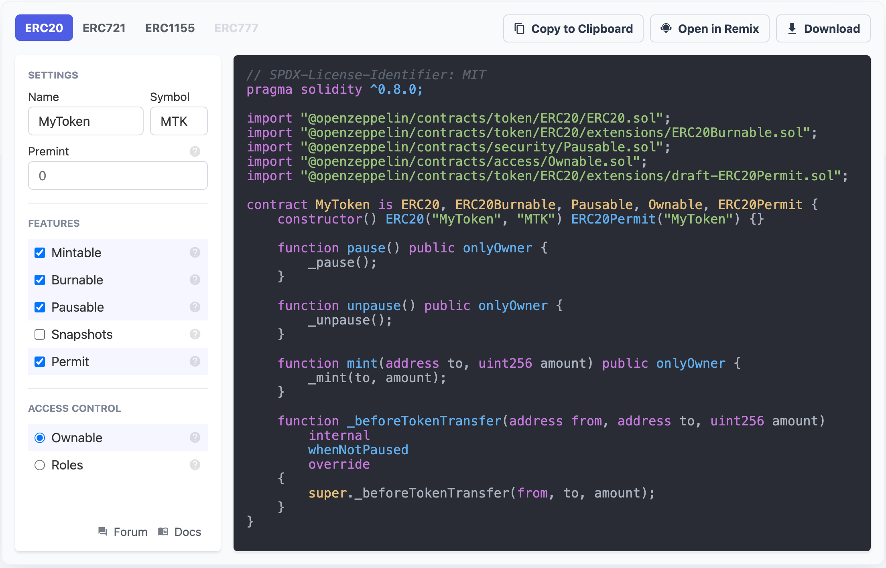

# OpenZeppelin

contracts: https://github.com/OpenZeppelin/openzeppelin-contracts

forum: https://forum.openzeppelin.com/

安装：`npm install @openzeppelin/contracts`

## Access Control

https://docs.openzeppelin.com/contracts/4.x/access-control

`AccessControl.sol ` 提供了一个通用的基于角色的访问控制（RBAC, Role Based Access Control）机制。 可以创建多个层次角色并将每个角色分配给多个帐户。

`Ownable.sol` 只支持单个所有者角色，且该角色只能分配给单一用户。

### Ownable

https://github.com/OpenZeppelin/openzeppelin-contracts/blob/master/contracts/access/Ownable.sol

```js
modifier onlyOwner()

function owner() public view virtual returns (address) // 返回当前 owner 地址
function renounceOwnership() public virtual onlyOwner // 将 owner 设置为 address(0)，即让合约没有 owner
function transferOwnership(address newOwner) public virtual onlyOwner // 转移 owner 给新地址
```

### AccessControl

https://github.com/OpenZeppelin/openzeppelin-contracts/blob/master/contracts/access/AccessControl.sol

```js
abstract contract AccessControl is Context, IAccessControl, ERC165 {
  struct RoleData {
    mapping(address => bool) members;
    bytes32 adminRole; // 该角色的管理角色，默认为空值0x00，即DEFAULT_ADMIN_ROLE
  }
  mapping(bytes32 => RoleData) private _roles;
  bytes32 public constant DEFAULT_ADMIN_ROLE = 0x00;

  modifier onlyRole(bytes32 role)

  function hasRole(bytes32 role, address account) public view returns (bool);
  function getRoleAdmin(bytes32 role) public view returns (bytes32);
  function grantRole(bytes32 role, address account) public virtual onlyRole(getRoleAdmin(role));
  function revokeRole(bytes32 role, address account) public virtual onlyRole(getRoleAdmin(role));
  function renounceRole(bytes32 role, address account) public virtual; // 撤销自己的角色

  function _setupRole(bytes32 role, address account) internal virtual
  function _setRoleAdmin(bytes32 role, bytes32 adminRole) internal virtual
  
  // 实现 ERC165 标准
  function supportsInterface(bytes4 interfaceId) public view virtual override returns (bool) {
    return interfaceId == type(IAccessControl).interfaceId || super.supportsInterface(interfaceId);
  }
}
```

```js
    modifier onlyRole(bytes32 role) {
        _checkRole(role, _msgSender());
        _;
    }
    function hasRole(bytes32 role, address account) public view override returns (bool) {
        return _roles[role].members[account];
    }
    function _checkRole(bytes32 role, address account) internal view {
        if (!hasRole(role, account)) {
          	// 连接字符串和数字转字符串
            revert(
                string(
                    abi.encodePacked(
                        "AccessControl: account ",
                        Strings.toHexString(uint160(account), 20),
                        " is missing role ",
                        Strings.toHexString(uint256(role), 32)
                    )
                )
            );
        }
    }
```


```js
pragma solidity ^0.8.0;

import "@openzeppelin/contracts/access/AccessControl.sol";
import "@openzeppelin/contracts/token/ERC20/ERC20.sol";

contract MyToken is ERC20, AccessControl {
    bytes32 public constant MINTER_ROLE = keccak256("MINTER_ROLE");
    bytes32 public constant BURNER_ROLE = keccak256("BURNER_ROLE");

    constructor(address minter, address burner) ERC20("MyToken", "TKN") {
        _setupRole(MINTER_ROLE, minter);
        _setupRole(BURNER_ROLE, burner);
    }

    function mint(address to, uint256 amount) public onlyRole(MINTER_ROLE) {
        _mint(to, amount);
    }

    function burn(address from, uint256 amount) public onlyRole(BURNER_ROLE) {
        _burn(from, amount);
    }
}
```

`AccessControl` includes a special role, called `DEFAULT_ADMIN_ROLE`, which acts as the **default admin role for all roles**. An account with this role will be able to manage any other role, unless `_setRoleAdmin` is used to select a new admin role.

```js
pragma solidity ^0.8.0;

import "@openzeppelin/contracts/access/AccessControl.sol";
import "@openzeppelin/contracts/token/ERC20/ERC20.sol";

contract MyToken is ERC20, AccessControl {
    bytes32 public constant MINTER_ROLE = keccak256("MINTER_ROLE");
    bytes32 public constant BURNER_ROLE = keccak256("BURNER_ROLE");

    constructor() ERC20("MyToken", "TKN") {
        // Grant the contract deployer the default admin role: it will be able
        // to grant and revoke any roles
        _setupRole(DEFAULT_ADMIN_ROLE, msg.sender);
    }

    function mint(address to, uint256 amount) public onlyRole(MINTER_ROLE) {
        _mint(to, amount);
    }

    function burn(address from, uint256 amount) public onlyRole(BURNER_ROLE) {
        _burn(from, amount);
    }
}
```

### AccessControlEnumerable

https://github.com/OpenZeppelin/openzeppelin-contracts/blob/master/contracts/access/AccessControlEnumerable.sol

```js
contract AccessControlEnumerable is AccessControl {
    using EnumerableSet for EnumerableSet.AddressSet;
    mapping(bytes32 => EnumerableSet.AddressSet) private _roleMembers;
  	function getRoleMember(bytes32 role, uint256 index) public view override returns (address)
  	function getRoleMemberCount(bytes32 role) public view override returns (uint256)
  
  	// 实现 ERC165 标准
    function supportsInterface(bytes4 interfaceId) public view virtual override returns (bool) {
      return interfaceId == type(IAccessControlEnumerable).interfaceId || super.supportsInterface(interfaceId);
    }
}
```

遍历角色

```js
const minterCount = await myToken.getRoleMemberCount(MINTER_ROLE);

const members = [];
for (let i = 0; i < minterCount; ++i) {
    members.push(await myToken.getRoleMember(MINTER_ROLE, i));
}
```

### TimelockController

https://github.com/OpenZeppelin/openzeppelin-contracts/blob/master/contracts/governance/TimelockController.sol

https://docs.openzeppelin.com/contracts/4.x/api/governance

```js
contract TimelockController is AccessControl {
    function hashOperation(
        address target,
        uint256 value,
        bytes calldata data,
        bytes32 predecessor,
        bytes32 salt
    ) public pure virtual returns (bytes32 hash) {
        return keccak256(abi.encode(target, value, data, predecessor, salt));
    }
    function schedule(
        address target,
        uint256 value,
        bytes calldata data,
        bytes32 predecessor,
        bytes32 salt,
        uint256 delay
    ) public virtual onlyRole(PROPOSER_ROLE) {
        bytes32 id = hashOperation(target, value, data, predecessor, salt);
        _schedule(id, delay);
        emit CallScheduled(id, 0, target, value, data, predecessor, delay);
    }
    function _schedule(bytes32 id, uint256 delay) private {
        require(!isOperation(id), "TimelockController: operation already scheduled");
        require(delay >= getMinDelay(), "TimelockController: insufficient delay");
        _timestamps[id] = block.timestamp + delay;
    }
    function execute(
        address target,
        uint256 value,
        bytes calldata data,
        bytes32 predecessor,
        bytes32 salt
    ) public payable virtual onlyRoleOrOpenRole(EXECUTOR_ROLE) {
        bytes32 id = hashOperation(target, value, data, predecessor, salt);
        _beforeCall(predecessor);
        _call(id, 0, target, value, data);
        _afterCall(id);
    }
    function _call(
        bytes32 id,
        uint256 index,
        address target,
        uint256 value,
        bytes calldata data
    ) private {
        (bool success, ) = target.call{value: value}(data);
        require(success, "TimelockController: underlying transaction reverted");
        emit CallExecuted(id, index, target, value, data);
    }
  	// Granting a role to `address(0)` is equivalent to enabling this role for everyone.
  	modifier onlyRoleOrOpenRole(bytes32 role) {
        if (!hasRole(role, address(0))) {
            _checkRole(role, _msgSender());
        }
        _;
    }
}
```

Operation structure

- **Target**, the address of the smart contract that the timelock should operate on.
- **Value**, in wei, that should be sent with the transaction. Most of the time this will be 0. Ether can be deposited before-end or passed along when executing the transaction.
- **Data**, containing the encoded function selector and parameters of the call. This can be produced using a number of tools. For example, a maintenance operation granting role `ROLE` to `ACCOUNT` can be encode using web3js as follows:

```javascript
const data = timelock.contract.methods.grantRole(ROLE, ACCOUNT).encodeABI()
```

- **Predecessor**, that specifies a dependency between operations. This dependency is optional. Use `bytes32(0)` if the operation does not have any dependency.
- **Salt**, used to disambiguate two otherwise identical operations. This can be any random value.

## Finance

### PaymentSplitter

```js
function release(address payable account) public virtual {
    require(_shares[account] > 0, "PaymentSplitter: account has no shares");

    uint256 totalReceived = address(this).balance + _totalReleased;
    uint256 payment = (totalReceived * _shares[account]) / _totalShares - _released[account];

    require(payment != 0, "PaymentSplitter: account is not due payment");

    _released[account] = _released[account] + payment;
    _totalReleased = _totalReleased + payment;

    Address.sendValue(account, payment);
    emit PaymentReleased(account, payment);
}
```

## metatx

## mocks

## Proxy

https://docs.openzeppelin.com/contracts/4.x/api/proxy

This is a low-level set of contracts implementing different proxy patterns with and without upgradeability. For an in-depth overview of this pattern check out the [Proxy Upgrade Pattern](https://docs.openzeppelin.com/upgrades-plugins/1.x/proxies) page.

Most of the proxies below are built on an abstract base contract.

- [`Proxy`](https://docs.openzeppelin.com/contracts/4.x/api/proxy#Proxy): Abstract contract implementing the core delegation functionality.

In order to avoid clashes with the storage variables of the implementation contract behind a proxy, we use [EIP1967](https://eips.ethereum.org/EIPS/eip-1967) storage slots.

- [`ERC1967Upgrade`](https://docs.openzeppelin.com/contracts/4.x/api/proxy#ERC1967Upgrade): Internal functions to get and set the storage slots defined in EIP1967.
- [`ERC1967Proxy`](https://docs.openzeppelin.com/contracts/4.x/api/proxy#ERC1967Proxy): A proxy using EIP1967 storage slots. Not upgradeable by default.

There are two alternative ways to add upgradeability to an ERC1967 proxy. Their differences are explained below in [Transparent vs UUPS Proxies](https://docs.openzeppelin.com/contracts/4.x/api/proxy#transparent-vs-uups).

- [`TransparentUpgradeableProxy`](https://docs.openzeppelin.com/contracts/4.x/api/proxy#TransparentUpgradeableProxy): A proxy with a built in admin and upgrade interface.
- [`UUPSUpgradeable`](https://docs.openzeppelin.com/contracts/4.x/api/proxy#UUPSUpgradeable): An upgradeability mechanism to be included in the implementation for an ERC1967 proxy.

A different family of proxies are beacon proxies. This pattern, popularized by Dharma, allows multiple proxies to be upgraded to a different implementation in a single transaction.

- [`BeaconProxy`](https://docs.openzeppelin.com/contracts/4.x/api/proxy#BeaconProxy): A proxy that retreives its implementation from a beacon contract.
- [`UpgradeableBeacon`](https://docs.openzeppelin.com/contracts/4.x/api/proxy#UpgradeableBeacon): A beacon contract that can be upgraded.

In this pattern, the proxy contract doesn’t hold the implementation address in storage like an ERC1967 proxy, instead the address is stored in a separate beacon contract. The `upgrade` operations that are sent to the beacon instead of to the proxy contract, and all proxies that follow that beacon are automatically upgraded.

Outside the realm of upgradeability, proxies can also be useful to make cheap contract clones, such as those created by an on-chain factory contract that creates many instances of the same contract. These instances are designed to be both cheap to deploy, and cheap to call.

- [`Clones`](https://docs.openzeppelin.com/contracts/4.x/api/proxy#Clones): A library that can deploy cheap minimal non-upgradeable proxies.

**Transparent vs UUPS Proxies**

UUPSProxy 将升级逻辑也迁移到具体逻辑合约（可以继承`UUPSUpgradeable`合约实现）。可以使用`ERC1967Proxy`实现UUPSProxy。

The original proxies included in OpenZeppelin followed the [Transparent Proxy Pattern](https://blog.openzeppelin.com/the-transparent-proxy-pattern/). While this pattern is still provided, our recommendation is now shifting towards UUPS proxies, which are both lightweight and versatile. The name UUPS comes from [EIP1822](https://eips.ethereum.org/EIPS/eip-1822), which first documented the pattern.

While both of these share the same interface for upgrades, in UUPS proxies the upgrade is handled by the implementation, and can eventually be removed. Transparent proxies, on the other hand, include the upgrade and admin logic in the proxy itself. This means [`TransparentUpgradeableProxy`](https://docs.openzeppelin.com/contracts/4.x/api/proxy#TransparentUpgradeableProxy) is more expensive to deploy than what is possible with UUPS proxies.

UUPS proxies are implemented using an [`ERC1967Proxy`](https://docs.openzeppelin.com/contracts/4.x/api/proxy#ERC1967Proxy). Note that this proxy is not by itself upgradeable. It is the role of the implementation to include, alongside the contract’s logic, all the code necessary to update the implementation’s address that is stored at a specific slot in the proxy’s storage space. This is where the [`UUPSUpgradeable`](https://docs.openzeppelin.com/contracts/4.x/api/proxy#UUPSUpgradeable) contract comes in. Inheriting from it (and overriding the [`_authorizeUpgrade`](https://docs.openzeppelin.com/contracts/4.x/api/proxy#UUPSUpgradeable-_authorizeUpgrade-address-) function with the relevant access control mechanism) will turn your contract into a UUPS compliant implementation.

### Proxy

```js
abstract contract Proxy {
    function _delegate(address implementation) internal virtual {
        assembly {
            // Copy msg.data
            calldatacopy(0, 0, calldatasize())
            // Call the implementation
            let result := delegatecall(gas(), implementation, 0, calldatasize(), 0, 0)
            // Copy the returned data.
            returndatacopy(0, 0, returndatasize())
            switch result
            // delegatecall returns 0 on error.
            case 0 {
                revert(0, returndatasize())
            }
            default {
                return(0, returndatasize())
            }
        }
    }
    function _implementation() internal view virtual returns (address);
    function _fallback() internal virtual {
        _beforeFallback();
        _delegate(_implementation());
    }
    fallback() external payable virtual {
        _fallback();
    }
    receive() external payable virtual {
        _fallback();
    }
    function _beforeFallback() internal virtual {}
}
```

### ERC1967

#### ERC1967Proxy

```js
contract ERC1967Proxy is Proxy, ERC1967Upgrade {
    /**
     * @dev Initializes the upgradeable proxy with an initial implementation specified by `_logic`.
     * If `_data` is nonempty, it's used as data in a delegate call to `_logic`. This will typically be an encoded function call, and allows initializating the storage of the proxy like a Solidity constructor.
     */
    constructor(address _logic, bytes memory _data) payable {
        assert(_IMPLEMENTATION_SLOT == bytes32(uint256(keccak256("eip1967.proxy.implementation")) - 1));
        _upgradeToAndCall(_logic, _data, false);
    }
    function _implementation() internal view virtual override returns (address impl) {
        return ERC1967Upgrade._getImplementation();
    }
}
```

#### ERC1967Upgrade

按 EIP1967 标准，定义各属性的存储slot及相关操作方法。

```js
bytes32 internal constant _IMPLEMENTATION_SLOT = 0x360894a13ba1a3210667c828492db98dca3e2076cc3735a920a3ca505d382bbc;
bytes32 internal constant _ADMIN_SLOT = 0xb53127684a568b3173ae13b9f8a6016e243e63b6e8ee1178d6a717850b5d6103;
bytes32 internal constant _BEACON_SLOT = 0xa3f0ad74e5423aebfd80d3ef4346578335a9a72aeaee59ff6cb3582b35133d50;
_upgradeTo、_upgradeToAndCall、_upgradeToAndCallSecure、_upgradeBeaconToAndCall、_changeAdmin
```

### Transparent Proxy

#### TransparentUpgradeableProxy

```js
contract TransparentUpgradeableProxy is ERC1967Proxy {
    modifier ifAdmin() {
        if (msg.sender == _getAdmin()) {
            _;
        } else {
            _fallback();
        }
    }
    function _beforeFallback() internal virtual override {
        require(msg.sender != _getAdmin(), "TransparentUpgradeableProxy: admin cannot fallback to proxy target");
        super._beforeFallback();
    }
}
```

#### ProxyAdmin

TransparentUpgradeableProxy的admin只能调用管理方法，而无法被转发到具体合约。ProxyAdmin只包含调用TransparentUpgradeableProxy合约中管理方法的相应方法。所以可以将该合约设置为TransparentUpgradeableProxy的admin，可以避免造成不必要的混淆。

### Beacon

#### BeaconProxy

将具体实现的地址及修改方法放在另一个Becon合约中，调用Becon合约的implementation方法获取。

#### IBeacon

```js
function implementation() external view returns (address);
```

#### UpgradeableBeacon

```js
function upgradeTo(address newImplementation) public virtual onlyOwner
```

### Utils

#### Initializable

```js
abstract contract Initializable {
    /**
     * @dev Indicates that the contract has been initialized.
     */
    bool private _initialized;

    /**
     * @dev Indicates that the contract is in the process of being initialized.
     */
    bool private _initializing;

    /**
     * @dev Modifier to protect an initializer function from being invoked twice.
     */
    modifier initializer() {
        require(_initializing || !_initialized, "Initializable: contract is already initialized");

        bool isTopLevelCall = !_initializing;
        if (isTopLevelCall) {
            _initializing = true;
            _initialized = true;
        }

        _;

        if (isTopLevelCall) {
            _initializing = false;
        }
    }
}
```

#### UUPSUpgradeable

用于支持UUPS Proxy模式。

[UUPS Proxies: Tutorial (Solidity + JavaScript)](https://forum.openzeppelin.com/t/uups-proxies-tutorial-solidity-javascript/7786)

### Clones [EIP-1167]

https://eips.ethereum.org/EIPS/eip-1167[EIP 1167] is a standard for deploying minimal proxy contracts 最小代理合约, also known as "clones". To simply and cheaply clone contract functionality in an immutable way, this standard specifies a minimal bytecode implementation that delegates all calls to a known, fixed address.

> https://blog.openzeppelin.com/workshop-recap-cheap-contract-deployment-through-clones/
>
> Clones (minimal proxies) as described in [ERC1167](https://eips.ethereum.org/EIPS/eip-1167), are very small, and cheap to deploy, smart-contracts that delegate all incoming calls to an implementation (template) contract containing the functionality. The address of this implementation contract is stored directly in the contract code, so no `sload` is required.
>
> Using clones, significant gas savings can be made for deployments when more than one of a family of smart contracts will be deployed over time e.g. multiple ERC20, Uniswap pairs or smart contract wallets.

```js
library Clones {
  function clone(address implementation) internal returns (address instance) {
    assembly {
      let ptr := mload(0x40)
      mstore(ptr, 0x3d602d80600a3d3981f3363d3d373d3d3d363d73000000000000000000000000)
      mstore(add(ptr, 0x14), shl(0x60, implementation))
      mstore(add(ptr, 0x28), 0x5af43d82803e903d91602b57fd5bf30000000000000000000000000000000000)
      instance := create(0, ptr, 0x37)
    }
    require(instance != address(0), "ERC1167: create failed");
  }
  function cloneDeterministic(address implementation, bytes32 salt) internal returns (address instance) {
    assembly {
      let ptr := mload(0x40)
      mstore(ptr, 0x3d602d80600a3d3981f3363d3d373d3d3d363d73000000000000000000000000)
      mstore(add(ptr, 0x14), shl(0x60, implementation))
      mstore(add(ptr, 0x28), 0x5af43d82803e903d91602b57fd5bf30000000000000000000000000000000000)
      instance := create2(0, ptr, 0x37, salt)
    }
    require(instance != address(0), "ERC1167: create2 failed");
  }
  function predictDeterministicAddress(address implementation, bytes32 salt, address deployer
    ) internal pure returns (address predicted)
  function predictDeterministicAddress(address implementation, bytes32 salt)
  	internal view returns (address predicted)
}
```

https://blog.openzeppelin.com/deep-dive-into-the-minimal-proxy-contract/

## Security

### Pausable

```js
abstract contract Pausable is Context {
  function paused() public view virtual returns (bool)
  modifier whenNotPaused()
  modifier whenPaused()
  function _pause() internal virtual whenNotPaused
  function _unpause() internal virtual whenPaused
}
```

### ReentrancyGuard

```js
abstract contract ReentrancyGuard {
    // Booleans are more expensive than uint256 or any type that takes up a full
    // word because each write operation emits an extra SLOAD to first read the
    // slot's contents, replace the bits taken up by the boolean, and then write
    // back. This is the compiler's defense against contract upgrades and
    // pointer aliasing, and it cannot be disabled.

    // The values being non-zero value makes deployment a bit more expensive,
    // but in exchange the refund on every call to nonReentrant will be lower in
    // amount. Since refunds are capped to a percentage of the total
    // transaction's gas, it is best to keep them low in cases like this one, to
    // increase the likelihood of the full refund coming into effect.
    uint256 private constant _NOT_ENTERED = 1;
    uint256 private constant _ENTERED = 2;

    uint256 private _status;

    constructor() {
        _status = _NOT_ENTERED;
    }

    /**
     * @dev Prevents a contract from calling itself, directly or indirectly.
     * Calling a `nonReentrant` function from another `nonReentrant`
     * function is not supported. It is possible to prevent this from happening
     * by making the `nonReentrant` function external, and make it call a
     * `private` function that does the actual work.
     */
    modifier nonReentrant() {
        // On the first call to nonReentrant, _notEntered will be true
        require(_status != _ENTERED, "ReentrancyGuard: reentrant call");

        // Any calls to nonReentrant after this point will fail
        _status = _ENTERED;

        _;

        // By storing the original value once again, a refund is triggered (see
        // https://eips.ethereum.org/EIPS/eip-2200)
        _status = _NOT_ENTERED;
    }
}
```

### PullPayment

https://consensys.github.io/smart-contract-best-practices/recommendations/#favor-pull-over-push-for-external-calls

Favor pull over push for external calls

it is better to let users withdraw funds rather than push funds to them automatically.

https://blog.openzeppelin.com/reentrancy-after-istanbul/

## Tokens

Contracts Wizard https://wizard.openzeppelin.com/ 提供界面生成所需要的token合约



### ERC20

https://learnblockchain.cn/docs/eips/eip-20.html

> 向量攻击， 假如 Alice 开始时给Bob授权了 N, 现在 Alice 想调整为 M ，于是发起了一笔调整授权的交易，这时Bob观察到了这笔交易， 迅速通过 transferFrom 交易（用更高的手续费，矿工优先打包）把 N 个币转移走，待 Alice 调整授权的交易打包后，Bob 又获得了 M 个授权。 这就相当于Bob 获得了 N + M个授权， 而不是 Alice 想要的 M个授权。

可以使用 openzeppelin ERC20合约中的 increaseAllowance/decreaseAllowance来解决该问题。

```js
interface IERC20 {
  function transfer(address recipient, uint256 amount) external returns (bool);
  function approve(address spender, uint256 amount) external returns (bool);
  function transferFrom(address sender, address recipient, uint256 amount) external returns (bool);
}
```

**由接口可以看出，以上方法可以使用返回值来表示执行成功还是失败，所以最好还是用SafeERC20的safeXXX方法来代替。**

```js
contract ERC20 is Context, IERC20, IERC20Metadata {
		// Hook that is called before any transfer of tokens. This includes minting and burning.
    function _beforeTokenTransfer(
        address from,
        address to,
        uint256 amount
    ) internal virtual {}
}
```

```js
pragma solidity ^0.8.0;

import "@openzeppelin/contracts/token/ERC20/ERC20.sol";

contract GLDToken is ERC20 {
    constructor(uint256 initialSupply) ERC20("Gold", "GLD") {
        _mint(msg.sender, initialSupply);
    }
}
```

https://docs.openzeppelin.com/contracts/4.x/erc20

It is important to understand that `decimals` is *only used for display purposes*. All arithmetic inside the contract is still performed on integers, and it is the different user interfaces (wallets, exchanges, etc.) that must adjust the displayed values according to `decimals`. 

https://docs.soliditylang.org/en/v0.8.0/control-structures.html#checked-or-unchecked-arithmetic

Since Solidity 0.8.0, all arithmetic operations revert on over- and underflow by default, thus making the use of these libraries unnecessary.

To obtain the previous behaviour, an `unchecked` block can be used:

```js
// SPDX-License-Identifier: GPL-3.0
pragma solidity >0.7.99;
contract C {
    function f(uint a, uint b) pure public returns (uint) {
        // This addition will wrap on underflow.
        unchecked { return a - b; }
    }
    function g(uint a, uint b) pure public returns (uint) {
        // This addition will revert on underflow.
        return a - b;
    }
}
```

#### Extensions

- `ERC20Burnable`

  - `function burn(uint256 amount) public virtual`
  - `function burnFrom(address account, uint256 amount) public virtual`

- `ERC20Capped` 设置 totalSupply 上限

- `ERC20Pausable` 可暂停 transfer，mint 和 burn

  - ```js
    abstract contract ERC20Pausable is ERC20, Pausable {
        function _beforeTokenTransfer(
            address from,
            address to,
            uint256 amount
        ) internal virtual override {
            super._beforeTokenTransfer(from, to, amount);
            require(!paused(), "ERC20Pausable: token transfer while paused");
        }
    }
    ```

- `ERC20Permit` EIP-2612, allowing approvals to be made via signatures, the token holder account doesn't need to send a transaction

  - ```js
    using Counters for Counters.Counter;
    mapping(address => Counters.Counter) private _nonces;
    bytes32 private immutable _PERMIT_TYPEHASH = keccak256("Permit(address owner,address spender,uint256 value,uint256 nonce,uint256 deadline)");
    function permit(address owner, address spender, uint256 value, uint256 deadline, uint8 v, bytes32 r, bytes32 s) public virtual override {
      require(block.timestamp <= deadline, "ERC20Permit: expired deadline");
      bytes32 structHash = keccak256(abi.encode(_PERMIT_TYPEHASH, owner, spender, value, _useNonce(owner), deadline));
      // keccak256(abi.encodePacked("\x19\x01", domainSeparator, structHash))
      bytes32 hash = _hashTypedDataV4(structHash);
      address signer = ECDSA.recover(hash, v, r, s);
      require(signer == owner, "ERC20Permit: invalid signature");
      _approve(owner, spender, value);
    }
    function nonces(address owner) public view virtual override returns (uint256) {
      return _nonces[owner].current();
    }
    function DOMAIN_SEPARATOR() external view override returns (bytes32) {
      return _domainSeparatorV4();
    }
    function _useNonce(address owner) internal virtual returns (uint256 current) {
      Counters.Counter storage nonce = _nonces[owner];
      current = nonce.current();
      nonce.increment();
    }
    ```

- `ERC20FlashMint`
  - [以太坊EIP-3156简明教程【FlashLoan】](http://blog.hubwiz.com/2021/05/25/eip-3156-intro/)
  - [EIP-3156: Flash Loans](https://eips.ethereum.org/EIPS/eip-3156)
    - 闪贷允许智能合约在不需要抵押的情况下借出一定数量的代币，条件是它们必须在同一笔交易中归还。

- `ERC20Snapshot`
  - 用处：记录某一时刻的账户余额和totalSupply
  - 重写`_beforeTokenTransfer`，在mint、burn、transfer之前记录账户余额和totalSupply
  - `function balanceOfAt(address account, uint256 snapshotId) public view virtual returns (uint256)`
  - `function totalSupplyAt(uint256 snapshotId) public view virtual returns (uint256)`
  - 比如可以重写`_getCurrentSnapshotId()`返回`block.number`实现对每个区块snapshot，当然这样做会导致gas消耗越来越大。
  - `function _snapshot() internal virtual returns (uint256)` 可以利用合理的权限控制暴露`_snapshot()`方法，调用该方法开启下一个snapshot。
  - https://github.com/Giveth/minime
    - 有交易时，对每个区块snapshot
    - 提供fork功能

- `ERC20Votes`

  - 支持像Compound那样的投票和委托。代币最大供应量为`2^224 - 1`，比Compound的`2^96 - 1`更高。

  - 记录每个账户的历史vote power变化。通过`_beforeTokenTransfer`勾子实现。

  - 默认情况下，账户余额不等同于vote power，这样做可以降低transfer的手续费。可以通过delegate给自己来记录自己的vote power变化。

  - ```js
    abstract contract ERC20Votes is ERC20Permit {
      struct Checkpoint {
        uint32 fromBlock;
        uint224 votes;
      }
      mapping(address => Checkpoint[]) private _checkpoints;
      function delegate(address delegatee) public virtual {
        return _delegate(_msgSender(), delegatee);
      }
      function getVotes(address account) public view returns (uint256)
      function getPastVotes(address account, uint256 blockNumber) public view returns (uint256)
      function _beforeTokenTransfer(address from, address to, uint256 amount) internal virtual override {
        _moveVotingPower(delegates(from), delegates(to), amount);
      }
      function _delegate(address delegator, address delegatee) internal virtual {
        address currentDelegate = delegates(delegator);
        uint256 delegatorBalance = balanceOf(delegator);
        _delegates[delegator] = delegatee;
        emit DelegateChanged(delegator, currentDelegate, delegatee);
        _moveVotingPower(currentDelegate, delegatee, delegatorBalance);
      }
      function _moveVotingPower(address src, address dst, uint256 amount) private {
        if (src != dst && amount > 0) {
          if (src != address(0)) {
            (uint256 oldWeight, uint256 newWeight) = _writeCheckpoint(_checkpoints[src], _subtract, amount);
            emit DelegateVotesChanged(src, oldWeight, newWeight);
          }
          if (dst != address(0)) {
            (uint256 oldWeight, uint256 newWeight) = _writeCheckpoint(_checkpoints[dst], _add, amount);
            emit DelegateVotesChanged(dst, oldWeight, newWeight);
          }
        }
      }
      // solidity 支持函数作为参数
      function _writeCheckpoint(Checkpoint[] storage ckpts,
        function(uint256, uint256) view returns (uint256) op,
        uint256 delta) private returns (uint256 oldWeight, uint256 newWeight) {
          uint256 pos = ckpts.length;
          oldWeight = pos == 0 ? 0 : ckpts[pos - 1].votes;
          newWeight = op(oldWeight, delta);
          if (pos > 0 && ckpts[pos - 1].fromBlock == block.number) {
            ckpts[pos - 1].votes = SafeCast.toUint224(newWeight);
          } else {
            ckpts.push(Checkpoint({fromBlock: SafeCast.toUint32(block.number), votes: SafeCast.toUint224(newWeight)}));
          }
        }
      function _add(uint256 a, uint256 b) private pure returns (uint256) {
        return a + b;
      }
      function _subtract(uint256 a, uint256 b) private pure returns (uint256) {
        return a - b;
      }
    }
    ```

    

#### Presets

- ERC20PresetMinterPauser

  - ```js
    contract ERC20PresetMinterPauser is Context, AccessControlEnumerable, ERC20Burnable, ERC20Pausable {
    	function _beforeTokenTransfer(
       address from,
       address to,
       uint256 amount
      ) internal virtual override(ERC20, ERC20Pausable) {
        super._beforeTokenTransfer(from, to, amount);
      }
    }
    ```

- ERC20PresetFixedSupply

  - ```js
    contract ERC20PresetFixedSupply is ERC20Burnable {
    	constructor(
        string memory name,
        string memory symbol,
        uint256 initialSupply,
        address owner
      ) ERC20(name, symbol) {
      	_mint(owner, initialSupply);
      }
    }
    ```

    

#### SafeERC20

用法：`using SafeERC20 for IERC20;`

```js
 /* @dev Wrappers around ERC20 operations that throw on failure (when the token
 * contract returns false). Tokens that return no value (and instead revert or
 * throw on failure) are also supported, non-reverting calls are assumed to be
 * successful.
 */
library SafeERC20 {
    using Address for address;

    function safeTransfer(IERC20 token, address to, uint256 value) internal {
        _callOptionalReturn(token, abi.encodeWithSelector(token.transfer.selector, to, value));
    }
    function safeTransferFrom(IERC20 token, address from, address to, uint256 value) internal
    function safeApprove(IERC20 token, address spender, uint256 value) internal
    function _callOptionalReturn(IERC20 token, bytes memory data) private {
        bytes memory returndata = address(token).functionCall(data, "SafeERC20: low-level call failed");
        if (returndata.length > 0) {
            // Return data is optional
            require(abi.decode(returndata, (bool)), "SafeERC20: ERC20 operation did not succeed");
        }
    }
}
```

### ERC721

NFT, non-fungible tokens

https://docs.openzeppelin.com/contracts/4.x/erc721

```js
pragma solidity ^0.8.0;

import "@openzeppelin/contracts/token/ERC721/ERC721.sol";
import "@openzeppelin/contracts/token/ERC721/extensions/ERC721URIStorage.sol";
import "@openzeppelin/contracts/utils/Counters.sol";

contract GameItem is ERC721URIStorage {
    using Counters for Counters.Counter;
    Counters.Counter private _tokenIds;

    constructor() ERC721("GameItem", "ITM") {}

    function awardItem(address player, string memory tokenURI)
        public
        returns (uint256)
    {
        _tokenIds.increment();

        uint256 newItemId = _tokenIds.current();
        _mint(player, newItemId);
        _setTokenURI(newItemId, tokenURI);

        return newItemId;
    }
}
```

```sh
> gameItem.awardItem(playerAddress, "https://game.example/item-id-8u5h2m.json")
Transaction successful. Transaction hash: 0x...
Events emitted:
 - Transfer(0x0000000000000000000000000000000000000000, playerAddress, 7)
> gameItem.ownerOf(7)
playerAddress
> gameItem.tokenURI(7)
"https://game.example/item-id-8u5h2m.json"

{
    "name": "Thor's hammer",
    "description": "Mjölnir, the legendary hammer of the Norse god of thunder.",
    "image": "https://game.example/item-id-8u5h2m.png",
    "strength": 20
}
```

https://learnblockchain.cn/docs/eips/eip-721.html

ERC-721 标准有两个转移函数`safeTransferFrom` (重载了带 data 和不带 data 参数 二种函数形式) 及 `transferFrom`，转移可由一下角色发起：

- NFT的所有者
- NFT的被授权（approved）地址
- NFT当前所有者授权的（authorized）操作员

`safeTransferFrom`需要接收者是EOA账户或者实现了`IERC721Receiver`接口的合约。

```js
function _checkOnERC721Received(
 address from,
 address to,
 uint256 tokenId,
 bytes memory _data
) private returns (bool) {
  if (to.isContract()) {
    try IERC721Receiver(to).onERC721Received(_msgSender(), from, tokenId, _data) returns (bytes4 retval) {
      return retval == IERC721Receiver(to).onERC721Received.selector;
    } catch (bytes memory reason) {
      if (reason.length == 0) {
        revert("ERC721: transfer to non ERC721Receiver implementer");
      } else {
        assembly {
          revert(add(32, reason), mload(reason))
        }
      }
    }
  } else {
    return true;
  }
}

function supportsInterface(bytes4 interfaceId) public view virtual override(ERC165, IERC165) returns (bool) {
  return
  interfaceId == type(IERC721).interfaceId ||
    interfaceId == type(IERC721Metadata).interfaceId ||
    super.supportsInterface(interfaceId);
}
```

#### Extensions

- ERC721Enumerable 支持按index枚举每个账户的token和所有的token

  - `function totalSupply() external view returns (uint256);`

  - `function tokenOfOwnerByIndex(address owner, uint256 index) external view returns (uint256 tokenId);`

  - `function tokenByIndex(uint256 index) external view returns (uint256);`

  - ```js
    function supportsInterface(bytes4 interfaceId) public view virtual override(IERC165, ERC721) returns (bool) {
      return interfaceId == type(IERC721Enumerable).interfaceId || super.supportsInterface(interfaceId);
    }
    ```

- ERC721Pausable

- ERC721Burnable

- ERC721URIStorage

  - `function _setTokenURI(uint256 tokenId, string memory _tokenURI) internal virtual`

#### Presets

- ERC721PresetMinterPauserAutoId

  - ```js
    contract ERC721PresetMinterPauserAutoId is
        Context, AccessControlEnumerable, ERC721Enumerable, ERC721Burnable, ERC721Pausable
    {
      function supportsInterface(bytes4 interfaceId)
      public view virtual override(AccessControlEnumerable, ERC721, ERC721Enumerable)
      returns (bool)
      {
        return super.supportsInterface(interfaceId);
      }
    }
    ```

#### ERC721Holder

实现`IERC721Receiver`接口，必须返回`IERC721.onERC721Received.selector`

```js
contract ERC721Holder is IERC721Receiver {
    /**
     * Always returns `IERC721Receiver.onERC721Received.selector`.
     */
    function onERC721Received(address, address, uint256, bytes memory
    ) public virtual override returns (bytes4) {
        return this.onERC721Received.selector;
    }
}
```

### ERC777

https://docs.openzeppelin.com/contracts/4.x/erc777

```js
pragma solidity ^0.8.0;

import "@openzeppelin/contracts/token/ERC777/ERC777.sol";

contract GLDToken is ERC777 {
    constructor(uint256 initialSupply, address[] memory defaultOperators)
        ERC777("Gold", "GLD", defaultOperators)
    {
        _mint(msg.sender, initialSupply, "", "");
    }
}
```

https://learnblockchain.cn/docs/eips/eip-777.html

ERC777 与[ERC20](https://learnblockchain.cn/docs/eips/eip-20.html)的向后兼容， 同时也定义了一些更高级的方法和代币进行交互。

如：*操作员（operators）* 可以代表另一个地址（合约或普通账户）发送代币， 以及 send/receive 加入了钩子函数（*hooks* ）让代币持有者可以有更多的控制。

ERC777 同样采用了 [ERC1820](https://learnblockchain.cn/docs/eips/eip-1820.html) 标准的优点，判断接受代币的地址是合约还是普通地址，并且判断合约是否兼容ERC777协议。

标准尝试改进大家常用的 [ERC20](https://learnblockchain.cn/docs/eips/eip-20.html) 代币标准。 ERC777标准的主要优点有：

1. 使用和发送以太相同的理念发送token，方法为：`send(dest, value, data)`.
2. 合约和普通地址都可以通过注册`tokensToSend` hook函数来控制和拒绝发送哪些token（拒绝发送通过在hook函数`tokensToSend` 里 `revert` 来实现）。
3. 合约和普通地址都可以通过注册`tokensReceived` hook函数来控制和拒绝接受哪些token（拒绝接受通过在hook函数`tokensReceived` 里 `revert` 来实现）。
4. `tokensReceived` 可以通过hook函数可以做到在一个交易里完成发送代币和通知合约接受代币，而不像 [ERC20](https://learnblockchain.cn/docs/eips/eip-20.html) 必须通过两次调用（`approve`/`transferFrom`）来完成。
5. 持有者可以"授权"和"撤销"操作员（operators: 可以代表持有者发送代币）。 这些操作员通常是（去中心化）交易所、支票处理机或自动支付系统。
6. 每个代币交易都包含 `data` 和 `operatorData` 字段， 可以分别传递来自持有者和操作员的数据。
7. 可以通过部署实现 `tokensReceived` 的代理合约来兼容没有实现`tokensReceived` 函数的地址。

```js
function _callTokensToSend(
 address operator,
 address from,
 address to,
 uint256 amount,
 bytes memory userData,
 bytes memory operatorData
) private {
  address implementer = _ERC1820_REGISTRY.getInterfaceImplementer(from, _TOKENS_SENDER_INTERFACE_HASH);
  if (implementer != address(0)) {
    IERC777Sender(implementer).tokensToSend(operator, from, to, amount, userData, operatorData);
  }
}
function _callTokensReceived(
 address operator,
 address from,
 address to,
 uint256 amount,
 bytes memory userData,
 bytes memory operatorData,
 bool requireReceptionAck
) private {
  address implementer = _ERC1820_REGISTRY.getInterfaceImplementer(to, _TOKENS_RECIPIENT_INTERFACE_HASH);
  if (implementer != address(0)) {
    IERC777Recipient(implementer).tokensReceived(operator, from, to, amount, userData, operatorData);
  } else if (requireReceptionAck) {
    require(!to.isContract(), "ERC777: token recipient contract has no implementer for ERC777TokensRecipient");
  }
}
```

ERC777向下兼容并增强ERC20，增加发送前和接收后可以调用外部合约，但是依赖ERC1820伪自省注册表合约，推广不易。

### ERC1155

多代币标准，一个合约支持多种代币，并实现相应的批量操作。同时为了防止代币被误锁定，接收者如果是合约，则需要实现`IERC1155Receiver`接口。

```js
// Mapping from token ID to account balances
mapping(uint256 => mapping(address => uint256)) private _balances;
```

https://docs.openzeppelin.com/contracts/4.x/erc1155

```js
pragma solidity ^0.8.0;

import "@openzeppelin/contracts/token/ERC1155/ERC1155.sol";

contract GameItems is ERC1155 {
    uint256 public constant GOLD = 0;
    uint256 public constant SILVER = 1;
    uint256 public constant THORS_HAMMER = 2;
    uint256 public constant SWORD = 3;
    uint256 public constant SHIELD = 4;

    constructor() ERC1155("https://game.example/api/item/{id}.json") {
        _mint(msg.sender, GOLD, 10**18, "");
        _mint(msg.sender, SILVER, 10**27, "");
        _mint(msg.sender, THORS_HAMMER, 1, "");
        _mint(msg.sender, SWORD, 10**9, "");
        _mint(msg.sender, SHIELD, 10**9, "");
    }
}
```

Note that for our Game Items, Gold is a fungible token whilst Thor’s Hammer is a non-fungible token as we minted only one.

The `uri` can include the string `{id}` which clients must replace with the actual token ID, in lowercase hexadecimal (with no 0x prefix) and leading zero padded to 64 hex characters.

For token ID `2` and uri `https://game.example/api/item/{id}.json` clients would replace `{id}` with `0000000000000000000000000000000000000000000000000000000000000002` to retrieve JSON at `https://game.example/api/item/0000000000000000000000000000000000000000000000000000000000000002.json`.

The JSON document for token ID 2 might look something like:

```json
{
    "name": "Thor's hammer",
    "description": "Mjölnir, the legendary hammer of the Norse god of thunder.",
    "image": "https://game.example/item-id-8u5h2m.png",
    "strength": 20
}
```

## Utils

https://docs.openzeppelin.com/contracts/4.x/utilities

### Address

https://github.com/OpenZeppelin/openzeppelin-contracts/blob/master/contracts/utils/Address.sol

```js
library Address {
  	/*  `isContract` will return false for the following types of addresses:
     *  - an externally-owned account 普通账户
     *  - a contract in construction 构造函数中调用
     *  - an address where a contract will be created 是合约地址，但尚未创建
     *  - an address where a contract lived, but was destroyed 已销毁的合约
     */
    function isContract(address account) internal view returns (bool) {
        // This method relies on extcodesize, which returns 0 for contracts in
        // construction, since the code is only stored at the end of the
        // constructor execution.
        uint256 size;
        assembly {
            size := extcodesize(account)
        }
        return size > 0;
    }
  	/**
     * @dev Replacement for Solidity's `transfer`: sends `amount` wei to
     * `recipient`, forwarding all available gas and reverting on errors.
     *
     * https://eips.ethereum.org/EIPS/eip-1884[EIP1884] increases the gas cost
     * of certain opcodes, possibly making contracts go over the 2300 gas limit
     * imposed by `transfer`, making them unable to receive funds via
     * `transfer`. {sendValue} removes this limitation.
     *
     * https://diligence.consensys.net/posts/2019/09/stop-using-soliditys-transfer-now/[Learn more].
     *
     * IMPORTANT: because control is transferred to `recipient`, care must be
     * taken to not create reentrancy vulnerabilities. Consider using
     * {ReentrancyGuard} or the
     * https://solidity.readthedocs.io/en/v0.5.11/security-considerations.html#use-the-checks-effects-interactions-pattern[checks-effects-interactions pattern].
     */
		function sendValue(address payable recipient, uint256 amount) internal {
        require(address(this).balance >= amount, "Address: insufficient balance");
        (bool success, ) = recipient.call{value: amount}("");
        require(success, "Address: unable to send value, recipient may have reverted");
    }
  	function functionCall(address target, bytes memory data) internal returns (bytes memory)
  	function functionCall(address target, bytes memory data, string memory errorMessage) internal returns (bytes memory)
  	function functionCallWithValue(address target, bytes memory data, uint256 value) internal returns (bytes memory)
  	function functionCallWithValue(address target, bytes memory data, uint256 value, string memory errorMessage) internal returns (bytes memory) {
        require(address(this).balance >= value, "Address: insufficient balance for call");
        require(isContract(target), "Address: call to non-contract");
        (bool success, bytes memory returndata) = target.call{value: value}(data);
        return _verifyCallResult(success, returndata, errorMessage);
    }
    function functionStaticCall(address target, bytes memory data) internal view returns (bytes memory)
    function functionStaticCall(
        address target,
        bytes memory data,
        string memory errorMessage
    ) internal view returns (bytes memory) {
        require(isContract(target), "Address: static call to non-contract");
        (bool success, bytes memory returndata) = target.staticcall(data);
        return _verifyCallResult(success, returndata, errorMessage);
    }
    function functionDelegateCall(address target, bytes memory data) internal returns (bytes memory)
    function functionDelegateCall(
        address target,
        bytes memory data,
        string memory errorMessage
    ) internal returns (bytes memory) {
        require(isContract(target), "Address: delegate call to non-contract");

        (bool success, bytes memory returndata) = target.delegatecall(data);
        return _verifyCallResult(success, returndata, errorMessage);
    }
    function _verifyCallResult(
        bool success,
        bytes memory returndata,
        string memory errorMessage
    ) private pure returns (bytes memory) {
        if (success) {
            return returndata;
        } else {
            // Look for revert reason and bubble it up if present
            if (returndata.length > 0) {
                // The easiest way to bubble the revert reason is using memory via assembly
                assembly {
                    let returndata_size := mload(returndata)
                    revert(add(32, returndata), returndata_size)
                }
            } else {
                revert(errorMessage);
            }
        }
    }
}
```

### Arrays

```js
library Arrays {
  // 二分查找法从有序数组中查找大于等于指定元素的索引
  function findUpperBound(uint256[] storage array, uint256 element) internal view returns (uint256)
}
```

### Strings

```js
library Strings {
    function toString(uint256 value) internal pure returns (string memory)
    function toHexString(uint256 value) internal pure returns (string memory)
}
```

### Counters

用法：`using Counters for Counters.Counter;`

```
library Counters {
    struct Counter {
        uint256 _value; // default: 0
    }
    function current、increment、decrement、reset
}
```

### Create2

```js
// https://eips.ethereum.org/EIPS/eip-1014
library Create2 {
    /**
     * @dev Deploys a contract using `CREATE2`. The address where the contract
     * will be deployed can be known in advance via {computeAddress}.
     *
     * The bytecode for a contract can be obtained from Solidity with
     * `type(contractName).creationCode`.
     *
     * Requirements:
     *
     * - `bytecode` must not be empty.
     * - `salt` must have not been used for `bytecode` already.
     * - the factory must have a balance of at least `amount`.
     * - if `amount` is non-zero, `bytecode` must have a `payable` constructor.
     */
    function deploy(
        uint256 amount,
        bytes32 salt,
        bytes memory bytecode
    ) internal returns (address) {
        address addr;
        require(address(this).balance >= amount, "Create2: insufficient balance");
        require(bytecode.length != 0, "Create2: bytecode length is zero");
        assembly {
            addr := create2(amount, add(bytecode, 0x20), mload(bytecode), salt)
        }
        require(addr != address(0), "Create2: Failed on deploy");
        return addr;
    }

    /**
     * @dev Returns the address where a contract will be stored if deployed via {deploy}. Any change in the
     * `bytecodeHash` or `salt` will result in a new destination address.
     */
    function computeAddress(bytes32 salt, bytes32 bytecodeHash) internal view returns (address) {
        return computeAddress(salt, bytecodeHash, address(this));
    }

    /**
     * @dev Returns the address where a contract will be stored if deployed via {deploy} from a contract located at
     * `deployer`. If `deployer` is this contract's address, returns the same value as {computeAddress}.
     */
    function computeAddress(
        bytes32 salt,
        bytes32 bytecodeHash,
        address deployer
    ) internal pure returns (address) {
        bytes32 _data = keccak256(abi.encodePacked(bytes1(0xff), deployer, salt, bytecodeHash));
        return address(uint160(uint256(_data)));
    }
}
```

### Multicall

```js
pragma solidity ^0.8.0;

import "./Address.sol";

/**
 * @dev Provides a function to batch together multiple calls in a single external call.
 *
 * _Available since v4.1._
 */
abstract contract Multicall {
    /**
     * @dev Receives and executes a batch of function calls on this contract.
     */
    function multicall(bytes[] calldata data) external returns (bytes[] memory results) {
        results = new bytes[](data.length);
        for (uint256 i = 0; i < data.length; i++) {
            results[i] = Address.functionDelegateCall(address(this), data[i]);
        }
        return results;
    }
}
```

用法：

```js
pragma solidity ^0.8.0;

import "@openzeppelin/contracts/utils/Multicall.sol";

contract Box is Multicall {
    function foo() public {
        ...
    }

    function bar() public {
        ...
    }
}

// scripts/foobar.js

const Box = artifacts.require('Box');
const instance = await Box.new();

await instance.multicall([
    instance.contract.methods.foo().encodeABI(),
    instance.contract.methods.bar().encodeABI()
]);
```

### StorageSlot

```js
library StorageSlot {
    struct AddressSlot {
        address value;
    }
    struct BooleanSlot {
        bool value;
    }
    struct Bytes32Slot {
        bytes32 value;
    }
    struct Uint256Slot {
        uint256 value;
    }
    /**
     * @dev Returns an `AddressSlot` with member `value` located at `slot`.
     */
    function getAddressSlot(bytes32 slot) internal pure returns (AddressSlot storage r) {
        assembly {
            r.slot := slot
        }
    }
    /**
     * @dev Returns an `BooleanSlot` with member `value` located at `slot`.
     */
    function getBooleanSlot(bytes32 slot) internal pure returns (BooleanSlot storage r) {
        assembly {
            r.slot := slot
        }
    }
    /**
     * @dev Returns an `Bytes32Slot` with member `value` located at `slot`.
     */
    function getBytes32Slot(bytes32 slot) internal pure returns (Bytes32Slot storage r) {
        assembly {
            r.slot := slot
        }
    }
    /**
     * @dev Returns an `Uint256Slot` with member `value` located at `slot`.
     */
    function getUint256Slot(bytes32 slot) internal pure returns (Uint256Slot storage r) {
        assembly {
            r.slot := slot
        }
    }
}
```

用法：

```js
contract ERC1967 {
  bytes32 internal constant _IMPLEMENTATION_SLOT = 0x360894a13ba1a3210667c828492db98dca3e2076cc3735a920a3ca505d382bbc;

  function _getImplementation() internal view returns (address) {
    return StorageSlot.getAddressSlot(_IMPLEMENTATION_SLOT).value;
  }

  function _setImplementation(address newImplementation) internal {
    require(Address.isContract(newImplementation), "ERC1967: new implementation is not a contract");
    StorageSlot.getAddressSlot(_IMPLEMENTATION_SLOT).value = newImplementation;
  }
}
```


### Math

#### Math

```js
library Math {
  function max(uint256 a, uint256 b) internal pure returns (uint256)
  function min(uint256 a, uint256 b) internal pure returns (uint256)
  function average(uint256 a, uint256 b) internal pure returns (uint256) {
    // (a + b) / 2 can overflow, so we distribute.
    return (a / 2) + (b / 2) + (((a % 2) + (b % 2)) / 2);
  }
  // This differs from standard division with `/` in that it rounds up instead of rounding down.
  // 整除小数进位
  function ceilDiv(uint256 a, uint256 b) internal pure returns (uint256) {
    return a / b + (a % b == 0 ? 0 : 1);
  }
}
```

#### SafeCast

类型转换前判断是否会溢出。

#### SafeMath

注意 SafeMath 版本，Solidity 0.8之后的版本有内置的溢出检测。


### Structs

#### EnumerableSet

```js
library EnumerableSet {
  struct Set {
    // Storage of set values
    bytes32[] _values;
    // Position of the value in the `values` array, plus 1 because index 0
    // means a value is not in the set.
    mapping(bytes32 => uint256) _indexes;
  }
  // sets of type `bytes32` (`Bytes32Set`), `address` (`AddressSet`) and `uint256` (`UintSet`) are supported.
  struct Bytes32Set {
    Set _inner;
  }
  function add(Bytes32Set storage set, bytes32 value) internal returns (bool)
  function remove(Bytes32Set storage set, bytes32 value) internal returns (bool)
  function contains(Bytes32Set storage set, bytes32 value) internal view returns (bool)
  function length(Bytes32Set storage set) internal view returns (uint256)
  function at(Bytes32Set storage set, uint256 index) internal view returns (bytes32)
  struct AddressSet {
    Set _inner;
  }
  struct UintSet {
    Set _inner;
  }
}
```

remove的过程中会先将该元素与队尾元素交换，然后再pop和delete。这样可以降低gas消耗。

用法：

```js
using EnumerableSet for EnumerableSet.AddressSet;
EnumerableSet.AddressSet private mySet;
```

#### EnumerableMap

```js
library EnumerableMap {
  using EnumerableSet for EnumerableSet.Bytes32Set;
  struct Map {
    // Storage of keys
    EnumerableSet.Bytes32Set _keys;
    mapping(bytes32 => bytes32) _values;
  }
  struct UintToAddressMap {
    Map _inner;
  }
  set、remove、contains、length、at、tryGet、get
  
  // byte32 转换成 address 类型
  byte32 value;
  address addr = address(uint160(uint256(value)));
}
```

用法：

```
using EnumerableMap for EnumerableMap.UintToAddressMap;
EnumerableMap.UintToAddressMap private myMap;
```

#### BitMaps

```js
// https://github.com/Uniswap/merkle-distributor/blob/master/contracts/MerkleDistributor.sol
library BitMaps {
    struct BitMap {
        mapping(uint256 => uint256) _data;
    }
    /**
     * @dev Returns whether the bit at `index` is set.
     */
    function get(BitMap storage bitmap, uint256 index) internal view returns (bool) {
        uint256 bucket = index / 256;
        uint256 mask = 1 << (index % 256);
        return bitmap._data[bucket] & mask != 0;
    }
    /**
     * @dev Sets the bit at `index` to the boolean `value`.
     */
    function setTo(
        BitMap storage bitmap,
        uint256 index,
        bool value
    ) internal {
        if (value) {
            set(bitmap, index);
        } else {
            unset(bitmap, index);
        }
    }
    /**
     * @dev Sets the bit at `index`.
     */
    function set(BitMap storage bitmap, uint256 index) internal {
        uint256 bucket = index / 256;
        uint256 mask = 1 << (index % 256);
        bitmap._data[bucket] |= mask;
    }
    /**
     * @dev Unsets the bit at `index`.
     */
    function unset(BitMap storage bitmap, uint256 index) internal {
        uint256 bucket = index / 256;
        uint256 mask = 1 << (index % 256);
        bitmap._data[bucket] &= ~mask;
    }
}
```

### Cryptography

#### ECDSA

```js
library ECDSA {
  function recover(bytes32 hash, bytes memory signature) internal pure returns (address)
  function recover(bytes32 hash, uint8 v, bytes32 r, bytes32 s) internal pure returns (address)
  // https://eth.wiki/json-rpc/API#eth_sign
  function toEthSignedMessageHash(bytes32 hash) internal pure returns (bytes32) {
    // 32 is the length in bytes of hash, enforced by the type signature above
    return keccak256(abi.encodePacked("\x19Ethereum Signed Message:\n32", hash));
  }
  // https://eips.ethereum.org/EIPS/eip-712
  function toTypedDataHash(bytes32 domainSeparator, bytes32 structHash) internal pure returns (bytes32) {
    return keccak256(abi.encodePacked("\x19\x01", domainSeparator, structHash));
  }
}
```

Signatures are a 65 byte array (of type `bytes` in Solidity) arranged the following way: `[[v (1)], [r (32)], [s (32)]]`.

用法：

```js
using ECDSA for bytes32;
function _verify(bytes32 data, bytes memory signature, address account) pure returns (bool) {
    return keccak256(data).toEthSignedMessageHash().recover(signature) == account;
}
```

#### MerkleProof

```js
library MerkleProof {
    /**
     * @dev Returns true if a `leaf` can be proved to be a part of a Merkle tree
     * defined by `root`. For this, a `proof` must be provided, containing
     * sibling hashes on the branch from the leaf to the root of the tree. Each
     * pair of leaves and each pair of pre-images are assumed to be sorted.
     */
    function verify(
        bytes32[] memory proof,
        bytes32 root,
        bytes32 leaf
    ) internal pure returns (bool) {
        bytes32 computedHash = leaf;

        for (uint256 i = 0; i < proof.length; i++) {
            bytes32 proofElement = proof[i];

            if (computedHash <= proofElement) {
                // Hash(current computed hash + current element of the proof)
                computedHash = keccak256(abi.encodePacked(computedHash, proofElement));
            } else {
                // Hash(current element of the proof + current computed hash)
                computedHash = keccak256(abi.encodePacked(proofElement, computedHash));
            }
        }

        // Check if the computed hash (root) is equal to the provided root
        return computedHash == root;
    }
}
```

#### EIP712

一个对结构化数据的哈希标准

```js
bytes32 DOMAIN_SEPARATOR = keccak256(
  abi.encode(
    keccak256('EIP712Domain(string name,string version,uint256 chainId,address verifyingContract)'),
    keccak256(bytes(name)),
    keccak256(bytes(version)),
    chainId,
    address(this)
  )
);

function _domainSeparatorV4() internal view returns (bytes32)
function _hashTypedDataV4(bytes32 structHash) internal view virtual returns (bytes32) {
  return ECDSA.toTypedDataHash(_domainSeparatorV4(), structHash);
}
```

https://segmentfault.com/a/1190000015647458

**交易和字节串**

以太坊有两种消息，交易𝕋和字节串𝔹⁸ⁿ。这些分别用`eth_sendTransaction`和`eth_sign`来签名。最初的编码函数`encode : 𝕋∪𝔹⁸ⁿ→𝔹⁸ⁿ`如下定义：

- `encode(t : T) = RLP_encode(t)`
- `encode(b :  𝔹⁸ⁿ) = b`

独立来看的话，它们都满足要求的属性，但是合在一起看就不满足了。如果我们采用`b = RLP_encode(t)`就会产生碰撞。在Geth [PR 2940](https://github.com/ethereum/go-ethereum/pull/2940)中，通过修改编码函数的第二条定义，这种情况得到了缓解：

- `encode(b : 𝔹⁸ⁿ) = "\x19Ethereum Signed Message:\n" ‖ len(b) ‖ b` 其中`len(b)`是`b`中字节数的ASCII十进制编码。

这就解决了两个定义之间的冲突，因为`RLP_encode(t : 𝕋)`永远不会以`\x19`作为开头。但新的编码函数依然存在确定性和单射性风险，仔细思考这些对我们很有帮助。

上面的定义并不是明显无碰撞阻力的。一个以`"\x19Ethereum Signed Message:\n42a…"`开头的字节串到底表示一个42字节大小的字符串，还是一个以`"2a"`作为开头的字符串？这个问题在 [Geth issue #14794](https://github.com/ethereum/go-ethereum/issues/14794)中被提出来，也直接促使了trezor不使用这个标准。幸运的是这并没有导致真正的碰撞因为编码后的字节串总长度提供了足够的信息来消除这个歧义。

**任意消息**

只是编码结构体还是不够的。比如两个不同的dapp使用同样的结构，那么用于其中一个dapp的签名消息同样对另一个也是有效的。这种签名是兼容的，这可能是有意而为的行为，在这种情况下，只要dapps预先把重放攻击（replay attack）考虑进来就没什么问题。如果不预先考虑这些问题，那么就会存在安全问题。

解决这个问题的办法啊就是引入一个**域名分隔符**（domain separator），一个256位的数字。这个值和签名混合，并且每个域名的值都不一样。这就让针对不同域名的签名无法相互兼容。域名分隔符的设计中要包含Dapp的独特信息，比如dapp的名字，预期的验证者合约地址，预期的Dapp域名等。用户和用户代理可以使用此信息来减轻钓鱼攻击，如果一个恶意的Dapp试图诱骗用户为另一个Dapp的消息签名的话。

**详细说明**

可签名的消息集合由交易和字节串`𝕋 ∪ 𝔹⁸ⁿ`扩展而来，还包含了结构化数据`𝕊`。可签名消息集合的最新表示就是``𝕋 ∪ 𝔹⁸ⁿ ∪ 𝕊`。他们都被编码成适合哈希和签名的字节串，如下所示：

- `encode(transaction, T) = RLP_encode(transaction)`
- `encode(message, 𝔹⁸ⁿ) = "\x19Ethereum Signed Message:\n" ‖ len(message) ‖ message`，其中`len(message)`是message中字节数的非零填充的ascii十进制编码。
- `encode(domainSeparator : 𝔹²⁵⁶, message : 𝕊) = "\x19\x01" ‖ domainSeparator ‖ hashStruct(message)`，其中`domainSeparator`和`hashStruct(message)`如下定义。

`hashStruct`方法如下定义：

- `hashStruct(s : 𝕊) = keccak256(typeHash ‖ encodeData(s))` ，其中 `typeHash = keccak256(encodeType(typeOf(s)))`

**注意**：`typeHash`对于给定结构类型来说是一个常量，并不需要运行时再计算。

`encodeType`的定义：

一个结构的类型用`name ‖ "(" ‖ member₁ ‖ "," ‖ member₂ ‖ "," ‖ … ‖ memberₙ ")"`来编码，其中每个成员（`member`）都用`type ‖ " " ‖ name`来表示。举个例子，下面的`Mail`结构体，就用`Mail(address from,address to,string contents)`来编码。

```js
struct Mail {
    address from;
    address to;
    string contents;
}
```

如果结构类型引用其他的结构体类型（并且这些结构类型又引用更多的结构类型），那么就会收集被引用的的结构类型集合，按名称排序并附加到编码中。一个编码的例子就是，`Transaction(Person from,Person to,Asset tx)Asset(address token,uint256 amount)Person(address wallet,string name)`。

`encodeData`的定义：

一个结构体实例的编码：`enc(value₁) ‖ enc(value₂) ‖ … ‖ enc(valueₙ)`，也就是说，成员值的编码按照他们在类型中出现的顺序连接在一起，每个编码后的成员值长度是确定的32字节。

`domainSeparator`的定义：

```
domainSeparator = hashStruct(eip712Domain)
```

其中`eip712Domain`的类型是一个名为`EIP712Domain`的结构体，并带有一个或多个以下字段。协议设计者只需要包含对其签名域名有意义的字段，未使用的字段不在结构体类型中。

- `string name`：用户可读的签名域名的名称。例如Dapp的名称或者协议。
- `string version`：签名域名的目前主版本。不同版本的签名不兼容。
- `uint256 chainId`：[EIP-155](https://eips.ethereum.org/EIPS/eip-155)中的链id。用户代理应当拒绝签名如果和目前的活跃链不匹配的话。
- `address verifyContract`：验证签名的合约地址。用户代理可以做合约特定的网络钓鱼预防。
- `bytes32 salt`：对协议消除歧义的加盐。这可以被用来做域名分隔符的最后的手段。

**eth_signTypedData**

这个签名方法用`sign(keccak256("\x19Ethereum Signed Message:\n" + len(message) + message))`计算一个以太坊特定的签名。

### Introspection

#### ERC165

```js
abstract contract ERC165 is IERC165 {
    function supportsInterface(bytes4 interfaceId) public view virtual override returns (bool) {
        return interfaceId == type(IERC165).interfaceId;
    }
}
```

用法：继承 ERC165，并且重写 supportsInterface 方法：

```js
function supportsInterface(bytes4 interfaceId) public view virtual override returns (bool) {
	return interfaceId == type(MyInterface).interfaceId || super.supportsInterface(interfaceId);
}
```

https://learnblockchain.cn/docs/eips/eip-165.html

EIP 165: ERC-165 **标准接口检测**

这个提案创建一个标准方法以发布和检测智能合约实现了哪些接口。

函数选择器: 函数签名(如："myMethod(uint256,string)")的 Keccak（SHA-3）哈希的前 4 字节

接口ID(interface identifier)定义为接口中所有函数选择器的异或（XOR）。

##### ERC165Checker

```js
library ERC165Checker {
  function supportsERC165(address account) internal view returns (bool)
  function supportsInterface(address account, bytes4 interfaceId) internal view returns (bool)
  function getSupportedInterfaces(address account, bytes4[] memory interfaceIds) internal view returns (bool[] memory)
  function supportsAllInterfaces(address account, bytes4[] memory interfaceIds) internal view returns (bool)
  function _supportsERC165Interface(address account, bytes4 interfaceId) private view returns (bool) {
    bytes memory encodedParams = abi.encodeWithSelector(IERC165(account).supportsInterface.selector, interfaceId);
    (bool success, bytes memory result) = account.staticcall{gas: 30000}(encodedParams);
    if (result.length < 32) return false;
    return success && abi.decode(result, (bool));
  }
}
```

用法：

```js
contract MyContract {
    using ERC165Checker for address;
    bytes4 private InterfaceId_ERC721 = 0x80ac58cd;
    function transferERC721(address token, address to, uint256 tokenId) public {
        require(token.supportsInterface(InterfaceId_ERC721), "IS_NOT_721_TOKEN");
        IERC721(token).transferFrom(address(this), to, tokenId);
    }
}
```


#### ERC1820

伪自省注册表合约

https://eips.ethereum.org/EIPS/eip-1820

>  https://learnblockchain.cn/docs/eips/eip-1820.html
>
> ERC1820标准定义智能合约和普通用户帐户可以向注册表发布其实现了哪些功能（普通用户帐户通过代理合约实现）
>
> 任何人都可以查询此注册表，询问哪个地址是否实现了给定的接口以及哪个智能合约处理实现逻辑。
>
> ERC1820注册表合约可以部署在任何链上，并在所有链上的地址是相同的。
>
> **部署方法**
>
> 该合约将使用无密钥部署方法（也称为[Nick](https://github.com/Arachnid/)的方法）进行部署，该方法依赖于一次性地址。 （详细信息，请参阅[Nick的文章](https://medium.com/@weka/how-to-send-ether-to-11-440-people-187e332566b7)）。 此方法的工作原理如下：
>
> 1.从新的随机帐户生成部署合约的交易。
>
> - 此交易不得使用[EIP155](https://learnblockchain.cn/docs/eips/eip-155.html)，以便支持任何链。
> - 该交易必须具有相对较高的GAS价格以便部署在任何一条链上。 在这种情况下，它将是 100 Gwei。
>
> 2.用以下的值设置交易签名的 `v`, `r`, `s` :
>
> ```text
> v: 27,
> r: 0x1820182018201820182018201820182018201820182018201820182018201820'
> s: 0x1820182018201820182018201820182018201820182018201820182018201820'
> ```
>
> 由`1820`重复模式构成的`r`和`s`值 是人为确定性生成的可预测的“随机数”。
>
> 3.从交易签名还原出签名账号，即一次性部署帐户。
>
> > 因此，我们获得了一个可以广播该交易的帐户，也可以保证没有人知道该帐户的私钥。
>
> 4.发送 0.08 ether 到这个一次性部署帐户。
>
> 5.广播部署交易。
>
> 此操作可以在任何链上完成，保证合约地址始终相同，并且任何人无法用一个其他的合约获得这个地址。


~~[The Hitchhiker’s Guide to Smart Contracts in Ethereum](https://blog.openzeppelin.com/the-hitchhikers-guide-to-smart-contracts-in-ethereum-848f08001f05/)~~

~~[A Gentle Introduction to Ethereum Programming, Part 1](https://blog.openzeppelin.com/a-gentle-introduction-to-ethereum-programming-part-1-783cc7796094/)~~

~~[Designing the architecture for your Ethereum application](https://blog.openzeppelin.com/designing-the-architecture-for-your-ethereum-application-9cec086f8317/)~~

# Upgrade

## OpenZeppelin Upgradeable

https://github.com/OpenZeppelin/openzeppelin-contracts-upgradeable

This repository hosts the Upgradeable variant of [OpenZeppelin Contracts](https://github.com/OpenZeppelin/openzeppelin-contracts), meant for use in upgradeable contracts. This variant is available as separate package called `@openzeppelin/contracts-upgradeable`.

It follows all of the rules for [Writing Upgradeable Contracts](https://docs.openzeppelin.com/upgrades-plugins/writing-upgradeable): constructors are replaced by initializer functions, state variables are initialized in initializer functions, and we additionally check for storage incompatibilities across minor versions.

https://docs.openzeppelin.com/contracts/4.x/upgradeable

## Upgrades Plugins

https://docs.openzeppelin.com/upgrades-plugins/1.x/

### Overview

```sh
$ npm install --save-dev @openzeppelin/hardhat-upgrades @nomiclabs/hardhat-ethers ethers
```

And register the plugin in your [`hardhat.config.js`](https://hardhat.org/config):

```js
require('@openzeppelin/hardhat-upgrades');
```

```js
const { ethers, upgrades } = require("hardhat");

async function main() {
  // Deploying
  const Box = await ethers.getContractFactory("Box");
  const instance = await upgrades.deployProxy(Box, [42]);
  await instance.deployed();

  // Upgrading
  const BoxV2 = await ethers.getContractFactory("BoxV2");
  const upgraded = await upgrades.upgradeProxy(instance.address, BoxV2);
}

main();
```

```js
it('works before and after upgrading', async function () {
  const instance = await upgrades.deployProxy(Box, [42]);
  assert.strictEqual(await instance.retrieve(), 42);

  await upgrades.upgradeProxy(instance.address, BoxV2);
  assert.strictEqual(await instance.retrieve(), 42);
});
```

**How the plugins work**

Both plugins provide two main functions, `deployProxy` and `upgradeProxy`, which take care of managing upgradeable deployments of your contracts. In the case of `deployProxy`, this means:

1. Validate that the implementation is [upgrade safe](https://docs.openzeppelin.com/upgrades-plugins/1.x/faq#what-does-it-mean-for-a-contract-to-be-upgrade-safe).
2. Deploy a [proxy admin](https://docs.openzeppelin.com/upgrades-plugins/1.x/faq#what-is-a-proxy-admin) for your project.
3. Deploy the [implementation contract](https://docs.openzeppelin.com/upgrades-plugins/1.x/faq#what-is-an-implementation-contract).
4. Create and initialize the proxy contract.

And when you call `upgradeProxy`:

1. Validate that the new implementation is [upgrade safe](https://docs.openzeppelin.com/upgrades-plugins/1.x/faq#what-does-it-mean-for-a-contract-to-be-upgrade-safe) and is [compatible](https://docs.openzeppelin.com/upgrades-plugins/1.x/faq#what-does-it-mean-for-an-implementation-to-be-compatible) with the previous one.
2. Check if there is an [implementation contract](https://docs.openzeppelin.com/upgrades-plugins/1.x/faq#what-is-an-implementation-contract) deployed with the same bytecode, and deploy one if not.
3. Upgrade the proxy to use the new implementation contract.

The plugins will keep track of all the implementation contracts you have deployed in an `.openzeppelin` folder in the project root, as well as the proxy admin. You will find one file per network there. It is advised that you commit to source control the files for all networks except the development ones (you may see them as `.openzeppelin/unknown-*.json`).

deployer -> proxyAdmin -> TransparentUpgradeableProxy -> impl

**[Step by Step Tutorial for Hardhat](https://forum.openzeppelin.com/t/openzeppelin-upgrades-step-by-step-tutorial-for-hardhat/3580)**

https://docs.openzeppelin.com/upgrades-plugins/1.x/api-hardhat-upgrades

### Writing Upgradeable Contracts

- 使用 initialize 函数代替构造函数
  - 确保 initialize 函数只能调用一次
  - 在 initialize 函数中按序调用父类的 initialize 函数
  - import 的类也必须遵守该规则，所以建议使用 @openzeppelin/contracts-upgradeable 提供的合约
- 不要在声明属性的同时，进行初始化（常量除外）。在 initialize 函数中进行初始化。
- 不能调整已有属性的顺序和类型。只可以追加新的变量。
  - 已有变量可以重命名。
  - 删除变量，并不会删除它的值。
  - 除此之外，父类还不能追加变量。
  - 不能调整多个父类的依赖顺序。`contract MyContract is A, B {}` `contract MyContract is B, A {}`
- 如果具体合约包含`selfdestruct ` 或 `delegatecall` （可能调用其他合约的`selfdestruct `），恶意用户可能越过代理合约直接调用具体合约的对应方法使合约销毁，从而导致代理失效。所以不允许在具体合约中使用这两个方法。

Due to a requirement of the proxy-based upgradeability system, no constructors can be used in upgradeable contracts. Change its constructor into a regular function, typically named `initialize`.

However, while Solidity ensures that a `constructor` is called only once in the lifetime of a contract, a regular function can be called many times. To prevent a contract from being *initialized* multiple times, you need to add a check to ensure the `initialize` function is called only once.

Since this pattern is very common when writing upgradeable contracts, OpenZeppelin Contracts provides an `Initializable` base contract that has an `initializer` modifier that takes care of this.

```js
pragma solidity ^0.6.0;

import "@openzeppelin/contracts-upgradeable/proxy/Initializable.sol";

contract MyContract is Initializable {
    uint256 public x;

    function initialize(uint256 _x) public initializer {
        x = _x;
    }
}
```

Another difference between a `constructor` and a regular function is that Solidity takes care of automatically invoking the constructors of all ancestors of a contract. When writing an initializer, you need to take special care to manually call the initializers of all parent contracts:

```js
pragma solidity ^0.6.0;

import "@openzeppelin/contracts-upgradeable/proxy/Initializable.sol";

contract BaseContract is Initializable {
    uint256 public y;

    function initialize() public initializer {
        y = 42;
    }
}

contract MyContract is BaseContract {
    uint256 public x;

    function initialize(uint256 _x) public initializer {
        BaseContract.initialize(); // Do not forget this call!
        x = _x;
    }
}
```

Keep in mind that this restriction affects not only your contracts, but also the contracts you import from a library. 

Avoiding Initial Values in Field Declarations.

It is still ok to define constant state variables, because the compiler does not reserve a storage slot for these variables, and every occurrence is replaced by the respective constant expression.

Modifying Your Contracts

When writing new versions of your contracts, either due to new features or bug fixing, there is an additional restriction to observe: you cannot change the order in which the contract state variables are declared, nor their type. 

### Proxy Upgrade Pattern

智能合约部署后不可修改。使用代理模式，改变代理指向的逻辑实现，即可实现升级。同时不需要建立接口的一一映射，而是使用动态转发机制（fallback方法），来实现函数调用。

```js
assembly {
  let ptr := mload(0x40)

  // (1) copy incoming call data
  calldatacopy(ptr, 0, calldatasize)

  // (2) forward call to logic contract
  let result := delegatecall(gas, _impl, ptr, calldatasize, 0, 0)
  let size := returndatasize

  // (3) retrieve return data
  returndatacopy(ptr, 0, size)

  // (4) forward return data back to caller
  switch result
  case 0 { revert(ptr, size) }
  default { return(ptr, size) }
}
```

> https://blog.openzeppelin.com/proxy-patterns/
>
> In order to delegate a call to another solidity contract function we have to pass it the msg.data the proxy received. Since msg.data is of type [bytes](http://solidity.readthedocs.io/en/v0.4.21/abi-spec.html?highlight=bytes#types), a dynamic data structure, it has a varying size that is stored in the first word size (of 32 bytes) in msg.data. If we wanted to extract just the actual data, we would need to step over the first word size, and start at `0x20` (32 bytes) of msg.data. However, there are two opcodes we’ll leverage to do this instead. We’ll use calldatasize to get the size of msg.data and calldatacopy to copy it over to our `ptr` variable.
>
> Notice how we initialize our `ptr` variable. In Solidity, the memory slot at position `0x40` is special as it contains the value for the next available free memory pointer. Every time you save a variable directly to memory, you should consult where you should save it to by checking the value at `0x40`. Now that we know where we’re allowed to save a variable, we can use `calldatacopy` to copy calldata of size `calldatasize` starting from 0 of call data to location at `ptr`.
>
> ```
> let ptr := mload(0x40)
> calldatacopy(ptr, 0, calldatasize)
> ```
>
> Let’s look at the following line in the assembly block that uses the `delegatecall` opcode:
>
> ```
> let result := delegatecall(gas, _impl, ptr, calldatasize, 0, 0)
> ```
>
> ##### Parameters
>
> - `gas` we pass in the gas needed to execute the function
> - `_impl` the address of the logic contract we’re calling
> - `ptr` the memory pointer for where data starts
> - `calldatasize` the size of the data we’re passing.
> - `0` for data out representing the returned value from calling the logic contract. This is unused because we do not yet know the size of data out and therefore cannot assign it to a variable. We can still access this information using `returndata` opcode later
> - `0` for size out. This is unused because we didn’t get a chance to create a temp variable to store data out, since we didn’t know the size of it prior to calling the other contract. We can get this value using an alternative way by calling the `returndatasize` opcode later
>
> The next line grabs the size of the returned data using the `returndatasize` opcode
>
> ```
> let size := returndatasize
> ```
>
> And we use the size of the returned data to copy over the contents of returned data to our `ptr` variable with a helper opcode function `returndatacopy`
>
> ```
> returndatacopy(ptr, 0, size)
> ```
>
> Lastly, the switch statement returns either the returned data or throws an exception if something went wrong.

delegatecall 可以在调用者的状态上下文中执行被调用者的代码。所有的状态都保存在代理中，逻辑则在代理指向的具体实现中。

为了防止代理的自身属性和具体实现的属性发生存储冲突，会选择伪随机的slot来存储代理的自身属性。

```js
bytes32 private constant implementationPosition = bytes32(uint256(
  keccak256('eip1967.proxy.implementation')) - 1
));
```

代理也会包含一些函数，如`upgradeTo(address)`。具体实现中可能也会包含同名函数（或者selector相同），这时候就存在函数冲突。可以使用透明代理机制来解决，即非管理员的所有函数调用都转发到具体合约，管理员可以直接调用代理的相应方法，即使函数不存在，也不进行转发。

### FAQ

1. 升级时，能不能修改solidity编译器版本？可以。solidity团队会确保不同版本的存储结构不变。
2. 怎样禁用安全检查？https://docs.openzeppelin.com/upgrades-plugins/1.x/faq#how-can-i-disable-checks
3. 为什么不能使用`immutable`变量？https://docs.openzeppelin.com/upgrades-plugins/1.x/faq#why-cant-i-use-immutable-variables

## Upgrading a contract via a multisig

https://docs.openzeppelin.com/defender/guide-upgrades

Transfer control of upgrades to a multisig

```js
await upgrades.admin.transferProxyAdminOwnership(gnosisSafe);
```

Propose the upgrade

```js
require('dotenv').config();
require('@nomiclabs/hardhat-ethers');
require('@openzeppelin/hardhat-upgrades');
require('@openzeppelin/hardhat-defender');

const mnemonic = process.env.MNEMONIC;
const alchemyApiKey = process.env.ALCHEMY_API_KEY;

/**
 * @type import('hardhat/config').HardhatUserConfig
 */
module.exports = {
  defender: {
    apiKey: process.env.DEFENDER_TEAM_API_KEY,
    apiSecret: process.env.DEFENDER_TEAM_API_SECRET_KEY,
  },
  networks: {
    rinkeby: {
      url: `https://eth-rinkeby.alchemyapi.io/v2/${alchemyApiKey}`,
      accounts: { mnemonic },
    },
  },
  solidity: '0.7.3',
};
```

```js
const proposal = await defender.proposeUpgrade(proxyAddress, BoxV2);
console.log("Upgrade proposal created at:", proposal.url);
```

Once we have proposed the upgrade, the owners of the multisig can review and approve it using Defender Admin. 
