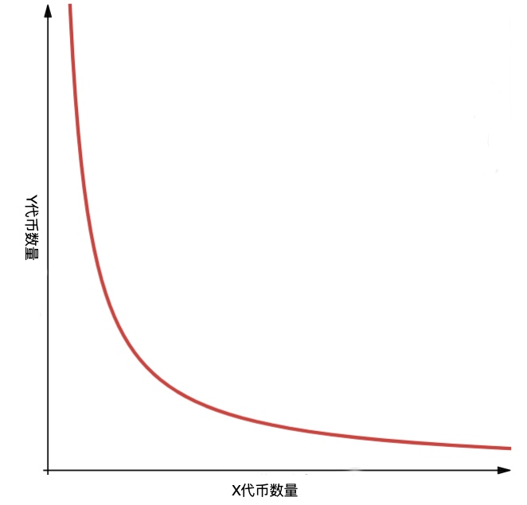
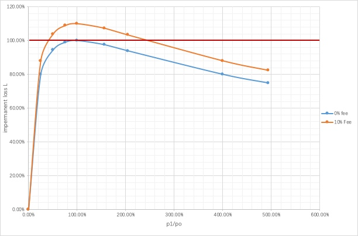
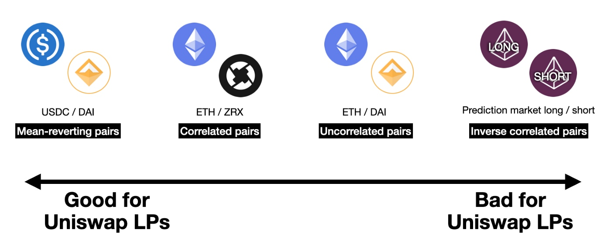

# UniswapV2

[Uniswap v2白皮书中文版](https://zhuanlan.zhihu.com/p/255190320)

[Uniswap 定制时要注意的几个点](https://www.jianshu.com/p/3f0a26de16ab)

~~[Uniswap 源码中文分析](https://gitee.com/facelay/uniswap-v2-core-master)~~

[精通 Uniswap](https://whatsblockchain.com/posts/2e1e9deb.html)

[Uniswap v2 Documentation](https://uniswap.org/docs/v2)

> `Uniswap`本质是一个自动化做市商（`AMM`），它舍弃了传统订单薄的撮合方式，采用流动池加恒定乘积公式算法($x×y=k$)为不同加密资产提供即时报价和兑换服务。
>
> ## 自动化做市商（AMM）
>
> 传统的交易所有一个订单薄(Order Book)，订单薄上记录着买卖方向，数量和出价，交易所负责对买卖双方进行配对，一旦订单薄中最高价格低于或等于最低价格，就会促成交易，同时会产生一个新的成交价，传统交易所有以下特点：
>
> - 市场上必须要有用户进行挂单，要有一定量的订单（市场流动）。
> - 订单必须重叠才能成交，即买价高于或等于卖价。
> - 需要将资产存储在交易所。
>
> 在订单薄模型市场中，买家期望用最低的价格买到想要的资产，而卖家则是期望用最高价格卖出同一项资产，如果交易要成立，买卖双方必须要在价格上达成共识，一是买家提高出价，二是卖家降低出价，如果双方都不要改变出价，这时候就要依靠做市商的参与，简单来说，做市商是一个促进交易的实体，它会在买卖两个方向上挂单，让想要交易的参与方只要跟做市商的订单撮合就能完成交易，而不需要等待对手方出现才能交易，极大的提高了市场的流动性。
>
> 为什么`Uniswap`不采用订单薄模型？
>
> `Uniswap`部署在以太坊上，而以太坊每秒可以出来`15`笔左右的交易，这对于订单薄交易所来不可行，主要原因是：“订单薄模型依赖一个或多个外部做市商对某项资产一直不断的做市，而以太坊的`TPS`过低不支持做市商高频的交易，如果缺少了做市商，那么交易所的流动性立刻会降低，对于用户来说这样的交易所体验很差。”
>
> `Uniswap`采用流动池加恒定乘法公式这种自动化做市商（AMM）模式实现了资产的交换，自动化做市商模式方式不需要买卖双方进行挂单，也不要买卖双方的订单重叠，可以进行自由买卖。
>
> - 流动池：使用流动池来提供买卖双方交易，做市商只要把资金放入流动池即可
> - 恒定乘法公式：按照流动池中`Token`的数量，自动计算买卖价格
>
> ### 流动池
>
> 流动池就是锁定在智能合约中所有的代币以及资金的总称，流动是资金转为代币，或代币转为资金的意思。
>
> 一个完整的流动池分为2个部份，分别表示不同的货币，成为一个交易对。
>
> `Uniswap`是无法自己变出钱来，因此需要依赖外部资金向合约中提供流动性，向`Uniswap`流动池中提供流动性的用户被称为流动性提供者，当流动性提供者向`Uniswap`中注入流动性的时候，`Uniswap`会铸造出一个流动性代币(`LP`)，铸出`LP`代币数量是与用户注入的资金所占流动池中的资金比例相关，流动性提供者可以选择在任何时间销毁自己持有的流动性代币。为了鼓励用于向`Uniswap`的流动池中提供更多的流动性，`Uniswap`会从每笔交易总额中抽取`0.3%`当成交易手续费，并将手续费全额交给那些将注资金到`Uniswap`资金池提供流动性的流动性提供者。 
>
> ### 恒定乘积公式
>
> `Uniswap`定价模型非常简洁，它的核心思想是一个恒定乘积公式 $x×y=k$ 。其中`x`和 `y`分别代表流动池中两种资产的数量，`k`是两种资产数量的乘积。
>
> $x×y=k$ 的函数图像如下：
>
> 
>
> 假设乘积`k`是一个固定不变的常量，当用户使用`x`资产从流动池中兑换`y`资产时，流动池中`x`资产的数量会增加，`y`资产的数量会减少。由于`k`是恒定的，所以当`x`增长$ΔX$ 时，需要将`y`减少$ΔY$才能保持等式的恒定。
> $$
> (x+ΔX)×(y−ΔY)=k
> $$
> 这里没有考虑到手续费的问题，如果要计算手续费的话，公式如下：
> $$
> (x+ΔXγ)×(y−ΔY)=k′ \\
> k′>k
> $$
> 其中：$ρ=0.3%$，$γ=1−ρ$
>
> $ΔXγ$表示扣除手续费后加入到流动池中的资产。由于在流动池中增加了手续费所以计算出来的`k'`会大于`k`，详细过程会在后面推导。
> $$
> x'=x+\Delta{x}=(1+\alpha)x=\frac{1}{1-\beta}x \\
> y'=y-\Delta{y}=(1-\beta)y=\frac{1}{1+\alpha}y \\
> xy=x'y'=k \\
> 其中：\alpha=\frac{\Delta{x}}{x}，\beta=\frac{\Delta{y}}{y}
> $$
>
> $$
> \Delta{x}=\frac{\beta}{1-\beta}x \\
> \Delta{y}=\frac{\alpha}{1+\alpha}y
> $$
>
> ##### 交易滑点
>
> 交易滑点是指：“在买卖Token时，实际支付的价格和期望的交易价格之间的差别，称为交易滑点”。
> $$
> P = \frac{\Delta{x}}{\Delta{y}}=\frac{\alpha{x}}{\frac{\alpha}{1+\alpha}y}=(1+\alpha)\frac{x}{y} \\
> P'=\frac{x}{y} \\
> 滑点=P-P'=(1+\alpha)P'-P=\alpha{P'}
> $$
> 其中 $P'$表示当前流动池的价格。
>
> 从公式可以看出交易的滑点是与$\alpha$成线性关系。
>
> 交易完成后，当前流动池中的价格更新为：
> $$
> P=\frac{x'}{y'}=\frac{(1+\alpha)x}{\frac{1}{1+\alpha}y}=(1+\alpha)^{2}\frac{x}{y}
> $$
> 从公式可以看出流动池中的币价与$\alpha$成二次函数关系
>
> ### impermanent loss
>
> `impermanent loss`通常是由于流动池中的价格发生波动引起的，下面看一个例子：
> $$
> e \times t = k \\
> p=\frac{t}{e} \\
> e=\sqrt{\frac{k}{p}} \\
> t=\sqrt{k \times p}
> $$
> 其中：$e$表示流动池中`ETH`数量，$t$表示流动池中`DAI`数量，$p$表示流动池中的价格
>
> 初始情况下，$e=100$，$t=10000$，则$p=100$，$k=1000000$
>
> 假设现在外部市场价格发生了变化，价格变成：$p'=120$，则
> $$
> e'=\sqrt{\frac{k}{p'}}=\sqrt{\frac{1000000}{120}}=91.28709291752769 \\
> t'=\sqrt{k \times p'}=\sqrt{1000000 \times 120}=10954.451150103323
> $$
> 则这部分资金的总价值为：
> $$
> v1=e' \times p'+t'=91.28709291752769 \times 120+10954.451150103323=21908.902300206646
> $$
> 
>
> 如果这部分资金没有放入流动池，则现在的价值为：
> $$
> v0=e \times p'+t=100 \times 120+10000=22000
> $$
> 计算`impermanent loss`:
> $$
> L=\frac{v1}{v0}=\frac{21908.902300206646}{22000}=0.9958591954639384\approx99.59\%
> $$
> 可以看出价格从`100`变成`120`后我们的资金只有之前的`99.59%`，损失了`4%`左右。只要这时候我们不将资金从流动池中取出，一旦流动池中的币价回到`100`时，我们是没有损失的，这是为什么叫`impermanent loss`无常损失的原因。
>
> 下图演示`impermanant loss`的比率与当前价格变化的关系，`O`列表示资金刚放入流动池的情况，`O->H`表示价格上涨时`impermanent loss`的变化，`A<-O`表示价格下跌时`impermanent loss`的变化。
>
> |      | A     | B           | C       | D           | O           | E       | F       | G           | H       |             |
> | ---- | ----- | ----------- | ------- | ----------- | ----------- | ------- | ------- | ----------- | ------- | ----------- |
> |      | p1/p0 | 0.00%       | 25.00%  | 50.30%      | 75.61%      | 100.00% | 156.25% | 204.08%     | 400.00% | 493.83%     |
> | ETH  | e     | 3162278     | 200     | 141         | 115         | 100     | 80      | 70          | 50      | 45          |
> | DAI  | t     | 0.316227732 | 5000    | 7092.198582 | 8695.652174 | 10000   | 12500   | 14285.71429 | 20000   | 22222.22222 |
> |      | k     | 1000000     | 1000000 | 1000000     | 1000000     | 1000000 | 1000000 | 1000000     | 1000000 | 1000000     |
> |      | p     | 1E-07       | 25      | 50.29928072 | 75.61436673 | 100     | 156.25  | 204.0816327 | 400     | 493.8271605 |
> |      | v0    | 10000.00001 | 12500   | 15029.92807 | 17561.43667 | 20000   | 25625   | 30408.16327 | 50000   | 59382.71605 |
> |      | v1    | 1           | 10000   | 14184       | 17391       | 20000   | 25000   | 28571       | 40000   | 44444       |
> |      | L     | 0.01%       | 80.00%  | 94.37%      | 99.03%      | 100.00% | 97.56%  | 93.96%      | 80.00%  | 74.84%      |
>
> 下图是根据上面数据画出的函数图像，蓝色的曲线是不包含手续费的，黄色的图像包含手续费，红色的线条是我手动添加上去的为了方便说明。
>
> 先看蓝色曲线，当不计算手续费收益的情况下，无论币价上涨或下跌，流动性提供者`100%`会有损失。
>
> 再看黄色的曲线，由于黄色曲线是计算手续费收益的，所以只要币价在一个范围内波动，流动性提供者可以稳赚手续费收益。
>
> 
>
> 
>
> - `mean-reverting pairs`：均值回归的交易对，比如稳定币交易对两者波动是最小的，可以最大程度减少`impermanent loss`
> - `correlated pairs`：有正相关性的交易对，例如`ETH/ZRX`，这两个币的波动方向基本上是一致的，同涨同跌，两者之间的相对波动小
> - `Uncorrelated pairs`：非相关性的交易对，如`ETH/DAI`，为这种交易对提供流动性，赚取的交易费有可能会覆盖`impermanent loss`
> - `Inverse correlated pairs`：负相关的交易对，是最危险的，他们之间波动方向相反，两者之间的相对波动范围最大。
>
> `impermanent loss`的公式：
> $$
> impermanent\_loss=\frac {2 \times \sqrt {price\_ratio}} {1+price\_ratio} -1
> $$
> 推导：
> $$
> \begin{aligned}
> V_0 &=e {P'} + t \\
> &=e \frac {t'} {e'} + t \\
> &=\frac {e{t'} + {e'}t} {e'}
> \end{aligned}
> $$
>
> $$
> \begin{aligned}
> V_1 &={e'}{P'} + {t'} \\
> &={e'}{\frac {t'} {e'} } + {t'} \\
> &=2{t'}
> \end{aligned}
> $$
>
> $$
> \begin{aligned}
> L &=\frac {V_1 - V_0} {V_0} \\
> &=\frac {V_1} {V_0} -1 \\
> &=\frac {2{t'}} {\frac {e{t'} + {e'}t} {e'}} -1 \\
> &=\frac {2{e'}{t'}} {e{t'}+{e'}t} -1 \\
> &=\frac {\frac {2{e'}{t'}} {et'}} {\frac {et'} {et'}+ \frac {e't} {et'}} -1 \\
> &=\frac {\frac {2e'} {e}} {1 + \frac {e't} {et'}} -1 \\
> &=\frac {2 \sqrt{\frac {P'} {p}}} {1 + \frac {P'} {P}} -1 \\
> &=\frac {2 \sqrt{price\_ratio }} {1 + {price\_ratio }}-1
> \end{aligned}
> $$
>
> 
>
> *精通 Uniswap*

## uniswap-v2-core

https://github.com/Uniswap/uniswap-v2-core

### UniswapV2Factory

```js
function createPair(address tokenA, address tokenB) external returns (address pair) {
  ...
  bytes memory bytecode = type(UniswapV2Pair).creationCode;
  bytes32 salt = keccak256(abi.encodePacked(token0, token1));
  assembly {
    pair := create2(0, add(bytecode, 32), mload(bytecode), salt)
  }
  ...
}
```

Typescript:

```js
export function getCreate2Address(
  factoryAddress: string,
  [tokenA, tokenB]: [string, string],
  bytecode: string
): string {
  const [token0, token1] = tokenA < tokenB ? [tokenA, tokenB] : [tokenB, tokenA]
  const create2Inputs = [
    '0xff',
    factoryAddress,
    keccak256(solidityPack(['address', 'address'], [token0, token1])),
    keccak256(bytecode)
  ]
  const sanitizedInputs = `0x${create2Inputs.map(i => i.slice(2)).join('')}`
  return getAddress(`0x${keccak256(sanitizedInputs).slice(-40)}`)
}
```

### UniswapV2Pair

```js
bytes4 private constant SELECTOR = bytes4(keccak256(bytes('transfer(address,uint256)')));
function _safeTransfer(address token, address to, uint value) private {
  (bool success, bytes memory data) = token.call(abi.encodeWithSelector(SELECTOR, to, value));
  require(success && (data.length == 0 || abi.decode(data, (bool))), 'UniswapV2: TRANSFER_FAILED');
}
```

> ### **2.2 价格预言(Price oracle)**
>
> Uniswap提供的t时刻的**边际价格**（marginal price，不包括手续费）可以用资产a的储备除以资产b的储备来计算。
> $$
> p_t=\frac{r^{a}_{t}}{r^{b}_{t}}\tag{1}
> $$
> 如果这个价格偏离（超出手续费足够的数额），套利者会和Uniswap进行交易使价格回归正常，所以Uniswap提供的价格趋向于追踪资产在相关市场的价格。这意味着它可以被用作一个近似的价格预言。
>
> 但是用Uniswap v1作为链上价格预言是不安全的，因为它非常容易被操纵。假设一个其他的合约用当前的ETH-DAI的价格交割某个衍生品，操纵价格的攻击者会从ETH-DAI交易对买入ETH，在衍生品上触发结算（引起失真的结算价），然后再把ETH卖给交易对，用真实价格反向交易。这甚至可以用一个原子的转账来完成，或者通过一个控制区块内交易（transaction）顺序的矿工。
>
> Uniswap v2改进了预言的功能，通过测算和记录每个区块第一笔交易之前的价格（也就是前一个区块最后的价格）。这个价格比一个区块内的价格更难被操纵。如果攻击者提交了一笔交易（transaction）尝试在区块末尾处操纵价格，其他的套利者可以提交另一个交易（transaction）立即进行反向交易。某个矿工（或有足够gas填满整个区块的攻击者）可以操纵区块末尾处的价格，除非他们可以挖出下一个区块，否则他们他们没有特殊的的套利优势。
>
> 具体来说，Uniswap v2追踪每个和合约交互的区块开始处的价格的累加和，来累加价格。每个价格用距离上一个更新价格的区块的时间进行加权，根据区块时间戳。这意思是累加器的值在任意时间（更新后）的值等于合约历史上每秒的现货价格的和。
> $$
> a_t = \sum_{i=1}^{t}p_i \tag{2}
> $$
> 要计算从时间 t1到t2的时间加权平均价（译者注：TWAP价格），一个外部调用者可以检查t1和t2时间的累加器的值，将后值减去前值，再除以期间经过的秒数。（注意，合约本身并不记录历史累加值，调用者必须在时间段开始处调用合约来读取和储存这个值。）
> $$
> p_{t_1,t_2} = \frac{\sum\nolimits_{i=t_1}^{t2}p_i}{t_2-t_1}=\frac{\sum\nolimits_{i=1}^{t_2}p_i-\sum\nolimits_{i=1}^{t_1}p_i}{t_2-t_1}=\frac{a_{t_2}-a_{t_1}}{t_2-t_1} \tag{3}
> $$
> 预言的用户可以选择这个区间的起始和结束时间。选择更长的区间可以让攻击者操纵价格的成本更高，虽然这会导致价格变化滞后。
>
> 一个复杂之处：我们应该用资产B来计算资产A的价格还是用资产A来计算资产B的价格？虽然用B计算的A的现货价格总是用A计算的B的现货价格的倒数，但是在某一时间段内用B计算的A的均价不等于用A计算的B的均价的倒数。举个例子，如果USD/ETH价格在区块1中是100，在区块2中是300，USD/ETH的均价是200 USD/ETH，但是ETH/USD的均价是1/150 ETH/USD（译者注：他们的均价不是倒数关系）。因为合约无法知道用户想要用哪个资产作为账户单位，所以Uniswap v2会同时追踪两个价格。
>
> 另一个复杂之处：有没有可能某个人发送资产给交易对合约，用来改变它的余额和边际价格，但又不和它交互，因此不会触发价格更新。如果合约简单的检查它自己的余额然后更新预言，攻击者可以在某一个区块中第一次调用合约之前向合约发送资产，从而操纵价格。如果上一次交易的区块是X秒以前，合约会在累加之前错误地把新价格乘以X，即使没有用户用那个价格进行过交易。为了防止这个问题，核心合约在每次交互后缓存它的资金储备，用缓存的资金储备更新价格预言而不用当前资金储备。除了保护价格预言被操纵，这个改动也启用3.2节中描述的合约重新架构。
>
> ### **2.2.1 精度**
>
> Solidity没有一等的非整型数的数据结构的支持，Uniswap v2用简单的二进制定点数格式编码和控制价格。具体来说，某一时间的价格存储为UQ112.112格式，意思是在小数点的任意一边都有112位精度，无符号。这些数字的范围是$[0,2^{112}-1]$ ，精度是$\frac{1}{2^{112}}$。
>
> 选择UQ112.112格式是由于实用的原因，因为这些数可以被存在uint224中，在256位中剩余的32位空余。储备资金各自存在uint112中，剩余32位存储空间。这些空闲空间被用于之前描述的累加过程。具体来说，储备资金和时间戳存储在至少有一个交易的最近的区块中，mod 232（译者注：取余数）之后可以存进32位空间。另外，虽然任意时间的价格（UQ112.112数字）确保可以储存进224位中，但某段时间的累加值确保能存下。存储A/B和B/A累加价格空间尾部附加的32位用来存连续累加溢出的位。这样设计意味着价格预言只在每一个区块的第一次交易中增加了3次SSTORE操作（目前花费15000gas）。
>
> 主要的缺点是32位不足以储存时间戳并确保不溢出。事实上32位Unix时间戳的溢出日期是2106年7月2日。为了确保系统在这个日期后以及每 $2^{32}-1$ 秒的间隔能够继续运行，预言简单要求每个间隔至少检查一次价格（大约136年一次）。这是由于累加的核心函数（mod取余运算)是溢出安全的，意思是预言用溢出算法计算差值，跨越溢出区间的交易可以被合理计算。
>
> ### **3.7 最大代币余额**
>
> 为了高效地实现预言机制，Uniswap v2只支持最高储备余额 $2^{112}-1$ 。这个数字足以支持总发行量超过一千万亿的18位小数精度的代币。
>
> 如果储备余额超过了，任何swap函数调用都会失败（由于_update()函数中的检查逻辑）。要从这个状态中恢复，任何用户都可以调用skim()函数从流动性池中删除超出的资产。
>
> *Uniswap v2白皮书中文版*

```js
// update reserves and, on the first call per block, price accumulators
function _update(uint balance0, uint balance1, uint112 _reserve0, uint112 _reserve1) private {
    require(balance0 <= uint112(-1) && balance1 <= uint112(-1), 'UniswapV2: OVERFLOW');
    uint32 blockTimestamp = uint32(block.timestamp % 2**32);
    uint32 timeElapsed = blockTimestamp - blockTimestampLast; // overflow is desired
    if (timeElapsed > 0 && _reserve0 != 0 && _reserve1 != 0) {
        // * never overflows, and + overflow is desired
        price0CumulativeLast += uint(UQ112x112.encode(_reserve1).uqdiv(_reserve0)) * timeElapsed;
        price1CumulativeLast += uint(UQ112x112.encode(_reserve0).uqdiv(_reserve1)) * timeElapsed;
    }
    reserve0 = uint112(balance0);
    reserve1 = uint112(balance1);
    blockTimestampLast = blockTimestamp;
    emit Sync(reserve0, reserve1);
}
```

price0CumulativeLast 和 price1CumulativeLast 即为累加价格 $a_t$

> ### **2.4 协议手续费(Protocol fee)**
>
> 如果feeTo地址被设置，协议会收取5pb的手续费，从流动性提供者的30bp手续费中抽取1/6。交易者将在所有交易上支付0.3%手续费，83.3%的手续费给流动性提供者，16.6%手续费给feeTo地址。
>
> 总共收集的手续费可以用自从上次手续费收集以来（译者注：k是常数乘积，可以看v1白皮书）的增长来计算（也就是 ）。以下公式给出了t1和t2之间的累加手续费占t2时间资金池中流动性的百分比：
> $$
> f_{1,2} = 1 - \frac{\sqrt{k_1}}{\sqrt{k_2}}  \tag{4}
> $$
> 如果fee在时间t1前启用，feeTo地址应该获得1/6的t1到t2时间段内的累加手续费。因此，我们要铸造新的流动性代币给feeTo地址 $\phi \cdot f_{1,2}$ ，其中 $\phi = \frac{1}{6}$ 。
>
> 我们要选择一个sm满足以下关系，其中s1是t1时刻的流通份额（outstanding shares）总量：
> $$
> \frac{s_m}{s_m+s_1}=\phi \cdot f_{1,2}  \tag{5}
> $$
> 经过变换，解得
> $$
> s_m=\frac{\sqrt{k_2}-\sqrt{k_1}}{(\frac{1}{\phi}-1)\cdot\sqrt{k_2}+\sqrt{k_1}} \cdot s_1  \tag{6}
> $$
> 设，得到以下公式
> $$
> s_m=\frac{\sqrt{k_2}-\sqrt{k_1}}{5\cdot\sqrt{k_2}+\sqrt{k_1}} \cdot s_1  \tag{7}
> $$
> 假设初始存款人存了100DAI和1ETH在交易对中，收到10份额。一段时间后（如果没有其他存款人参与）他们把钱转出，这时交易对有96DAI和1.5ETH，用上面得公式可以得出：
> $$
> s_m=\frac{\sqrt{1.5 \cdot 96}-\sqrt{1 \cdot 100}}{5\cdot\sqrt{1.5 \cdot 96}+\sqrt{1 \cdot 100}} \cdot 10  \approx 0.0286     \tag{8}
> $$
> *Uniswap v2白皮书中文版*

```js
// if fee is on, mint liquidity equivalent to 1/6th of the growth in sqrt(k)
function _mintFee(uint112 _reserve0, uint112 _reserve1) private returns (bool feeOn) {
    address feeTo = IUniswapV2Factory(factory).feeTo();
    feeOn = feeTo != address(0);
    uint _kLast = kLast; // gas savings
    if (feeOn) {
        if (_kLast != 0) {
            uint rootK = Math.sqrt(uint(_reserve0).mul(_reserve1));
            uint rootKLast = Math.sqrt(_kLast);
            if (rootK > rootKLast) {
                uint numerator = totalSupply.mul(rootK.sub(rootKLast));
                uint denominator = rootK.mul(5).add(rootKLast);
                uint liquidity = numerator / denominator;
                if (liquidity > 0) _mint(feeTo, liquidity);
            }
        }
    } else if (_kLast != 0) {
        kLast = 0;
    }
}
```

> ### **3.2.1 手续费调整**
>
> Uniswap v1通过转入合约的代币数量，在保持常数乘积不变之前收取交易手续费。合约强制确保了以下公式（减去手续费，使用大于号是因为可能存在进位误差或者有人直接发送token到合约）：
> $$
> (x_{1} - 0.003 \cdot x_{in}) \cdot  y_1  >= x_0 \cdot y_0   \tag{9}
> $$
> 使用flash swaps时，Uniswap v2引入了xin和yin可以同时为非零的可能性（当用户想要返还同样的资产，而不是互换时）。为了处理这种情况，同时正确地收取手续费，合约强制确保：
> $$
> ( x_1 - 0.003 \cdot x_{in}) \cdot  (y_1 - 0.003 \cdot y_{in}) >= x_0 \cdot y_0 \tag{10}
> $$
> 为了简化链上计算，两边同时乘以1000000，得到：
> $$
> (1000 \cdot x_1 - 3 \cdot x_{in}) \cdot  (1000 \cdot y_1 - 3 \cdot y_{in}) >= 1000000 \cdot x_0 \cdot y_0  \tag{11}
> $$
>
> ### **2.3 快速互换(Flash Swaps)**
>
> Uniswap v2添加了一个新的特性，允许用户在支付前接收和使用资产，只要他们在同一个原子的转账中完成支付。swap函数调用一个可选的用户指定的回调合约，在这之间转出用户请求的代币并且强制确保不变。一旦回调完成，合约检查新余额并且确保满足不变（在经过支付手续费调整后）。如果合约没有足够的资金，它会回滚整个交易。
>
> 用户也可以用同样的代币返还给Uniswap资金池而不完成互换。这高效地让任何人从Uniswap资金池中快速借取任何资产（Uniswap收取同样的千分之三的交易手续费）。
>
> *Uniswap v2白皮书中文版*

```js
{ // scope for reserve{0,1}Adjusted, avoids stack too deep errors
uint balance0Adjusted = balance0.mul(1000).sub(amount0In.mul(3));
uint balance1Adjusted = balance1.mul(1000).sub(amount1In.mul(3));
require(balance0Adjusted.mul(balance1Adjusted) >= uint(_reserve0).mul(_reserve1).mul(1000**2), 'UniswapV2: K');
}
```

> ### **3.4 初始化流动性代币供给**
>
> 当新的流动性提供者向现有的Uniswap交易对中存代币时，计算铸造的流动性代币（译者注：流动性代币需要看Uniswap v1白皮书）数量基于现有的代币数量：
> $$
> s_{minted}=\frac{x_{deposited}}{x_{starting}} \cdot s_{starting} \tag{12}
> $$
> 如果是第一个存款人呢？在 $x_{starting}$ 为0的情况下，这个公式不能用。
>
> Uniswap v2初始铸造份额等于存入代币数量的几何平均值：
> $$
> s_{minted}=\sqrt{x_{deposited}\cdot y_{deposited}} \tag{13}
> $$
> 这个公式确保了流动性资金池份额的价值在任意时间和在本质上和初始存入的比例无关。
>
> 以上公式确保了流动性资金池不会少于资金池中储备金额的几何平均值。但是，流动性资金池份额的价值随时间增长是可能的，通过累加交易手续费或者向流动性资金池“捐款（给pair合约转账后调用sync函数）”。理论上，这会导致一种极端情况，最小的流动性份额数量（1e-18份额）过于值钱，以至于无法位小流动性提供者提供任何流动性。
>
> 为了减轻这种情况，Uniswap v2销毁第一次铸造的1e-15资金池份额，发送到全零地址而不是铸造者。这对任何代币交易对都是微不足道的。但是这显著地提高了上述攻击地成本。为了提高流动性资金池份额价值到100美元，攻击者需要捐献100000美元到资金池总，这会被作为流动性永久锁定。
>
> *Uniswap v2白皮书中文版*

```js
uint public constant MINIMUM_LIQUIDITY = 10**3;
function mint(address to) external lock returns (uint liquidity) {
  (uint112 _reserve0, uint112 _reserve1,) = getReserves(); // gas savings
  uint balance0 = IERC20(token0).balanceOf(address(this));
  uint balance1 = IERC20(token1).balanceOf(address(this));
  uint amount0 = balance0.sub(_reserve0);
  uint amount1 = balance1.sub(_reserve1);

  bool feeOn = _mintFee(_reserve0, _reserve1);
  uint _totalSupply = totalSupply; // gas savings, must be defined here since totalSupply can update in _mintFee
  if (_totalSupply == 0) {
    liquidity = Math.sqrt(amount0.mul(amount1)).sub(MINIMUM_LIQUIDITY);
    _mint(address(0), MINIMUM_LIQUIDITY); // permanently lock the first MINIMUM_LIQUIDITY tokens
  } else {
    liquidity = Math.min(amount0.mul(_totalSupply) / _reserve0, amount1.mul(_totalSupply) / _reserve1);
  }
  require(liquidity > 0, 'UniswapV2: INSUFFICIENT_LIQUIDITY_MINTED');
  _mint(to, liquidity);

  _update(balance0, balance1, _reserve0, _reserve1);
  if (feeOn) kLast = uint(reserve0).mul(reserve1); // reserve0 and reserve1 are up-to-date
  emit Mint(msg.sender, amount0, amount1);
}
```

### test

Solidity:

```js
contract UniswapV2ERC20 is IUniswapV2ERC20 {
    bytes32 public DOMAIN_SEPARATOR;
    // keccak256("Permit(address owner,address spender,uint256 value,uint256 nonce,uint256 deadline)");
    bytes32 public constant PERMIT_TYPEHASH = 0x6e71edae12b1b97f4d1f60370fef10105fa2faae0126114a169c64845d6126c9;
    constructor() public {
        uint chainId;
        assembly {
            chainId := chainid
        }
        DOMAIN_SEPARATOR = keccak256(
            abi.encode(
                keccak256('EIP712Domain(string name,string version,uint256 chainId,address verifyingContract)'),
                keccak256(bytes(name)),
                keccak256(bytes('1')),
                chainId,
                address(this)
            )
        );
    }
    function permit(address owner, address spender, uint value, uint deadline, uint8 v, bytes32 r, bytes32 s) external {
        require(deadline >= block.timestamp, 'UniswapV2: EXPIRED');
        bytes32 digest = keccak256(
            abi.encodePacked(
                '\x19\x01',
                DOMAIN_SEPARATOR,
                keccak256(abi.encode(PERMIT_TYPEHASH, owner, spender, value, nonces[owner]++, deadline))
            )
        );
        address recoveredAddress = ecrecover(digest, v, r, s);
        require(recoveredAddress != address(0) && recoveredAddress == owner, 'UniswapV2: INVALID_SIGNATURE');
        _approve(owner, spender, value);
    }
}
```

Typescript:

```js
import { Contract } from 'ethers'
import {
  BigNumber,
  bigNumberify,
  getAddress,
  keccak256,
  defaultAbiCoder,
  toUtf8Bytes,
  solidityPack
} from 'ethers/utils'

const PERMIT_TYPEHASH = keccak256(
  toUtf8Bytes('Permit(address owner,address spender,uint256 value,uint256 nonce,uint256 deadline)')
)
function getDomainSeparator(name: string, tokenAddress: string) {
  return keccak256(
    defaultAbiCoder.encode(
      ['bytes32', 'bytes32', 'bytes32', 'uint256', 'address'],
      [
        keccak256(toUtf8Bytes('EIP712Domain(string name,string version,uint256 chainId,address verifyingContract)')),
        keccak256(toUtf8Bytes(name)),
        keccak256(toUtf8Bytes('1')),
        1,
        tokenAddress
      ]
    )
  )
}
export async function getApprovalDigest(
  token: Contract,
  approve: {
    owner: string
    spender: string
    value: BigNumber
  },
  nonce: BigNumber,
  deadline: BigNumber
): Promise<string> {
  const name = await token.name()
  const DOMAIN_SEPARATOR = getDomainSeparator(name, token.address)
  return keccak256(
    solidityPack(
      ['bytes1', 'bytes1', 'bytes32', 'bytes32'],
      [
        '0x19',
        '0x01',
        DOMAIN_SEPARATOR,
        keccak256(
          defaultAbiCoder.encode(
            ['bytes32', 'address', 'address', 'uint256', 'uint256', 'uint256'],
            [PERMIT_TYPEHASH, approve.owner, approve.spender, approve.value, nonce, deadline]
          )
        )
      ]
    )
  )
}

import { MaxUint256 } from 'ethers/constants'
import { bigNumberify, hexlify, keccak256, defaultAbiCoder, toUtf8Bytes } from 'ethers/utils'
import { ecsign } from 'ethereumjs-util'

  it('permit', async () => {
    const nonce = await token.nonces(wallet.address)
    const deadline = MaxUint256
    const digest = await getApprovalDigest(
      token,
      { owner: wallet.address, spender: other.address, value: TEST_AMOUNT },
      nonce,
      deadline
    )

    const { v, r, s } = ecsign(Buffer.from(digest.slice(2), 'hex'), Buffer.from(wallet.privateKey.slice(2), 'hex'))

    await expect(token.permit(wallet.address, other.address, TEST_AMOUNT, deadline, v, hexlify(r), hexlify(s)))
      .to.emit(token, 'Approval')
      .withArgs(wallet.address, other.address, TEST_AMOUNT)
    expect(await token.allowance(wallet.address, other.address)).to.eq(TEST_AMOUNT)
    expect(await token.nonces(wallet.address)).to.eq(bigNumberify(1))
  })
```


## uniswap-v2-periphery

### UniswapV2Library

#### init code hash

> ### **3.6 确定交易对地址**
>
> 和Uniswap v1一样，Uniswap v2交易对也是通过单一的工厂合约进行实例化的。在Uniswap v1中，交易对合约用CREATE运算码进行创建，这意味着合约地址依赖于交易对创建的顺序。Uniswap v2使用以太坊新的CREATE2运算码来创建确定地址的交易对合约，这意味着可以在链下计算某个交易对的地址，不用查看以太坊区块链的状态。
>
> *Uniswap v2白皮书中文版*

```js
// calculates the CREATE2 address for a pair without making any external calls
function pairFor(address factory, address tokenA, address tokenB) internal pure returns (address pair) {
    (address token0, address token1) = sortTokens(tokenA, tokenB);
    pair = address(uint(keccak256(abi.encodePacked(
            hex'ff',
            factory,
            keccak256(abi.encodePacked(token0, token1)),
            hex'96e8ac4277198ff8b6f785478aa9a39f403cb768dd02cbee326c3e7da348845f' // init code hash
        ))));
}
```

[如何获取 `init code hash`？](https://learnblockchain.cn/question/1604)

JavaScript：

```js
var Web3 = require('web3')
const artifact = require('./build/contracts/UniswapV2Pair.json')
const initCodeHash = Web3.utils.keccak256(artifact.bytecode)
console.log(initCodeHash)
```

Solidity：

```js
function getCodeHash() external pure returns (bytes32) {
  return keccak256(type(UniswapV2Pair).creationCode);
}
```

#### 

```js
// given an input amount of an asset and pair reserves, returns the maximum output amount of the other asset
function getAmountOut(uint amountIn, uint reserveIn, uint reserveOut) internal pure returns (uint amountOut) {
    require(amountIn > 0, 'UniswapV2Library: INSUFFICIENT_INPUT_AMOUNT');
    require(reserveIn > 0 && reserveOut > 0, 'UniswapV2Library: INSUFFICIENT_LIQUIDITY');
    uint amountInWithFee = amountIn.mul(997);
    uint numerator = amountInWithFee.mul(reserveOut);
    uint denominator = reserveIn.mul(1000).add(amountInWithFee);
    amountOut = numerator / denominator;
}

// given an output amount of an asset and pair reserves, returns a required input amount of the other asset
function getAmountIn(uint amountOut, uint reserveIn, uint reserveOut) internal pure returns (uint amountIn) {
    require(amountOut > 0, 'UniswapV2Library: INSUFFICIENT_OUTPUT_AMOUNT');
    require(reserveIn > 0 && reserveOut > 0, 'UniswapV2Library: INSUFFICIENT_LIQUIDITY');
    uint numerator = reserveIn.mul(amountOut).mul(1000);
    uint denominator = reserveOut.sub(amountOut).mul(997);
    amountIn = (numerator / denominator).add(1);
}
```


### UniswapV2LiquidityMathLibrary

TODO


### test

TODO


# UniswapV3

[uniswap - V3 源代码导读](https://www.chainnews.com/articles/874467291934.htm)

[Uniswap V3 Core 白皮书（中文版）](https://shimo.im/docs/DCxd8VJGgV3yVjpp/read)

