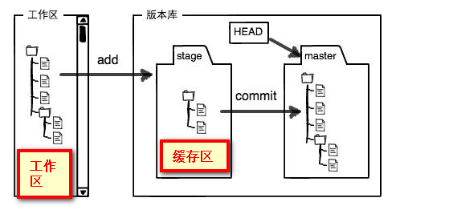
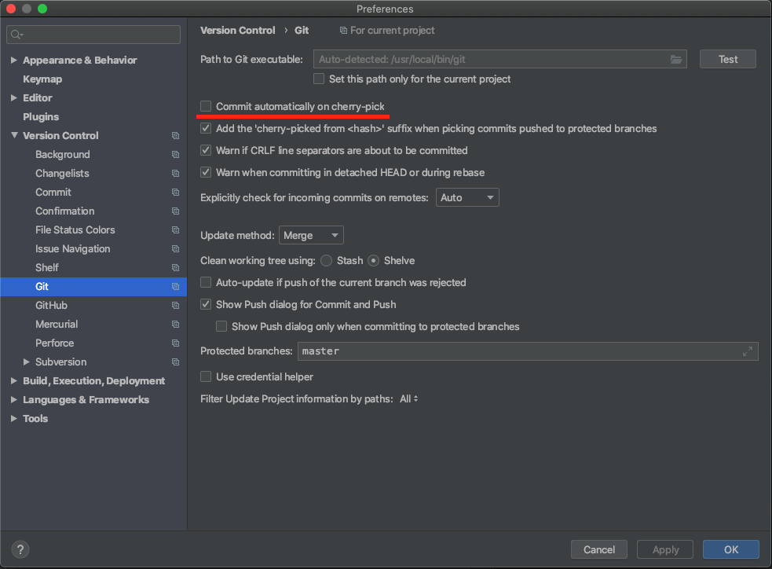

## Github

### 生成 SSH Keys

使用 SSH 连接 github 操作（如 `git clone git@github.com:...`）时，报错 `git@github.com: Permission denied (publickey).`

解决方法：

运行以下命令生成本机 SSH 密钥：

```bash
mkdir ~/.ssh //in case that the folder doesnt exist...
cd ~/.ssh

ssh-keygen -t rsa -C "youremail@somewhere.gr"

// -f 设置文件名
ssh-keygen -t ed25519 -C "gateswapbot" -f gateswapbot
```

然后一路回车即可。

使用 `cat id_rsa.pub` 命令查看公钥，并将公钥加到 `https://github.com/settings/keys` 

## 设置代理

https://gist.github.com/chuyik/02d0d37a49edc162546441092efae6a1

### 1.1 HTTP 形式

适用于：git clone https://github.com/owner/git.git

#### 走 HTTP 代理

```bash
git config --global http.proxy "http://127.0.0.1:9910"
git config --global https.proxy "http://127.0.0.1:9910"
```

#### 走 socks5 代理（如 Shadowsocks）

```bash
git config --global http.proxy "socks5://127.0.0.1:9909"
git config --global https.proxy "socks5://127.0.0.1:9909"
```

#### 取消设置

```bash
git config --global --unset http.proxy
git config --global --unset https.proxy
```

#### 查看配置

```bash
git config --global --list
```

> cargo 默认使用此代理。

### 1.2 SSH 形式

适用于：git clone git@github.com:owner/git.git

修改 `~/.ssh/config` 文件（不存在则新建）：

```
# 必须是 github.com
Host github.com
   HostName github.com
   User git
   # 走 HTTP 代理
   # ProxyCommand socat - PROXY:127.0.0.1:%h:%p,proxyport=8080
   # 走 socks5 代理（如 Shadowsocks）
   # ProxyCommand nc -v -x 127.0.0.1:1080 %h %p
```

## 查看配置信息

```shell
# 查看系统配置
git config --system --list
# 查看当前用户配置
git config --global  --list
# 查看当前仓库配置
git config --local  --list
```

## 工作区、缓存区



工作区即为本地的相应文件夹，通过`git add`命令，即可将文件放置缓存区；继而通过`git commit`即可将文件放置于相对应的git分支。

通过`git status`，可以判断当前文件所属位置：

- 出现 `Untracked files`，代表当前文件出在工作区，还未进入缓存区
- 出现`new file modified`等，代表文件在缓存区，还未进入当前所在分支

**工作区和缓存区内容是公共的，不从属于任何一个分支。**所以切换分支时，会将未add或未commit的内容也切换过去。

https://segmentfault.com/a/1190000017794371

## checkout远程分支

`git checkout -b dev origin/dev`

## 指定 git 命令运行目录

https://stackoverflow.com/questions/3769137/use-git-log-command-in-another-folder

` git -C <directory> <command>`

例如：`git -C ~/foo status`

git 2.0版本以下使用：`git --git-dir=<directory>/.git <command>`

## commit 历史中找回已删除文件

https://stackoverflow.com/questions/7203515/how-to-find-a-deleted-file-in-the-project-commit-history

Get a list of the deleted files and copy the full path of the deleted file

```bash
git log --diff-filter=D --summary | grep delete
```

Execute the next command to find commit id of that commit and copy the commit id

```bash
git log --all -- FILEPATH
```

restore the file or directory

```bash
git checkout <commit id> -- /path/to/file
git checkout <commit id> -- /path/to/dir/**
```

## 找回丢失的本地 commit

https://blog.csdn.net/qq_38233837/article/details/84833066

本地 commit 后，没有 push 到服务器，切换分支后，本地提交丢失

```bash
# 查看所有 git 操作历史
git reflog
git reflog --date=iso # 显示操作时间
# 切换到最后的 commit 
git reset --hard HEAD@{7}
```

## Cherry-Pick

https://juejin.im/entry/5c24ecb6f265da61553ae35e

1. 关闭cherry-pick自动提交



2. 切换到没有对应commit的分支
3. 在git窗口切换到commit所在分支，选中（可多选）需要提交的commit，然后右键Cherry-Pick即可。

## Tag

### 创建标签

右键git log，选择`New Tag...`，输入标签名（前面加上v）

Push界面中选中`Push Tags: All`

### 删除标签

```shell
# 删除本地标签命令
git tag -d v1.0.1
# 删除远程标签命令
git push origin :refs/tags/v1.0.1
```

## .gitignore not working

The files/folder in your version control will not just delete themselves just because you added them to the `.gitignore`. They are already in the repository and you have to remove them. You can just do that with this:

(**Remember to commit everything you've changed before you do this.**)

```
git rm -rf --cached .
git add .
```

This removes all files from the repository and adds them back (this time respecting the rules in your `.gitignore`).

https://stackoverflow.com/questions/25436312/gitignore-not-working/25436481

## Git LFS

Git LFS（Large File Storage, 大文件存储）是可以把音乐、图片、视频等指定的任意文件存在 Git 仓库之外，而在 Git 仓库中用一个占用空间 1KB 不到的文本指针来代替的小工具。

### 安装

下载 https://git-lfs.github.com/， 安装后运行 `git lfs install`

### 使用

1. 查看现有的文件追踪模式：`git lfs track`

2. 添加要管理的大文件的文件类型，比如gz文件

   运行命令：`git lfs track *.gz`

   添加类型后，查看管理文件.gitattributes，可以发现.gitattributes中新增加一行：*.gz filter=lfs diff=lfs merge=lfs -text

3. `git add .gitattributes`

4. 对于之前未使用 Git LFS 追踪的文件，可以使用 [git lfs migrate](https://github.com/git-lfs/git-lfs/blob/master/docs/man/git-lfs-migrate.1.ronn?utm_source=gitlfs_site&utm_medium=doc_man_migrate_link&utm_campaign=gitlfs)命令

5. 获取git lfs管理的所有文件列表：`git lfs ls-files `

6. 添加大文件到git仓库，和其它添加方式一样

   ```
   git add my.gz
   git commit -m "add gz file"
   git push
   ```

7. 将代码 push 到远程仓库后，LFS 跟踪的文件会以『Git LFS』的形式显示

8. clone 时 使用`git clone` 或 `git lfs clone`均可

9. 查看帮助：git lfs help

10. 下载指定文件：`git lfs pull --include "fullnode/prod/0.7.2/linux/bnbchaind"`

## 您的分支和 'origin/master' 出现了偏离

```
git fetch origin
git reset --hard origin/master
```

## Undo uncommitted changes

https://stackoverflow.com/questions/14075581/git-undo-all-uncommitted-or-unsaved-changes

```
git status	// 一般会包含相应提示，如怎样回滚和提交
git reset	// unstage all files which have been staged with `git add`
git checkout .	// revert all local uncommitted changes, equivalent to `git reset --hard HEAD`
git clean -fdx	// remove all local untracked files
```

```
git stash -u && git stash drop	// -u is short for --include-untracked
```

## git alias

查看 git 默认的命令 alias：`git config --list`

```
alias.s=status
alias.a=!git add . && git status
alias.au=!git add -u . && git status
alias.aa=!git add . && git add -u . && git status
alias.c=commit
alias.cm=commit -m
alias.ca=commit --amend
alias.ac=!git add . && git commit
alias.acm=!git add . && git commit -m
alias.l=log --graph --all --pretty=format:'%C(yellow)%h%C(cyan)%d%Creset %s %C(white)- %an, %ar%Creset'
alias.ll=log --stat --abbrev-commit
alias.lg=log --color --graph --pretty=format:'%C(bold white)%h%Creset -%C(bold green)%d%Creset %s %C(bold green)(%cr)%Creset %C(bold blue)<%an>%Creset' --abbrev-commit --date=relative
alias.llg=log --color --graph --pretty=format:'%C(bold white)%H %d%Creset%n%s%n%+b%C(bold blue)%an <%ae>%Creset %C(bold green)%cr (%ci)' --abbrev-commit
alias.d=diff
alias.master=checkout master
alias.spull=svn rebase
alias.spush=svn dcommit
alias.alias=!git config --list | grep 'alias\.' | sed 's/alias\.\([^=]*\)=\(.*\)/\1\     => \2/' | sort
```

常用命令：

```
git s
git acm
git l
git lg
git llg
```

## Rebase

https://www.cnblogs.com/zhaoyingjie/p/10259715.html

```
git rebase -i HEAD~4	// 对最近的 4 个 commit 进行 rebase 操作
git rebase -i 9fbf10	// 对 commit id 前几位为 9fbf10 的 commit 之后的 commit 进行 rebase
```

```
pick abc8023 Merge PR ：Fix incorrect account nonce in watch db (#876)
pick e512b75 Merge PR: add txpool (#868)
pick 3efe19f Merge PR: add check of watch db enabled in handler (#877)
pick df1f078 Merge PR ：fix failed to get block height via the keywrod block.number (#878)

# Rebase 3ac6fe2..df1f078 onto df1f078 (4 commands)
#
# Commands:
# p, pick <commit> = use commit	保留该commit
# r, reword <commit> = use commit, but edit the commit message
# e, edit <commit> = use commit, but stop for amending
# s, squash <commit> = use commit, but meld into previous commit	与上一个commit合并，注释也合并
# f, fixup <commit> = like "squash", but discard this commit's log message 与上一个commit合并，丢弃注释
# x, exec <command> = run command (the rest of the line) using shell
# b, break = stop here (continue rebase later with 'git rebase --continue')
# d, drop <commit> = remove commit	丢弃该commit
# l, label <label> = label current HEAD with a name
# t, reset <label> = reset HEAD to a label
# m, merge [-C <commit> | -c <commit>] <label> [# <oneline>]
# .       create a merge commit using the original merge commit's
# .       message (or the oneline, if no original merge commit was
# .       specified). Use -c <commit> to reword the commit message.
#
# These lines can be re-ordered; they are executed from top to bottom.
#
# If you remove a line here THAT COMMIT WILL BE LOST.
#
# However, if you remove everything, the rebase will be aborted.
#
# Note that empty commits are commented out
```

编辑后保存退出，git 会自动压缩提交历史，如果有冲突，记得解决冲突后，使用 `git rebase --continue` 重新回到当前的 git 压缩过程。最后使用` git push -f`推送到远程仓库。

## 学习资料

- [Learn Git Branching](https://learngitbranching.js.org/) 知名的 Git 教学游戏，通过可视化的动画和交互，帮助理解所有分支操作的概念和方法。如果你打算自学，这些命令会用得上：`show solution`、`levels`、`undo`、`reset`。

- [Pro Git](https://git-scm.com/book/zh/v2) 专业全面的 git 教程
- [Git 进阶指南](https://gb.yekai.net/)

