https://segmentfault.com/a/1190000014992947

https://zhuanlan.zhihu.com/p/41745503

本文默认各位同学已经安装了git环境和XCode's command line tools，遇到提示找不到git命令或需要安装command line tool的地方，文中不再赘述了。

### 下载iTerm2

可以直接去官网下载：https://www.iterm2.com/

安装完成后，在/bin目录下会多出一个zsh的文件。

Mac系统默认使用dash作为终端，可以使用命令修改默认使用zsh：

```shell
chsh -s /bin/zsh
```

如果想修改回默认dash，同样使用chsh命令即可：

```shell
chsh -s /bin/bash
```

OK，这就是iTerm2初始的样子，下面我们来美化它，让它变得更好用！

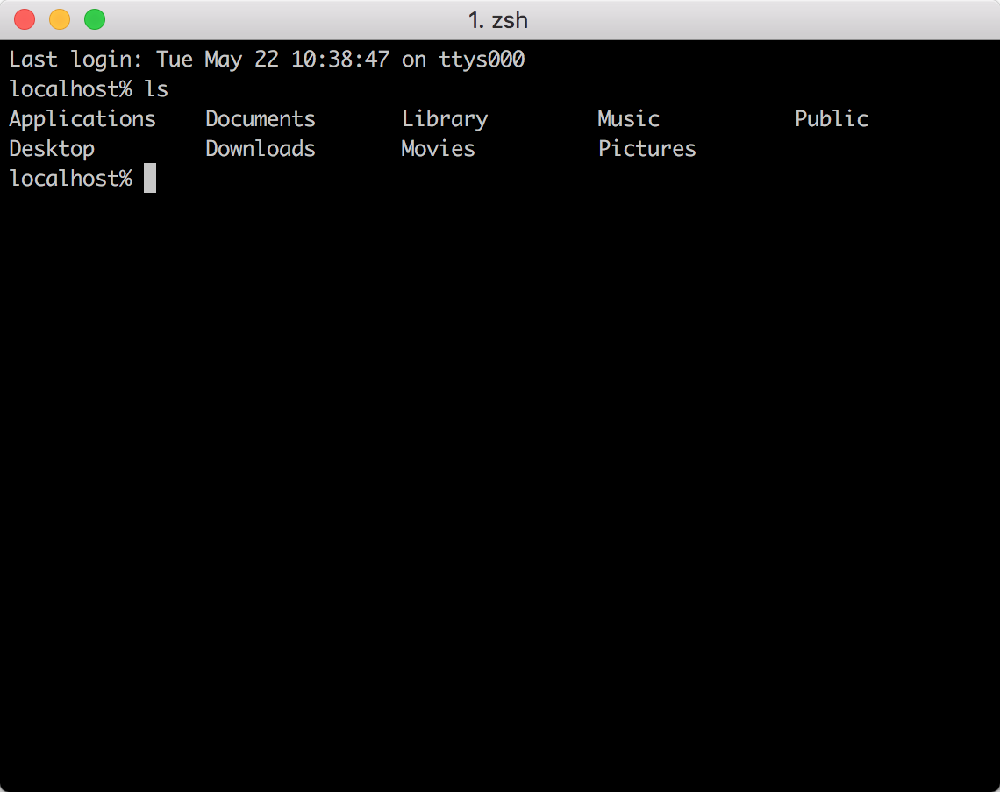

### 安装Oh my zsh

安装方法有两种，可以使用curl或wget，看自己环境或喜好：

```shell
# curl 安装方式
sh -c "$(curl -fsSL https://raw.githubusercontent.com/robbyrussell/oh-my-zsh/master/tools/install.sh)"
# wget 安装方式
sh -c "$(wget https://raw.githubusercontent.com/robbyrussell/oh-my-zsh/master/tools/install.sh -O -)"
```

安装命令和安装完成后的截图：

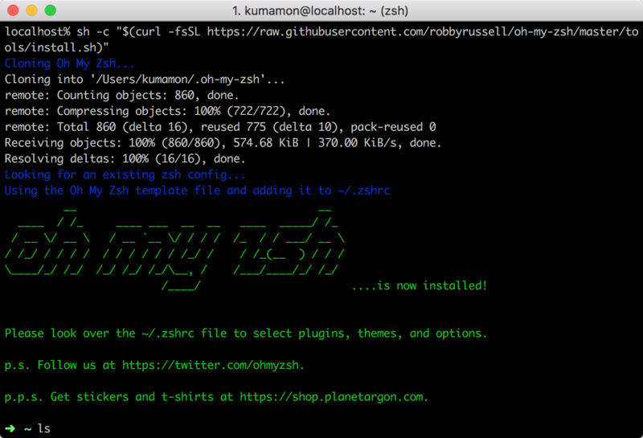

oh-my-zsh开源地址：[https://github.com/robbyrussell/oh-my-zsh](https://github.com/robbyrussell/oh-my-zsh)

### 安装PowerLine

powerline官网：[http://powerline.readthedocs.io/en/latest/installation.html](http://powerline.readthedocs.io/en/latest/installation.html)

安装powerline的方式依然简单，也只需要一条命令：

```shell
pip install powerline-status --user
```

没有安装pip的同学可能会碰到zsh: command not found: pip。

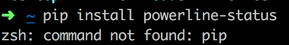

使用命令安装pip即可：

```shell
sudo easy_install pip
```

安装后再次执行安装powerline的命令即可。

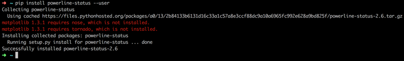

### 安装PowerFonts

安装字体库需要首先将项目git clone至本地，然后执行源码中的install.sh。

在你习惯的位置新建一个文件夹，如：~/Desktop/OpenSource/

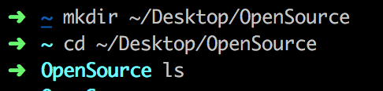

在此文件夹下执行git clone命令：

```shell
# git clone
git clone https://github.com/powerline/fonts.git --depth=1
# cd to folder
cd fonts
# run install shell
./install.sh
```

执行结果如下：

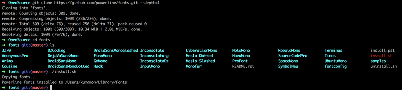

安装好字体库之后，我们来设置iTerm2的字体，具体的操作是iTerm2 -> Preferences -> Profiles -> Text，在Font区域选中Change Font，然后找到Meslo LG字体。有L、M、S可选，看个人喜好：


### 安装配色方案

配色方案在使用VIM或Colorful Log时会变得非常有用，同时界面也不会一片黑绿一样死板。

同样使用git clone的方式下载源码进行安装：

```shell
cd ~/Desktop/OpenSource
git clone https://github.com/altercation/solarized
cd solarized/iterm2-colors-solarized/
open .
```

在打开的finder窗口中，双击Solarized Dark.itermcolors和Solarized Light.itermcolors即可安装明暗两种配色：

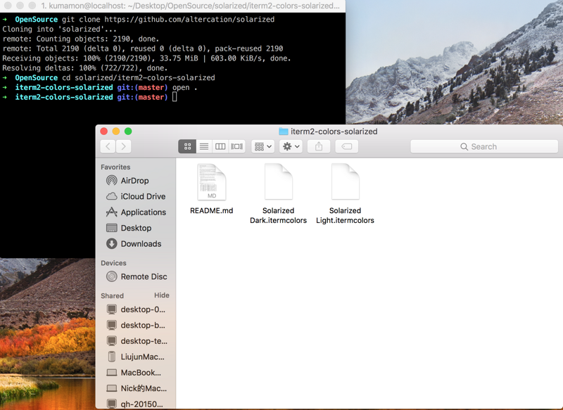

再次进入iTerm2 -> Preferences -> Profiles -> Colors -> Color Presets中根据个人喜好选择这两种配色中的一种即可：

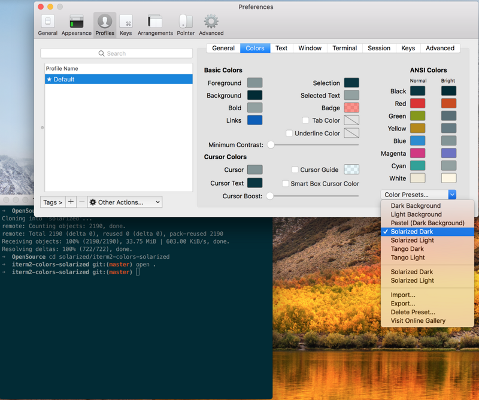

### 安装主题

下载agnoster主题，执行脚本安装：

```shell
cd ~/Desktop/OpenSource
git clone https://github.com/fcamblor/oh-my-zsh-agnoster-fcamblor.git
cd oh-my-zsh-agnoster-fcamblor/
./install
```

执行上面的命令会将主题拷贝到oh my zsh的themes中：

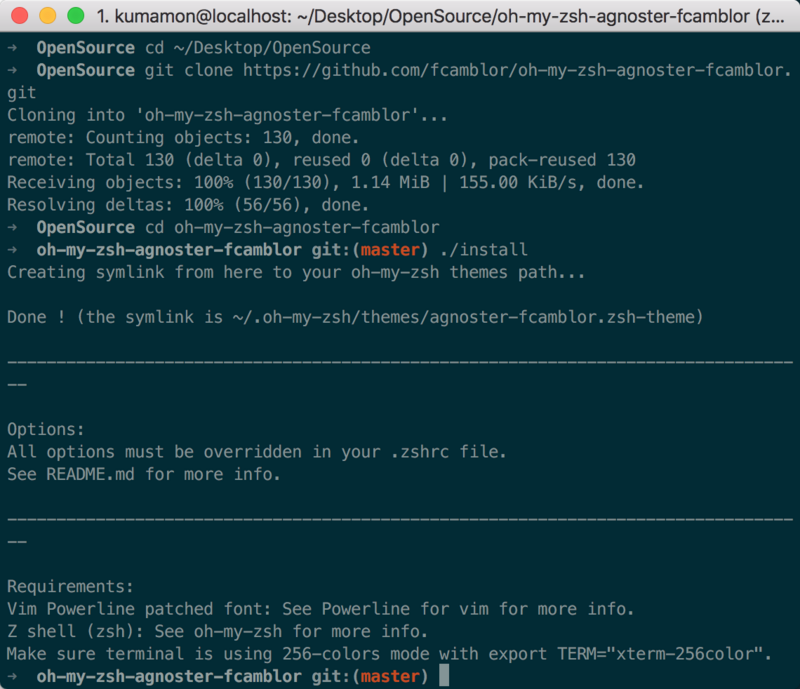

拷贝完成后，执行命令打开zshrc配置文件，将ZSH_THEME后面的字段改为agnoster。

```shell
vi ~/.zshrc
```

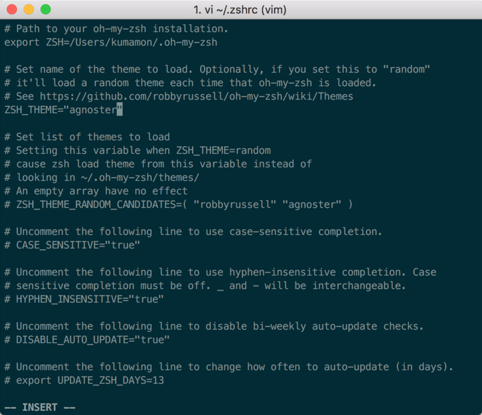

修改完成后按一下esc调出vi命令，输入:wq保存并退出vi模式。

此时command+Q或source配置文件后，iTerm2变了模样：

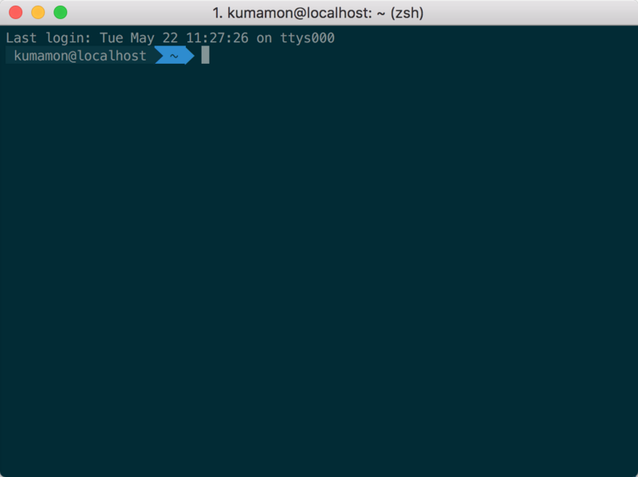

### 安装高亮插件

这是oh my zsh的一个插件，安装方式与theme大同小异：

```shell
cd ~/.oh-my-zsh/custom/plugins/
git clone https://github.com/zsh-users/zsh-syntax-highlighting.git
vi ~/.zshrc
```

这时我们再次打开zshrc文件进行编辑。找到plugins，此时plugins中应该已经有了git，我们需要把高亮插件也加上：

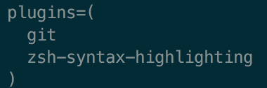

请务必保证插件顺序，zsh-syntax-highlighting必须在最后一个。

然后在文件的最后一行添加：source ~/.oh-my-zsh/custom/plugins/zsh-syntax-highlighting/zsh-syntax-highlighting.zsh

按一下esc调出vi命令，输入:wq保存并退出vi模式。

执行命令使刚才的修改生效：

```bash
source ~/.zshrc
```

至此大功告成

#### 可选择、命令补全

跟代码高亮的安装方式一样，这也是一个zsh的插件，叫做zsh-autosuggestion，用于命令建议和补全。

```bash
cd ~/.oh-my-zsh/custom/plugins/
git clone https://github.com/zsh-users/zsh-autosuggestions
vi ~/.zshrc
```

找到plugins，加上这个插件即可：

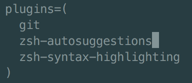

插件效果：

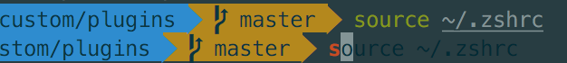

Github：[https://github.com/sirius1024/iterm2-with-oh-my-zsh](https://github.com/sirius1024/iterm2-with-oh-my-zsh)

### 修改命令提示符

默认的命令提示符为 user@userdemackbookPro，这样的提示符配合 powerlevel9k 主题太过冗长，因此我选择将该冗长的提示符去掉，在 `~/.zshrc` 配置文件后面追加如下内容：

```bash
# 注意：DEFAULT_USER 的值必须要是系统用户名才能生效
DEFAULT_USER="user"
```

编辑方法同上。