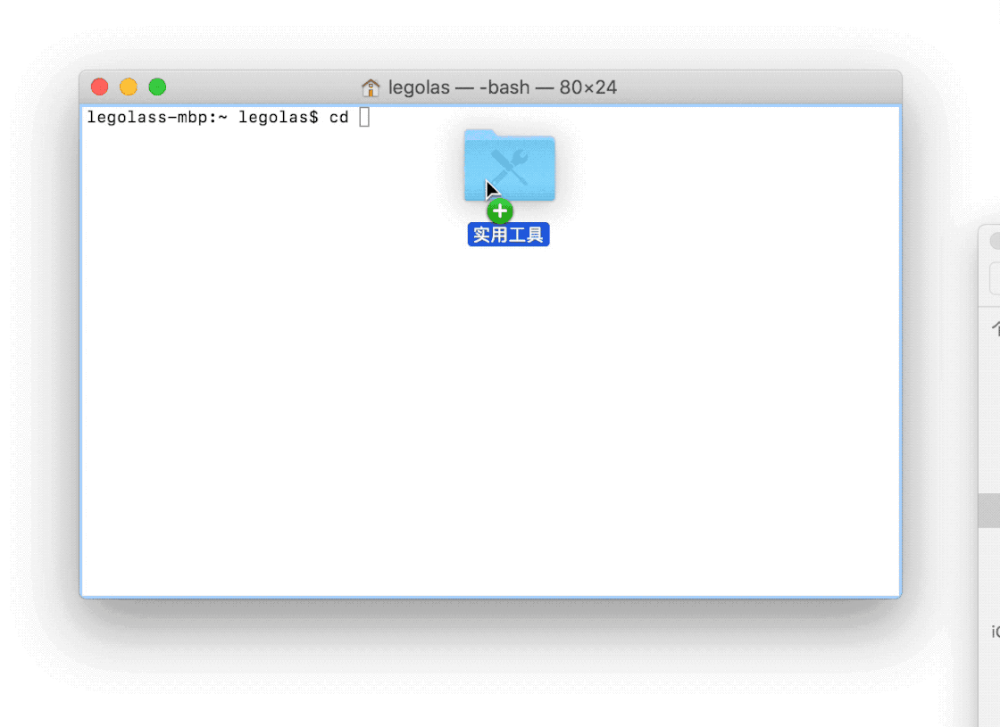

# Terminal

快速导入路径：直接将待编辑文件或文件夹拖入终端中即可

不进入休眠状态：当你临时不希望电脑进入休眠状态时，可以使用 caffeinate 命令让电脑时刻清醒。

## 显示隐藏文件夹

defaults write com.apple.finder AppleShowAllFiles -bool true; killall Finder

恢复隐藏：defaults write com.apple.finder AppleShowAllFiles -bool false; killall Finder

## 设置代理

https://jdhao.github.io/2019/10/10/mac_proxy_in_terminal/

在 Unix 终端，有三个和代理相关的环境变量，分别为 `http_proxy`, `https_proxy` 和`all_proxy`。粗略来说，`http_proxy` 和 `https_proxy` 分别用来设置 http 和 https连接的代理，`all_proxy` 设置所有连接的代理。

