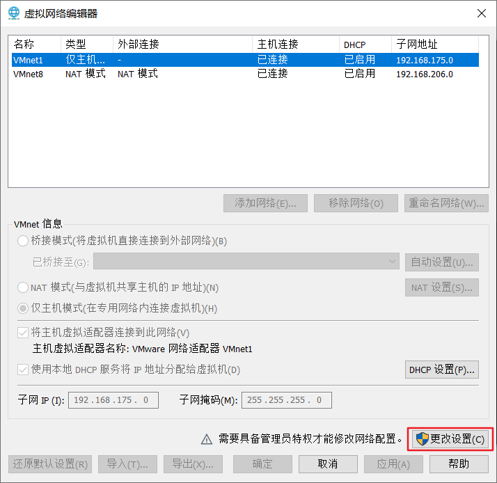
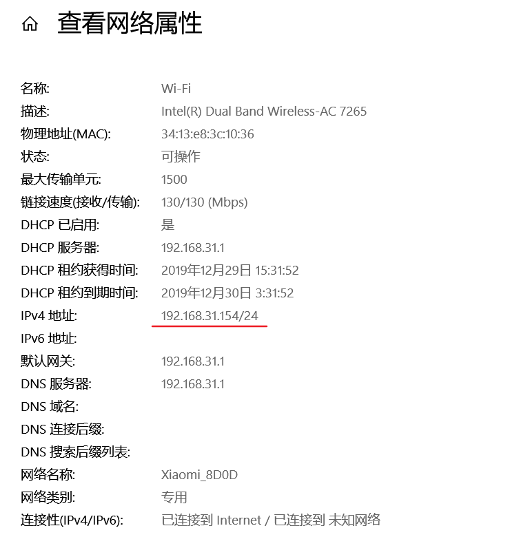
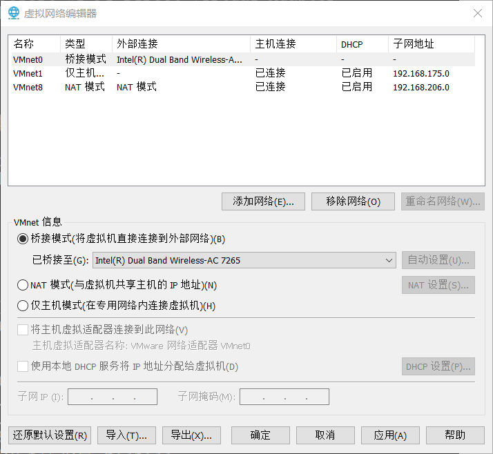
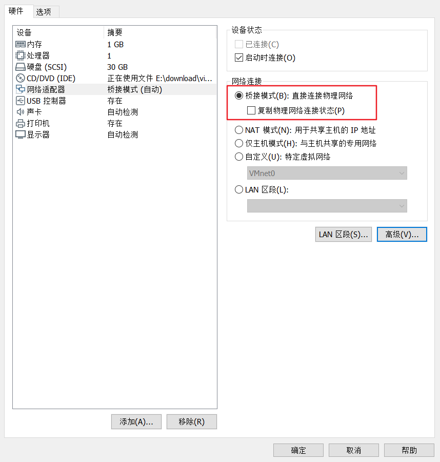
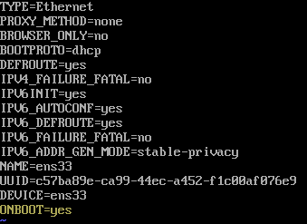

## VMware 设置桥接模式

1. 关闭虚拟机里的系统
2. 编辑 -> 虚拟网络编辑器


3. 添加“桥接模式”

   

   

   

4. 虚拟机设置

   

5. 启动虚拟机

   ```shell
   # 查看网卡名称
   ifconfig
   # 修改对应网卡，ens33 为 ifconfig 命令输出的网卡名称
   vi /etc/sysconfig/network-scripts/ifcfg-ens33
   ```

   

将 ONBOOT 修改为yes

保存退出后重启网络服务 `systemctl restart network.service`


