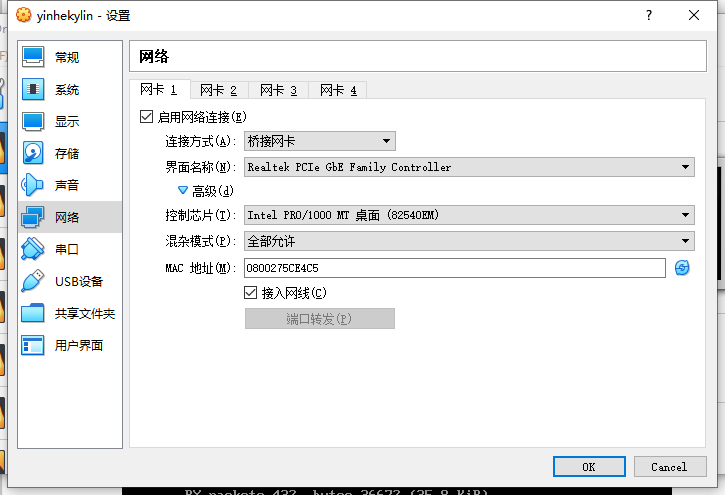
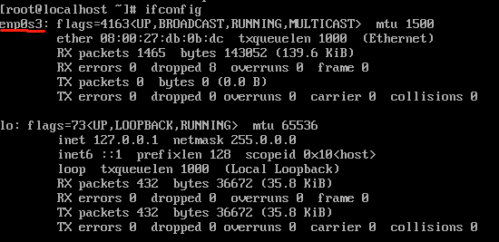
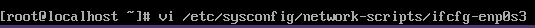
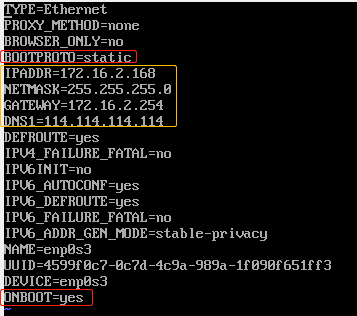
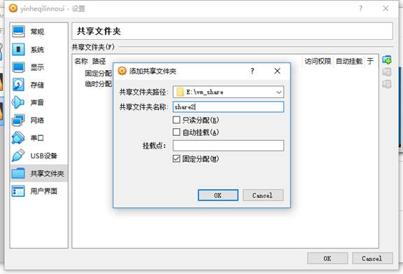
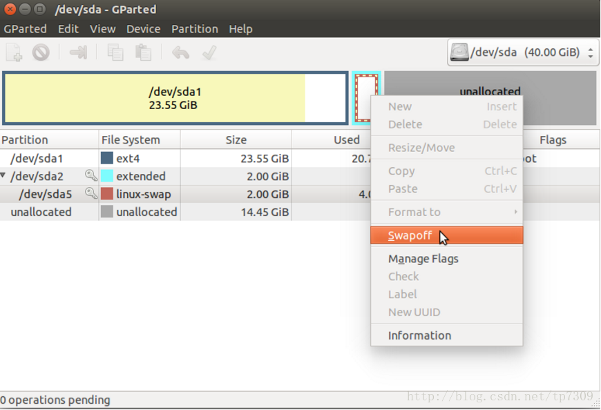

# VirtualBox

## 设置网络

目的：虚拟机能够上网

打开虚拟机设置，选择“桥接网卡”，混杂模式选择“全部允许”，勾选“接入网线”



终端中输入ifconfig，查看网卡名称



修改网卡配置文件





修改BOOTPROTO为static，ONBOOT为yes

增加黄框中的IP、掩码、网关、DNS（与主机配置在同一个网络）

重启网络 `systemctl restart network`

## 设置共享文件夹



“设备”-“安装增强功能”

https://www.jianshu.com/p/5b66e1ec09dc

创建挂载文件夹：sudo mkdir /mnt/shared

挂载共享文件（重启失效）：sudo mount -t vboxsf share2 /mnt/shared

取消挂载：sudo umount -f /mnt/shared

设置自动挂载（重启不失效）：

•  sudo vi /etc/fstab

•  末尾添加：share2 /mnt/shared vboxsf rw,gid=100,uid=1000,auto 0 0

## 虚拟硬盘扩容

打开命令行，运行以下命令（扩容到60G）

```
cd C:\Program Files\Oracle\VirtualBox
VBoxManage.exe modifyhd "E:\VMS\yinhekylin\yinkekylin.vdi" --resize 61440
```

启动虚拟机，打开终端，安装并启动 gparted

```
sudo apt install gparted
sudo gparted
```



先”swap off”关闭交换空间，然后删除linux-swap，删除extended。然后选择需要调整的盘执行”Resize/Move”命令，调整到需要的大小，同样留下4GB的空间再新建回extended与linux-swap，完成后点对勾应用更改，Partition节下会恢复原来的分区标识，修改完毕再正常进入系统即可。

https://blog.csdn.net/tanningzhong/article/details/80482994

https://blog.csdn.net/orange_612/article/details/79597905